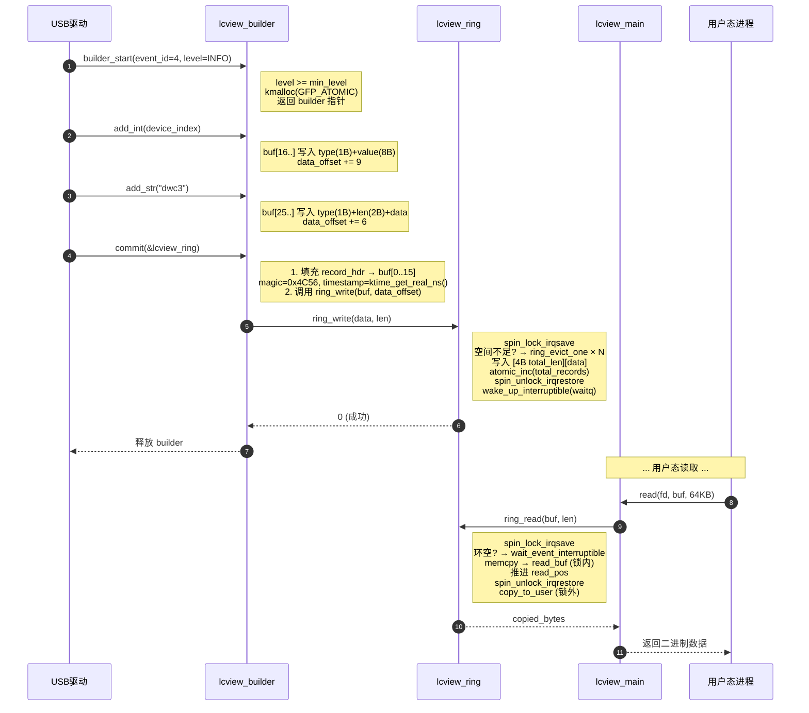
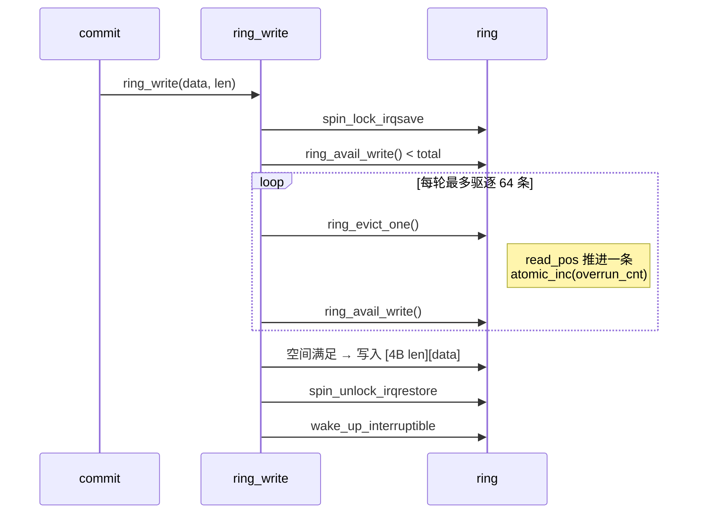
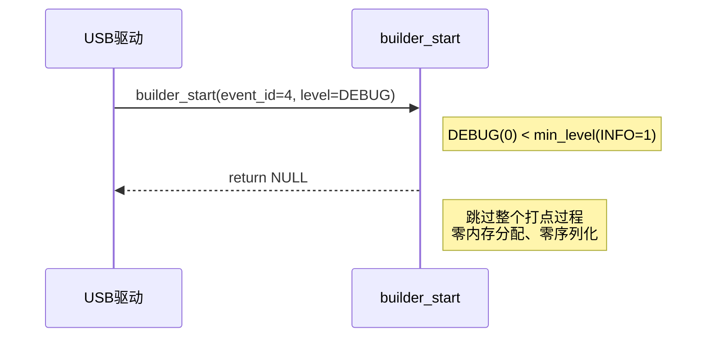
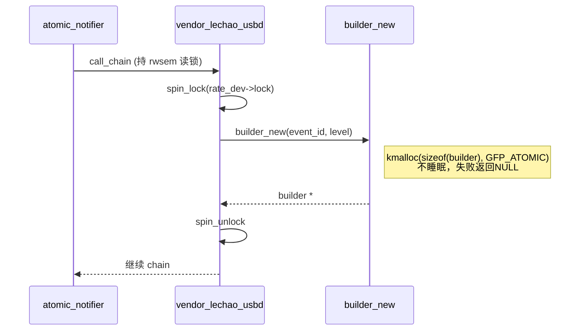
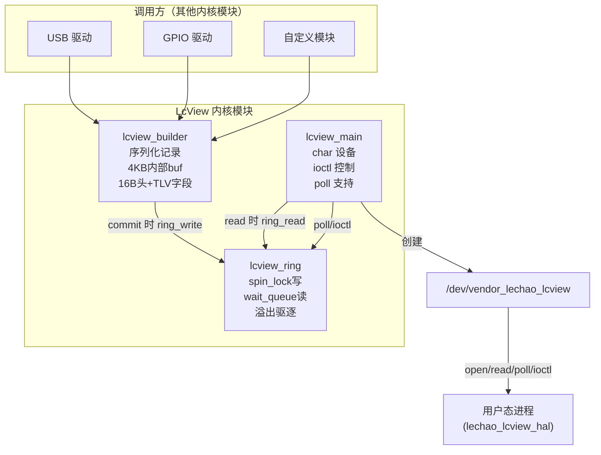
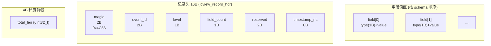
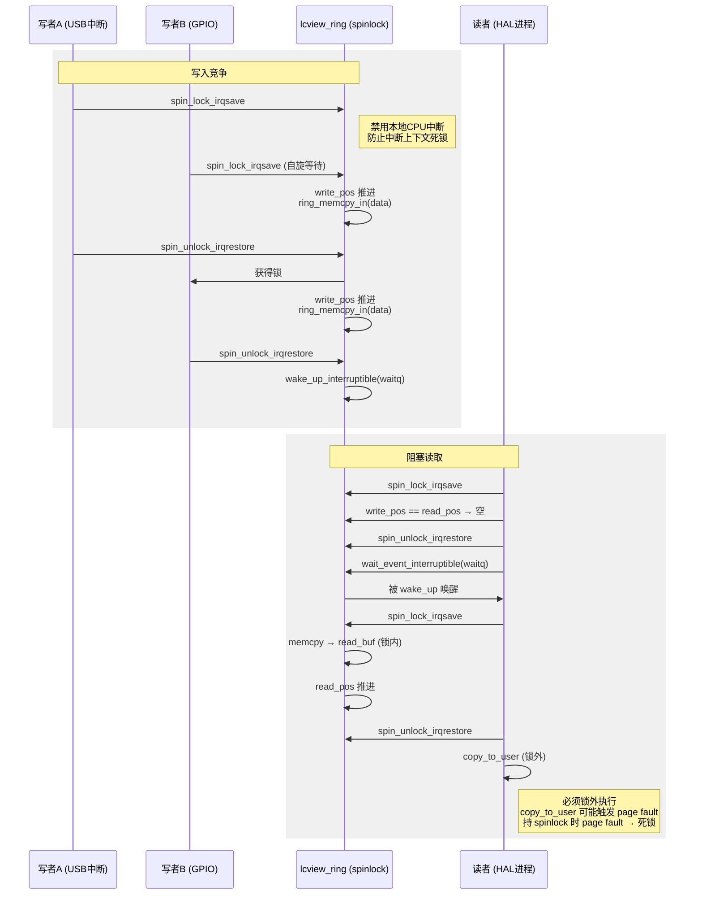
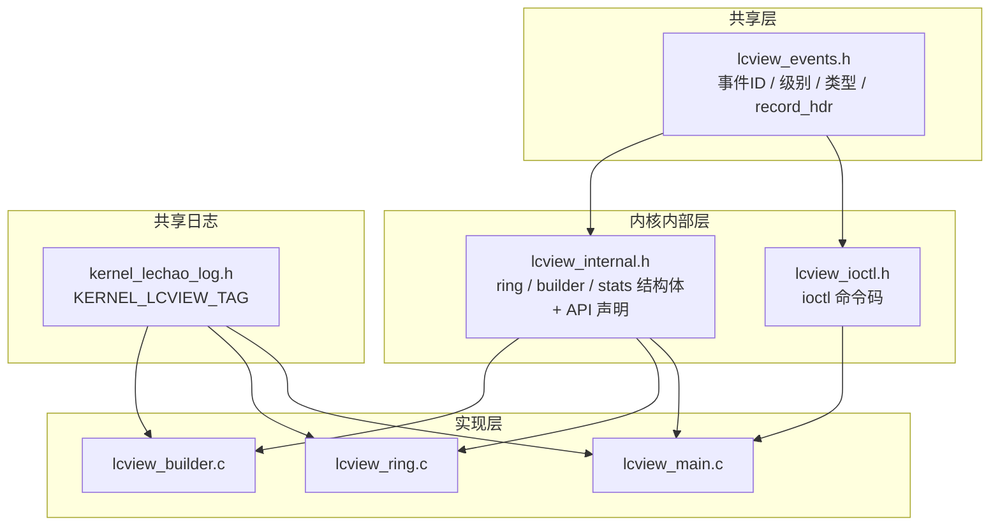

# LcView 内核模块

## 1 概述

LcView 是一个**结构化事件打点框架**的内核态组件，以 built-in 模式编译进 vmlinux，为其他内核模块提供 Builder 风格的日志打点 API。数据经环形缓冲区通过字符设备 `/dev/vendor_lechao_lcview` 上报到用户态。

**设计理念：** 不修改任何原生内核代码。其他内核模块通过 `EXPORT_SYMBOL` 导出的 Builder API 调用来打点，字段名由用户态 JSON schema 定义，内核只传 ID + 字段值，体积最小化。

**设计目标：**

1. **Builder 模式** — `start()` → `add_*()` → `commit()` 链式构建，简洁直观
2. **Schema ID 驱动** — 传输只传 ID + 字段值，字段名由用户态 JSON schema 定义
3. **环形缓冲区** — spin_lock 保护的多生产者写入、wait_queue 阻塞的单消费者读取
4. **单实例字符设备** — open 互斥、read 阻塞读、poll 支持、ioctl 控制
5. **级别过滤** — ioctl 动态设置最低上报级别，低于阈值的 commit 静默丢弃

**源码路径：**

- 内核源码根目录：`~/workspace/rpi5-kernel-build/common`
- LcView 模块源码：`vendor/lechao/LcView/`
- 完整源码归档：[`../patchs/rpi5/kernel/new/vendor/lechao/LcView/`](./../patchs/rpi5/kernel/new/vendor/lechao/LcView/)

> **用户态工具：** HAL + Daemon 的详细设计见 [01.02-HAL增强](./01.02-HAL增强-lcview-hal.md) 和 [01.03-Daemon增强](./01.03-Daemon增强-lcview-daemon.md)。系统级架构分析见 [README.md](./README.md)。

## 2 场景视图

### 2.1 正常路径：事件生命周期

一个事件从内核模块打点到用户态读取的完整生命周期：



### 2.2 异常路径

#### 环满溢出



#### 级别过滤短路



#### Atomic 上下文安全



## 3 逻辑视图

### 3.1 模块分解



**职责矩阵：**

| 模块 | 职责 | 关键抽象 |
|------|------|---------|
| `lcview_builder` | 链式构建事件记录，TLV 序列化到内部 4KB buf | `struct lcview_builder` — [lcview_internal.h:83](./../patchs/rpi5/kernel/new/vendor/lechao/LcView/lcview_internal.h#L83) |
| `lcview_ring` | 环形缓冲区读写、溢出驱逐、阻塞等待 | `struct lcview_ring` — [lcview_internal.h:53](./../patchs/rpi5/kernel/new/vendor/lechao/LcView/lcview_internal.h#L53) |
| `lcview_main` | 字符设备注册、file_operations、级别过滤、模块入口 | `lcview_fops` — [lcview_main.c:248](./../patchs/rpi5/kernel/new/vendor/lechao/LcView/lcview_main.c#L248) |

### 3.2 二进制记录格式

每条事件记录以 TLV (Type-Length-Value) 格式序列化，由定长记录头 + 变长字段区组成：



**字段类型编码：**

| 类型 | 编码 | 值布局 |
|------|------|--------|
| INT32 | 1 | type(1B) + int32(4B) |
| INT64 | 2 | type(1B) + int64(8B) |
| FLOAT | 3 | type(1B) + float(4B) |
| STRING | 4 | type(1B) + len(2B) + data |
| BINARY | 5 | type(1B) + len(2B) + data |

> 结构体定义：[`lcview_record_hdr`](./../patchs/rpi5/kernel/new/vendor/lechao/LcView/lcview_events.h#L76)，[`lcview_field_hdr`](./../patchs/rpi5/kernel/new/vendor/lechao/LcView/lcview_events.h#L85)。事件 ID 和类型编码定义在 [`lcview_events.h`](./../patchs/rpi5/kernel/new/vendor/lechao/LcView/lcview_events.h)。

### 3.3 Schema ID 驱动

每个事件有固定 ID，内核只传 ID + 字段值，字段名由用户态 JSON schema 定义。这种设计使传输体积最小化，且新增字段仅需改 schema，历史数据兼容。

> 系统级对比分析（Schema 方案 vs 传统 printk）见 [README.md §3.1](./README.md#311-schema-模板--数据解耦)。

## 4 过程视图

### 4.1 并发模型

环形缓冲区采用 **多生产者 / 单消费者** 模型，spin_lock 保护写指针和读指针：



**read_buf 中转机制：** 读者在锁内将环中数据 `memcpy` 到独立的 `read_buf`（vmalloc 分配的 4KB 缓冲区），解锁后在锁外执行 `copy_to_user`。避免持 spinlock 期间 page fault 导致死锁。

> `read_buf` 分配：[`lcview_ring_init`](./../patchs/rpi5/kernel/new/vendor/lechao/LcView/lcview_ring.c#L133)，锁内拷贝：[`lcview_ring_read`](./../patchs/rpi5/kernel/new/vendor/lechao/LcView/lcview_ring.c#L449)。

### 4.2 上下文安全

`lcview_builder_new` 使用 `GFP_ATOMIC` 分配内存，因为调用者可能处于 atomic 上下文：

```
atomic_notifier_call_chain (持 rwsem 读锁)
  └── vendor_lechao_usbd_handle_event (持 spinlock)
        └── lcview_builder_start → lcview_builder_new → kmalloc(GFP_ATOMIC)
```

`GFP_KERNEL` 在内存压力下会触发直接回收（涉及睡眠），在 spinlock 上下文中会触发 `BUG: sleeping function called from invalid context`。`GFP_ATOMIC` 使用保留内存池，不睡眠，失败时返回 NULL。

> 分配实现：[`lcview_builder.c:88`](./../patchs/rpi5/kernel/new/vendor/lechao/LcView/lcview_builder.c#L88)

### 4.3 溢出驱逐策略

写入空间不足时，批量驱逐最旧记录（每轮最多 64 条），递增 `overrun_cnt`。批量策略将 256KB 环中最坏情况迭代次数从 ~13,000 降至 ~200。

> 驱逐实现：[`ring_evict_one`](./../patchs/rpi5/kernel/new/vendor/lechao/LcView/lcview_ring.c#L197)，批量逻辑：[`lcview_ring.c:294`](./../patchs/rpi5/kernel/new/vendor/lechao/LcView/lcview_ring.c#L294)

### 4.4 关键不变量

| 不变量 | 保证机制 | 代码位置 |
|--------|---------|---------|
| `write_pos == read_pos` 恒为"空" | 预留 1 字节不可用 | [`ring_avail_write`](./../patchs/rpi5/kernel/new/vendor/lechao/LcView/lcview_ring.c#L59) |
| 单实例 open | `atomic_cmpxchg` | [`lcview_main.c:99`](./../patchs/rpi5/kernel/new/vendor/lechao/LcView/lcview_main.c#L99) |
| 单条记录 ≤ 4KB | `LCVIEW_BUILDER_MAX_SIZE` 边界检查 | [`lcview_internal.h:35`](./../patchs/rpi5/kernel/new/vendor/lechao/LcView/lcview_internal.h#L35) |
| 4B 长度前缀 wrap-around | `ring_memcpy_in/out` 分段拷贝 | [`lcview_ring.c:96`](./../patchs/rpi5/kernel/new/vendor/lechao/LcView/lcview_ring.c#L96) |
| commit 幂等 | `committed` 标志防重入 | [`lcview_builder.c:277`](./../patchs/rpi5/kernel/new/vendor/lechao/LcView/lcview_builder.c#L277) |

## 5 开发视图

### 5.1 文件职责矩阵

```
patchs/rpi5/kernel/new/vendor/lechao/LcView/
├── lcview_events.h          # 内核/用户态共享：事件ID、级别、类型编码、record_hdr
├── lcview_internal.h        # 模块内部：ring/builder/stats 结构体 + API 声明
├── lcview_builder.c         # Builder API 实现：链式构建 + TLV 序列化
├── lcview_ring.c            # 环形缓冲区：读写、溢出驱逐、阻塞等待
├── lcview_main.c            # 字符设备驱动：file_ops + ioctl + 模块入口 + EXPORT_SYMBOL
├── lcview_ioctl.h           # ioctl 命令码定义（魔数 'V'）
├── Makefile                 # 三合一编译：lcview_main.o + lcview_ring.o + lcview_builder.o
├── Kconfig                  # CONFIG_LCVIEW bool 配置
└── (via ccflags) → ../kernel_lechao_log.h  # 日志 tag 常量
```

| 文件 | 职责 | 关键函数 | 行数 |
|------|------|---------|------|
| `lcview_events.h` | 内核/用户态共享的事件 ID、类型编码、记录头结构 | — | 105 |
| `lcview_internal.h` | 模块内部数据结构和 API 声明 | — | 181 |
| `lcview_builder.c` | Builder 模式：`start → add_* → commit` 链式构建 | `lcview_builder_new`/`commit` | 319 |
| `lcview_ring.c` | 环形缓冲区：写入/驱逐/阻塞读取/统计 | `lcview_ring_write`/`read`/`evict_one` | 508 |
| `lcview_main.c` | 字符设备注册、`file_operations`、`EXPORT_SYMBOL`、模块入口 | `lcview_init`/`builder_start` | 366 |
| `lcview_ioctl.h` | ioctl 命令码（`_IOR`/`_IOW` 宏生成） | — | 48 |

### 5.2 头文件依赖图



### 5.3 EXPORT_SYMBOL 契约

LcView 通过 `EXPORT_SYMBOL` 导出 8 个 Builder API 符号，供其他内核模块调用：

| 符号 | 说明 | 定义位置 |
|------|------|---------|
| `lcview_builder_start(event_id, level)` | 分配 builder，低于级别阈值返回 NULL | [lcview_main.c:274](./../patchs/rpi5/kernel/new/vendor/lechao/LcView/lcview_main.c#L274) |
| `lcview_builder_add_int(b, int64_t)` | 添加 INT64 字段 | [lcview_builder.c:154](./../patchs/rpi5/kernel/new/vendor/lechao/LcView/lcview_builder.c#L154) |
| `lcview_builder_add_int32(b, int32_t)` | 添加 INT32 字段 | [lcview_builder.c:160](./../patchs/rpi5/kernel/new/vendor/lechao/LcView/lcview_builder.c#L160) |
| `lcview_builder_add_str(b, val)` | 添加 STRING 字段 | [lcview_builder.c:177](./../patchs/rpi5/kernel/new/vendor/lechao/LcView/lcview_builder.c#L177) |
| `lcview_builder_add_float(b, float)` | 添加 FLOAT 字段 | [lcview_builder.c:200](./../patchs/rpi5/kernel/new/vendor/lechao/LcView/lcview_builder.c#L200) |
| `lcview_builder_add_binary(b, ptr, len)` | 添加 BINARY 字段 | [lcview_builder.c:216](./../patchs/rpi5/kernel/new/vendor/lechao/LcView/lcview_builder.c#L216) |
| `lcview_builder_commit(b, ring)` | 序列化 → 写入环形缓冲区 → 释放 builder | [lcview_builder.c:271](./../patchs/rpi5/kernel/new/vendor/lechao/LcView/lcview_builder.c#L271) |
| `lcview_builder_cancel(b)` | 释放 builder 不写入 | [lcview_builder.c:245](./../patchs/rpi5/kernel/new/vendor/lechao/LcView/lcview_builder.c#L245) |

**使用示例：**

```c
#include "lcview_events.h"

lcview_builder_t *b = lcview_builder_start(LCVIEW_EVENT_USB_CONNECT, LCVIEW_LEVEL_INFO);
if (b) {
    lcview_builder_add_int(b, port);
    lcview_builder_add_str(b, chipset);
    lcview_builder_add_int(b, vid);
    lcview_builder_add_int(b, pid);
    lcview_builder_commit(b);
}
```

**调用方契约：**
- 字段按 schema 顺序添加，不传字段名
- `commit` 失败（环满）时 builder 不释放，调用方可重试或 `cancel`
- `add_binary(ptr=NULL, len>0)` 返回 `-EINVAL`
- 字符串自动截断到 65535 字节

### 5.4 构建集成

#### Kconfig / Makefile

> 完整定义：[`Kconfig`](./../patchs/rpi5/kernel/new/vendor/lechao/LcView/Kconfig)，[`Makefile`](./../patchs/rpi5/kernel/new/vendor/lechao/LcView/Makefile)

| 配置项 | 值 | 说明 |
|--------|-----|------|
| `config LCVIEW` | `bool` | built-in 模式（非可卸载模块） |
| `obj-$(CONFIG_LCVIEW)` | `lcview.o` | 三合一编译 |
| `lcview-objs` | `lcview_main.o lcview_ring.o lcview_builder.o` | 编译单元 |
| `ccflags-y` | `-I$(src) -I$(srctree)/vendor/lechao` | 头文件搜索路径 |

#### 集成步骤

1. 将 `patchs/rpi5/kernel/new/vendor/` 拷贝到内核源码根目录
2. 确保上层 Kconfig 已 `source "vendor/lechao/LcView/Kconfig"`
3. 内核配置启用 `CONFIG_LCVIEW=y`：

```bash
cd ~/workspace/rpi5-kernel-build/common
make ARCH=arm64 CROSS_COMPILE=aarch64-linux-gnu- menuconfig
# Device Drivers → Vendor Lechao → LcView logging trace subsystem → Y
```

4. 编译内核：

```bash
make ARCH=arm64 CROSS_COMPILE=aarch64-linux-gnu- Image
```

LcView 随 vmlinux 启动，`module_init(lcview_init)` 映射为 `device_initcall`。

## 6 物理视图

### 6.1 运行时拓扑

```mermaid
graph TB
    subgraph kernel["内核空间 (vmlinux)"]
        LCVIEW["LcView (device_initcall)<br/><i>init 顺序：<br/>1. ring_init (vmalloc 256KB)<br/>2. register_chrdev (动态 major)<br/>3. class_create (sysfs)<br/>4. device_create (/dev 节点)</i>"]
    end

    subgraph dev["/dev"]
        CHRDEV["vendor_lechao_lcview<br/>(chr device)"]
    end

    subgraph userspace["用户空间"]
        HAL["lechao_lcview_hal<br/>(vendor域, epoll读取)"]
        DAEMON["lechao_lcview<br/>(system域, Binder拉取)"]
    end

    LCVIEW -->|创建设备节点| CHRDEV
    CHRDEV -->|open/read/poll/ioctl| HAL
    HAL -->|Binder AIDL getBatch()| DAEMON
```

> 初始化入口：[`lcview_init`](./../patchs/rpi5/kernel/new/vendor/lechao/LcView/lcview_main.c#L317)

### 6.2 设备节点与权限

| 配置项 | 文件 | 说明 |
|--------|------|------|
| ueventd 权限 | `ueventd.rpi5.rc` | 设备节点 `/dev/vendor_lechao_lcview` 的访问权限 |
| SELinux 设备类型 | `file_contexts` | `lechao_lcview_hal_device` 标签 |
| HAL 域权限 | `lechao_lcview_hal.te` | `allow ... chr_file { open read write ioctl }` |

### 6.3 内核启动参数

`ring_size_kb` 通过内核 cmdline 传递：

```bash
# kernel cmdline 示例
lcview.ring_size_kb=512
```

| 参数 | 默认值 | 最大值 | 说明 |
|------|--------|--------|------|
| `ring_size_kb` | 256KB | 4096KB | 环形缓冲区容量 |

### 6.4 验证

```bash
# 验证设备节点
ls -l /dev/vendor_lechao_lcview

# 查看内核日志
dmesg | grep kernel_lechao_lcview
# 期望: kernel_lechao_lcview: initialized (ring=256KB, major=N)

# 调整环形缓冲区大小（需重启，添加到 kernel cmdline）
# lcview.ring_size_kb=512
```

## 7 接口参考

### 7.1 Builder API

| 函数 | 参数 | 返回值 | 说明 |
|------|------|--------|------|
| `lcview_builder_start(event_id, level)` | `u16, u8` | `builder*` 或 `NULL` | 低于级别阈值返回 NULL |
| `lcview_builder_add_int(b, val)` | `builder*, int64` | `int` (0/-ENOSPC) | 添加 INT64 字段 (9B) |
| `lcview_builder_add_int32(b, val)` | `builder*, int32` | `int` | 添加 INT32 字段 (5B) |
| `lcview_builder_add_str(b, val)` | `builder*, const char*` | `int` | 添加 STRING (3B+len)，NULL 写空串 |
| `lcview_builder_add_float(b, val)` | `builder*, uint32` | `int` | 添加 FLOAT 字段 (5B) |
| `lcview_builder_add_binary(b, ptr, len)` | `builder*, void*, u16` | `int` (0/-EINVAL/-ENOSPC) | ptr=NULL && len>0 返回 -EINVAL |
| `lcview_builder_commit(b, ring)` | `builder*, ring*` | `int` (0/-ENOSPC/-EINVAL) | 成功释放 builder，失败保留 |
| `lcview_builder_cancel(b)` | `builder*` | `void` | 释放 builder 不写入 |

### 7.2 ioctl 命令

| 命令 | 方向 | 参数 | 功能 |
|------|------|------|------|
| `LCVIEW_GET_AVAIL_BYTES` | 内核→用户 | `uint32_t*` | 查询环中可读字节数 |
| `LCVIEW_GET_OVERRUN` | 内核→用户 | `uint32_t*` | 查询溢出次数，读后清零 |
| `LCVIEW_GET_STATS` | 内核→用户 | `struct lcview_stats*` | 返回完整统计 |
| `LCVIEW_SET_LEVEL` | 用户→内核 | `uint8_t` | 设置最低上报级别 (0~3) |

> 命令码定义：[`lcview_ioctl.h`](./../patchs/rpi5/kernel/new/vendor/lechao/LcView/lcview_ioctl.h)

### 7.3 file_operations

| 操作 | 行为 |
|------|------|
| `open()` | 单实例互斥（`atomic_cmpxchg`），已打开返回 `-EBUSY` |
| `read(buf, len)` | 阻塞读取，尽量填满 buf，返回实际字节数 |
| `poll(POLLIN)` | 环非空时返回 `POLLIN | POLLRDNORM`，支持 epoll |
| `compat_ioctl` | 与 `unlocked_ioctl` 共用，32/64-bit 兼容 |
| `close()` | 原子复位单实例锁，未读数据保留 |

> `file_operations` 定义：[`lcview_main.c:248`](./../patchs/rpi5/kernel/new/vendor/lechao/LcView/lcview_main.c#L248)
