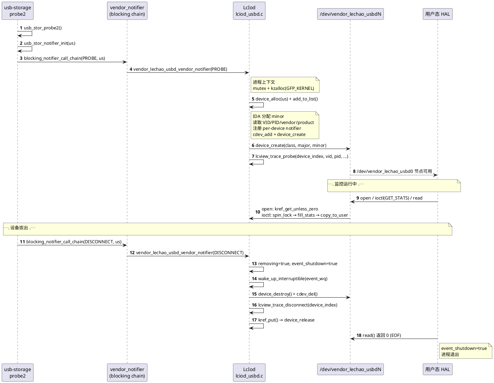
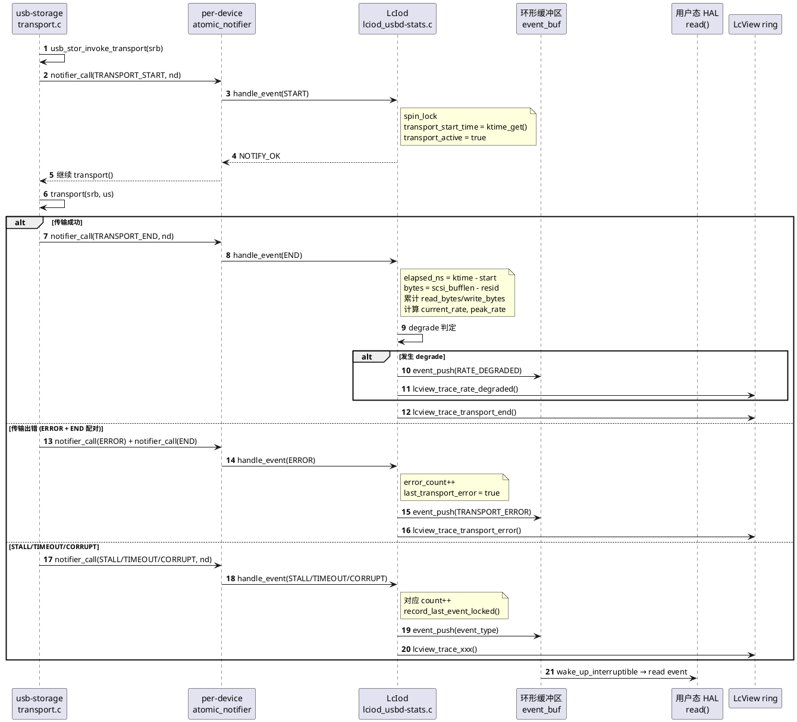
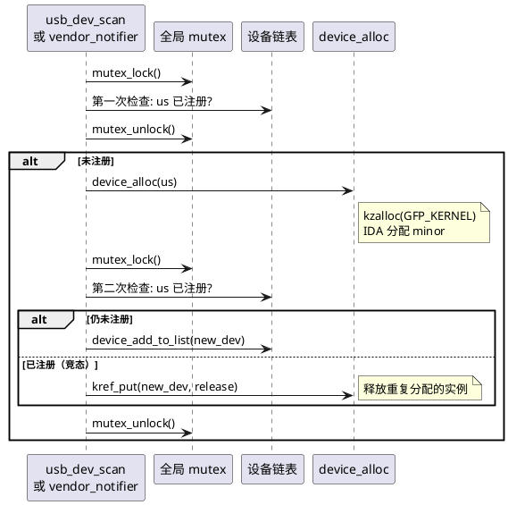
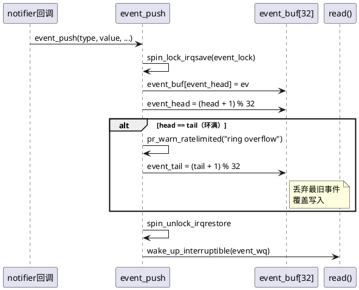
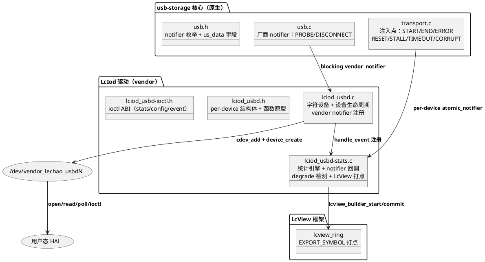
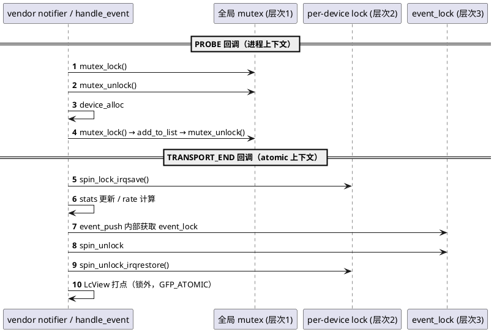
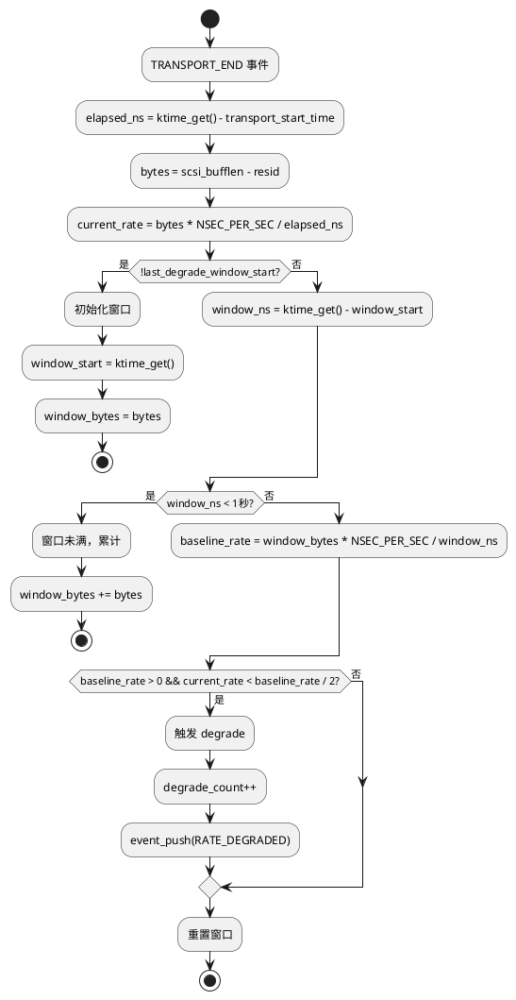
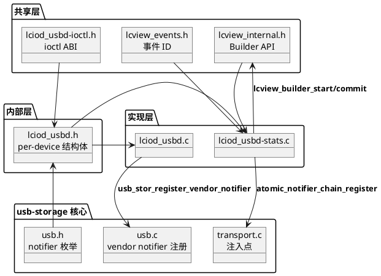
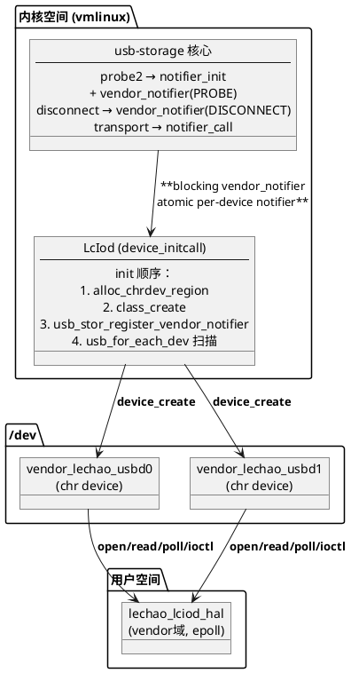
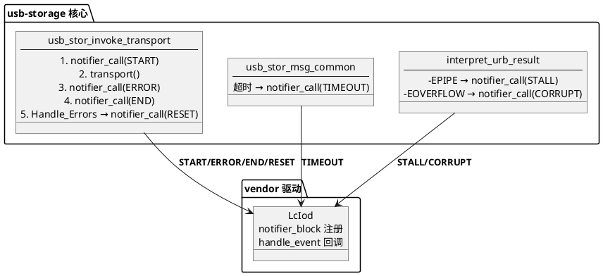

# LcIod 内核驱动

## 概述

LcIod 是**USB 存储速率监控驱动**的内核态组件，以 built-in 模式编译进 vmlinux，为每个 USB 存储设备创建独立的字符设备 `/dev/vendor_lechao_usbdN`（最多 16 个）。通过 notifier chain 机制从 usb-storage 核心实时捕获传输事件，计算速率、检测性能降级，并通过 ioctl 和 read() 向用户态提供统计快照和异步事件推送。

- **职责**：实时监控 USB 存储设备的传输速率、延迟、错误；自动检测性能降级；向用户态推送结构化事件
- **上下游**：上游为 usb-storage 核心（通过 notifier chain 接收传输事件）；下游为 LcView 打点框架（EXPORT_SYMBOL 调用）和用户态 HAL（通过字符设备读取统计和事件）
- **对外接口**：字符设备 `/dev/vendor_lechao_usbdN`（ioctl GET_STATS/SET_CONFIG、read 阻塞读事件）

**设计理念：** 通过 notifier chain 注入 usb-storage 核心，零侵入式捕获传输事件；per-device 多实例架构，每个 USB 设备独立监控；双重 notifier（厂商级 PROBE/DISCONNECT + per-device 传输事件）实现完整生命周期覆盖。

**设计目标：**

1. **Notifier chain 注入** — 零侵入式捕获 usb-storage 核心的传输事件，无需修改核心逻辑
2. **Per-device 多实例** — 每个 USB 存储设备独立字符设备，最多 16 个，IDA 分配次设备号
3. **实时统计引擎** — 累计读写字节数、命令数、错误数；计算瞬时速率和峰值速率
4. **Degrade 自动检测** — 1 秒滑动窗口对比基线速率，自动发现性能降级
5. **事件推送通道** — 环形缓冲区存储异常事件，阻塞 read() 支持异步通知
6. **LcView 打点集成** — 所有 PROBE/DISCONNECT/传输事件同步上送 LcView 时序分析

**源码路径：**

- 内核源码根目录：`~/workspace/rpi5-kernel-build/common`
- LcIod 模块源码：`vendor/lechao/LcIod/`
- 完整源码归档：[`../patchs/rpi5/kernel/new/vendor/lechao/LcIod/`](./../patchs/rpi5/kernel/new/vendor/lechao/LcIod/)
- usb-storage 修改归档：[`../patchs/rpi5/kernel/modified/drivers/usb/storage/`](./../patchs/rpi5/kernel/modified/drivers/usb/storage/)

> **关联文档：** LcView 打点框架设计见 [01.01-内核态增强-lcview-kernel.md](../01-打点增强/01.01-内核态增强-lcview-kernel.md)。系统级架构分析见 [README.md](./README.md)。

## 用例视图

### 正常路径：USB 设备生命周期（PROBE → 监控 → DISCONNECT）

从 USB 存储设备插入到监控实例创建再到设备拔出的完整流程：



### 正常路径：传输事件处理流程

从 usb-storage 核心发射传输事件到 LcIod 统计更新、degrade 检测、事件推送、LcView 打点的完整流程：



### 异常路径：设备热插拔竞态

模块初始化扫描与 vendor notifier 同时触发 PROBE，通过双重检查防止重复注册：



### 异常路径：环满溢出

事件环形缓冲区满时丢弃最旧事件：



## 逻辑视图

### 模块分解



**职责矩阵：**

| 模块 | 职责 | 关键抽象 |
|------|------|---------|
| `lciod_usbd.c` | 字符设备注册、设备生命周期管理、vendor notifier 注册 | `vendor_lechao_usbd_vendor_notifier` — [lciod_usbd.c:630](./../patchs/rpi5/kernel/new/vendor/lechao/LcIod/lciod_usbd.c#L630) |
| `lciod_usbd-stats.c` | notifier 回调、统计更新、degrade 检测、事件推送、LcView 打点 | `vendor_lechao_usbd_handle_event` — [lciod_usbd-stats.c:463](./../patchs/rpi5/kernel/new/vendor/lechao/LcIod/lciod_usbd-stats.c#L463) |
| `lciod_usbd.h` | per-device 结构体定义、跨编译单元函数原型 | `struct vendor_lechao_usbd_device` — [lciod_usbd.h:56](./../patchs/rpi5/kernel/new/vendor/lechao/LcIod/lciod_usbd.h#L56) |
| `lciod_usbd-ioctl.h` | 用户态共享 ABI：stats/config/event 结构体 + ioctl 命令码 | `struct vendor_lechao_usbd_stats` — [lciod_usbd-ioctl.h:46](./../patchs/rpi5/kernel/new/vendor/lechao/LcIod/lciod_usbd-ioctl.h#L46) |

### usb-storage notifier chain 注入

usb-storage 核心的 notifier chain 注入是 LcIod 实现零侵入式监控的关键设计。修改涉及三个文件：

#### usb.h 新增内容

[`usb.h.diff`](./../patchs/rpi5/kernel/modified/drivers/usb/storage/usb.h.diff) 新增：

**notifier 枚举（10 类事件）：**

```c
// usb.h.diff:41-52
enum usb_stor_notifier_event {
    USB_STOR_NOTIFIER_TRANSPORT_START,   /* 传输开始 */
    USB_STOR_NOTIFIER_TRANSPORT_END,     /* 传输结束 */
    USB_STOR_NOTIFIER_TRANSPORT_ERROR,   /* 传输层错误 */
    USB_STOR_NOTIFIER_RESET,             /* 设备重置 */
    USB_STOR_NOTIFIER_DEVICE_PROBE,      /* 设备探测 */
    USB_STOR_NOTIFIER_DEVICE_DISCONNECT, /* 设备断开 */
    USB_STOR_NOTIFIER_STALL,             /* USB STALL */
    USB_STOR_NOTIFIER_TIMEOUT,           /* 传输超时 */
    USB_STOR_NOTIFIER_DATA_CORRUPT,      /* 数据损坏 */
    USB_STOR_NOTIFIER_RATE_DEGRADED,     /* 性能降级（vendor 内部） */
};
```

**notifier_data 结构体：**

```c
// usb.h.diff:70-78
struct usb_stor_notifier_data {
    struct us_data *us;            /* usb-storage 设备实例 */
    struct scsi_cmnd *srb;         /* SCSI 命令指针 */
    int result;                    /* 传输层返回码 */
    int status;                    /* URB 状态码 */
    u8 data_direction;             /* 数据方向 */
    u32 data_len;                  /* 请求传输长度 */
    u64 duration_ns;               /* 传输耗时 */
};
```

**us_data 新增字段：**

```c
// usb.h.diff:89-101
struct atomic_notifier_head notifier;  /* per-device notifier 链头 */
int last_fault_type;                   /* 最近故障类型 */
int last_fault_status;                 /* 最近故障 URB status */
u64 last_rate_sample_ns;               /* 预留：速率采样 */
u64 last_rate_sample_bytes;            /* 预留：速率采样 */
```

**helper 函数（inline）：** `usb_stor_notifier_init(call)`、`usb_stor_notifier_call(us, event, data)`、`usb_stor_register_vendor_notifier(nb)`、`usb_stor_unregister_vendor_notifier(nb)` — [usb.h.diff:118-148](./../patchs/rpi5/kernel/modified/drivers/usb/storage/usb.h.diff#L118)

#### usb.c 新增内容

[`usb.c.diff`](./../patchs/rpi5/kernel/modified/drivers/usb/storage/usb.c.diff) 新增厂商级 blocking notifier 链：

```c
// usb.c.diff:9-21
static BLOCKING_NOTIFIER_HEAD(usb_stor_vendor_nh);

int usb_stor_register_vendor_notifier(struct notifier_block *nb)
{
    return blocking_notifier_chain_register(&usb_stor_vendor_nh, nb);
}
EXPORT_SYMBOL_GPL(usb_stor_register_vendor_notifier);
```

probe2 中初始化 + 通知；disconnect 中通知。见 [usb.c.diff:31-49](./../patchs/rpi5/kernel/modified/drivers/usb/storage/usb.c.diff#L31)。

#### transport.c 新增内容

[`transport.c.diff`](./../patchs/rpi5/kernel/modified/drivers/usb/storage/transport.c.diff) 新增 7 个注入点：

| 注入点 | 位置 | 事件类型 | 说明 |
|--------|------|---------|------|
| TRANSPORT_START | `usb_stor_invoke_transport` 入口 | `START` | 每次 transport() 调用前发射 |
| TRANSPORT_END | 所有出口点（正常/aborted/error/no_sense） | `END` | 成功/失败/auto-sense 路径 |
| TRANSPORT_ERROR | `USB_STOR_TRANSPORT_ERROR` 分支 | `ERROR` | transport() 返回 ERROR |
| RESET | `Handle_Errors` 标签 | `RESET` | 错误恢复路径 |
| STALL | `interpret_urb_result` (-EPIPE) | `STALL` | 端点挂起 |
| TIMEOUT | `usb_stor_msg_common` 超时 | `TIMEOUT` | URB 等待超时 |
| DATA_CORRUPT | `interpret_urb_result` (-EOVERFLOW) | `CORRUPT` | Babble/数据损坏 |

**为什么用 notifier chain 而非直接 hook：**

1. **零侵入**：notifier chain 是内核标准机制，通过注册回调实现扩展，无需修改核心逻辑流程
2. **解耦**：vendor 驱动独立编译，usb-storage 核心无需感知 vendor 模块的存在
3. **可扩展**：多个 vendor 驱动可同时注册到同一 notifier 链，按优先级执行
4. **上下文安全**：atomic_notifier_chain 在任意上下文安全调用，blocking_notifier_chain 在进程上下文调用

> 完整 diff：[`usb.h.diff`](./../patchs/rpi5/kernel/modified/drivers/usb/storage/usb.h.diff)（150 行）、[`usb.c.diff`](./../patchs/rpi5/kernel/modified/drivers/usb/storage/usb.c.diff)（53 行）、[`transport.c.diff`](./../patchs/rpi5/kernel/modified/drivers/usb/storage/transport.c.diff)（230 行）

### ioctl ABI（跨层共享契约）

用户态与内核态共享的数据结构定义在 [`lciod_usbd-ioctl.h`](./../patchs/rpi5/kernel/new/vendor/lechao/LcIod/lciod_usbd-ioctl.h)：

#### struct vendor_lechao_usbd_stats

23 个字段，分为四类 — [lciod_usbd-ioctl.h:46-74](./../patchs/rpi5/kernel/new/vendor/lechao/LcIod/lciod_usbd-ioctl.h#L46)

| 字段分类 | 字段列表 | 说明 |
|---------|---------|------|
| 累计计数器 | `read_bytes`, `write_bytes`, `read_ns`, `write_ns`, `read_cmds`, `write_cmds`, `error_count`, `reset_count`, `probe_count`, `disconnect_count`, `degrade_count`, `stall_count`, `corrupt_count`, `timeout_count` | 单调递增，RESET_STATE 清零 |
| 快照字段 | `current_rate`, `peak_rate`, `last_transport_latency_ns`, `last_event_ts_ns`, `last_event_type`, `last_update` | 反映最近一次传输/事件状态 |
| 设备标识 | `vid (u16)`, `pid (u16)`, `vendor[32]`, `product[32]` | 分配时读取，之后不变 |
| 配置状态 | `enabled (u8)`, `flags (u32)` | 反映当前运行时配置 |

#### struct vendor_lechao_usbd_config

| 字段 | 类型 | 说明 |
|------|------|------|
| `enabled` | `u8` | 监控开关：1=启用, 0=暂停 |
| `reserved` | `u8[3]` | 预留对齐 |
| `flags` | `u32` | 运行时标志位 |

#### struct vendor_lechao_usbd_event

| 字段 | 类型 | 说明 |
|------|------|------|
| `timestamp_ns` | `u64` | 事件时间（CLOCK_MONOTONIC 纳秒） |
| `event_type` | `u32` | 事件类型（见 enum） |
| `event_value` | `u32` | 附加值（TRANSPORT_ERROR 为 result 码，其余为 0） |
| `status` | `s32` | 原始错误码（STALL 为 -EPIPE，TIMEOUT 为 URB status） |
| `data_direction` | `u8` | 传输方向：0=无, 1=读, 2=写 |
| `valid` | `u8` | 有效标志 |
| `reserved` | `u8[2]` | 预留对齐 |

#### enum vendor_lechao_usbd_event_type

```c
// lciod_usbd-ioctl.h:102-110
enum vendor_lechao_usbd_event_type {
    VENDOR_LECHAO_USBD_EVENT_NONE            = 0,
    VENDOR_LECHAO_USBD_EVENT_TRANSPORT_ERROR = 1,
    VENDOR_LECHAO_USBD_EVENT_STALL           = 2,
    VENDOR_LECHAO_USBD_EVENT_DATA_CORRUPT    = 3,
    VENDOR_LECHAO_USBD_EVENT_TIMEOUT         = 4,
    VENDOR_LECHAO_USBD_EVENT_RESET           = 5,
    VENDOR_LECHAO_USBD_EVENT_RATE_DEGRADED   = 6,
};
```

#### ioctl 命令码

魔数 `'R'`，定义在 [lciod_usbd-ioctl.h:135-164](./../patchs/rpi5/kernel/new/vendor/lechao/LcIod/lciod_usbd-ioctl.h#L135)：

| 命令 | 方向 | 参数 | 功能 |
|------|------|------|------|
| `GET_STATS` | 内核→用户 | `struct vendor_lechao_usbd_stats` | 返回统计快照 |
| `RESET_STATE` | 无 | 无 | 重置累计计数器 |
| `GET_CONFIG` | 内核→用户 | `struct vendor_lechao_usbd_config` | 读取配置 |
| `SET_CONFIG` | 用户→内核 | `struct vendor_lechao_usbd_config` | 修改配置 |

#### 环形缓冲区大小

`VENDOR_LECHAO_USBD_EVENT_BUF_SIZE = 32`，每个设备的事件队列深度为 32 条，覆盖典型突发异常场景。

## 过程视图

### 并发模型

LcIod 采用三重锁层次防止死锁：



**三重锁层次（按获取顺序）：**

| 锁 | 类型 | 保护对象 | 获取上下文 |
|----|------|---------|-----------|
| `vendor_lechao_usbd_mutex` | mutex | 全局设备链表 | 进程上下文（PROBE/DISCONNECT/scan） |
| `rate_dev->lock` | spinlock (irqsave) | stats、config、transport 状态 | atomic notifier 回调 |
| `rate_dev->event_lock` | spinlock (irqsave) | event_buf、head、tail | notifier 回调、read() |

死锁预防：先获取外层锁（mutex），再获取内层锁（spinlock）。不存在反向获取路径：spinlock 上下文不会尝试获取 mutex。

### Atomic 上下文安全

notifier chain 调用链上下文分析：

```
blocking_notifier_call_chain (进程上下文, usb.c)
  └── vendor_lechao_usbd_vendor_notifier (进程上下文)
        ├── mutex_lock (可睡眠)
        ├── kzalloc(GFP_KERNEL) (可睡眠)
        └── device_create (可睡眠)

atomic_notifier_call_chain (任意上下文, transport.c)
  └── vendor_lechao_usbd_handle_event (atomic 上下文)
        ├── spin_lock_irqsave (不可睡眠)
        ├── stats 更新 + event_push (不可睡眠)
        ├── spin_unlock_irqrestore
        └── lcview_builder_start (GFP_ATOMIC, 可失败)
```

关键约束：
- `handle_event` 运行在 atomic notifier chain，不可调用睡眠函数
- `spin_lock_irqsave` 禁用本地 CPU 中断，防止中断上下文死锁
- LcView 打点在 `spin_unlock` 后调用，允许使用 GFP_ATOMIC

### Degrade 检测算法

使用 1 秒滑动窗口对比历史基线速率与当前瞬时速率：



**阈值设计（2x）考量：** USB 传输速率本身有波动（±30% 正常），2 倍阈值过滤正常抖动，只捕获真正性能问题（USB 2.0 降级到 Full Speed、线缆接触不良、电源不稳定）。

**两种 degrade 判定条件**（源码 [lciod_usbd-stats.c:577-588](./../patchs/rpi5/kernel/new/vendor/lechao/LcIod/lciod_usbd-stats.c#L577)）：

```c
// lciod_usbd-stats.c:577-588
u64 prev_rate = rate_dev->stats.current_rate;
u64 prev_latency = rate_dev->last_transport_latency_ns;

vendor_lechao_usbd_update_current_rate_locked(rate_dev, bytes, elapsed_ns);

if (prev_rate > 0 && rate_dev->stats.current_rate < prev_rate)
    degraded = true;
if (prev_latency > 0 && elapsed_ns > prev_latency)
    degraded = true;
```

- 速率下降：`current_rate < prev_rate`
- 延迟上升：`elapsed_ns > prev_latency`

滑动窗口验证作为辅助判定，确保持续下降而非瞬时波动。

### 关键不变量

| 不变量 | 保证机制 | 代码位置 |
|--------|---------|---------|
| 设备不重复注册 | 双重检查（mutex 外 + mutex 内） | [`lciod_usbd.c:643-673`](./../patchs/rpi5/kernel/new/vendor/lechao/LcIod/lciod_usbd.c#L643) |
| kref 归零时才释放 | `kref_put` + `device_release` 回调 | [`lciod_usbd.c:439-445`](./../patchs/rpi5/kernel/new/vendor/lechao/LcIod/lciod_usbd.c#L439) |
| removing 标志原子访问 | `READ_ONCE`/`WRITE_ONCE` | [`lciod_usbd.c:170`](./../patchs/rpi5/kernel/new/vendor/lechao/LcIod/lciod_usbd.c#L170) |
| START/END 配对 | ERROR 后立即发射 END | [`transport.c.diff:171-177`](./../patchs/rpi5/kernel/modified/drivers/usb/storage/transport.c.diff#L171) |
| 环满时丢弃最旧 | head == tail 时 tail 推进 | [`lciod_usbd-stats.c:366-369`](./../patchs/rpi5/kernel/new/vendor/lechao/LcIod/lciod_usbd-stats.c#L366) |

## 开发视图

### 文件职责矩阵

> **约束：** 目录结构只列出源码文件，不含编译产物（`.o`、`.ko`、`.cmd` 等）。

```
patchs/rpi5/kernel/new/vendor/lechao/LcIod/
├── lciod_usbd.c           # 字符设备 + 设备生命周期 + vendor notifier
├── lciod_usbd-stats.c     # 统计引擎 + notifier 回调 + degrade 检测 + LcView 打点
├── lciod_usbd.h           # per-device 结构体 + 函数原型
├── lciod_usbd-ioctl.h     # 用户态共享 ABI（stats/config/event + ioctl 命令码）
├── Kconfig                # CONFIG_VENDOR_LECHAO_USBD bool
└── Makefile               # lciod_usbd-objs := lciod_usbd.o lciod_usbd-stats.o
```

| 文件 | 职责 | 关键函数 | 行数 |
|------|------|---------|------|
| `lciod_usbd.c` | 字符设备注册、设备生命周期、vendor notifier | `vendor_lechao_usbd_vendor_notifier`、`vendor_lechao_usbd_monitor_init` | 932 |
| `lciod_usbd-stats.c` | notifier 回调、统计更新、degrade 检测 | `vendor_lechao_usbd_handle_event`、`vendor_lechao_usbd_update_degrade_context_locked` | 665 |
| `lciod_usbd.h` | per-device 结构体、函数原型 | `struct vendor_lechao_usbd_device` | 142 |
| `lciod_usbd-ioctl.h` | ioctl ABI 定义 | `struct vendor_lechao_usbd_stats` | 166 |

### 模块依赖图



### 构建集成

#### Kconfig / Makefile

> 完整定义：[`Kconfig`](./../patchs/rpi5/kernel/new/vendor/lechao/LcIod/Kconfig)，[`Makefile`](./../patchs/rpi5/kernel/new/vendor/lechao/LcIod/Makefile)

| 配置项 | 值 | 说明 |
|--------|-----|------|
| `config VENDOR_LECHAO_USBD` | `bool` | built-in 模式 |
| `depends on` | `USB_STORAGE=y` | 强制 built-in，避免模块依赖导致 LcIod 不可用 |
| `select` | `LCVIEW` | 自动启用 LcView |
| `obj-$(CONFIG_VENDOR_LECHAO_USBD)` | `lciod_usbd.o` | 目标文件 |
| `lciod_usbd-objs` | `lciod_usbd.o lciod_usbd-stats.o` | 编译单元 |

```bash
cd ~/workspace/rpi5-kernel-build/common
make ARCH=arm64 CROSS_COMPILE=aarch64-linux-gnu- menuconfig
# Device Drivers → Vendor Lechao → Lechao USB Storage Rate Monitor → Y
make ARCH=arm64 CROSS_COMPILE=aarch64-linux-gnu- Image
```

## 部署视图

### 运行时拓扑



### 权限与安全

| 配置项 | 文件 | 说明 |
|--------|------|------|
| 设备节点权限 | [`lciod_usbd.c:118`](./../patchs/rpi5/kernel/new/vendor/lechao/LcIod/lciod_usbd.c#L118) | `devnode` 设置 0666 |
| ueventd | `ueventd.rc5.rc` | 可添加 `/dev/vendor_lechao_usbd* 0666` |
| SELinux 设备类型 | `file_contexts` | `vendor_lechao_usbd_device` 标签 |

### 验证

```bash
# 验证设备节点
ls -l /dev/vendor_lechao_usbd*
# 期望: /dev/vendor_lechao_usbd0 ... /dev/vendor_lechao_usbdN (0666)

# 查看内核日志
dmesg | grep vendor_lechao_usbd
# 期望: registered device vendor_lechao_usbd0 (VID:xxxx PID:xxxx)
```

## 关键设计与实现

本章节从架构与源码两个维度，提炼 LcIod 中的 9 项关键设计决策及其实现细节。

### Notifier chain 注入设计 — usb-storage 核心事件推送

**设计思路：** 通过修改 usb-storage 核心头文件和传输层源码，在关键传输节点插入 notifier_call 调用，将传输事件推送到 vendor 驱动。零侵入式设计，usb-storage 核心逻辑流程不变。



**源码实现：** transport.c 入口处发射 START，所有出口点发射 END，ERROR 后紧跟 END 配对：

```c
// transport.c.diff:116-127
ts_start = ktime_get();
usb_stor_notifier_call(us, USB_STOR_NOTIFIER_TRANSPORT_START, &notif_data);

// transport.c.diff:174-177 (error 路径)
usb_stor_notifier_call(us, USB_STOR_NOTIFIER_TRANSPORT_ERROR, &notif_data);
usb_stor_notifier_call(us, USB_STOR_NOTIFIER_TRANSPORT_END, &notif_data);
```

### Per-device 多实例 — IDA 分配 + kref 引用计数

**设计思路：** 每个 USB 存储设备对应独立的监控实例，通过 IDA 分配次设备号（0~15），通过 kref 引用计数确保 fd 持有期间设备安全释放。IDA 可回收释放的次设备号，避免频繁插拔后无限增长；kref 解决"谁最后 close 谁清理"的问题。

```c
// lciod_usbd.c:467-489
rate_dev = kzalloc(sizeof(*rate_dev), GFP_KERNEL);
minor = ida_alloc_max(&vendor_lechao_usbd_ida, VENDOR_LECHAO_USBD_MAX_DEVICES - 1, GFP_KERNEL);
rate_dev->minor = minor;
kref_init(&rate_dev->kref);

// lciod_usbd.c:498-501 (错误路径：kref 初始化前需手动 ida_free)
if (!us->pusb_dev) {
    ida_free(&vendor_lechao_usbd_ida, minor);
    kfree(rate_dev);
    return ERR_PTR(-ENODEV);
}

// lciod_usbd.c:439-445
void vendor_lechao_usbd_device_release(struct kref *kref)
{
    struct vendor_lechao_usbd_device *rate_dev = container_of(kref, ...);
    ida_free(&vendor_lechao_usbd_ida, rate_dev->minor);
    kfree(rate_dev);
}
```

生命周期：`device_alloc` 初始化 kref=1 → `open()` kref_get → USB 断开 kref_put（但 fd 仍持有，引用>0）→ `close()` kref_put → 引用归零触发 `device_release`（ida_free + kfree）。注意：kref 初始化前的错误路径（如 `!us->pusb_dev`）必须手动 `ida_free`，因为此时 kref 尚未就绪，不会走 release 回调。

### 三重锁层次 — 死锁预防设计

**设计思路：** 按固定顺序获取锁：全局 mutex → per-device lock → event_lock。不存在反向获取路径，彻底防止死锁。详见 [过程视图 · 并发模型](#并发模型)。

| 锁层次 | 锁类型 | 保护对象 | 获取者 |
|--------|--------|---------|--------|
| 1 | `vendor_lechao_usbd_mutex` | 设备链表 | vendor_notifier、usb_dev_scan |
| 2 | `rate_dev->lock` | stats、config、transport 状态 | handle_event |
| 3 | `rate_dev->event_lock` | event_buf | event_push、read |

关键：`event_push` 内部获取 event_lock（层次 3），层次 2 + 3 嵌套但顺序固定。LcView 打点在所有锁释放后执行。

### 事件环形缓冲区 — 定长记录 + wait_queue

**设计思路：** 每个设备内嵌 32 条定长事件环形缓冲区，spinlock 保护写入，wait_queue 实现阻塞读取。满时丢弃最旧事件（head 追上 tail 时 tail 推进）。read() 端通过 `wait_event_interruptible` 阻塞等待，event_shutdown 标志实现优雅关闭（返回 EOF）。

### Degrade 滑动窗口检测 — 速率降级自动发现

**设计思路：** 1 秒滑动窗口对比历史基线速率与当前瞬时速率，2 倍阈值过滤正常波动。两种判定条件：速率下降（`current_rate < prev_rate`）或延迟上升（`elapsed_ns > prev_latency`）。滑动窗口验证作为辅助判定，确保持续下降而非瞬时波动。详见 [过程视图 · Degrade 检测算法](#degrade-检测算法)。

### Atomic 上下文安全 — notifier 回调约束

**设计思路：** handle_event 运行在 atomic notifier chain，必须使用 `spin_lock_irqsave` 禁用中断，不能调用睡眠函数。LcView 打点在 `spin_unlock` 后调用，使用 GFP_ATOMIC。

关键设计：**事件推送（`event_push`）和 LcView 打点是分离的**（`spin_unlock` 后才打点）。这是因为 `lcview_builder_start` 内部使用 `GFP_ATOMIC` 分配内存，虽不睡眠但可能失败；将打点移到锁外，使锁持有时间最短，减少中断延迟。

```c
// lciod_usbd-stats.c:489,621-653
spin_lock_irqsave(&rate_dev->lock, flags);
// stats 更新 + event_push（锁内）
spin_unlock_irqrestore(&rate_dev->lock, flags);

// LcView 打点（锁外，GFP_ATOMIC）
switch (event) {
case USB_STOR_NOTIFIER_TRANSPORT_START:
    lcview_trace_transport_start(rate_dev, srb, trace.device_index);
    break;
// ...
}
```

### 双重 notifier — 厂商级（PROBE/DISCONNECT）+ per-device（传输事件）

**设计思路：** 两层 notifier 链分工：厂商级 blocking notifier 处理设备生命周期（进程上下文，可睡眠），per-device atomic notifier 处理传输事件（任意上下文，不可睡眠）。

| notifier 链 | 类型 | 事件 | 调用上下文 | 注册位置 |
|-------------|------|------|-----------|---------|
| `usb_stor_vendor_nh` | blocking | PROBE/DISCONNECT | 进程上下文 | [`lciod_usbd.c:858`](./../patchs/rpi5/kernel/new/vendor/lechao/LcIod/lciod_usbd.c#L858) |
| `us->notifier` | atomic | START/END/ERROR/STALL/TIMEOUT/CORRUPT/RESET | 任意上下文 | [`lciod_usbd.c:543`](./../patchs/rpi5/kernel/new/vendor/lechao/LcIod/lciod_usbd.c#L543) |

### LcView 打点集成 — 结构化事件上送

**设计思路：** 所有 PROBE/DISCONNECT/传输事件同步上送 LcView，通过 EXPORT_SYMBOL 调用 Builder API。事件 ID 与用户态 JSON schema 对应。

| LcView 事件 ID | 字段 | 级别 |
|---------------|------|------|
| `LCVIEW_EVENT_USB_PROBE` | device_index, vid, pid, vendor, product | INFO |
| `LCVIEW_EVENT_USB_DISCONNECT` | device_index | INFO |
| `LCVIEW_EVENT_USB_TRANSPORT_START` | device_index, direction, data_len | DEBUG |
| `LCVIEW_EVENT_USB_TRANSPORT_END` | device_index, direction, bytes, elapsed_ns, was_error | INFO |
| `LCVIEW_EVENT_USB_TRANSPORT_ERROR` | device_index, direction, result | WARN |
| `LCVIEW_EVENT_USB_STALL/TIMEOUT/CORRUPT/RESET` | device_index, status | WARN |
| `LCVIEW_EVENT_USB_RATE_DEGRADED` | device_index, latency_ns | WARN |

实现见 [`lciod_usbd.c:71-85`](./../patchs/rpi5/kernel/new/vendor/lechao/LcIod/lciod_usbd.c#L71) 和 [`lciod_usbd-stats.c:184-330`](./../patchs/rpi5/kernel/new/vendor/lechao/LcIod/lciod_usbd-stats.c#L184)。

### 双重检查防重注册 — usb_dev_scan + vendor notifier 竞态处理

**设计思路：** 模块初始化扫描与 vendor notifier 可能同时触发 PROBE，通过双重检查模式防止重复注册。第一次检查在 mutex 外（快速路径优化），第二次检查在 mutex 内（避免分配和注册之间的竞态）。详见 [异常路径：设备热插拔竞态](#异常路径设备热插拔竞态)。

## 接口参考

### 内核内部 API

| 函数 | 参数 | 返回值 | 说明 |
|------|------|--------|------|
| `vendor_lechao_usbd_device_alloc(us)` | `struct us_data *` | `struct vendor_lechao_usbd_device *` 或 `ERR_PTR` | 分配 per-device 结构体 |
| `vendor_lechao_usbd_device_add_to_list(rate_dev)` | `struct vendor_lechao_usbd_device *` | `void` | 注册设备到全局列表 |
| `vendor_lechao_usbd_handle_event(nb, event, data)` | `notifier_block *, unsigned long, void *` | `NOTIFY_OK` | notifier 回调入口 |
| `vendor_lechao_usbd_do_reset(rate_dev)` | `struct vendor_lechao_usbd_device *` | `void` | 重置统计状态 |

### ioctl 命令

| 命令 | 方向 | 参数 | 功能 |
|------|------|------|------|
| `VENDOR_LECHAO_USBD_IOC_GET_STATS` | 内核→用户 | `struct vendor_lechao_usbd_stats` | 返回统计快照 |
| `VENDOR_LECHAO_USBD_IOC_RESET_STATE` | 无 | 无 | 重置累计计数器 |
| `VENDOR_LECHAO_USBD_IOC_GET_CONFIG` | 内核→用户 | `struct vendor_lechao_usbd_config` | 读取配置 |
| `VENDOR_LECHAO_USBD_IOC_SET_CONFIG` | 用户→内核 | `struct vendor_lechao_usbd_config` | 修改配置 |

> 命令码定义：[`lciod_usbd-ioctl.h:142-164`](./../patchs/rpi5/kernel/new/vendor/lechao/LcIod/lciod_usbd-ioctl.h#L142)

### file_operations

| 操作 | 行为 |
|------|------|
| `open()` | kref_get_unless_zero，检查 removing 标志 |
| `read(buf, len)` | 阻塞读取事件，返回 `sizeof(vendor_lechao_usbd_event)` 或 0 (EOF) |
| `poll(POLLIN)` | 非空返回 `EPOLLIN | EPOLLRDNORM`，shutdown 返回 `EPOLLHUP` |
| `unlocked_ioctl(cmd, arg)` | GET_STATS/RESET_STATE/GET_CONFIG/SET_CONFIG |
| `release()` | kref_put，引用归零时触发 device_release |

> `file_operations` 定义：[`lciod_usbd.c:420-427`](./../patchs/rpi5/kernel/new/vendor/lechao/LcIod/lciod_usbd.c#L420)
