# LcIod Vendor HAL 服务

## 概述

`lechao_lciod_hal` 是 lechao vendor 的 **USB IO 监控框架** 的 vendor 域 HAL 进程，实现 `vendor.lechao.lciod.IIoHal` AIDL 接口，作为内核驱动 `/dev/vendor_lechao_usbd*` 的用户态代理，向 system 域 Daemon 提供设备枚举、统计查询、配置管理、事件读取四类 Binder RPC 接口。

- **职责**：管理多设备缓存、字段映射内核 struct 到 AIDL parcelable、持久化 fd 维护事件读取通道
- **上下游**：上游为 system 域 Daemon（`lechao_lciod`）通过 vndbinder 调用；下游为内核驱动 `vendor_lechao_usbd`（通过 ioctl/read）
- **对外接口**：`vendor.lechao.lciod.IIoHal/default`（VINTF 稳定 AIDL，6 个方法）

**设计理念：** HAL 只做映射——从内核 ioctl 读取数据，逐字段映射后通过 AIDL 暴露。HAL 不做业务逻辑，不缓存统计数据，每次调用直接透传内核，保证数据实时性。

**设计目标：**

1. **多设备管理** — DeviceEntry 缓存 + glob 枚举，支持热插拔自动发现
2. **字段映射透明** — 内核 `struct vendor_lechao_usbd_stats` → AIDL `IoStats`，逐字段拷贝，无解析逻辑
3. **持久 fd 策略** — `readEvent` 使用持久化 fd 保证 poll→read 连续性，其他方法临时打开即关
4. **单线程串行** — Binder 线程池仅 1 个线程，`mDeviceMap` 无需锁保护
5. **排空读取** — `read_event` 循环 read 排空内核环形缓冲区，只保留最新事件

**源码路径：**

- AOSP 源码根目录：`~/workspace/aosp`
- HAL 源码目录：`vendor/lechao/services/lechao_lciod/hal/`
- 完整源码归档：[`../patchs/rpi5/aosp/new/vendor/lechao/services/lechao_lciod/hal/`](./../patchs/rpi5/aosp/new/vendor/lechao/services/lechao_lciod/hal/)

> **内核模块：** 内核驱动设计见 [02.01-内核态增强-lciod-kernel](./02.01-内核态增强-lciod-kernel.md)。Daemon（system 域）的详细设计见 [02.03-Daemon增强-lciod-daemon](./02.03-Daemon增强-lciod-daemon.md)。系统级架构分析见 [README.md](./README.md)。

## 用例视图

### 正常路径：设备列表查询与统计获取

Daemon 启动时先枚举在线设备，再按需获取统计快照：

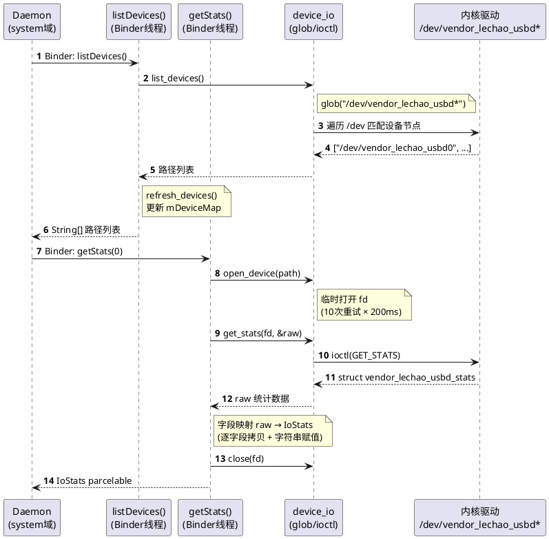

### 正常路径：事件读取流程

Daemon 调用 `readEvent` 阻塞等待内核事件，HAL 内部 poll + 循环 read 排空：

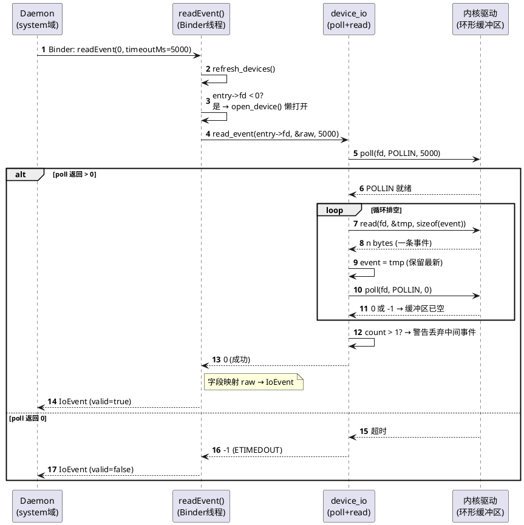

### 异常路径：设备节点消失

设备热拔后，持久 fd 失效，HAL 关闭 fd 并标记 -1，下次调用重新尝试：

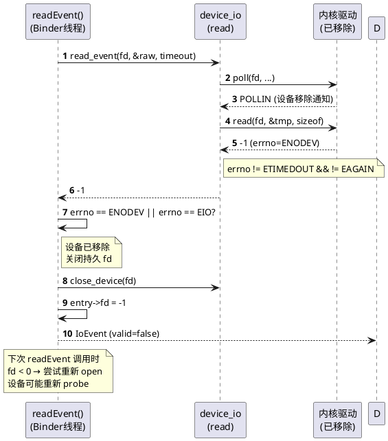

### 异常路径：设备热插拔

新设备插入或移除时，`refresh_devices` 自动同步 `mDeviceMap`：

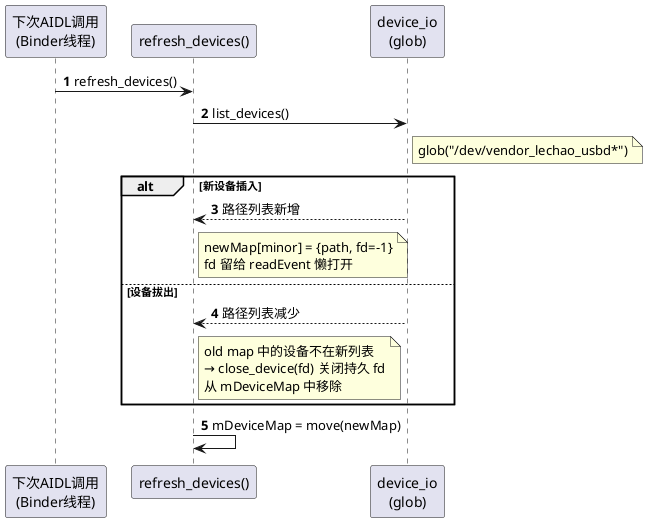

## 逻辑视图

### 模块分解

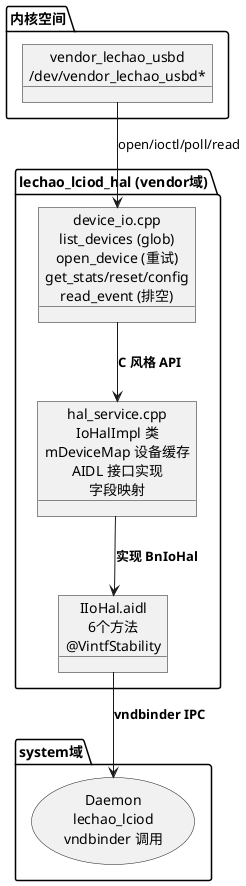

**职责矩阵：**

| 模块 | 职责 | 关键抽象 |
|------|------|---------|
| `hal_service.cpp` | AIDL 接口实现、设备缓存管理、字段映射 | `class IoHalImpl` — [hal_service.cpp:66](./../patchs/rpi5/aosp/new/vendor/lechao/services/lechao_lciod/hal/hal_service.cpp#L66) |
| `device_io.cpp` | 底层 IO 封装（glob/ioctl/poll/read） | `list_devices()` / `read_event()` — [device_io.cpp:29](./../patchs/rpi5/aosp/new/vendor/lechao/services/lechao_lciod/hal/device_io.cpp#L29) |
| `vendor_lechao_usbd-ioctl.h` | 内核-用户态共享 ABI | `struct vendor_lechao_usbd_stats` — [vendor_lechao_usbd-ioctl.h:55](./../patchs/rpi5/aosp/new/vendor/lechao/services/lechao_lciod/hal/vendor_lechao_usbd-ioctl.h#L55) |

### AIDL 接口定义

> 完整定义见 [`IIoHal.aidl`](./../patchs/rpi5/aosp/new/vendor/lechao/services/lechao_lciod/vendor/lechao/lciod/IIoHal.aidl)

服务名：`vendor.lechao.lciod.IIoHal/default`

```aidl
@VintfStability
interface IIoHal {
    String[] listDevices();
    IoStats getStats(int deviceMinor);
    void resetState(int deviceMinor);
    IoConfig getConfig(int deviceMinor);
    boolean setConfig(int deviceMinor, in IoConfig config);
    IoEvent readEvent(int deviceMinor, int timeoutMs);
}
```

| 方法 | 参数 | 返回值 | 说明 |
|------|------|--------|------|
| `listDevices()` | 无 | `String[]` | glob 枚举当前在线设备路径列表，触发 `refresh_devices` |
| `getStats(minor)` | `int deviceMinor` | `IoStats` | 获取统计快照，临时打开 fd，字段映射后返回 |
| `resetState(minor)` | `int deviceMinor` | `void` | 重置内核端计数器（IOC_RESET_STATE） |
| `getConfig(minor)` | `int deviceMinor` | `IoConfig` | 获取运行时配置（enabled + flags） |
| `setConfig(minor, cfg)` | `int + IoConfig` | `boolean` | 设置运行时配置，返回内核是否接受 |
| `readEvent(minor, ms)` | `int + int` | `IoEvent` | 阻塞等待事件（持久 fd + poll + 排空读取） |

**IoStats 字段表：**

| 字段 | 类型 | 对应内核字段 | 说明 |
|------|------|-------------|------|
| `vid` | `int` | `u16 vid` | USB 厂商 ID |
| `pid` | `int` | `u16 pid` | USB 产品 ID |
| `vendor` | `String` | `char vendor[32]` | 厂商名称 |
| `product` | `String` | `char product[32]` | 产品名称 |
| `readBytes` | `long` | `u64 read_bytes` | 累计读取字节数 |
| `readNs` | `long` | `u64 read_ns` | 累计读取耗时 |
| `readCmds` | `long` | `u64 read_cmds` | 累计读请求次数 |
| `writeBytes` | `long` | `u64 write_bytes` | 累计写入字节数 |
| `writeNs` | `long` | `u64 write_ns` | 累计写入耗时 |
| `writeCmds` | `long` | `u64 write_cmds` | 累计写请求次数 |
| `errorCount` | `long` | `u64 error_count` | 传输错误总次数 |
| `resetCount` | `long` | `u64 reset_count` | USB 复位次数 |
| `stallCount` | `long` | `u64 stall_count` | 端点停滞次数 |
| `corruptCount` | `long` | `u64 corrupt_count` | 数据损坏次数 |
| `timeoutCount` | `long` | `u64 timeout_count` | 传输超时次数 |
| `probeCount` | `long` | `u64 probe_count` | 设备探测次数 |
| `disconnectCount` | `long` | `u64 disconnect_count` | 设备断开次数 |
| `degradeCount` | `long` | `u64 degrade_count` | 速率降级次数 |
| `lastTransportLatencyNs` | `long` | `u64 last_transport_latency_ns` | 最近传输延迟 |
| `currentRate` | `long` | `u64 current_rate` | 当前传输速率 |
| `lastEventTsNs` | `long` | `u64 last_event_ts_ns` | 最近事件时间戳 |
| `lastEventType` | `int` | `u32 last_event_type` | 最近事件类型 |
| `enabled` | `boolean` | `u8 enabled` | 监控启用标志 |
| `flags` | `int` | `u32 flags` | 配置标志位 |

**IoConfig 字段表：**

| 字段 | 类型 | 说明 |
|------|------|------|
| `enabled` | `boolean` | IO 监控启用标志 |
| `flags` | `int` | 配置标志位（内核扩展保留） |

**IoEvent 字段表：**

| 字段 | 类型 | 说明 |
|------|------|------|
| `timestampNs` | `long` | 事件内核单调时钟时间戳（纳秒） |
| `eventType` | `int` | 事件类型（0-6，见内核 enum） |
| `eventValue` | `int` | 事件附加数值（语义取决于类型） |
| `dataDirection` | `byte` | 传输方向：0=NONE, 1=READ, 2=WRITE |
| `status` | `int` | 事件状态码：0=成功，负值=errno |
| `valid` | `boolean` | 事件是否有效；false 表示超时/无事件 |

### 设备缓存设计

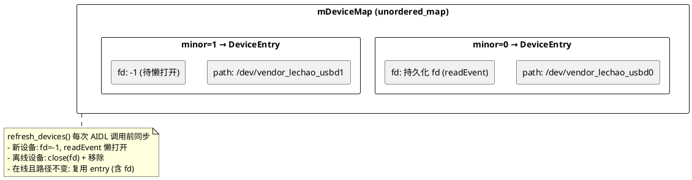

**DeviceEntry 结构：**

```cpp
// hal_service.cpp:49
struct DeviceEntry {
    std::string path;  // 设备节点路径
    int fd = -1;       // 持久化 fd，readEvent 使用；-1 表示已关闭
};
```

**持久 fd vs 临时 fd 策略：**

| 方法 | fd 策略 | 原因 |
|------|---------|------|
| `listDevices` | 无 fd | 仅 glob 枚举，不操作设备 |
| `getStats` | 临时打开即关 | ioctl 单次操作，无需保持 fd |
| `resetState` | 临时打开即关 | 同上 |
| `getConfig` | 临时打开即关 | 同上 |
| `setConfig` | 临时打开即关 | 同上 |
| `readEvent` | **持久 fd** | poll→read 连续操作，fd 必须保持打开 |

## 过程视图

### 并发模型

HAL 进程采用 **单 Binder 线程** 模型，所有 AIDL 调用串行执行：

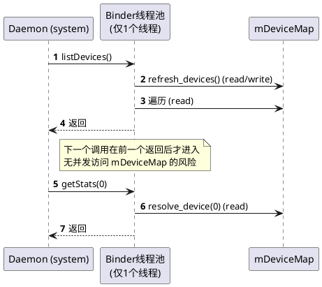

```cpp
// hal_service.cpp:337
ABinderProcess_setThreadPoolMaxThreadCount(1);
```

**关键并发机制：** 单 Binder 线程保证 `mDeviceMap` 无需任何锁保护。所有 AIDL 方法入口先调用 `refresh_devices()` 同步设备列表，确保操作前设备仍在线。

### read_event 排空策略

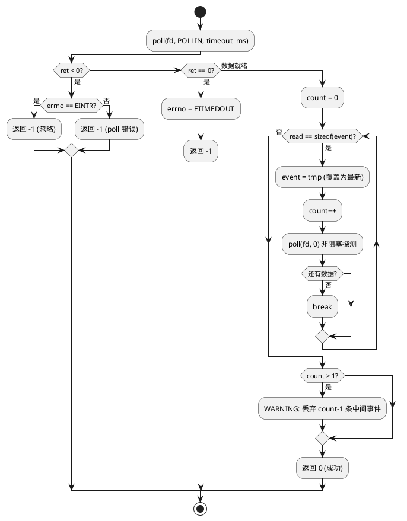

**排空策略说明：** 内核环形缓冲区大小为 32 条事件（`VENDOR_LECHAO_USBD_EVENT_BUF_SIZE`）。用户态消费不及时时可能积压多条。`read_event` 循环 read 直到排空，只保留最后一条（最新），中间事件丢弃并打印警告日志。

### 设备打开重试

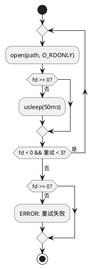

## 开发视图

### 文件职责矩阵

```
patchs/rpi5/aosp/new/vendor/lechao/services/lechao_lciod/
├── Android.bp                             # 顶层 Soong 配置（system + vendor AIDL 接口）
├── common/                                # HAL/Daemon 公共工具库
│   ├── Android.bp                         # cc_library_static (lechao_lciod_common)
│   ├── minor_utils.h                      # minor 编号解析 API
│   └── minor_utils.cpp                    # ParseMinorFromPath / BuildDevicePath 实现
├── hal/                                   # vendor 域 HAL 实现
│   ├── Android.bp                         # cc_binary + VINTF prebuilt_etc
│   ├── hal_service.cpp                    # AIDL 接口实现 + 设备缓存 + 进程入口
│   ├── device_io.cpp                      # 底层 IO 封装（glob/ioctl/poll/read）
│   ├── device_io.h                        # IO 操作 API 声明
│   ├── vendor_lechao_usbd-ioctl.h         # 内核-用户态共享 ABI 定义
│   ├── lechao_lciod_hal.rc                # init 启动脚本
│   └── vendor.lechao.lciod.IIoHal-service.xml  # VINTF manifest 声明
├── vendor/lechao/lciod/                   # Vendor AIDL 接口（VINTF 稳定）
│   ├── IIoHal.aidl                        # HAL 接口定义（6个方法）
│   ├── IoStats.aidl                       # 统计数据 parcelable（24字段）
│   ├── IoConfig.aidl                      # 配置 parcelable（2字段）
│   └── IoEvent.aidl                       # 事件 parcelable（6字段）
├── aidl_api/                              # AIDL API 冻结快照
└── daemon/                                # system 域 Daemon（详见 02.03）
```

| 文件 | 职责 | 关键函数/类 | 行数 |
|------|------|------------|------|
| `hal_service.cpp` | AIDL 实现、设备缓存、字段映射、进程入口 | `IoHalImpl` / `main()` | 354 |
| `device_io.cpp` | 底层 IO 封装（glob 枚举、带重试 open、ioctl、排空 read） | `list_devices()` / `read_event()` | 180 |
| `device_io.h` | IO 操作 C 风格 API 声明 | — | 89 |
| `minor_utils.h` | HAL/Daemon 共用 minor 编号解析 API（`ParseMinorFromPath`/`BuildDevicePath`） | — | 52 |
| `minor_utils.cpp` | 严格数字校验 + 范围检查 `[0,65535]` | `ParseMinorFromPath()` | 51 |
| `vendor_lechao_usbd-ioctl.h` | 内核共享 ABI（struct/event/ioctl 命令） | `struct vendor_lechao_usbd_stats` | 175 |
| `IIoHal.aidl` | VINTF 稳定 AIDL 接口 | `listDevices` / `getStats` / `readEvent` 等 | 47 |
| `IoStats.aidl` | 统计 parcelable（24 字段） | — | 49 |
| `IoConfig.aidl` | 配置 parcelable（2 字段） | — | 13 |
| `IoEvent.aidl` | 事件 parcelable（6 字段） | — | 27 |
| `lechao_lciod_hal.rc` | init 启动脚本（class hal，崩溃自动重启） | — | 20 |
| `vendor.lechao.lciod.IIoHal-service.xml` | VINTF manifest 声明 | — | 21 |
| `Android.bp` (顶层) | system + vendor 双 AIDL 接口编译配置 | — | 48 |
| `Android.bp` (common/) | `lechao_lciod_common` 静态库 | — | 25 |
| `Android.bp` (hal/) | HAL cc_binary + VINTF prebuilt_etc | — | 49 |

### 头文件依赖图

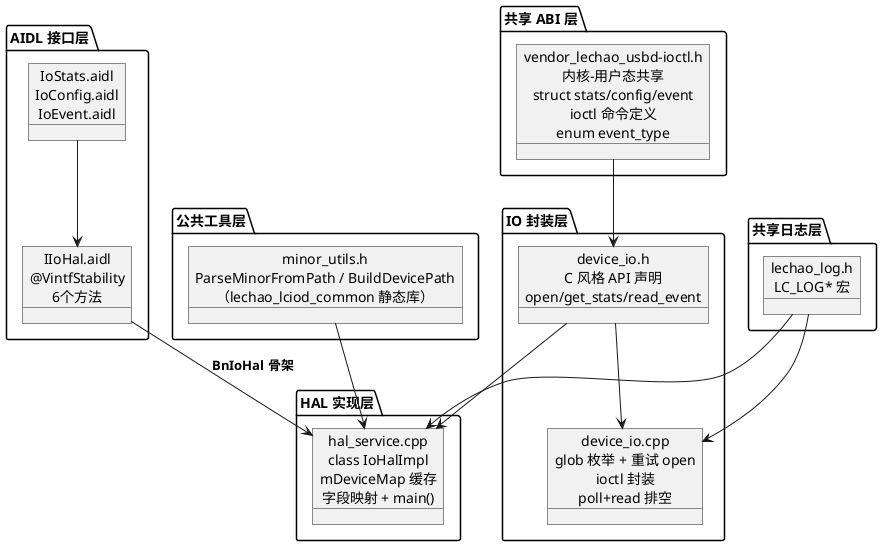

### 构建集成

#### Soong 配置

> 完整定义：[`Android.bp` (顶层)](./../patchs/rpi5/aosp/new/vendor/lechao/services/lechao_lciod/Android.bp)，[`Android.bp` (hal/)](./../patchs/rpi5/aosp/new/vendor/lechao/services/lechao_lciod/hal/Android.bp)

| 模块 | 类型 | 说明 |
|------|------|------|
| `vendor.lechao.lciod` | `aidl_interface` | VINTF 稳定 AIDL 接口，`stability: "vintf"`，NDK 后端 |
| `system.lechao.lciod` | `aidl_interface` | system 分区 AIDL 接口，`unstable: true` |
| `lechao_lciod_common` | `cc_library_static` | HAL/Daemon 共用工具库（`minor_utils.cpp`），消除重复的 minor 解析逻辑 |
| `lechao_lciod_hal` | `cc_binary` | HAL 进程二进制，`vendor: true`，链接 `vendor.lechao.lciod-V1-ndk` + `lechao_lciod_common` |
| `vendor.lechao.lciod.IIoHal-vintf` | `prebuilt_etc` | VINTF manifest，安装到 `/vendor/etc/vintf/manifest/` |

#### device.mk 集成

```makefile
# lechao lciod HAL service
PRODUCT_PACKAGES += \
    lechao_lciod_hal \
    vendor.lechao.lciod.IIoHal-vintf
```

#### 编译与部署

```bash
cd ~/workspace/aosp
source build/envsetup.sh && lunch aosp_rpi5-bp1a-userdebug
m lechao_lciod_hal

# 验证部署
adb shell ls -l /vendor/bin/lechao_lciod_hal
adb reboot

# 验证 HAL 服务
adb shell service list | grep vendor.lechao.lciod
# 期望：vendor.lechao.lciod.IIoHal: [vendor.lechao.lciod.IIoHal/default]
```

## 部署视图

### 运行时拓扑

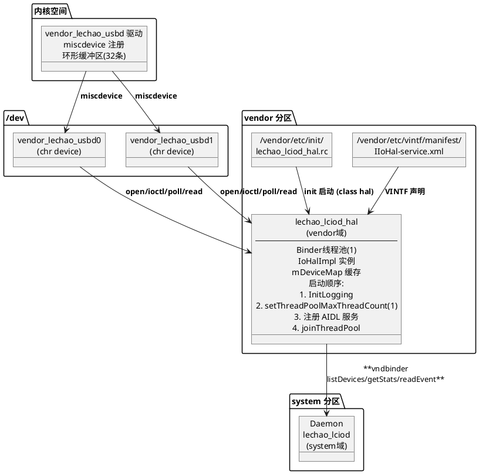

### init 启动配置

```bash
# lechao_lciod_hal.rc
service lechao_lciod_hal /vendor/bin/lechao_lciod_hal
    class hal
    user system
    group system
    interface aidl vendor.lechao.lciod.IIoHal/default
```

| 配置项 | 值 | 说明 |
|--------|-----|------|
| `class` | `hal` | 随 hal 类启动 |
| `user/group` | `system` | 以 system 身份运行 |
| `interface` | `vendor.lechao.lciod.IIoHal/default` | Treble 架构 AIDL 声明 |

> 不设 `oneshot`：HAL 进程崩溃后 init 自动重启，确保 HAL 可用性。System Daemon 通过 `linkToDeath` 死亡通知感知 HAL 重启并自动重连。

### SELinux 策略

> 完整定义：[`lechao_lciod_hal.te`](./../patchs/rpi5/aosp/new/device/brcm/rpi5/sepolicy/lechao_lciod_hal.te)

```te
type lechao_lciod_hal, domain;
type lechao_lciod_hal_exec, exec_type, vendor_file_type, file_type;
type lechao_lciod_hal_device, dev_type, file_type;
type lechao_lciod_hal_service, service_manager_type;

init_daemon_domain(lechao_lciod_hal)
vndbinder_use(lechao_lciod_hal)
binder_call(lechao_lciod_hal, servicemanager)

allow lechao_lciod_hal lechao_lciod_hal_device:chr_file { open read write ioctl getattr };
allow lechao_lciod_hal lechao_lciod_hal_service:service_manager add;
allow lechao_lciod_hal device:dir { search read open };
allow lechao_lciod_hal logd:unix_dgram_socket write;
```

**关联标签配置：**

| 文件 | 规则 |
|------|------|
| `file_contexts` | `/vendor/bin/lechao_lciod_hal → lechao_lciod_hal_exec` |
| `file_contexts` | `/dev/vendor_lechao_usbd* → lechao_lciod_hal_device` |
| `service_contexts` | `vendor.lechao.lciod.IIoHal → lechao_lciod_hal_service` |
| `service_contexts` | `vendor.lechao.lciod.IIoHal/default → lechao_lciod_hal_service` |

### 验证命令

```bash
# 验证 HAL 服务注册
adb shell service list | grep vendor.lechao.lciod

# 验证设备节点
adb shell ls -l /dev/vendor_lechao_usbd*

# 查看 HAL 日志
adb logcat -s lechao_lciod_hal

# 验证 SELinux 标签
adb shell ls -Z /dev/vendor_lechao_usbd0
adb shell ls -Z /vendor/bin/lechao_lciod_hal
```

## 关键设计与实现

### DeviceEntry 缓存 + refresh_devices — 避免每次重新枚举

**设计思路：** `mDeviceMap`（minor → DeviceEntry）缓存所有在线设备信息。每次 AIDL 调用前先 `refresh_devices()` 同步：在线且路径不变的设备复用已有 entry（含持久 fd），新设备创建 entry（fd=-1 待懒打开），离线设备关闭 fd 并移除。

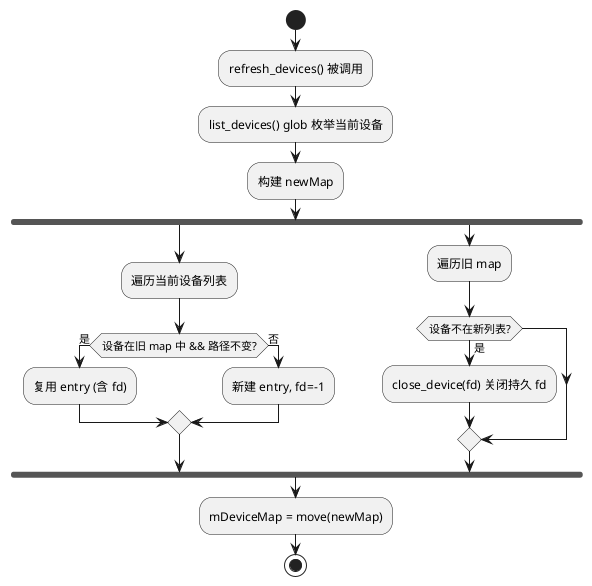

**源码实现：**

```cpp
// hal_service.cpp:91
void refresh_devices() {
    std::vector<std::string> current = ::list_devices();
    std::unordered_map<int, DeviceEntry> newMap;

    for (auto& path : current) {
        int minor = extract_minor(path);
        if (minor < 0) continue;

        auto old = mDeviceMap.find(minor);
        if (old != mDeviceMap.end() && old->second.path == path) {
            newMap[minor] = old->second;           // 复用已有 entry（含 fd）
        } else {
            DeviceEntry entry;
            entry.path = path;
            entry.fd = -1;                          // 留给 readEvent 懒打开
            newMap[minor] = entry;
        }
    }

    for (auto& [minor, entry] : mDeviceMap) {
        if (newMap.find(minor) == newMap.end())
            ::close_device(entry.fd);              // 关闭离线设备 fd
    }

    mDeviceMap = std::move(newMap);
}
```

### 持久 fd vs 临时 fd — readEvent 需持久，其他临时

**设计思路：** `readEvent` 需要 poll→read 连续操作，fd 必须保持打开，存储在 `DeviceEntry.fd` 中。其他方法（getStats/resetState/getConfig/setConfig）每次调用临时打开 fd，操作完立即关闭，避免占用 fd 资源。

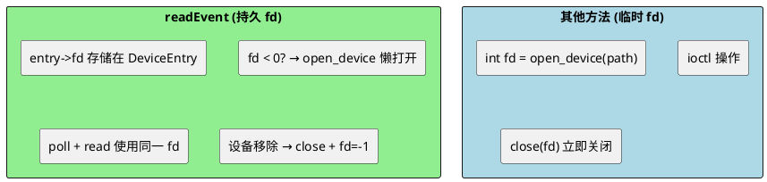

**源码实现（持久 fd 管理）：**

```cpp
// hal_service.cpp:285 — readEvent 中懒打开持久 fd
if (entry->fd < 0) {
    entry->fd = ::open_device(entry->path.c_str());
}

// hal_service.cpp:301 — 设备移除时关闭 fd 并标记 -1
if (errno == ENODEV || errno == EIO) {
    ::close_device(entry->fd);
    entry->fd = -1;                               // 下次调用重新尝试打开
}
```

### read_event 排空策略 — poll + 循环 read 保留最新

**设计思路：** 内核环形缓冲区（32 条）可能积压多条事件。`read_event` 先 poll 等待数据就绪，然后循环 read 直到排空，只保留最后一条（最新），中间事件丢弃。确保 HAL 获取的是最新状态。

**源码实现：**

```cpp
// device_io.cpp:143 — poll + 循环 read 排空
int read_event(int fd, struct vendor_lechao_usbd_event *event, int timeout_ms) {
    struct pollfd pfd = { .fd = fd, .events = POLLIN };
    int ret = poll(&pfd, 1, timeout_ms);
    if (ret <= 0) { errno = (ret == 0) ? ETIMEDOUT : errno; return -1; }

    struct vendor_lechao_usbd_event tmp;
    ssize_t n;
    int count = 0;
    while ((n = read(fd, &tmp, sizeof(tmp))) == (ssize_t)sizeof(tmp)) {
        *event = tmp;                             // 覆盖为最新
        count++;
        ret = poll(&pfd, 1, 0);                   // 非阻塞探测是否还有数据
        if (ret <= 0) break;
    }
    if (count > 1)
        LOG(WARNING) << "drained " << count << " events, "
                     << (count - 1) << " dropped";
    return (count > 0) ? 0 : -1;
}
```

### glob 设备枚举 — /dev/vendor_lechao_usbd* 模式匹配

**设计思路：** 使用 POSIX `glob(3)` 函数匹配 `/dev/vendor_lechao_usbd*` 模式，枚举所有内核创建的设备节点。比手动遍历 `/dev` 目录更简洁高效，且天然支持多设备。

**源码实现：**

```cpp
// device_io.cpp:29
std::vector<std::string> list_devices() {
    glob_t gl;
    char pattern[128];
    snprintf(pattern, sizeof(pattern), "%s*", DEV_PREFIX);
    std::vector<std::string> result;
    if (glob(pattern, 0, NULL, &gl) == 0) {
        for (size_t i = 0; i < gl.gl_pathc; i++)
            result.emplace_back(gl.gl_pathv[i]);
        globfree(&gl);
    }
    return result;
}
```

### 字段映射 — 内核 struct → AIDL parcelable

**设计思路：** HAL 将内核 `struct vendor_lechao_usbd_stats`（C struct，u64/u16/char[] 混合）逐字段映射到 AIDL `IoStats` parcelable（long/int/String）。整数字段直接赋值，字符串字段用 `assign(ptr, len)` 拷贝。HAL 不做任何解析或校验。

**源码实现：**

```cpp
// hal_service.cpp:179 — getStats 中的字段映射
_aidl_return->vid = raw.vid;
_aidl_return->pid = raw.pid;
_aidl_return->vendor.assign(raw.vendor, strnlen(raw.vendor, sizeof(raw.vendor)));
_aidl_return->product.assign(raw.product, strnlen(raw.product, sizeof(raw.product)));
_aidl_return->readBytes = raw.read_bytes;
_aidl_return->readNs = raw.read_ns;
// ... 其余字段一一对应
```

> **ABI v2 字段裁剪说明：** 内核 `struct vendor_lechao_usbd_stats`（ABI v2）含 27 个业务字段 + `reserved[3]`，其中 `peak_rate`、`last_update`、`event_drop_count`（环形缓冲区溢出丢弃计数）不映射到 AIDL `IoStats`（24 字段）。HAL 仅选取上层监控需要的字段，内核保留的诊断字段可通过 usb-verify 工具直接 ioctl 读取。

### 单 Binder 线程 — 无并发风险

**设计思路：** `ABinderProcess_setThreadPoolMaxThreadCount(1)` 将 Binder 线程池限制为 1 个线程，所有 AIDL 调用串行执行。`mDeviceMap` 无需任何锁保护，简化实现。

**源码实现：**

```cpp
// hal_service.cpp:339
ABinderProcess_setThreadPoolMaxThreadCount(1);
auto service = ndk::SharedRefBase::make<IoHalImpl>();
const std::string name = std::string("vendor.lechao.lciod.IIoHal/") + "default";
AServiceManager_addService(service->asBinder().get(), name.c_str());
ABinderProcess_joinThreadPool();
```

## 接口参考

### AIDL 接口

> 完整定义：[`IIoHal.aidl`](./../patchs/rpi5/aosp/new/vendor/lechao/services/lechao_lciod/vendor/lechao/lciod/IIoHal.aidl)

| 方法 | 参数 | 返回值 | 说明 |
|------|------|--------|------|
| `listDevices()` | 无 | `String[]` | 枚举在线设备路径，触发 refresh_devices |
| `getStats(minor)` | `int` | `IoStats` | 统计快照，临时 fd + 字段映射 |
| `resetState(minor)` | `int` | `void` | 重置内核计数器 |
| `getConfig(minor)` | `int` | `IoConfig` | 获取运行时配置 |
| `setConfig(minor, cfg)` | `int + IoConfig` | `boolean` | 设置配置，返回是否成功 |
| `readEvent(minor, ms)` | `int + int` | `IoEvent` | 阻塞等待事件，持久 fd + 排空读取 |

### device_io API

> 完整定义：[`device_io.h`](./../patchs/rpi5/aosp/new/vendor/lechao/services/lechao_lciod/hal/device_io.h)

| 函数 | 参数 | 返回值 | 说明 |
|------|------|--------|------|
| `list_devices()` | 无 | `vector<string>` | glob 枚举设备路径 |
| `open_device(path)` | `const char*` | `int fd` | 带重试打开（默认 3 次 × 50ms，可通过参数覆盖） |
| `close_device(fd)` | `int` | `void` | 安全关闭（fd<0 跳过） |
| `get_stats(fd, stats)` | `int + struct*` | `0/-1` | ioctl GET_STATS |
| `reset_state(fd)` | `int` | `0/-1` | ioctl RESET_STATE |
| `get_config(fd, cfg)` | `int + struct*` | `0/-1` | ioctl GET_CONFIG |
| `set_config(fd, cfg)` | `int + struct*` | `0/-1` | ioctl SET_CONFIG |
| `read_event(fd, event, ms)` | `int + struct* + int` | `0/-1` | poll + 排空 read |

### 内核 ioctl 命令

> 完整定义：[`vendor_lechao_usbd-ioctl.h`](./../patchs/rpi5/aosp/new/vendor/lechao/services/lechao_lciod/hal/vendor_lechao_usbd-ioctl.h)

Magic number: `'R'` (0x52)，宏 `VENDOR_LECHAO_USBD_IOC_MAGIC`

| 命令 | 编码 | 方向 | 参数类型 | 功能 |
|------|------|------|---------|------|
| `IOC_GET_STATS` | `_IOR('R', 0, stats)` | 内核→HAL | `struct vendor_lechao_usbd_stats` | 获取统计快照（不重置） |
| `IOC_RESET_STATE` | `_IO('R', 1)` | HAL→内核 | 无 | 重置所有计数器为 0 |
| `IOC_GET_CONFIG` | `_IOR('R', 2, config)` | 内核→HAL | `struct vendor_lechao_usbd_config` | 获取运行时配置 |
| `IOC_SET_CONFIG` | `_IOW('R', 3, config)` | HAL→内核 | `struct vendor_lechao_usbd_config` | 设置运行时配置 |

**事件类型枚举（`enum vendor_lechao_usbd_event_type`）：**

| 值 | 常量 | 说明 |
|----|------|------|
| 0 | `EVENT_NONE` | 无事件 |
| 1 | `EVENT_TRANSPORT_ERROR` | 传输错误 |
| 2 | `EVENT_STALL` | 端点停滞 |
| 3 | `EVENT_DATA_CORRUPT` | 数据损坏 |
| 4 | `EVENT_TIMEOUT` | 传输超时 |
| 5 | `EVENT_RESET` | 设备复位 |
| 6 | `EVENT_RATE_DEGRADED` | 速率降级 |

### 运行时配置常量

| 常量 | 值 | 定义位置 | 说明 |
|------|-----|---------|------|
| `OPEN_RETRY_MAX_DEFAULT` | 3 | `device_io.cpp:50` | open 默认重试次数（`open_device` 可通过参数覆盖） |
| `OPEN_RETRY_DELAY_MS_DEFAULT` | 50ms | `device_io.cpp:51` | open 默认重试间隔 |
| `DEV_PREFIX` | `/dev/vendor_lechao_usbd` | `device_io.cpp:22` | 设备节点路径前缀 |
| `EVENT_BUF_SIZE` | 32 | `vendor_lechao_usbd-ioctl.h:114` | 内核事件环形缓冲区大小 |
| `IOC_MAGIC` | `'R'` | `vendor_lechao_usbd-ioctl.h:161` | ioctl magic number（`VENDOR_LECHAO_USBD_IOC_MAGIC`） |
| Binder 线程池 | 1 | `hal_service.cpp:339` | 单线程串行执行 |

## 版本历史

| 版本 | 日期 | 变更内容 |
|------|------|----------|
| **v1.0** | **2026-06-14** | 初始版本：实现 IIoHal AIDL 接口（6个方法）；DeviceEntry 缓存 + refresh_devices 热插拔管理；持久 fd vs 临时 fd 策略；read_event 排空读取（poll + 循环 read 保留最新）；glob 设备枚举；字段映射内核 struct → AIDL parcelable；单 Binder 线程无锁设计；VINTF 稳定 AIDL + SELinux 策略 |
| **v1.1** | **2026-06-14** | **重构 + 健壮性**：(1) minor 解析逻辑抽取为公共静态库 `lechao_lciod_common`（`common/minor_utils.{h,cpp}`），HAL 与 Daemon 共用 `ParseMinorFromPath`，消除重复实现；(2) `device_io.cpp` `open_device` 改为可变重试参数（默认 3×50ms），`read_event` 补充 POLLERR/POLLHUP 处理并保留真实 errno；(3) 内核 ABI 升级至 v2（stats 新增 `event_drop_count`），HAL 字段映射保持 24 字段不变，内核诊断字段（peak_rate/last_update/event_drop_count）通过 usb-verify 直接读取 |
