# LcIod System Daemon 服务

## 概述

`lechao_lciod` 是 system 分区的 IO 监控 Daemon 进程，实现 `IIoService` AIDL 接口，作为 vendor HAL 的代理层面向 system_server 和上层 App 暴露 IO 监控服务。

- **职责**：代理转发（system AIDL → vendor HAL） + 字段投影（省略管理字段） + 后台监控（定期打印速率到 logcat）
- **进程域**：system 域常驻进程，由 `lechao_lciod.rc` 在 boot_completed 时启动
- **数据源**：通过 vndbinder 连接 `vendor.lechao.lciod.IIoHal/default` HAL 服务

**设计理念：** System daemon 是架构抽象层，屏蔽 vendor HAL 实现细节——路径转换为 minor 编号、字段投影过滤管理字段、计算派生值（平均速率），上层只需感知简洁的 `IIoService` 接口。

**设计目标：**

1. **代理转发** — System AIDL 调用透明转发到 vendor HAL，无需上层感知跨分区 Binder 通信
2. **字段投影** — Vendor IoStats 包含 currentRate/enabled/flags 等管理字段，system IoStats 省略这些字段，上层按需通过 `getAverageRate()` 计算速率
3. **延迟连接** — Vendor HAL 可能比 system daemon 启动得晚，使用 `checkService` + 指数退避重连而非阻塞等待
4. **死亡重连** — 通过 `linkToDeath` 监听 HAL 进程死亡，自动清空缓存并在下次调用时重连
5. **detach 后台线程** — 监控线程独立运行，不阻塞 Binder RPC 主线程

**源码路径：**

- AOSP 源码根目录：`~/workspace/aosp`
- Daemon 源码目录：`vendor/lechao/services/lechao_lciod/daemon/`
- System AIDL 目录：`vendor/lechao/services/lechao_lciod/system/lechao/lciod/`
- 完整源码归档：[`../patchs/rpi5/aosp/new/vendor/lechao/services/lechao_lciod/daemon/`](./../patchs/rpi5/aosp/new/vendor/lechao/services/lechao_lciod/daemon/)

> **关联文档：** HAL（vendor 域）设计见 [02.02-HAL增强-lciod-hal](./02.02-HAL增强-lciod-hal.md)。内核驱动设计见 [02.01-内核态增强-lciod-kernel](./02.01-内核态增强-lciod-kernel.md)。系统级架构分析见 [README.md](./README.md)。

## 用例视图

### 正常路径：HAL 连接与代理转发

System daemon 启动后延迟连接 vendor HAL，AIDL 调用经字段投影后返回上层：

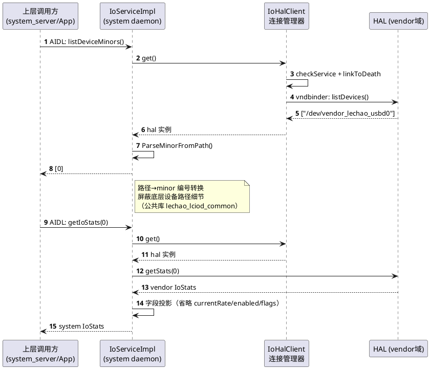

### 正常路径：后台监控线程

detach 线程独立运行，启动前先 refresh 设备列表，随后周期轮询事件并遍历所有活跃设备打印统计信息：

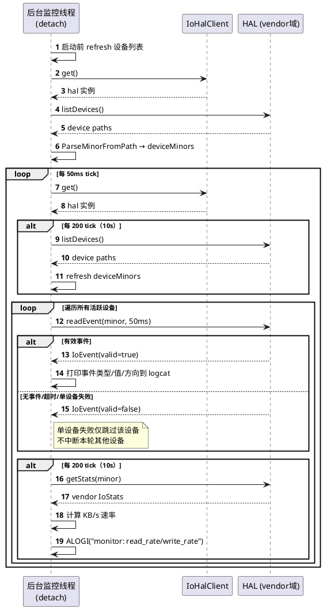

### 异常路径：HAL 断连重连

Vendor HAL 进程崩溃或重启时，daemon 通过死亡通知自动清空缓存并重连：

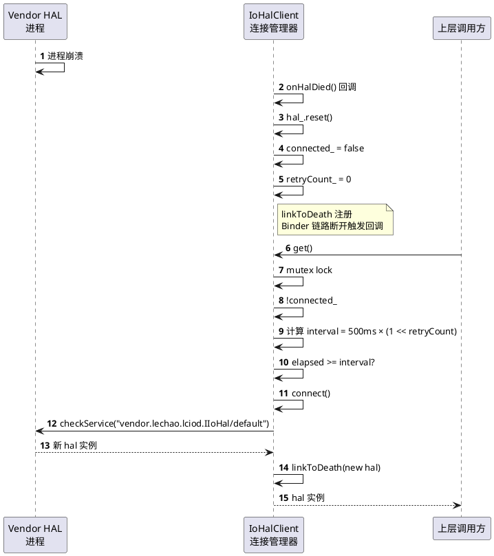

### 异常路径：设备不存在

调用方请求不存在的设备 minor 编号时，HAL 返回 ServiceSpecificError：

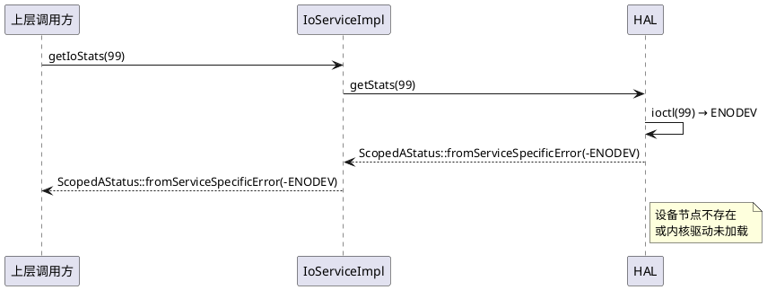

## 逻辑视图

### 模块分解

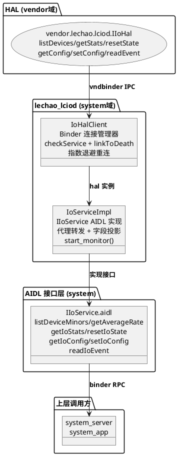

**职责矩阵：**

| 模块 | 职责 | 关键抽象 |
|------|------|---------|
| `IoServiceImpl` | IIoService AIDL 实现、代理转发、字段投影、后台监控启动 | `class IoServiceImpl` — [service.cpp:60](./../patchs/rpi5/aosp/new/vendor/lechao/services/lechao_lciod/daemon/service.cpp#L60) |
| `IoHalClient` | HAL Binder 连接管理、延迟连接、指数退避重连、死亡通知 | `class IoHalClient` — [hal_client.h:24](./../patchs/rpi5/aosp/new/vendor/lechao/services/lechao_lciod/daemon/hal_client.h#L24) |

### 双层 AIDL 接口

**System IIoService（7 个方法）：**

| 方法 | 功能 | 与 vendor IIoHal 对应关系 |
|------|------|--------------------------|
| `listDeviceMinors()` | 返回设备 minor 编号列表 | ← `listDevices()`（路径→minor 编号转换） |
| `getAverageRate(minor)` | 计算平均传输速率 | ← `getStats()`（派生值计算：总字节/总耗时） |
| `getIoStats(minor)` | 获取统计快照（投影版） | ← `getStats()`（字段投影，省略管理字段） |
| `resetIoState(minor)` | 重置统计计数器 | ← `resetState()`（1:1 代理） |
| `getIoConfig(minor)` | 获取运行时配置 | ← `getConfig()`（1:1 代理） |
| `setIoConfig(minor, config)` | 设置运行时配置 | ← `setConfig()`（1:1 代理） |
| `readIoEvent(minor, timeoutMs)` | 读取异步事件 | ← `readEvent()`（1:1 直传） |

**Vendor IIoHal（6 个方法）：**

| 方法 | 功能 | 说明 |
|------|------|------|
| `listDevices()` | 枚举设备节点路径 | 返回 `/dev/vendor_lechao_usbd<N>` 路径列表 |
| `getStats(minor)` | 获取统计快照 | 包含 currentRate/enabled/flags 等管理字段 |
| `resetState(minor)` | 重置计数器 | 对应内核 ioctl IOC_RESET_STATE |
| `getConfig(minor)` | 获取配置 | enabled + flags |
| `setConfig(minor, config)` | 设置配置 | 返回 boolean 表示是否成功 |
| `readEvent(minor, timeoutMs)` | 读取事件 | 从内核环形缓冲区读取异步事件 |

### 字段投影设计

System IoStats 是 vendor IoStats 的投影版本，省略管理字段：

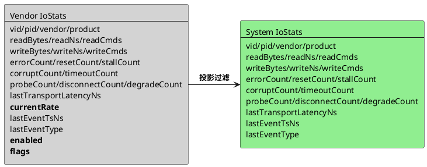

**省略字段说明：**

| 字段 | vendor IoStats | system IoStats | 原因 |
|------|---------------|---------------|------|
| `currentRate` | 包含 | 省略 | 上层通过 `getAverageRate()` 接口按需计算 |
| `peakRate` | 包含 | 省略 | 仅 degrade check 内部使用，不暴露给上层 |
| `enabled` | 包含 | 省略 | 管理字段，不暴露给上层 App |
| `flags` | 包含 | 省略 | 管理字段，保留给内核扩展使用 |

**计算字段 getAverageRate：**

公式：`(readBytes + writeBytes) × 10^9 / (readNs + writeNs)`，单位：字节/秒

```c
// service.cpp:92-107
uint64_t total = stats.readBytes + stats.writeBytes;
uint64_t totalNs = stats.readNs + stats.writeNs;
if (totalNs > 0)
    *_aidl_return = static_cast<int64_t>(total * 1000000000ULL / totalNs);
else
    *_aidl_return = 0;
```

## 过程视图

### 并发模型

Daemon 采用 **主线程 Binder RPC + detach 后台线程** 模型：

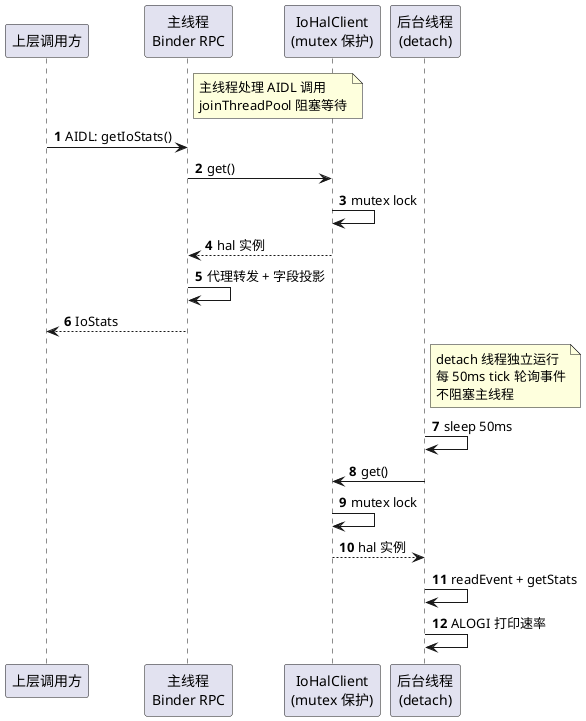

**线程安全分析：**

| 共享资源 | 保护机制 | 说明 |
|---------|---------|------|
| `IoHalClient::hal_` | `std::mutex mtx_` | 主线程 AIDL 调用与后台监控线程同时访问，需互斥保护 |
| `IoHalClient::connected_` | 同上 `mtx_` | 状态标志，重连逻辑依赖此字段 |
| `IoHalClient::retryCount_` | 同上 `mtx_` | 指数退避计算依赖此字段 |

### IoHalClient 延迟连接

首次调用或重连时，通过 `checkService` + 指数退避策略连接 HAL：

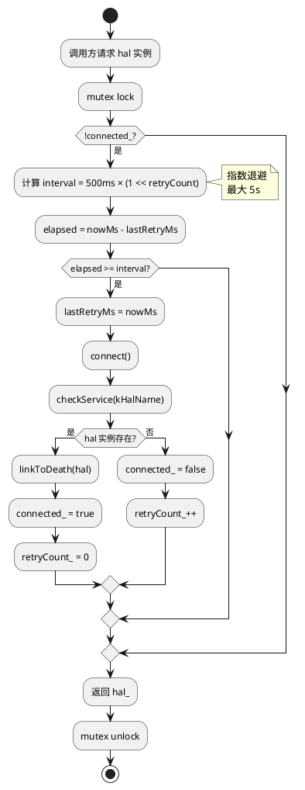

**指数退避参数：**

| 参数 | 值 | 定义位置 |
|------|-----|---------|
| 基础间隔 | 500ms | `hal_client.cpp:24` |
| 最大间隔 | 5000ms | `hal_client.cpp:25` |
| 指数上限 | 4（左移位） | `hal_client.cpp:99` |

间隔计算：`interval = 500ms × (1 << min(retryCount, 4))`
- retryCount=0 → 500ms
- retryCount=1 → 1000ms
- retryCount=2 → 2000ms
- retryCount=3 → 4000ms
- retryCount≥4 → 5000ms（上限）

### 监控线程行为

```plantuml
@startuml
start
:detach 线程启动;
:tick = 0;
:启动前 refresh 设备列表 → deviceMinors;

repeat
    :sleep 50ms;
    :tick++;
    
    :hal = hal_client_.get();
    if (!hal?) then (是)
        :skip cycle;
    else (否)
        if (tick % 200 == 0?) then (是)
            :listDevices();
            :refresh deviceMinors (ParseMinorFromPath);
        endif

        if (deviceMinors 为空?) then (是)
            :continue;
            stop
        endif

        loop 遍历所有活跃设备
            :readEvent(minor, 50ms timeout);

            if (event.valid?) then (是)
                :打印事件类型/值/方向到 logcat;
            else (否)
                :单设备失败仅告警，继续下一个;
            endif

            if (tick % 200 == 0?) then (是)
                :getStats(minor);
                :计算 KB/s 速率;
                :ALOGI("monitor: read_rate/write_rate");
            endif
        end
    endif
repeat while (true?)
stop
@enduml
```

**监控参数：**

| 参数 | 值 | 定义位置 |
|------|-----|---------|
| tick 间隔 | 50ms | `service.cpp:233` |
| 统计刷新周期 | 200 tick（10s） | `service.cpp:239` |
| readEvent timeout | 50ms | `service.cpp:257` |
| 启动时机 | `main()` 中服务注册成功后显式调用 `service->start()` | `service.cpp:336` |

### 关键不变量

| 不变量 | 保证机制 | 代码位置 |
|--------|---------|---------|
| HAL 连接状态一致性 | `IoHalClient::mtx_` 互斥保护 `connected_`/`hal_` | [`hal_client.h:27`](./../patchs/rpi5/aosp/new/vendor/lechao/services/lechao_lciod/daemon/hal_client.h#L27) |
| 死亡回调清空缓存 | `onHalDied()` 中 `hal_.reset()` + `connected_ = false` | [`hal_client.cpp:84`](./../patchs/rpi5/aosp/new/vendor/lechao/services/lechao_lciod/daemon/hal_client.cpp#L84) |
| 指数退避上限 | `min(retryCount, 4)` 左移位，最大 5000ms | [`hal_client.cpp:99`](./../patchs/rpi5/aosp/new/vendor/lechao/services/lechao_lciod/daemon/hal_client.cpp#L99) |
| detach 线程随进程终止 | 进程为 oneshot，退出时线程自动终止 | [`service.cpp:210`](./../patchs/rpi5/aosp/new/vendor/lechao/services/lechao_lciod/daemon/service.cpp#L210) |

## 开发视图

### 文件职责矩阵

```
patchs/rpi5/aosp/new/vendor/lechao/services/lechao_lciod/
├── common/
│   ├── Android.bp               # lechao_lciod_common 静态库（HAL/Daemon 共用）
│   ├── minor_utils.h            # ParseMinorFromPath / BuildDevicePath 声明
│   └── minor_utils.cpp          # 严格数字校验 + 范围 [0,65535]
├── daemon/
│   ├── service.cpp              # IoServiceImpl 主实现（代理转发 + 字段投影 + 监控线程）
│   ├── hal_client.cpp           # IoHalClient 实现（连接管理 + 重连 + 死亡通知）
│   ├── hal_client.h             # IoHalClient 声明（mutex + 状态字段 + DeathCookie）
│   ├── Android.bp               # cc_binary 编译配置
│   └── lechao_lciod.rc          # init 启动脚本（boot_completed 触发）
└── system/lechao/lciod/
    ├── IIoService.aidl          # system AIDL 接口定义（7 个方法）
    ├── IoStats.aidl             # system 统计数据 parcelable（投影版）
    ├── IoConfig.aidl            # system 配置数据 parcelable
    └── IoEvent.aidl             # system 事件数据 parcelable
```

| 文件 | 职责 | 关键函数 | 行数 |
|------|------|---------|------|
| `service.cpp` | IoServiceImpl 实现、代理转发、字段投影、监控线程 | `IoServiceImpl::listDeviceMinors()` / `getAverageRate()` / `getIoStats()` / `start_monitor()` / `start()` | 340 |
| `hal_client.cpp` | IoHalClient 实现、延迟连接、指数退避、死亡通知 | `IoHalClient::connect()` / `onHalDied()` / `get()` | 111 |
| `hal_client.h` | IoHalClient 声明（含 `DeathCookie` 结构体） | `class IoHalClient` | 48 |
| `minor_utils.h` | minor 解析公共 API（HAL/Daemon 共用） | `ParseMinorFromPath()` / `BuildDevicePath()` | 52 |
| `minor_utils.cpp` | 严格数字校验实现 | `ParseMinorFromPath()` | 51 |
| `IIoService.aidl` | system AIDL 接口定义 | `listDeviceMinors` / `getAverageRate` / `getIoStats` | 53 |
| `IoStats.aidl` | system 统计数据结构 | `parcelable IoStats` | 56 |
| `IoConfig.aidl` | system 配置数据结构 | `parcelable IoConfig` | 13 |
| `IoEvent.aidl` | system 事件数据结构 | `parcelable IoEvent` | 25 |
| `Android.bp` | Soong 编译配置 | — | 35 |
| `lechao_lciod.rc` | init 启动脚本 | — | 28 |

### 模块依赖图

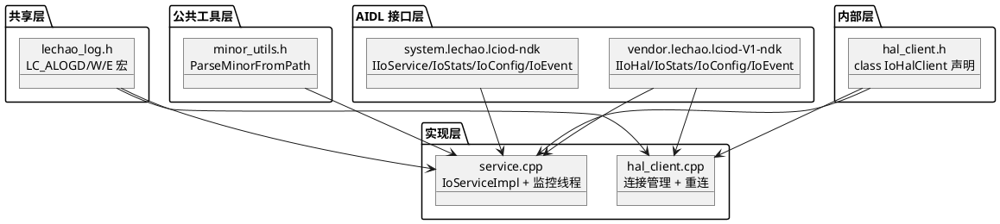

### 构建集成

#### Soong 配置

| 模块 | 类型 | 说明 |
|------|------|------|
| `lechao_lciod` | `cc_binary` | System daemon 进程二进制，`system` 分区 |
| `system.lechao.lciod-ndk` | `AIDL NDK 后端` | System AIDL 接口库（接口由单独的 Android.bp 定义） |
| `vendor.lechao.lciod-V1-ndk` | `AIDL NDK 后端` | Vendor AIDL 接口库（接口由单独的 Android.bp 定义） |
| `lechao_lciod_common` | `cc_library_static` | HAL/Daemon 共用工具库（minor_utils），daemon `static_libs` 依赖 |
| `vendor_lechao_log_headers` | `cc_library_headers` | 共享日志宏头文件 |

#### device tree 集成（必须）

> **lechao_lciod 的 `cc_binary` 必须显式加入 `PRODUCT_PACKAGES`**，否则不会被打包进镜像。

```makefile
# device/brcm/rpi5/aosp_rpi5.mk
PRODUCT_PACKAGES += \
    lechao_lciod \
    lechao_lciod_hal \
    vendor.lechao.lciod-service
```

#### 编译与部署

```bash
cd /home/lechao/workspace/aosp
source build/envsetup.sh && lunch aosp_rpi5-bp1a-userdebug
m lechao_lciod           # 编译 daemon

# 验证部署
adb shell ls -l /system/bin/lechao_lciod
adb reboot

# 验证 daemon 进程
adb shell ps -A | grep lechao_lciod

# 验证服务注册
adb shell service list | grep lechao
```

## 部署视图

### 运行时拓扑

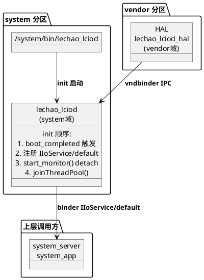

### init 启动配置

```bash
# lechao_lciod.rc
service lechao_lciod /system/bin/lechao_lciod
    class main
    user system
    group system
    interface aidl system.lechao.lciod.IIoService/default
    oneshot

on property:sys.boot_completed=1
    start lechao_lciod
```

| 配置项 | 值 | 说明 |
|--------|-----|------|
| `class` | `main` | 随 main 类服务启动 |
| `user/group` | `system` | 以 system 身份运行，可访问 AIDL service_manager |
| `interface` | `aidl system.lechao.lciod.IIoService/default` | 声明注册的 Binder 服务 |
| `oneshot` | — | 退出后不自动重启（避免 HAL 未就绪时反复重启） |
| `boot_completed` | `sys.boot_completed=1` | 等待系统完全启动后再启动服务 |

**延迟启动原因：**

1. Vendor HAL 可能还在启动阶段，`checkService` 会返回 nullptr
2. 内核驱动设备节点可能还未创建完成
3. 避免启动初期与 HAL 竞争 Binder 资源

### SELinux 策略

| 配置项 | 文件 | 说明 |
|--------|------|------|
| Daemon 域 | `lechao_lciod.te` | `type lechao_lciod, domain;` |
| 可执行文件标签 | `file_contexts` | `/system/bin/lechao_lciod → lechao_lciod_exec` |
| Binder 域 | `lechao_lciod.te` | `vndbinder_use(lechao_lciod)` |
| HAL 调用 | `lechao_lciod.te` | `binder_call(lechao_lciod, lechao_lciod_hal)` |
| HAL 服务查找 | `lechao_lciod.te` | `allow lechao_lciod lechao_lciod_hal_service:service_manager find;` |
| System 服务注册 | `lechao_lciod.te` | `allow lechao_lciod lciod_service:service_manager add;` |

```te
type lechao_lciod, domain;
type lechao_lciod_exec, exec_type, file_type;

init_daemon_domain(lechao_lciod)
typeattribute lechao_lciod halclientdomain;
vndbinder_use(lechao_lciod)
binder_call(lechao_lciod, lechao_lciod_hal)
allow lechao_lciod lechao_lciod_hal_service:service_manager find;
binder_use(lechao_lciod, servicemanager)
allow lechao_lciod binder_device:chr_file rw_file_perms;
allow lechao_lciod self:capability2 syslog;
allow lechao_lciod lciod_service:service_manager add;
type lciod_service, service_manager_type;
```

### 验证

```bash
# 确认二进制已部署
adb shell ls -l /system/bin/lechao_lciod

# 重启触发 init 启动
adb reboot

# 验证 daemon 进程
adb shell ps -A | grep lechao_lciod

# 验证服务注册
adb shell service list | grep lechao

# 查看监控日志（10s 周期）
adb logcat -s lechao_lciod:V | grep "monitor"
```

## 关键设计与实现

本章节从架构与源码两个维度，提炼 System Daemon 中的关键设计决策及其实现细节。

### 代理转发模式 — system AIDL → vendor HAL

**设计思路：** System daemon 作为架构抽象层，将 system 层 AIDL 调用透明转发到 vendor HAL，上层无需感知跨分区 Binder 通信细节。

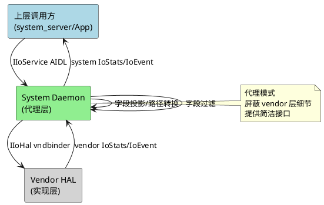

**源码实现：**

```c
// service.cpp:118-147
ndk::ScopedAStatus getIoStats(int32_t in_deviceMinor, IoStats* _aidl_return) override {
    auto hal = hal_client_.get();
    if (!hal) { return ndk::ScopedAStatus::fromServiceSpecificError(-ENODEV); }
    aidl::vendor::lechao::lciod::IoStats vstats;
    auto status = hal->getStats(in_deviceMinor, &vstats);
    if (!status.isOk()) { return status; }
    // 字段投影：直传 vid/pid/vendor/product + 计数器 + 延迟 + 时间戳
    _aidl_return->vid = vstats.vid;
    _aidl_return->pid = vstats.pid;
    // ... 省略 currentRate/enabled/flags
    return ndk::ScopedAStatus::ok();
}
```

### 字段投影设计 — 省略管理字段 + 计算字段

**设计思路：** Vendor IoStats 包含 currentRate/enabled/flags 等管理字段，这些字段不暴露给上层 App。System IoStats 省略这些字段，上层通过 `getAverageRate()` 接口按需计算速率。

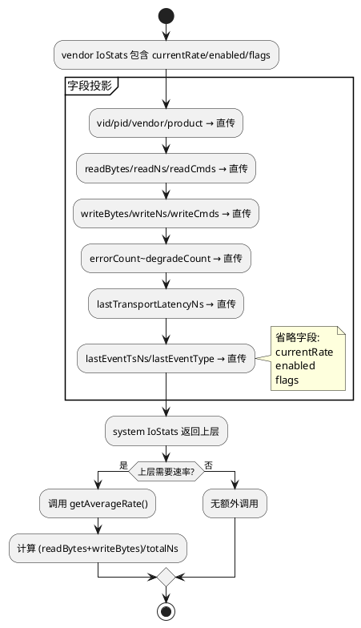

**源码实现：**

```c
// service.cpp:92-107（计算字段）
uint64_t total = stats.readBytes + stats.writeBytes;
uint64_t totalNs = stats.readNs + stats.writeNs;
if (totalNs > 0)
    *_aidl_return = static_cast<int64_t>(total * 1000000000ULL / totalNs);
else
    *_aidl_return = 0;

// service.cpp:118-147（字段投影）
// 省略 vstats.currentRate、vstats.peakRate、vstats.enabled、vstats.flags
// 直传所有其他字段
```

### IoHalClient 延迟连接 — checkService + 指数退避

**设计思路：** Vendor HAL 可能比 system daemon 启动得晚，使用 `AServiceManager_checkService`（立即返回）而非 `getService`（阻塞等待），配合延迟重连策略避免启动阻塞。

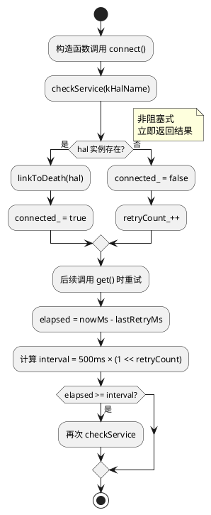

**源码实现：**

```c
// hal_client.cpp:46-75
void IoHalClient::connect() {
    auto hal = IIoHal::fromBinder(
        ndk::SpAIBinder(AServiceManager_checkService(kHalName)));  // 非阻塞式
    if (hal) {
        hal_ = hal;
        connected_ = true;
        retryCount_ = 0;
        AIBinder_linkToDeath(hal_->asBinder().get(), recipient, this);
    } else {
        connected_ = false;
        retryCount_++;
    }
}

// hal_client.cpp:96-111
std::shared_ptr<IIoHal> IoHalClient::get() {
    std::lock_guard<std::mutex> lock(mtx_);
    if (!connected_) {
        int64_t interval = kRetryIntervalBaseMs * (1LL << std::min(retryCount_, 4));  // 指数退避
        if (elapsed >= interval) {
            connect();
        }
    }
    return hal_;
}
```

### 死亡重连机制 — linkToDeath + onHalDied

**设计思路：** Vendor HAL 进程崩溃或重启时，system daemon 通过 `linkToDeath` 注册死亡监听，回调中自动清空缓存，下次调用时重新连接。cookie 使用 `DeathCookie{self, recipient}` 结构体，便于 `onHalDiedUnlinked` 回调正确释放 `AIBinder_DeathRecipient` 资源。

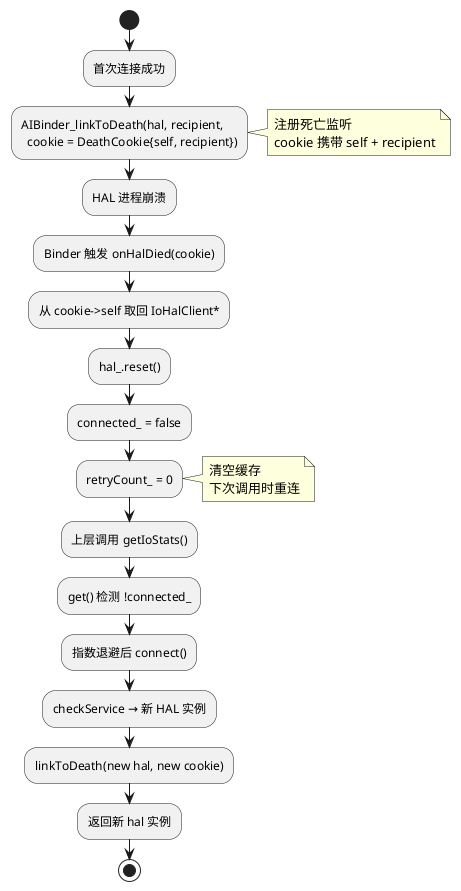

**源码实现：**

```c
// hal_client.cpp:54-66
AIBinder_DeathRecipient *recipient = AIBinder_DeathRecipient_new(&onHalDied);
AIBinder_DeathRecipient_setOnUnlinked(recipient, &onHalDiedUnlinked);

auto *cookie = new DeathCookie{this, recipient};
binder_status_t linkRet = AIBinder_linkToDeath(hal_->asBinder().get(), recipient, cookie);
if (linkRet != STATUS_OK) {
    AIBinder_DeathRecipient_delete(recipient);
    delete cookie;
} else {
    currentCookie_ = cookie;
}

// hal_client.cpp:84-94
void IoHalClient::onHalDied(void *cookie) {
    auto *dc = static_cast<DeathCookie *>(cookie);
    auto *self = dc->self;
    std::lock_guard<std::mutex> lock(self->mtx_);
    self->hal_.reset();              // 清空 HAL 实例
    self->connected_ = false;        // 标记未连接
    self->retryCount_ = 0;           // 重置重试计数
    self->currentCookie_ = nullptr;
}

// hal_client.cpp:77-82 — onUnlinked 回调释放 DeathRecipient + cookie
void IoHalClient::onHalDiedUnlinked(void *cookie) {
    auto *dc = static_cast<DeathCookie *>(cookie);
    AIBinder_DeathRecipient_delete(dc->recipient);
    delete dc;
}
```

> **DeathCookie 设计**：早期实现将 `this` 直接作为 cookie 传入，导致 `onHalDiedUnlinked` 回调无法获取 `recipient` 指针来调用 `AIBinder_DeathRecipient_delete`，造成内存泄漏。`DeathCookie{self, recipient}` 同时携带两者，析构函数 `~IoHalClient()` 也负责释放 `currentCookie_`。

### detach 后台线程 — 监控不阻塞 Binder

**设计思路：** 监控线程通过 `std::thread().detach()` 独立运行，不阻塞主线程的 Binder RPC。线程无独立退出条件，但进程为 oneshot，退出时线程自动终止。

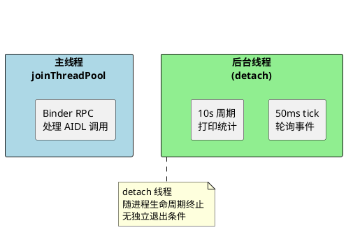

**源码实现：**

```c
// service.cpp:214-307
void start_monitor() {
    std::thread([this]() {
        int tick = 0;
        std::vector<int32_t> deviceMinors;  // 当前活跃设备列表
        // 启动前 refresh 一次设备列表
        ...
        while (true) {
            std::this_thread::sleep_for(std::chrono::milliseconds(50));
            tick++;
            auto hal = hal_client_.get();
            if (!hal) continue;
            // 每 tick 遍历所有活跃设备
            for (int32_t minor : deviceMinors) {
                hal->readEvent(minor, 50, &vev);
                // 每 200 tick 打印统计
                if (tick % 200 == 0) {
                    hal->getStats(minor, &stats);
                    ALOGI("monitor: read_rate/write_rate KB/s");
                }
            }
        }
    }).detach();  // detach 不阻塞主线程
}

// service.cpp:210 注释
// NOTE: detach 线程无独立退出条件，但本进程为 oneshot 服务，
// 进程退出时线程自动终止，不存在生命周期风险。
```

### 路径→minor 转换 — ParseMinorFromPath（公共工具库）

**设计思路：** HAL `listDevices()` 返回 `/dev/vendor_lechao_usbd<N>` 路径列表，system daemon 通过公共工具库 `lechao_lciod_common` 的 `ParseMinorFromPath()` 解析 minor 编号（HAL 与 Daemon 共用同一实现，消除重复）。严格校验：必须以 `kUsbdDevPrefix` 开头、后缀全为数字、范围 `[0, 65535]`。

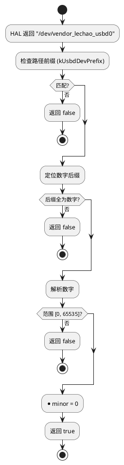

**源码实现：**

```c
// common/minor_utils.cpp
bool ParseMinorFromPath(const std::string& path, int32_t* minor) {
    // 1. 前缀匹配 kUsbdDevPrefix
    // 2. 后缀必须全为数字（不允许空字符串、非数字字符）
    // 3. 数字范围 [0, 65535]，避免 atoi 溢出隐患
    ...
}
```

> 公共工具库 `lechao_lciod_common`（`common/minor_utils.{h,cpp}`）被 HAL 和 Daemon 共同链接，消除早期 HAL/daemon 各自实现 `extract_minor` 的重复。详见 [02.02 common 章节](./02.02-HAL增强-lciod-hal.md#文件职责矩阵)。

## 接口参考

### AIDL 接口

**System IIoService（7 个方法）：**

| 方法 | 参数 | 返回值 | 说明 |
|------|------|--------|------|
| `listDeviceMinors()` | 无 | `int[]` | 返回在线设备的 minor 编号列表（0, 1, ...） |
| `getAverageRate(minor)` | `int deviceMinor` | `long` | 计算平均传输速率（字节/秒），公式：总字节×10^9/总耗时 |
| `getIoStats(minor)` | `int deviceMinor` | `IoStats` | 获取统计快照（投影版，省略 currentRate/enabled/flags） |
| `resetIoState(minor)` | `int deviceMinor` | `void` | 重置内核端统计计数器 |
| `getIoConfig(minor)` | `int deviceMinor` | `IoConfig` | 获取运行时配置（enabled + flags） |
| `setIoConfig(minor, config)` | `int deviceMinor` + `IoConfig` | `boolean` | 设置运行时配置，返回是否成功 |
| `readIoEvent(minor, timeoutMs)` | `int deviceMinor` + `int timeoutMs` | `IoEvent` | 从内核环形缓冲区读取异步事件，valid=false 表示超时或无事件 |

> 完整定义：[`IIoService.aidl`](./../patchs/rpi5/aosp/new/vendor/lechao/services/lechao_lciod/system/lechao/lciod/IIoService.aidl)

### IoHalClient API

| 函数 | 参数 | 返回值 | 说明 |
|------|------|--------|------|
| `IoHalClient()` | 无 | — | 构造函数，调用 `connect()` 尝试连接 HAL |
| `get()` | 无 | `std::shared_ptr<IIoHal>` | 获取 HAL 实例，未连接时按指数退避重试连接 |

### System IoStats parcelable

| 字段 | 类型 | 说明 |
|------|------|------|
| `vid` | `int` | USB 厂商 ID |
| `pid` | `int` | USB 产品 ID |
| `vendor` | `String` | 厂商名称（最长 32 字节） |
| `product` | `String` | 产品名称（最长 32 字节） |
| `readBytes` | `long` | 累计读取字节数 |
| `readNs` | `long` | 累计读取耗时（纳秒） |
| `readCmds` | `long` | 累计读取请求次数 |
| `writeBytes` | `long` | 累计写入字节数 |
| `writeNs` | `long` | 累计写入耗时（纳秒） |
| `writeCmds` | `long` | 累计写入请求次数 |
| `errorCount` | `long` | 传输错误总次数 |
| `resetCount` | `long` | USB 复位次数 |
| `stallCount` | `long` | 端点停滞次数 |
| `corruptCount` | `long` | 数据损坏次数 |
| `timeoutCount` | `long` | 传输超时次数 |
| `probeCount` | `long` | 设备探测次数 |
| `disconnectCount` | `long` | 设备断开次数 |
| `degradeCount` | `long` | 速率降级次数 |
| `lastTransportLatencyNs` | `long` | 最近一次传输延迟（纳秒） |
| `lastEventTsNs` | `long` | 最近一次事件时间戳（纳秒） |
| `lastEventType` | `int` | 最近一次事件类型 |

### System IoEvent parcelable

| 字段 | 类型 | 说明 |
|------|------|------|
| `timestampNs` | `long` | 事件发生时的内核单调时钟时间戳（纳秒） |
| `eventType` | `int` | 事件类型：1=TRANSPORT_ERROR, 2=STALL, 3=DATA_CORRUPT, 4=TIMEOUT, 5=RESET, 6=RATE_DEGRADED |
| `eventValue` | `int` | 事件附加数值，语义取决于 eventType |
| `dataDirection` | `byte` | 数据传输方向：0=NONE, 1=READ, 2=WRITE |
| `status` | `int` | 事件状态码：0=成功，负值=内核错误码 |
| `valid` | `boolean` | 事件是否有效；false 表示超时或缓冲区为空 |

## 版本历史

| 版本 | 日期 | 变更内容 |
|------|------|----------|
| **v1.0** | **2026-06-14** | **初始版本**：(1) System daemon 实现 IIoService AIDL 接口，作为 vendor HAL 代理层；(2) 字段投影设计：system IoStats 省略 currentRate/enabled/flags 等管理字段；(3) IoHalClient 延迟连接：checkService + 指数退避（500ms~5s）；(4) 死亡重连机制：linkToDeath + onHalDied 自动清空缓存；(5) detach 后台线程：每 50ms 轮询事件，每 10s 打印统计速率；(6) 路径→minor 转换：extract_minor_from_path 解析设备节点路径 |
| **v1.1** | **2026-06-14** | **健壮性修复 + 重构**：(1) DeathCookie 结构体重构死亡通知 cookie：从裸 `this` 改为 `{self, recipient}`，修复 `AIBinder_DeathRecipient` 内存泄漏，新增 `~IoHalClient()` 析构释放 + `onHalDiedUnlinked` 正确回调签名；(2) HAL `.rc` 移除 `oneshot`：HAL 崩溃后 init 自动重启，确保 HAL 可用性；(3) `device_io.cpp` read_event 保留真实 errno 而非硬编码 EAGAIN；(4) `service.cpp` deviceMinor 为 -1 时 continue 跳过，避免无效设备轮询 |
| **v1.2** | **2026-06-14** | **minor 解析公共库 + 多设备监控**：(1) minor 解析逻辑抽取为公共静态库 `lechao_lciod_common`（`common/minor_utils.{h,cpp}`），`ParseMinorFromPath` 采用严格数字校验（全数字 + 范围 `[0,65535]`），替代旧版裸 `atoi` 的 `extract_minor_from_path`，HAL 与 Daemon 共用同一实现；(2) 监控线程从单设备（`deviceMinor=0`）改为遍历所有活跃设备，单设备调用失败仅跳过该设备不中断本轮；(3) `main()` 中服务注册成功后显式调用 `service->start()` 启动监控线程，启动前先 refresh 设备列表避免首轮空转；(4) 字段投影补充省略 `peakRate`（仅 degrade check 内部使用） |