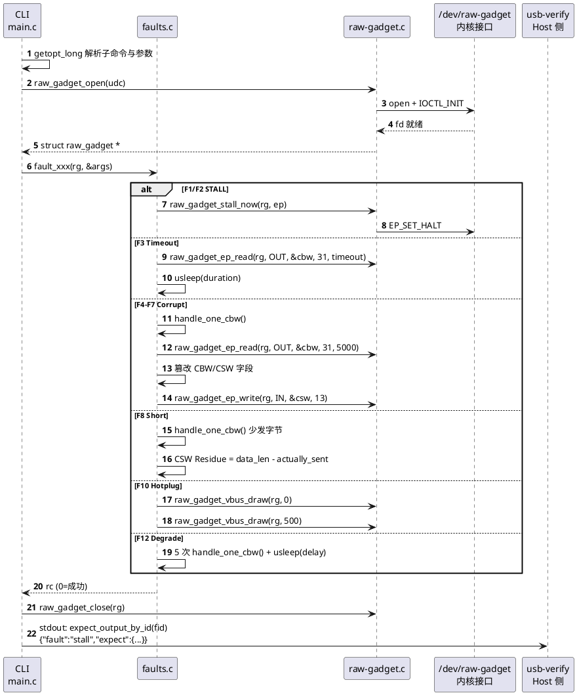
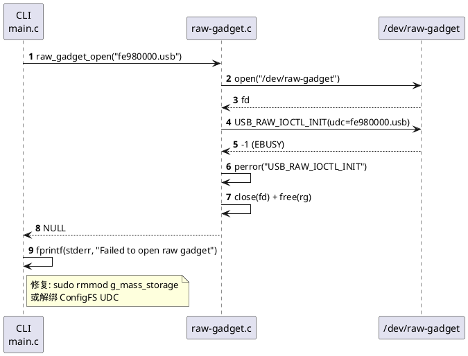
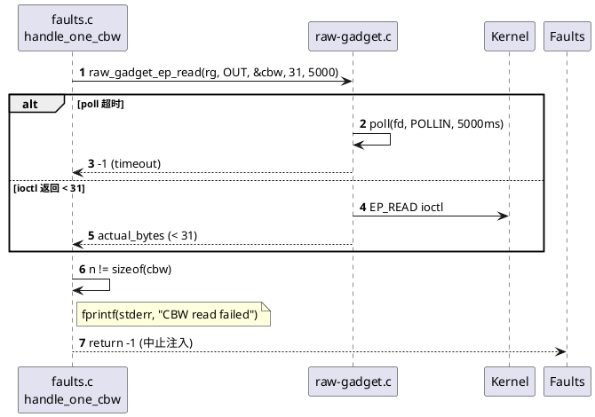
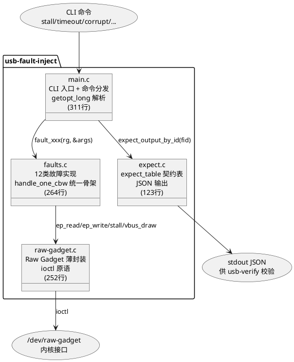
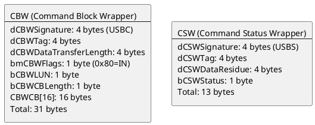
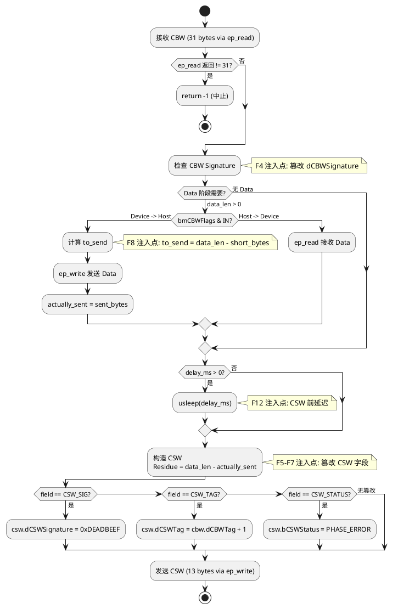
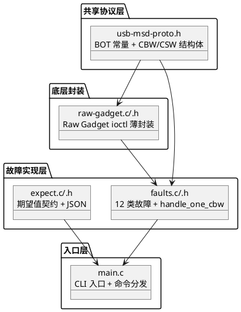
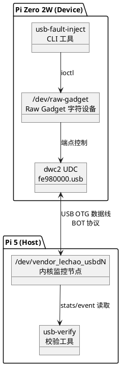
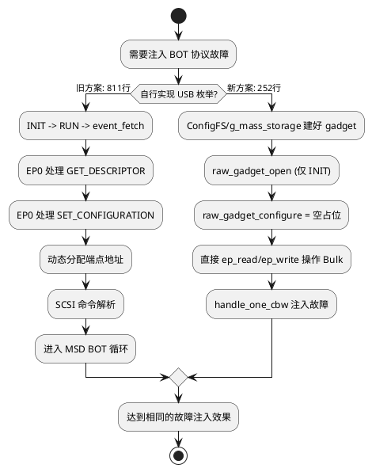

# usb-fault-inject 故障注入工具

## 概述

USB Device 侧（Pi Zero 2W）故障注入 CLI 工具：通过 Linux Raw Gadget 接口模拟 USB Mass Storage 设备，在 BOT 协议层注入 12 类故障，触发 Host 侧内核监控驱动检测并上报。

- **职责**：协议级故障注入（STALL / Timeout / Corrupt / Short / Abort / Hotplug / Disconnect / Degrade）+ 预期值 JSON 输出
- **上下游**：上游为 Raw Gadget 内核接口 `/dev/raw-gadget`；下游为 Host 侧 usb-verify 校验工具
- **对外接口**：CLI 命令 + stdout JSON

**设计理念：** Raw Gadget 薄封装策略——抛弃完整 USB 枚举栈，复用 ConfigFS / g_mass_storage 已建好的 gadget 端点，仅接管协议层数据流注入故障。代码量从旧版 811 行缩减至 252 行。

**设计目标：**

1. **协议级精度** — 所有故障在 BOT 协议层（CBW / Data / CSW）注入，精确控制触发时机
2. **12 类故障覆盖** — F1-F12 覆盖 STALL、超时、字段损坏、短传输、Abort、热插拔、断开、降级，与内核监控事件严格对齐
3. **注入-验证闭环** — 每次注入自动输出 expect JSON，供 usb-verify 自动化校验
4. **ConfigFS 共存** — Raw Gadget 仅接管协议层数据流，描述符配置外包给 ConfigFS / g_mass_storage
5. **交叉编译就绪** — Makefile 默认 `arm-linux-gnueabihf-`，一键生成 32-bit ARM 二进制
6. **UDC 无关性** — UDC 路径通过 CLI `--udc` 参数传入，默认 `fe980000.usb`

**源码路径：**

- 模块源码：[`patchs/rpi-zero2w/others/usb-fault-inject/`](./../patchs/rpi-zero2w/others/usb-fault-inject/)

> **关联文档：** usb-verify 校验工具设计见 [02.05-故障注入验证-usb-verify.md](./02.05-故障注入验证-usb-verify.md)。内核监控驱动设计见 [02.01-内核态增强-lciod-kernel.md](./02.01-内核态增强-lciod-kernel.md)。

## 用例视图

### 正常路径：协议级故障注入

CLI 解析命令行参数，打开 Raw Gadget，执行对应故障注入，输出 expect JSON 到 stdout。



### 异常路径

#### UDC 被占用

`raw_gadget_open` 执行 `USB_RAW_IOCTL_INIT` 时，若 UDC 已被 g_mass_storage 或 ConfigFS gadget 绑定，ioctl 返回 `EBUSY`。



#### CBW 读取失败

`handle_one_cbw` 中 `raw_gadget_ep_read` 返回值不等于 `sizeof(cbw)`（31 字节），故障注入中止。



## 逻辑视图

### 模块分解



**职责矩阵：**

| 模块 | 职责 | 关键抽象 |
|------|------|---------|
| `main.c` | CLI 入口 + 命令分发 + getopt_long 参数解析 | `main()` / `usage()` / `parse_field()` / `parse_ep()` — [main.c:66](./../patchs/rpi-zero2w/others/usb-fault-inject/main.c) |
| `faults.c` | 12 类故障实现 + `handle_one_cbw` 统一协议骨架 | `handle_one_cbw()` / `fault_stall_ep()` / `fault_corrupt()` / `fault_degrade()` — [faults.c:15](./../patchs/rpi-zero2w/others/usb-fault-inject/faults.c) |
| `raw-gadget.c` | Raw Gadget ioctl 薄封装（open/close/stall/ep_read/ep_write/vbus） | `struct raw_gadget` / `raw_gadget_open()` / `raw_gadget_stall_now()` — [raw-gadget.c:15](./../patchs/rpi-zero2w/others/usb-fault-inject/raw-gadget.c) |
| `expect.c` | `expect_table[12]` 期望值契约表 + JSON 输出 | `expect_table` / `expect_output_by_id()` / `expect_list_all()` — [expect.c:20](./../patchs/rpi-zero2w/others/usb-fault-inject/expect.c) |

### 故障类型矩阵（F1-F12）

| ID | 故障名 | CLI 命令 | 触发条件 | 注入点 | expect(error/reset/stall/corrupt/timeout) |
|----|--------|----------|----------|--------|-----|
| F1 | stall --ep out | `stall --ep out` | 立即触发 | EP_BULK_OUT SET_HALT | 1/1/1/-1/-1 |
| F2 | stall --ep in | `stall --ep in` | 立即触发 | EP_BULK_IN SET_HALT | 1/1/1/-1/-1 |
| F3 | timeout | `timeout --duration <ms>` | 收到 CBW 后静默 | Data/CSW 阶段不响应 | 1/1/-1/-1/1 |
| F4 | corrupt-cbw-sig | `corrupt --field cbw-sig` | CBW 签名检查前 | `cbw.dCBWSignature = 0xDEADBEEF` | 1/1/-1/1/-1 |
| F5 | corrupt-csw-sig | `corrupt --field csw-sig` | CSW 构造后 | `csw.dCSWSignature = 0xDEADBEEF` | 1/1/-1/1/-1 |
| F6 | corrupt-csw-tag | `corrupt --field csw-tag` | CSW 构造后 | `csw.dCSWTag = cbw.dCBWTag + 1` | 1/1/-1/1/-1 |
| F7 | corrupt-csw-status | `corrupt --field csw-status` | CSW 构造后 | `csw.bCSWStatus = PHASE_ERROR` | 1/1/-1/1/-1 |
| F8 | short | `short --bytes <n>` | Data IN 阶段 | 少发 n 字节, Residue 正确报告 | 1/-1/-1/1/-1 |
| F9 | abort | `abort --ep <in\|out>` | 立即触发 | SET_HALT + usleep(1ms) | 1/1/-1/-1/-1 |
| F10 | hotplug | `hotplug --cycles <n>` | 循环触发 | VBUS draw(0)/draw(500) | -1/-1/-1/-1/-1 |
| F11 | disconnect | `disconnect` | 立即触发 | VBUS 拉低保持 | -1/-1/-1/-1/-1 |
| F12 | degrade | `degrade --delay <ms>` | 5 次 CBW 循环 | 每次 CSW 前 usleep(delay) | -1/-1/-1/-1/-1 |

> **三态语义：** `-1` = 不校验该字段；`0` = 期望为 0；`N` = 期望 >= N（usb-verify 按 `actual >= expect` 校验）。

### BOT 协议结构

USB Mass Storage Class Bulk-Only Transport (BOT) 协议数据包结构：



**BOT 传输流程：**

```
Host                              Device
─────                             ──────
  │  ──── CBW (31 bytes) ────────►  │
  │  ◄─── Data (IN) ─────────────   │    或  ──── Data (OUT) ────►
  │  ◄─── CSW (13 bytes) ─────────  │
```

**字段表：**

| 字段 | 类型 | 偏移 | 说明 |
|------|------|------|------|
| CBW.dCBWSignature | uint32 | 0 | 固定 `0x43425355` ("USBC") |
| CBW.dCBWTag | uint32 | 4 | Host 生成，CSW 必须回显 |
| CBW.dCBWDataTransferLength | uint32 | 8 | Data 阶段传输字节数 |
| CBW.bmCBWFlags | uint8 | 12 | bit7=1 → IN (Device→Host) |
| CBW.bCBWLUN | uint8 | 13 | Logical Unit Number |
| CBW.bCBWCBLength | uint8 | 14 | SCSI 命令块有效长度 (1-16) |
| CBW.CBWCB[16] | uint8[16] | 15 | SCSI 命令块 |
| CSW.dCSWSignature | uint32 | 0 | 固定 `0x53425355` ("USBS") |
| CSW.dCSWTag | uint32 | 4 | 必须等于 CBW.dCBWTag |
| CSW.dCSWDataResidue | uint32 | 8 | `dCBWDataTransferLength - 实际传输` |
| CSW.bCSWStatus | uint8 | 12 | 0=Pass, 1=Fail, 2=Phase Error |

## 过程视图

### handle_one_cbw 协议骨架

`handle_one_cbw` 是 F4-F8/F12 共用的统一 CBW 处理骨架，在 7 个阶段中的 4 处可注入故障：



**4 处故障注入点汇总：**

| 注入点 | 位置 | 触发故障 |
|--------|------|----------|
| CBW 签名篡改 | handle_one_cbw 第2步 | F4 corrupt-cbw-sig |
| Data 少发 | handle_one_cbw 第4步 IN 分支 | F8 short |
| CSW 前延迟 | handle_one_cbw 第5步 | F12 degrade |
| CSW 字段篡改 | handle_one_cbw 第6步 | F5/F6/F7 corrupt-csw-* |

### 关键不变量

| 不变量 | 保证机制 | 代码位置 |
|--------|---------|---------|
| CBW 签名验证 | `cbw.dCBWSignature != USB_MS_CBW_SIGNATURE` 时拒绝处理（除非故意损坏） | [`faults.c:40-45`](./../patchs/rpi-zero2w/others/usb-fault-inject/faults.c) |
| CSW Residue 正确计算 | `csw.dCSWDataResidue = data_len - actually_sent`，短传输时反映真实差值 | [`faults.c:126`](./../patchs/rpi-zero2w/others/usb-fault-inject/faults.c) |
| CSW Tag 回显 | `csw.dCSWTag = cbw.dCBWTag`（除非 F6 故意篡改） | [`faults.c:125`](./../patchs/rpi-zero2w/others/usb-fault-inject/faults.c) |
| Data 方向判断 | `cbw.bmCBWFlags & USB_MS_CBW_FLAGS_IN`（0x80）决定 IN/OUT | [`faults.c:55`](./../patchs/rpi-zero2w/others/usb-fault-inject/faults.c) |
| CBW 读取超时 | `raw_gadget_ep_read(rg, OUT, &cbw, 31, 5000)` 固定 5 秒超时 | [`faults.c:26`](./../patchs/rpi-zero2w/others/usb-fault-inject/faults.c) |
| ep_io 堆分配 | `usb_raw_ep_io` 使用 flexible array，必须 calloc 连续内存 | [`raw-gadget.c:99-101`](./../patchs/rpi-zero2w/others/usb-fault-inject/raw-gadget.c) |

## 开发视图

### 文件职责矩阵

```
patchs/rpi-zero2w/others/usb-fault-inject/
├── main.c              # CLI 入口 + 命令分发 + getopt_long 解析
├── raw-gadget.c        # Raw Gadget ioctl 封装（open/close/stall/ep_read/ep_write/vbus）
├── raw-gadget.h        # Raw Gadget API 声明（不透明指针 struct raw_gadget）
├── faults.c            # 12 类故障实现 + handle_one_cbw 统一骨架
├── faults.h            # fault_id 枚举 + fault_args 参数结构 + 故障 API 声明
├── expect.c            # expect_table[12] 期望值契约表 + JSON 输出
├── expect.h            # fault_expect 结构体 + API 声明
├── usb-msd-proto.h     # BOT 协议常量 + CBW/CSW 结构体 + corrupt_field 枚举
└── Makefile            # arm-linux-gnueabihf 交叉编译
```

| 文件 | 职责 | 关键函数 | 行数 |
|------|------|---------|------|
| `main.c` | CLI 入口 + 命令分发 + getopt_long 参数解析 | `main()` / `usage()` / `parse_field()` / `parse_ep()` | 311 |
| `faults.c` | 12 类故障实现 + handle_one_cbw 统一骨架 | `handle_one_cbw()` / `fault_stall_ep()` / `fault_timeout()` / `fault_corrupt()` / `fault_short_transfer()` / `fault_abort()` / `fault_hotplug()` / `fault_disconnect()` / `fault_degrade()` | 264 |
| `raw-gadget.c` | Raw Gadget ioctl 薄封装 | `raw_gadget_open()` / `raw_gadget_stall_now()` / `raw_gadget_ep_read()` / `raw_gadget_ep_write()` / `raw_gadget_vbus_draw()` / `raw_gadget_send_bulk_err()` | 252 |
| `expect.c` | expect_table 契约表 + JSON 输出 | `expect_table` / `expect_output_by_id()` / `expect_list_all()` | 123 |
| `usb-msd-proto.h` | BOT 协议常量 + 结构体 | `struct usb_ms_cbw` / `struct usb_ms_csw` / `enum corrupt_field` | 67 |
| `faults.h` | fault_id 枚举 + fault_args 参数结构 | `enum fault_id` / `struct fault_args` | 85 |
| `raw-gadget.h` | Raw Gadget API 声明 | `struct raw_gadget` / 11 个函数声明 | 46 |
| `expect.h` | fault_expect 结构体 | `struct fault_expect` | 28 |
| `Makefile` | 交叉编译构建规则 | `all` / `clean` target | 32 |

### 模块依赖图



### 构建集成

Makefile 使用 `arm-linux-gnueabihf-` 交叉编译器，4 个 `.c` 文件编译为单个 `usb-fault-inject` 二进制。

| 配置项 | 值 | 说明 |
|--------|-----|------|
| `CROSS` | `arm-linux-gnueabihf-` | 默认交叉编译前缀（Pi Zero 2W 32-bit） |
| `CC` | `$(CROSS)gcc` | 编译器 |
| `CFLAGS` | `-O2 -Wall -Wextra -Wno-unused-parameter` | 编译选项 |
| `TARGET` | `usb-fault-inject` | 输出二进制名 |
| `SRCS` | `main.c raw-gadget.c faults.c expect.c` | 源文件列表 |

```bash
cd patchs/rpi-zero2w/others/usb-fault-inject

make
file usb-fault-inject
# 预期: ELF 32-bit LSB executable, ARM, ...

scp usb-fault-inject pi@pi-zero-2w.local:/usr/local/bin/
ssh pi@pi-zero-2w.local "chmod +x /usr/local/bin/usb-fault-inject"
```

## 部署视图

### 运行时拓扑



**拓扑要点：**

| 维度 | 说明 |
|------|------|
| 连接线缆 | USB OTG 数据线，Micro USB (Pi Zero 2W) → Type-A (Pi 5)，必须为数据线 |
| Pi Zero 2W 角色 | USB Device（Gadget 模式），通过 `dtoverlay=dwc2` 启用 |
| Pi 5 角色 | USB Host，标准 USB 口识别下游设备 |
| 传输协议 | USB 2.0 High-Speed (480Mbps)，Bulk-Only Transport (BOT) |
| 供电 | 两板各自独立供电，不通过 USB 数据线取电 |
| UDC 路径 | `fe980000.usb`（BCM2710A1 片内 DesignWare USB 2.0 OTG） |

### Raw Gadget + ConfigFS 共存架构

Raw Gadget 复用 ConfigFS / g_mass_storage 已建好的 gadget 端点，仅接管协议层数据流注入故障。`raw_gadget_configure()` 为空占位函数，不设置任何 USB 描述符。

```
┌──────────────────────────────────────────────────────┐
│                    用户态                              │
│  ┌────────────┐    ┌──────────────┐                   │
│  │ g_mass_..  │    │ ConfigFS     │                   │
│  │ modprobe   │    │ 文件操作      │                   │
│  └─────┬──────┘    └──────┬───────┘                   │
│        │                  │                           │
├────────┼──────────────────┼───────────────────────────┤
│        ▼                  ▼           内核态           │
│  ┌─────────────────────────────┐                       │
│  │  Gadget API (内核Gadget框架) │                       │
│  └─────────────┬───────────────┘                       │
│                ▼                                       │
│  ┌─────────────────────────────┐                       │
│  │      UDC 驱动 (dwc2)         │                      │
│  └─────────────────────────────┘                       │
│                ▲                                       │
│  ┌─────────────┴───────────────┐                       │
│  │     Raw Gadget (/dev/raw-)   │   ← 仅接管协议层      │
│  └─────────────────────────────┘                       │
├──────────────────────────────────────────────────────┤
│                    用户态                              │
│            usb-fault-inject                            │
│            (ioctl 直接控制端点读写)                     │
└──────────────────────────────────────────────────────┘
```

> **关键：** Raw Gadget 与 g_mass_storage / ConfigFS 互斥使用 UDC。运行 usb-fault-inject 前必须先 `rmmod g_mass_storage` 或解绑 ConfigFS。但 Raw Gadget 本身不需要描述符配置——它复用上层 gadget 框架已建好的端点。

## 关键设计与实现

### Raw Gadget 薄封装策略 — 从 811 行到 252 行

**设计思路：** 旧版 raw-gadget.c 包含完整的 USB 枚举引擎（EP0 SETUP 处理、GET_DESCRIPTOR 响应、SET_CONFIGURATION 处理、端点动态分配），共 811 行。新版发现这些逻辑在 ConfigFS / g_mass_storage 已建立 gadget 后完全不需要——Raw Gadget 只需接管 Bulk 端点的数据流即可注入故障。



**源码实现：**

```c
// raw-gadget.c:62-71
int raw_gadget_configure(struct raw_gadget *rg,
                         uint16_t vid, uint16_t pid,
                         const char *vendor, const char *product)
{
    (void)rg; (void)vid; (void)pid; (void)vendor; (void)product;
    return 0;
}
```

`raw_gadget_configure` 是空函数——所有描述符配置（VID/PID/厂商字符串/端点描述符）由 ConfigFS 或 g_mass_storage 在内核 Gadget 框架中完成。usb-fault-inject 只需通过 `raw_gadget_open` 获取 fd，然后直接调用 `ep_read`/`ep_write`/`stall_now` 等原语操作 Bulk 端点。

### expect_table 契约机制 — 注入-验证闭环的基石

**设计思路：** 12 类故障各自的预期内核监控事件不同（STALL 触发 stall_count，Timeout 触发 timeout_count，Corrupt 触发 corrupt_count），将预期值硬编码为 `expect_table[FAULT__MAX]`，注入后自动输出 JSON 供 usb-verify 校验。

**三态语义：**

| 取值 | 含义 | usb-verify 校验逻辑 |
|------|------|-------------------|
| `-1` | 不校验该字段 | 跳过 |
| `0` | 期望为 0 | `actual == 0` |
| `N` (> 0) | 期望 >= N | `actual >= N` |

```c
// expect.c:20-76
static const struct fault_expect expect_table[FAULT__MAX] = {
    [FAULT_STALL] = {
        .name = "stall", .human_desc = "STALL endpoint",
        .error_count = 1, .reset_count = 1, .stall_count = 1,
        .corrupt_count = -1, .timeout_count = -1,
    },
    [FAULT_TIMEOUT] = {
        .name = "timeout", .human_desc = "No response timeout",
        .error_count = 1, .reset_count = 1, .stall_count = -1,
        .corrupt_count = -1, .timeout_count = 1,
    },
    [FAULT_CORRUPT_CBW_SIG] = {
        .name = "corrupt-cbw-sig", .human_desc = "CBW Signature corrupted",
        .error_count = 1, .reset_count = 1, .stall_count = -1,
        .corrupt_count = 1, .timeout_count = -1,
    },
    [FAULT_SHORT] = {
        .name = "short", .human_desc = "Data short transfer",
        .error_count = 1, .reset_count = -1, .stall_count = -1,
        .corrupt_count = 1, .timeout_count = -1,
    },
    [FAULT_DEGRADE] = {
        .name = "degrade", .human_desc = "Rate degradation",
        .error_count = -1, .reset_count = -1, .stall_count = -1,
        .corrupt_count = -1, .timeout_count = -1,
    },
};
```

**JSON 输出示例：**

```json
{"fault":"stall","expect":{"error_count":1,"reset_count":1,"stall_count":1}}
{"fault":"timeout","expect":{"error_count":1,"reset_count":1,"timeout_count":1}}
{"fault":"corrupt-cbw-sig","expect":{"error_count":1,"reset_count":1,"corrupt_count":1}}
{"fault":"short","expect":{"error_count":1,"corrupt_count":1}}
{"fault":"degrade","expect":{}}
```

### 12 类故障详解（F1-F12）

#### F1/F2 STALL — 端点 Stall 注入

**CLI 命令：**

```bash
usb-fault-inject stall --ep in     # F2: STALL Bulk-IN (0x81)
usb-fault-inject stall --ep out    # F1: STALL Bulk-OUT (0x02)
```

**实现路径：** `main.c → fault_stall_ep(rg, &a) → raw_gadget_stall_now(rg, ep) → ioctl(EP_SET_HALT)`

```c
// faults.c:156-163
int fault_stall_ep(struct raw_gadget *rg, const struct fault_args *a)
{
    if (a->ep != EP_BULK_IN && a->ep != EP_BULK_OUT) {
        fprintf(stderr, "[faults] STALL: invalid ep 0x%02x\n", a->ep);
        return -1;
    }
    return raw_gadget_stall_now(rg, a->ep);
}
```

```c
// raw-gadget.c:76-85
int raw_gadget_stall_now(struct raw_gadget *rg, int ep)
{
    __u32 ep_handle = (__u32)ep;
    if (ioctl(rg->fd, USB_RAW_IOCTL_EP_SET_HALT, &ep_handle) < 0) {
        perror("USB_RAW_IOCTL_EP_SET_HALT");
        return -1;
    }
    fprintf(stderr, "[raw-gadget] STALL injected on ep 0x%02x\n", ep);
    return 0;
}
```

**expect JSON：** `{"fault":"stall","expect":{"error_count":1,"reset_count":1,"stall_count":1}}`

#### F3 Timeout — 传输超时

**CLI 命令：** `usb-fault-inject timeout --duration 5000`

**实现路径：** `main.c → fault_timeout(rg, &a) → raw_gadget_ep_read(CBW) → usleep(duration)`

接收一次 CBW 后故意不发送 Data/CSW 响应，静默等待指定时长，触发 Host 端传输超时。

```c
// faults.c:166-188
int fault_timeout(struct raw_gadget *rg, const struct fault_args *a)
{
    struct usb_ms_cbw cbw;
    fprintf(stderr, "[faults] TIMEOUT: ignoring CBW for %d ms\n",
            a->duration_ms);

    int n = raw_gadget_ep_read(rg, EP_BULK_OUT, &cbw, sizeof(cbw),
                               a->duration_ms + 1000);
    if (n > 0) {
        fprintf(stderr, "[faults] TIMEOUT: CBW received, holding %d ms...\n",
                a->duration_ms);
        usleep(a->duration_ms * 1000);
    } else {
        fprintf(stderr, "[faults] TIMEOUT: no CBW received, sleeping anyway\n");
        usleep(a->duration_ms * 1000);
    }
    return 0;
}
```

**expect JSON：** `{"fault":"timeout","expect":{"error_count":1,"reset_count":1,"timeout_count":1}}`

#### F4-F7 Corrupt — CBW/CSW 字段损坏

**CLI 命令：**

```bash
usb-fault-inject corrupt --field cbw-sig      # F4
usb-fault-inject corrupt --field csw-sig      # F5
usb-fault-inject corrupt --field csw-tag      # F6
usb-fault-inject corrupt --field csw-status   # F7
```

**实现路径：** `main.c → fault_corrupt(rg, &a) → handle_one_cbw(rg, &a, &count)`

4 种损坏均在 `handle_one_cbw` 中处理：

```c
// faults.c:34-37 (F4: CBW 签名损坏)
if (a->field == CORRUPT_FIELD_CBW_SIG) {
    cbw.dCBWSignature = 0xDEADBEEF;
}

// faults.c:130-143 (F5-F7: CSW 字段损坏)
if (a->field == CORRUPT_FIELD_CSW_SIG) {
    csw.dCSWSignature = 0xDEADBEEF;
} else if (a->field == CORRUPT_FIELD_CSW_TAG) {
    csw.dCSWTag = cbw.dCBWTag + 1;
} else if (a->field == CORRUPT_FIELD_CSW_STATUS) {
    csw.bCSWStatus = USB_MS_CSW_STATUS_PHASE;
}
```

**expect JSON（4 种相同）：** `{"fault":"corrupt-csw-sig","expect":{"error_count":1,"reset_count":1,"corrupt_count":1}}`

#### F8 Short — 短传输

**CLI 命令：** `usb-fault-inject short --bytes 512`

**实现路径：** `main.c → fault_short_transfer(rg, &a) → handle_one_cbw(rg, &a, &count)`

Data IN 阶段少发 `short_bytes` 字节，CSW Residue 正确报告差值：

```c
// faults.c:63-74 (Data IN 阶段少发字节)
if (a->field == CORRUPT_FIELD_SHORT && a->short_bytes > 0) {
    if (a->short_bytes >= (int)data_len) {
        to_send = 0;
    } else {
        int reduced = (int)data_len - a->short_bytes;
        to_send = reduced;
    }
}

// faults.c:126 (Residue 正确计算)
csw.dCSWDataResidue = data_len - (uint32_t)actually_sent;
```

**expect JSON：** `{"fault":"short","expect":{"error_count":1,"corrupt_count":1}}`

#### F9 Abort — Bulk ABORT（ERR PID 模拟）

**CLI 命令：** `usb-fault-inject abort --ep in`

**实现路径：** `main.c → fault_abort(rg, &a) → raw_gadget_send_bulk_err(rg, ep)`

Raw Gadget 无直接 ERR PID 接口，通过 `EP_SET_HALT + usleep(1ms)` 模拟 ABORT 序列：

```c
// raw-gadget.c:207-218
int raw_gadget_send_bulk_err(struct raw_gadget *rg, int ep)
{
    __u32 ep_handle = (__u32)ep;
    if (ioctl(rg->fd, USB_RAW_IOCTL_EP_SET_HALT, &ep_handle) < 0) {
        perror("EP_SET_HALT (abort)");
        return -1;
    }
    usleep(1000);
    fprintf(stderr, "[raw-gadget] Bulk ERR injected on ep 0x%02x\n", ep);
    return 0;
}
```

**expect JSON：** `{"fault":"abort","expect":{"error_count":1,"reset_count":1}}`

#### F10 Hotplug — VBUS 热插拔

**CLI 命令：** `usb-fault-inject hotplug --cycles 3 --offline 2000`

**实现路径：** `main.c → fault_hotplug(rg, &a) → 循环: vbus_draw(0) → usleep → vbus_draw(500)`

```c
// faults.c:224-236
int fault_hotplug(struct raw_gadget *rg, const struct fault_args *a)
{
    for (int i = 0; i < a->cycles; i++) {
        fprintf(stderr, "[faults] HOTPLUG cycle %d/%d: OFF\n", i + 1, a->cycles);
        raw_gadget_vbus_draw(rg, 0);
        usleep(a->offline_ms * 1000);

        fprintf(stderr, "[faults] HOTPLUG cycle %d/%d: ON\n", i + 1, a->cycles);
        raw_gadget_vbus_draw(rg, 500);
        usleep(500 * 1000);
    }
    return 0;
}
```

**expect JSON：** `{"fault":"hotplug","expect":{}}`（全字段 -1，通过设备节点消失/重现观察）

#### F11 Disconnect — 物理断开

**CLI 命令：** `usb-fault-inject disconnect`

**实现路径：** `main.c → fault_disconnect(rg, &a) → raw_gadget_run_stop(rg) → vbus_draw(0)`

```c
// raw-gadget.c:194-201
int raw_gadget_run_stop(struct raw_gadget *rg)
{
    fprintf(stderr, "[raw-gadget] RUN stop (via VBUS=0)\n");
    return raw_gadget_vbus_draw(rg, 0);
}
```

**expect JSON：** `{"fault":"disconnect","expect":{}}`（全字段 -1，通过设备节点消失观察）

#### F12 Degrade — 速率降级

**CLI 命令：** `usb-fault-inject degrade --delay 50`

**实现路径：** `main.c → fault_degrade(rg, &a) → 5 次 handle_one_cbw() + usleep(delay)`

每次 CBW 的 Data 阶段完成后、CSW 发送前插入延迟：

```c
// faults.c:118-120 (CSW 前延迟)
if (a->field == CORRUPT_FIELD_NONE && a->delay_ms > 0) {
    usleep(a->delay_ms * 1000);
}

// faults.c:247-264 (5 次 CBW 循环)
int fault_degrade(struct raw_gadget *rg, const struct fault_args *a)
{
    int count = 0;
    for (int i = 0; i < 5; i++) {
        if (handle_one_cbw(rg, a, &count) < 0) {
            break;
        }
    }
    return 0;
}
```

**expect JSON：** `{"fault":"degrade","expect":{}}`（全字段 -1，通过 `current_rate < 50% × baseline` 校验）

## 接口参考

### CLI 命令

**故障注入子命令（8 个）：**

| 子命令 | 参数 | 故障 ID | 说明 |
|--------|------|---------|------|
| `stall` | `--ep <in\|out>` | F1/F2 | STALL 指定 Bulk 端点 |
| `timeout` | `--duration <ms>` | F3 | 收到 CBW 后静默指定时长 |
| `corrupt` | `--field <cbw-sig\|csw-sig\|csw-tag\|csw-status>` | F4-F7 | 篡改 CBW/CSW 协议字段 |
| `short` | `--bytes <n>` | F8 | Data IN 阶段少发 n 字节 |
| `abort` | `--ep <in\|out>` | F9 | Bulk ABORT（SET_HALT + delay） |
| `hotplug` | `--cycles <n> [--offline <ms>]` | F10 | VBUS 热插拔循环 |
| `disconnect` | 无 | F11 | VBUS 拉低保持（物理断开） |
| `degrade` | `--delay <ms>` | F12 | 5 次 CBW 循环，每次 CSW 前延迟 |

**通用选项：**

| 选项 | 参数 | 说明 |
|------|------|------|
| `--udc` | `<path>` | UDC 设备路径（默认 `fe980000.usb`） |

**特殊命令（3 个）：**

| 命令 | 说明 |
|------|------|
| `--list` / `-l` | 列出全部 12 类故障 ID 与描述 |
| `--show-expect <id\|name>` | 打印指定故障的 expect JSON（不执行注入） |
| `--help` / `-h` | 显示帮助信息 |

**输出：**

- **stdout**：JSON 行 `{"fault":"<name>","expect":{...}}`，供 usb-verify `--expect` 解析
- **stderr**：诊断日志（注入进度、错误信息）

### Raw Gadget API

| 函数 | 参数 | 返回值 | 说明 |
|------|------|--------|------|
| `raw_gadget_open(udc_path)` | UDC 路径字符串 | `struct raw_gadget*` / NULL | open + INIT ioctl |
| `raw_gadget_close(rg)` | raw_gadget 句柄 | void | close fd + free |
| `raw_gadget_configure(rg, vid, pid, vendor, product)` | 描述符参数 | 0 | 空占位（ConfigFS 负责） |
| `raw_gadget_stall_now(rg, ep)` | 端点地址 (0x02/0x81) | 0/-1 | EP_SET_HALT ioctl |
| `raw_gadget_ep_read(rg, ep, buf, len, timeout_ms)` | 端点/缓冲区/超时 | 实际字节数/-1 | poll + EP_READ ioctl |
| `raw_gadget_ep_write(rg, ep, buf, len)` | 端点/缓冲区 | 实际字节数/-1 | EP_WRITE ioctl |
| `raw_gadget_vbus_draw(rg, mA)` | 电流值 (0/500) | 0/-1 | VBUS_DRAW ioctl |
| `raw_gadget_run_start(rg)` | 无 | 0/-1 | RUN ioctl |
| `raw_gadget_run_stop(rg)` | 无 | 0/-1 | VBUS=0（模拟断开） |
| `raw_gadget_send_bulk_err(rg, ep)` | 端点地址 | 0/-1 | SET_HALT + usleep(1ms) |
| `raw_gadget_event_fetch(rg, timeout_ms)` | 超时 | event type/-1 | poll + read 事件 |

### BOT 协议常量

**签名与状态码（`usb-msd-proto.h`）：**

| 常量 | 值 | 说明 |
|------|-----|------|
| `USB_MS_CBW_SIGNATURE` | `0x43425355` | "USBC" |
| `USB_MS_CSW_SIGNATURE` | `0x53425355` | "USBS" |
| `USB_MS_CSW_STATUS_PASS` | `0x00` | 传输成功 |
| `USB_MS_CSW_STATUS_FAIL` | `0x01` | 传输失败 |
| `USB_MS_CSW_STATUS_PHASE` | `0x02` | 相位错误 |
| `USB_MS_CBW_FLAGS_IN` | `0x80` | Data 方向：Device→Host |
| `USB_MS_CBW_FLAGS_OUT` | `0x00` | Data 方向：Host→Device |
| `USB_MS_CBW_LEN` | `31` | CBW 包长度 |
| `USB_MS_CSW_LEN` | `13` | CSW 包长度 |

**端点地址：**

| 常量 | 值 | 说明 |
|------|-----|------|
| `EP_BULK_OUT` | `0x02` | Host → Device |
| `EP_BULK_IN` | `0x81` | Device → Host |

**损坏字段枚举（`enum corrupt_field`）：**

| 常量 | 值 | 说明 |
|------|-----|------|
| `CORRUPT_FIELD_NONE` | 0 | 无损坏 |
| `CORRUPT_FIELD_CBW_SIG` | 1 | 篡改 dCBWSignature |
| `CORRUPT_FIELD_CSW_SIG` | 2 | 篡改 dCSWSignature |
| `CORRUPT_FIELD_CSW_TAG` | 3 | dCSWTag != CBW.dCBWTag |
| `CORRUPT_FIELD_CSW_STATUS` | 4 | bCSWStatus = 0x02 |
| `CORRUPT_FIELD_SHORT` | 5 | Data 阶段短传输 |

## 附录 A：硬件清单与物理拓扑

### 硬件清单

| 硬件 | 数量 | 说明 |
|------|------|------|
| 树莓派 Zero 2W | 1 | 故障注入 Device 端 |
| Micro SD 卡 | 1 | 建议 >= 16GB，Class 10 或更高 |
| USB OTG 数据线 | 1 | Micro USB 转 Type-A，**必须为数据线**（非仅充电线） |
| USB 读卡器 | 1 | 用于在开发机上刷写 SD 卡 |
| 开发主机 | 1 | 编译 usb-fault-inject，刷写 SD 卡 |

> **USB 线选择：** 许多 Micro USB 线仅支持充电（D+/D- 未连接），会导致 Host 无法识别 Device。验证方法：连接后 Pi 5 执行 `lsusb`，若无新增设备则换线。

### 物理连接

```
  树莓派5 (Host)                          树莓派 Zero 2W (Device)
┌──────────────────┐                    ┌──────────────────────────┐
│  USB Type-A 口   │                    │  PWR IN (靠板边)          │
│  ┌────────────┐  │    USB OTG 数据线   │   仅供电, 不接数据线      │
│  │            │◄─┼── Type-A ──────┐   │                          │
│  └────────────┘  │                │   │  OTG (靠内侧)             │
│                  │                └───┼─ Micro USB ◄── 接数据线   │
│                  │                    │  (dwc2 Gadget 模式)       │
└──────────────────┘                    └──────────────────────────┘
  独立供电 (Type-C)                        独立供电 (PWR IN Micro USB)
```

> **关键：** Pi Zero 2W 有两个 Micro USB 口——靠板边的 PWR IN 仅用于供电，靠内侧的 OTG 口才是 USB 数据口。OTG 口接 Pi 5 的 USB 数据线，PWR IN 口接 5V 电源适配器独立供电。

### SoC 内部数据流

```
┌────────────────────────────────────────────────┐
│                   BCM2710A1                     │
│  ┌──────────┐     ┌───────────────────┐        │
│  │ ARM      │────►│ DesignWare USB    │        │
│  │ Cortex-A53│     │ 2.0 OTG Controller│       │
│  │ (4 cores) │     │ (dwc2 驱动)       │       │
│  └──────────┘     └────────┬──────────┘        │
│                            │                    │
└────────────────────────────┼────────────────────┘
                             │ Micro USB OTG Port
                             │ (USB 2.0 High-Speed)
                             ▼
                     ┌────────────────┐
                     │  Pi 5 (Host)   │
                     └────────────────┘
```

## 附录 B：系统刷写

### 镜像选择

- 通过 Pi Imager 自动下载最新版 **Raspberry Pi OS Lite (32-bit)**
- 内核版本 >= 6.12

> **选型理由：** Pi Zero 2W 仅有 512MB RAM，32-bit 操作系统指针占用 4 字节（vs 64-bit 的 8 字节），节省约 30% 内存；`arm-linux-gnueabihf-gcc` 工具链可统一用于内核和用户态工具的编译。

### Pi Imager 刷写步骤

[Raspberry Pi Imager](https://www.raspberrypi.com/software/) 是树莓派官方刷写工具，支持 Windows / macOS / Linux，自动下载镜像并写入 SD 卡。

1. 下载并安装 Raspberry Pi Imager
2. 启动后点击 **"CHOOSE DEVICE"** → 选择 **"Raspberry Pi Zero 2 W"**
3. 点击 **"CHOOSE OS"** → **"Raspberry Pi OS (other)"** → **"Raspberry Pi OS Lite (32-bit)"**
4. 点击 **"CHOOSE STORAGE"** → 选择目标 SD 卡
5. 点击 **"NEXT"** → 弹出"Use OS customisation?"时选择 **"EDIT SETTINGS"**：
   - **GENERAL** 标签：设主机名 `pi-zero-2w`、用户名/密码、WiFi SSID 和密码、locale（`Asia/Shanghai`）
   - **SERVICES** 标签：勾选 **"Enable SSH"**（选择 "Use password authentication"）
6. 点击 **"SAVE"** → **"YES"** 确认写入 → 等待完成

### 首次启动验证

```bash
ssh 用户名@pi-zero-2w.local

uname -r
free -h
sudo apt update && sudo apt full-upgrade -y
```

## 附录 C：串口连接配置

若 WiFi 不可用，可通过 USB 转 TTL 串口模块直接连接 Pi Zero 2W 的 UART 引脚获取终端。

### USB 转 TTL 模块要求

| 物料 | 说明 |
|------|------|
| USB 转 TTL 串口模块 | 必须为 **3.3V 电平**（如 CP2102、CH340G、FT232RL），严禁使用 5V 或 RS232 |
| 杜邦线（母对母） | 3 根 |

> **电压警告：** 树莓派 GPIO 为 3.3V 电平。使用 5V 串口模块会永久损坏 Pi Zero 2W 的 SoC。

### 引脚连接

```
Pi Zero 2W GPIO 40-pin Header (部分)
─────────────────────────────────────
 Pin 1 (3.3V)  ● ●  Pin 2 (5V)
 Pin 3 (SDA)   ● ●  Pin 4 (5V)
 Pin 5 (SCL)   ● ●  Pin 6 (GND)  ←── USB-TTL GND
 Pin 7 (GPIO4) ● ●  Pin 8 (TX)   ←── USB-TTL RX
 Pin 9 (GND)   ● ●  Pin 10 (RX)  ←── USB-TTL TX
 ...              ...
─────────────────────────────────────
```

| Pi Zero 2W GPIO | USB 转 TTL 模块 | 说明 |
|:---:|:---:|------|
| Pin 6 (GND) | GND | 共地 |
| Pin 8 (GPIO14, TX) | RX | Pi 发送 → 模块接收 |
| Pin 10 (GPIO15, RX) | TX | 模块发送 → Pi 接收 |

> TX 接 RX，RX 接 TX（交叉连接）。不要接 VCC。

### 使能 UART

在 SD 卡 `boot` 分区的 `config.txt` 末尾添加：

```
enable_uart=1
core_freq=250
```

> **Pi Zero 2W 特殊配置：** 仅加 `enable_uart=1` 串口可能无输出或乱码。GPIO14/15 默认使用 mini UART，其波特率由 VPU 核心时钟驱动。核心时钟随负载变频导致波特率漂移。`core_freq=250` 将核心时钟固定为 250MHz，mini UART 的 115200 波特率才能稳定。
>
> **替代方案（更稳定）：** 若不需要蓝牙功能，可添加 `dtoverlay=disable-bt` 代替 `core_freq=250`，将硬件 PL011 UART 映射到 GPIO14/15。

### 终端连接

| 终端软件 | 关键配置 |
|----------|----------|
| PuTTY (Windows) | Serial line=COMx, Speed=115200, **Flow control=None** |
| MobaXterm (Windows) | Serial port=COMx, Speed=115200, **Flow control=None** |
| screen (Linux) | `screen /dev/ttyUSB0 115200,-ixon,-ixoff` |
| minicom (Linux) | `minicom -D /dev/ttyUSB0`，Serial port setup → Hardware Flow Control → No |

> **Flow Control 必须为 None：** 三线（TX/RX/GND）串口不支持 RTS/CTS 硬件流控；XON/XOFF 软件流控会被启动日志中的 0x13 字节误触发导致键盘锁定。

### mini UART vs PL011 对比

| 维度 | mini UART | PL011 (硬件 UART) |
|------|-----------|-------------------|
| 波特率稳定性 | 依赖核心时钟（需 `core_freq=250`） | 独立时钟源，稳定 |
| 默认占用 | GPIO14/15（使能后） | 蓝牙模块 |
| 释放到 GPIO14/15 | 默认方案 | 需 `dtoverlay=disable-bt` |
| 推荐场景 | 需蓝牙 | 纯串口调试（本项目推荐） |

### 串口无输出专项排查

| 序号 | 排查项 | 检查方法 | 修复 |
|------|--------|----------|------|
| 1 | TX/RX 接反 | 交换模块上的 TX 和 RX 杜邦线 | Pi Pin 8 ↔ 模块 RX, Pi Pin 10 ↔ 模块 TX |
| 2 | GND 未接 | 检查 Pin 6 ↔ 模块 GND 是否牢固 | 重新插紧 GND 杜邦线 |
| 3 | 缺少 `core_freq=250` | 查看 `config.txt` 末尾 | 添加 `core_freq=250`，重新启动 |
| 4 | Baud rate 不匹配 | 确认终端为 115200 | 正确：115200, 8N1, No flow control |
| 5 | USB-TTL 模块坏/非 3.3V | 短接模块 TX 和 RX，发送字符看是否回显 | 更换 3.3V 模块 |
| 6 | `enable_uart` 未生效 | 查看是否获取到 IP（路由器后台） | 确认 `config.txt` 末尾有 `enable_uart=1` |
| 7 | micro USB 线仅供电 | 两 micro USB 口功能不同 | 确保供电接靠板边的 PWR IN 口 |

> **最可能故障：** 仅加 `enable_uart=1` 而未加 `core_freq=250` → mini UART 波特率漂移 → 串口收到乱码或无数据。解决：添加 `core_freq=250`，或改用 `dtoverlay=disable-bt` 方案。

## 附录 D：DWC2 Device 模式开启

### DWC2 OTG 原理

Pi Zero 2W 采用 BCM2710A1 SoC，片内集成 DesignWare USB 2.0 OTG 控制器。该控制器支持 Host 和 Device 两种角色，通过 dwc2 内核驱动管理角色切换。默认工作在 Host 模式，需通过 Device Tree overlay 启用 Device 模式。

UDC 路径：`fe980000.usb`（地址映射自 BCM2710 的 `0x7e980000`）。

### config.txt 配置

```bash
sudo mount /dev/sdX1 /mnt/boot
echo "dtoverlay=dwc2" | sudo tee -a /mnt/boot/config.txt
sudo umount /mnt/boot
sudo reboot
```

```bash
ls /sys/class/udc/
# 预期输出：fe980000.usb
```

### g_mass_storage 快速验证

```bash
sudo dd if=/dev/zero of=/var/msd_backing.img bs=1M count=512
sudo mkfs.exfat /var/msd_backing.img

sudo modprobe g_mass_storage file=/var/msd_backing.img stall=0 removable=1

cat /sys/class/udc/fe980000.usb/state
# 预期：configured
```

Host 端（Pi 5）验证：

```bash
lsusb | grep -i mass
lsblk | grep sd
sudo dd if=/dev/zero of=/dev/sdX bs=1M count=50 oflag=direct status=progress
# 预期：>= 5.0 MB/s
```

### ConfigFS (libcomposite) 验证

```bash
sudo rmmod g_mass_storage 2>/dev/null
sudo mount -t configfs none /sys/kernel/config

cd /sys/kernel/config/usb_gadget
sudo mkdir -p g1 && cd g1
sudo echo 0x1d6b > idVendor
sudo echo 0x0104 > idProduct
sudo mkdir -p strings/0x409
sudo echo "000000000001" > strings/0x409/serialnumber
sudo echo "Raspberry Pi" > strings/0x409/manufacturer
sudo echo "Mass Storage Gadget" > strings/0x409/product
sudo mkdir -p configs/c.1/strings/0x409
sudo echo "Mass Storage Config" > configs/c.1/strings/0x409/configuration
sudo echo 500 > configs/c.1/MaxPower
sudo mkdir -p functions/mass_storage.0
sudo echo "/var/msd_backing.img" > functions/mass_storage.0/lun.0/file
sudo ln -s functions/mass_storage.0 configs/c.1/
sudo echo fe980000.usb > UDC

cat /sys/class/udc/fe980000.usb/state
# 预期：configured
```

### Raw Gadget 可用性确认

```bash
ls -la /dev/raw-gadget
# 预期：crw------- 1 root root ... /dev/raw-gadget

modinfo g_raw_gadget
# 预期：显示模块信息

sudo modprobe g_raw_gadget
zcat /proc/config.gz | grep CONFIG_USB_RAW_GADGET
# 预期：CONFIG_USB_RAW_GADGET=m 或 =y
```

> **注意事项：**
> - Raw Gadget 与 g_mass_storage / ConfigFS 互斥使用 UDC。运行 usb-fault-inject 前必须先 `rmmod g_mass_storage` 或解绑 ConfigFS
> - 内核 6.12 官方 RPi OS 已包含 `CONFIG_USB_RAW_GADGET=m`，无需重新编译内核
