# usb-verify 故障校验工具

## 概述

USB Host 侧（Pi 5）故障校验 CLI 工具：通过 ioctl 读取内核 LcIod 驱动的统计快照和异步事件，与故障注入的预期值比对，输出 PASS/FAIL 结果。

- **9 命令体系**：`stats get/reset`、`config get/set`、`event read/wait`、`check stats/event/degrade`
- **职责**：统计读取 + 事件等待 + 阈值断言 + 降级检查
- **上下游**：上游为 LcIod 内核驱动 `/dev/vendor_lechao_usbdN`；下游为用户/脚本（检查退出码）
- **对外接口**：CLI 命令 + stdout（文本表格/JSON）+ 退出码

**设计理念：** 阈值断言模型取代旧版全量 JSON 比对——抛弃 `--expect` 单一 JSON 参数的全量字段匹配方式，改用 `--stall-ge`/`--timeout-ge` 等独立阈值参数，支持更灵活的校验场景（部分字段断言、多字段组合断言、三态语义）。

**设计目标：**

1. **阈值断言模型** — 以 `actual >= expected` 为核心判定逻辑，取代旧版全量 JSON 比对，支持字段级灵活断言
2. **双格式输出** — 文本表格（人工可读）与 JSON（脚本可解析），通过 `--json` 开关切换
3. **异步事件等待** — 基于 `poll` + `read` 从内核环形缓冲区获取事件，使用 `CLOCK_MONOTONIC` 精确控制总超时
4. **退出码即结论** — 6 级退出码（`FV_OK` 到 `FV_ERR_CHECK`），shell 脚本通过 `$?` 直接判断校验结果
5. **ABI 严格兼容** — `vendor_lechao_usbd-ioctl.h` 三方共享 ABI，内核驱动 / AOSP HAL / usb-verify 保持二进制一致
6. **轻量零依赖** — 纯 C11 + POSIX，无第三方库，7 个编译单元，单二进制部署

**源码路径：**

- 模块源码：[`patchs/rpi5/others/usb-verify/`](./../patchs/rpi5/others/usb-verify/)

> **关联文档：** 故障注入工具设计见 [02.04-故障注入工具-usb-fault-inject.md](./02.04-故障注入工具-usb-fault-inject.md)。内核 LcIod 驱动设计见 [02.01-内核态增强-lciod-kernel.md](./02.01-内核态增强-lciod-kernel.md)。

## 用例视图

### 正常路径：故障注入端到端校验

Pi Zero 2W 执行 `usb-fault-inject stall` 注入故障并输出 expect JSON，Pi 5 侧先重置统计计数器，再执行 `check stats --stall-ge 1` 断言，输出 PASS/FAIL 报告。

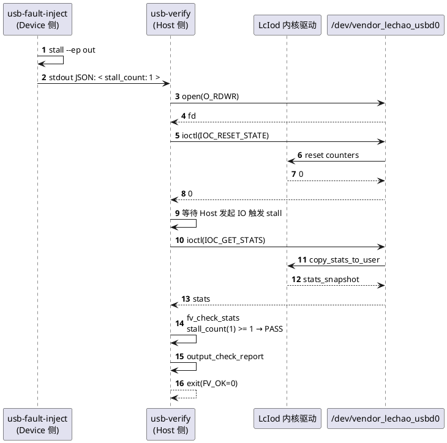

### 正常路径：异步事件等待

`usb-verify event wait --type stall --timeout-ms 5000` 进入 poll + read 循环，匹配事件类型或超时退出。

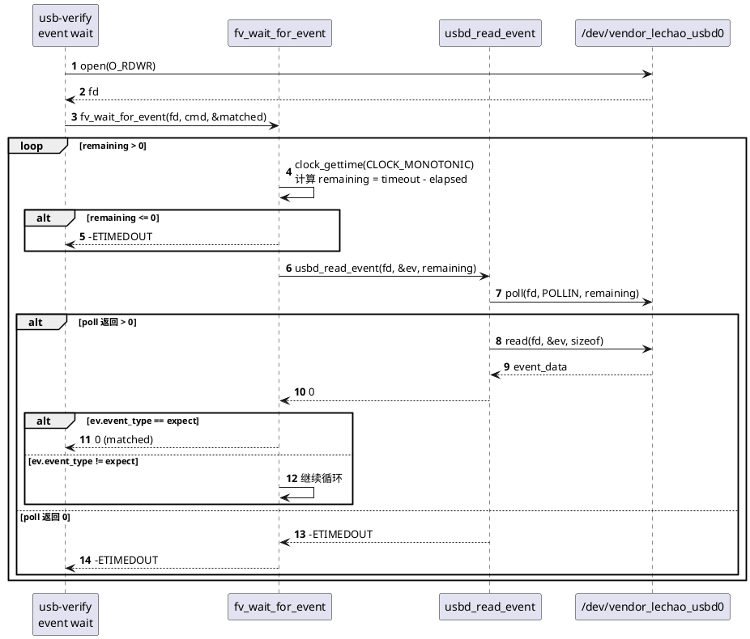

### 异常路径

#### 设备节点不存在

`usbd_open` 执行 `open()` 时设备节点不存在，返回 `-ENOENT`，`main` 返回 `FV_ERR_DEVICE=2`。

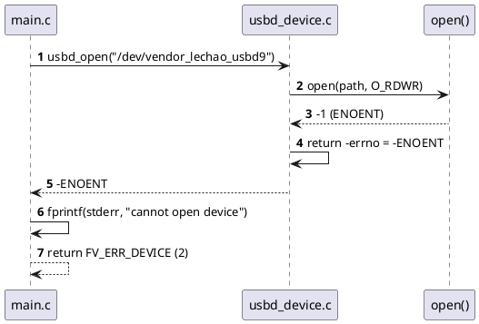

#### 断言检查失败

`fv_check_stats` 中 `actual < expected`（如 `stall_count=0 < stall_ge=1`），`report.failed++`，退出码 `FV_ERR_CHECK=5`。

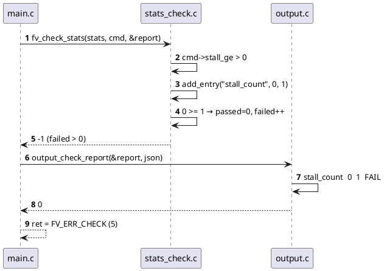

#### 事件等待超时

`fv_wait_for_event` 中 `remaining <= 0`（`clock_gettime` 计算已用时间超过 `timeout_ms`），返回 `-ETIMEDOUT`，退出码 `FV_ERR_TIMEOUT=4`。

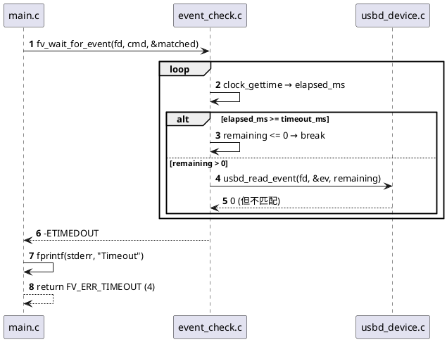

## 逻辑视图

### 模块分解

四层架构：cli 层（命令分发/参数解析/输出格式化）、device 层（系统调用封装）、check 层（断言引擎）、common 层（数据结构与工具）。

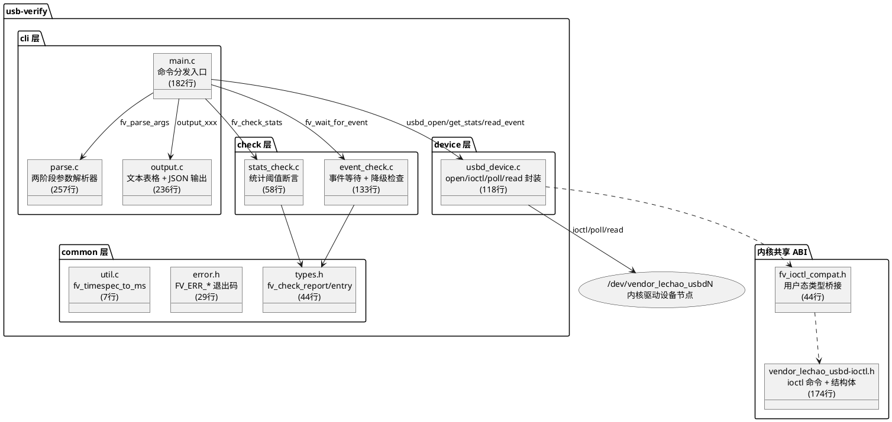

**职责矩阵：**

| 层 | 模块 | 职责 | 关键函数 |
|----|------|------|---------|
| cli | `main.c` | 命令路由器，根据 `fv_command_kind` 分发到对应子命令 | `main()` — [main.c:38](./../patchs/rpi5/others/usb-verify/src/cli/main.c) |
| cli | `parse.c` | 两阶段参数解析器：子命令识别 + 选项参数遍历 | `fv_parse_args()` / `usage()` / `parse_event_type()` — [parse.c:112](./../patchs/rpi5/others/usb-verify/src/cli/parse.c) |
| cli | `output.c` | 文本表格与 JSON 双格式输出 | `output_stats()` / `output_check_report()` / `output_degrade_check()` — [output.c:38](./../patchs/rpi5/others/usb-verify/src/cli/output.c) |
| device | `usbd_device.c` | 系统调用封装（open/close/ioctl/poll/read），返回 `-errno` | `usbd_open()` / `usbd_get_stats()` / `usbd_read_event()` — [usbd_device.c:23](./../patchs/rpi5/others/usb-verify/src/device/usbd_device.c) |
| check | `stats_check.c` | 统计阈值断言引擎 | `fv_check_stats()` / `add_entry()` — [stats_check.c:40](./../patchs/rpi5/others/usb-verify/src/check/stats_check.c) |
| check | `event_check.c` | 事件轮询等待 + 事件类型匹配 + 降级检查 | `fv_wait_for_event()` / `fv_check_event()` / `fv_check_degrade()` — [event_check.c:29](./../patchs/rpi5/others/usb-verify/src/check/event_check.c) |
| common | `types.h` | 断言报告数据结构（`fv_check_entry` / `fv_check_report`） | — [types.h:27](./../patchs/rpi5/others/usb-verify/src/common/types.h) |
| common | `error.h` | 6 级退出码枚举（`FV_OK` 到 `FV_ERR_CHECK`） | — [error.h:22](./../patchs/rpi5/others/usb-verify/src/common/error.h) |
| common | `util.c` | 时间转换辅助函数 | `fv_timespec_to_ms()` — [util.c:4](./../patchs/rpi5/others/usb-verify/src/common/util.c) |
| abi | `vendor_lechao_usbd-ioctl.h` | 内核-用户态共享 ABI（stats/config/event 结构体 + ioctl 命令） | — [vendor_lechao_usbd-ioctl.h:45](./../patchs/rpi5/others/usb-verify/include/vendor_lechao_usbd-ioctl.h) |
| abi | `fv_ioctl_compat.h` | 用户态类型桥接层（`u8/u16/u32/u64` typedef） | — [fv_ioctl_compat.h:27](./../patchs/rpi5/others/usb-verify/include/fv_ioctl_compat.h) |

### 命令模型（9 种子命令）

| 枚举值 | 命令 | 功能 | 说明 |
|--------|------|------|------|
| `FV_CMD_STATS_GET` | `stats get` | 获取设备统计快照 | 通过 `IOC_GET_STATS` 读取，纯只读不重置 |
| `FV_CMD_STATS_RESET` | `stats reset` | 重置设备统计计数器 | 通过 `IOC_RESET_STATE` 将所有计数器归零 |
| `FV_CMD_CONFIG_GET` | `config get` | 获取设备运行时配置 | 通过 `IOC_GET_CONFIG` 读取 `enabled` + `flags` |
| `FV_CMD_CONFIG_SET` | `config set` | 设置设备运行时配置 | 通过 `IOC_SET_CONFIG` 写入 `enabled` + `flags` |
| `FV_CMD_EVENT_READ` | `event read` | 读取一条事件 | 单次 `poll` + `read`，超时返回 `-ETIMEDOUT` |
| `FV_CMD_EVENT_WAIT` | `event wait` | 等待匹配指定类型的事件 | 循环读取直到类型匹配或超时 |
| `FV_CMD_CHECK_STATS` | `check stats` | 断言统计阈值 | 遍历非零 `*_ge` 参数，`actual >= expected` 判定 |
| `FV_CMD_CHECK_EVENT` | `check event` | 等待并断言事件类型匹配 | `event wait` + 类型断言，输出报告 |
| `FV_CMD_CHECK_DEGRADE` | `check degrade` | 断言降级指标 | 检查速率下降、延迟上升、STALL 累计 |

### 断言报告数据结构

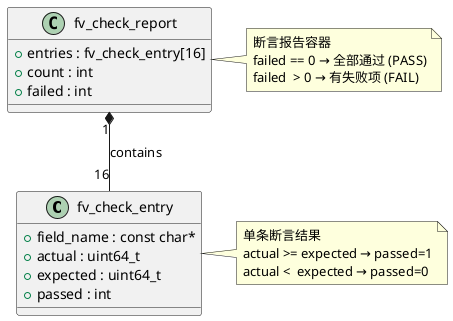

**字段说明：**

| 结构体 | 字段 | 类型 | 说明 |
|--------|------|------|------|
| `fv_check_entry` | `field_name` | `const char*` | 断言字段名（如 `"stall_count"`），用于输出显示 |
| `fv_check_entry` | `actual` | `uint64_t` | 实际值（来自内核 stats 或计算值） |
| `fv_check_entry` | `expected` | `uint64_t` | 期望阈值（来自命令行参数） |
| `fv_check_entry` | `passed` | `int` | 是否通过：`1`=通过，`0`=失败 |
| `fv_check_report` | `entries` | `fv_check_entry[16]` | 断言结果数组，最大容量 `FV_MAX_CHECK_ENTRIES=16` |
| `fv_check_report` | `count` | `int` | 已记录的断言数量 |
| `fv_check_report` | `failed` | `int` | 失败的断言数量；`0` 表示全部通过 |

## 过程视图

### 命令分发流程

`main` 函数作为命令路由器：解析参数 → 打开设备 → switch 分发到 9 个 case → 关闭设备 → 返回退出码。

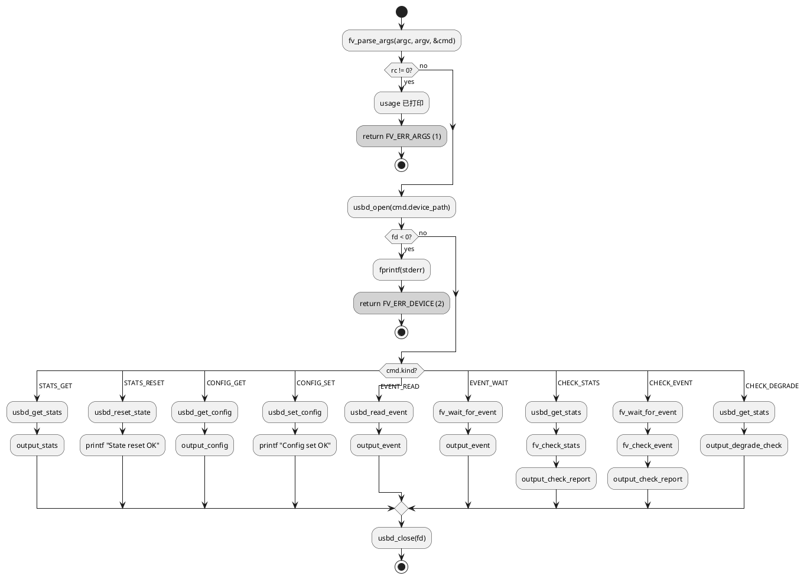

### 事件轮询等待机制

`fv_wait_for_event` 使用 `CLOCK_MONOTONIC` 精确计算已用时间，`remaining` 递减确保总等待时间不超过 `timeout_ms`。

```plantuml
@startuml
autonumber
participant "fv_wait_for_event" as Wait
participant "clock_gettime" as Clock
participant "usbd_read_event" as Read

Wait -> Clock : clock_gettime(CLOCK_MONOTONIC, &ts_start)
note right of Wait: 记录起始时间戳

repeat
    Wait -> Clock : clock_gettime(CLOCK_MONOTONIC, &ts_now)
    Wait -> Wait : elapsed = (now - start) 换算为毫秒
    Wait -> Wait : remaining = timeout_ms - elapsed

    if (remaining <= 0?) then (yes)
        Wait --> Wait : return -ETIMEDOUT
    else (no)
        Wait -> Read : usbd_read_event(fd, &ev, remaining)
        Read --> Wait : 0 or -errno

        if (rc < 0?) then (yes)
            Wait --> Wait : return rc (错误码)
        else (no)
            if (ev.event_type == expect_type?) then (yes)
                Wait -> Wait : *matched = ev
                Wait --> Wait : return 0 (匹配成功)
            else (no)
                note right of Wait: 类型不匹配，继续循环
            endif
        endif
    endif
repeat while (未匹配且未超时?)
@enduml
```

### 阈值断言三态模型

`--stall-ge N` 参数的三态语义：

| 参数状态 | 值 | 行为 | 报告中 |
|----------|-----|------|--------|
| 未指定 | `0`（默认） | 跳过该字段，不检查 | 不出现 |
| 指定 `N > 0` | `N` | 检查 `actual >= N` | 出现，标记 PASS/FAIL |
| 指定 `0` | `0` | 与未指定等价，跳过 | 不出现 |

`fv_check_stats` 中的实现逻辑：

```plantuml
@startuml
start
:memset(report, 0, sizeof(*report));
note right
  三态语义:
  参数 == 0 → 跳过（未指定）
  参数  > 0 → 断言 actual >= expected
end note

if (cmd->stall_ge > 0?) then (yes)
  :add_entry("stall_count",\n stats->stall_count,\n cmd->stall_ge);
endif
if (cmd->timeout_ge > 0?) then (yes)
  :add_entry("timeout_count",\n stats->timeout_count,\n cmd->timeout_ge);
endif
if (cmd->corrupt_ge > 0?) then (yes)
  :add_entry("corrupt_count",\n stats->corrupt_count,\n cmd->corrupt_ge);
endif
if (cmd->disconnect_ge > 0?) then (yes)
  :add_entry("disconnect_count",\n stats->disconnect_count,\n cmd->disconnect_ge);
endif
if (cmd->probe_ge > 0?) then (yes)
  :add_entry("probe_count",\n stats->probe_count,\n cmd->probe_ge);
endif

if (report->failed > 0?) then (yes)
  :return -1;<<#pink>>
else (no)
  :return 0;<<#lightgreen>>
endif
stop
@enduml
```

### 关键不变量

| 不变量 | 约束 | 实现位置 |
|--------|------|---------|
| 总超时上限 | `fv_wait_for_event` 的总等待时间 ≤ `cmd->timeout_ms` | `event_check.c:40` — `remaining = timeout_ms - elapsed_ms` |
| 报告容量 | `report->count ≤ FV_MAX_CHECK_ENTRIES(16)` | `stats_check.c:25` / `event_check.c:69` — `if (count >= MAX) return` |
| 类型匹配精确 | `event wait` 只在 `ev.event_type == cmd->expect_event_type` 时返回成功 | `event_check.c:49` |
| 设备路径安全 | `--device` 参数必须以 `/dev/` 开头 | `parse.c:166` — `strncmp(argv[i], "/dev/", 5)` |
| 错误码一致性 | 所有 device 层函数返回 `-errno`（非 `-1`） | `usbd_device.c` 全文 |
| 退出码可区分 | `FV_ERR_TIMEOUT(4)` 与 `FV_ERR_IOCTL(3)` 分开 | `main.c:111` — `(rc == -ETIMEDOUT) ? FV_ERR_TIMEOUT : FV_ERR_IOCTL` |

## 开发视图

### 文件职责矩阵

```
patchs/rpi5/others/usb-verify/
├── Makefile
├── include/
│   ├── vendor_lechao_usbd-ioctl.h    # ioctl 命令 + stats/config/event 结构体（内核共享 ABI）
│   └── fv_ioctl_compat.h             # 用户态类型桥接层（u8/u16/u32/u64 typedef）
├── src/
│   ├── cli/
│   │   ├── main.c                     # 命令分发入口
│   │   ├── parse.c / parse.h          # 两阶段参数解析器
│   │   ├── output.c / output.h        # 文本表格 + JSON 双格式输出
│   ├── device/
│   │   ├── usbd_device.c / .h         # 系统调用封装（open/ioctl/poll/read）
│   ├── check/
│   │   ├── stats_check.c / .h         # 统计阈值断言
│   │   ├── event_check.c / .h         # 事件等待 + 降级检查
│   └── common/
│       ├── types.h                    # fv_check_report / fv_check_entry
│       ├── error.h                    # FV_ERR_* 退出码
│       ├── util.c / util.h            # fv_timespec_to_ms
```

| 文件 | 职责 | 关键函数/定义 | 行数 |
|------|------|--------------|------|
| `main.c` | 命令分发入口，switch 路由 9 个子命令 | `main()` | 182 |
| `parse.c` | 两阶段参数解析器（子命令 + 选项） | `fv_parse_args()` / `usage()` / `parse_event_type()` / `parse_u64()` | 257 |
| `parse.h` | CLI 命令模型定义 | `enum fv_command_kind` / `struct fv_command` | 68 |
| `output.c` | 文本表格 + JSON 输出 + 降级计算 | `output_stats()` / `output_config()` / `output_event()` / `output_check_report()` / `output_degrade_check()` | 236 |
| `output.h` | 输出函数接口声明 | — | 45 |
| `usbd_device.c` | 系统调用封装，返回 `-errno` | `usbd_open()` / `usbd_close()` / `usbd_get_stats()` / `usbd_reset_state()` / `usbd_get_config()` / `usbd_set_config()` / `usbd_read_event()` | 118 |
| `usbd_device.h` | 设备操作 API 声明 | — | 74 |
| `stats_check.c` | 统计阈值断言引擎 | `fv_check_stats()` / `add_entry()` | 58 |
| `stats_check.h` | 统计断言接口声明 | — | 32 |
| `event_check.c` | 事件等待 + 降级检查 | `fv_wait_for_event()` / `fv_check_event()` / `fv_check_degrade()` / `add_degrade_entry()` | 133 |
| `event_check.h` | 事件检查接口声明 | — | 53 |
| `types.h` | 断言报告数据结构 | `struct fv_check_entry` / `struct fv_check_report` / `FV_MAX_CHECK_ENTRIES` | 44 |
| `error.h` | 6 级退出码定义 | `FV_OK` / `FV_ERR_ARGS` / `FV_ERR_DEVICE` / `FV_ERR_IOCTL` / `FV_ERR_TIMEOUT` / `FV_ERR_CHECK` | 29 |
| `util.c` | 时间转换辅助 | `fv_timespec_to_ms()` | 7 |
| `util.h` | 辅助函数声明 | — | 9 |
| `vendor_lechao_usbd-ioctl.h` | 内核-用户态共享 ABI | `struct vendor_lechao_usbd_stats` / `struct vendor_lechao_usbd_config` / `struct vendor_lechao_usbd_event` / 4 个 IOC 宏 | 174 |
| `fv_ioctl_compat.h` | 用户态类型桥接 | `typedef uint8_t u8` 等 8 个 typedef | 44 |
| `Makefile` | 构建规则 | 7 个编译单元 | 20 |

### 模块依赖图

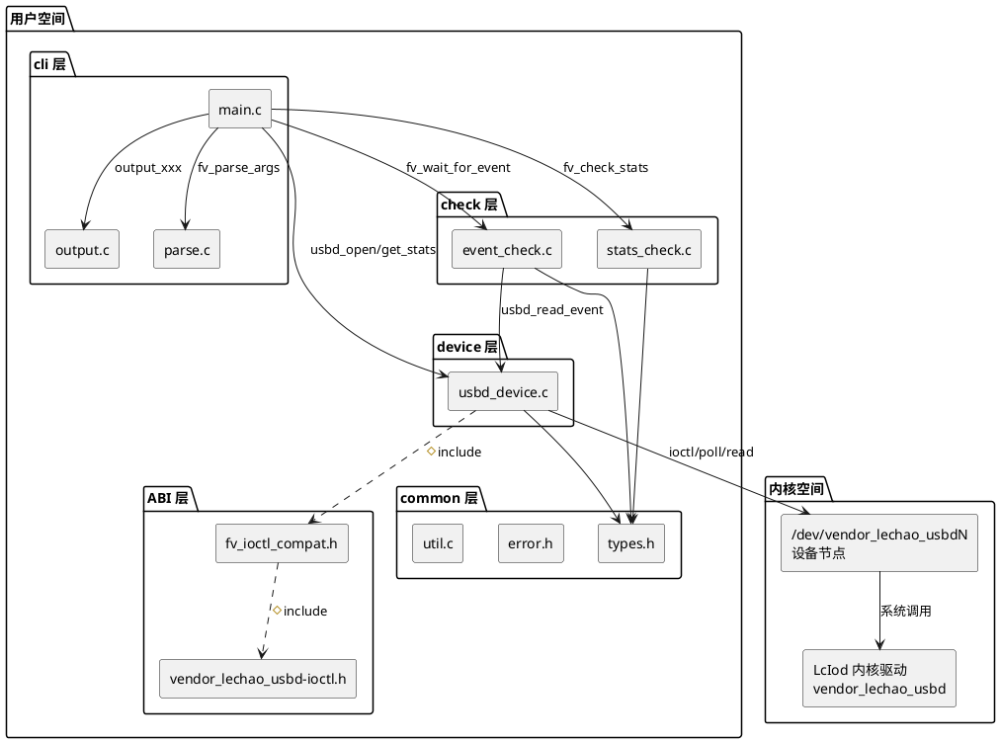

### 构建集成

Makefile 关键配置：

| 配置项 | 值 | 说明 |
|--------|-----|------|
| `CC` | `gcc`（可覆盖） | 支持 `CC=aarch64-linux-gnu-gcc` 交叉编译 |
| `-std` | `c11` | C11 标准 |
| `-D_POSIX_C_SOURCE` | `199309L` | 启用 `clock_gettime` / `CLOCK_MONOTONIC` |
| `-I` | `include` `src/common` `src/device` `src/check` `src/cli` | 5 个头文件搜索路径 |
| 警告 | `-Wall -Wextra -Werror` | 严格警告，警告视为错误 |
| 编译单元 | 7 个 `.c` 文件 | `util.c` / `usbd_device.c` / `stats_check.c` / `event_check.c` / `parse.c` / `output.c` / `main.c` |
| 输出 | `fault-verify` | 单一二进制 |

```makefile
CC ?= gcc
CFLAGS += -Wall -Wextra -Werror -std=c11 -D_POSIX_C_SOURCE=199309L -Iinclude -Isrc/common -Isrc/device -Isrc/check -Isrc/cli
LDFLAGS +=

SRCS := \
  src/common/util.c \
  src/device/usbd_device.c \
  src/check/stats_check.c \
  src/check/event_check.c \
  src/cli/parse.c \
  src/cli/output.c \
  src/cli/main.c

fault-verify: $(SRCS)
	$(CC) $(CFLAGS) -o $@ $(SRCS) $(LDFLAGS)

clean:
	rm -f fault-verify

.PHONY: clean
```

## 部署视图

### 运行时拓扑

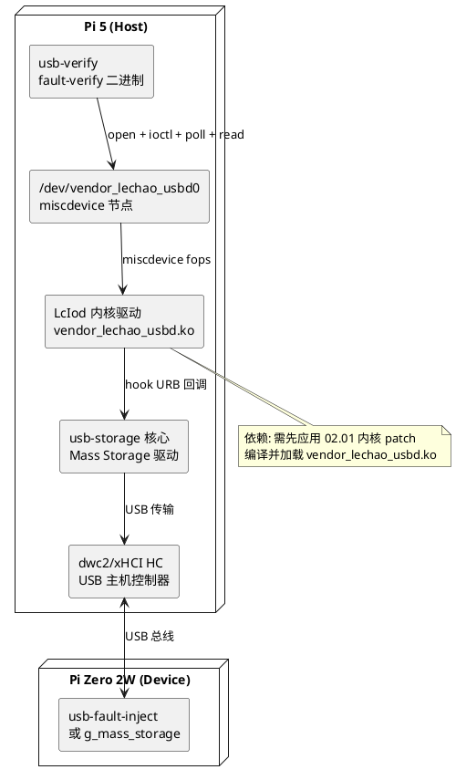

### ioctl ABI 兼容性

`vendor_lechao_usbd-ioctl.h` 是三方共享 ABI（Application Binary Interface），以下三方必须保持二进制兼容：

| 使用方 | 编译环境 | 类型来源 | 说明 |
|--------|---------|---------|------|
| 内核驱动 | `__KERNEL__` 定义 | `<linux/types.h>` 提供 `__u8` 等，头文件内 `typedef __u8 u8` | 内核态原生类型 |
| AOSP HAL | NDK 工具链 | `<linux/types.h>` 提供 `__u8` 等，头文件内 `typedef __u8 u8` | 与内核共享同一个 ioctl.h |
| usb-verify | Host gcc / 交叉编译 | `fv_ioctl_compat.h` 先 `typedef uint8_t u8`，再定义 `U8_ALREADY_TYPEDEF` | 避免 `__u8` 重定义冲突 |

**类型桥接机制：**

`fv_ioctl_compat.h` 的工作原理：

1. 引入 `<stdint.h>`，获得 `uint8_t` / `uint16_t` / `uint32_t` / `uint64_t` / `int8_t` / `int16_t` / `int32_t` / `int64_t`
2. `typedef uint8_t u8` 等 8 个别名，使类型名与内核 `u8`/`u64` 一致
3. 定义宏 `U8_ALREADY_TYPEDEF`，告知 `vendor_lechao_usbd-ioctl.h` 跳过自身 typedef
4. `#include "vendor_lechao_usbd-ioctl.h"`，该头文件检测到 `U8_ALREADY_TYPEDEF` 已定义，不再重复 typedef

这保证了 `sizeof(struct vendor_lechao_usbd_stats)` 在内核态和用户态完全一致，ioctl 传递的数据布局严格对齐。

## 关键设计与实现

### 阈值断言引擎 — 从全量比对到灵活断言

**设计思路：** 旧版使用 `--expect '{"stall_count":1,"error_count":1,...}'` 全量 JSON 比对，要求所有字段精确匹配。新版改用 `--stall-ge` / `--timeout-ge` / `--corrupt-ge` 等独立阈值参数，每个参数有三态语义（未指定/指定/跳过），报告只包含被检查的字段。

```plantuml
@startuml
start
:fv_check_stats(stats, cmd, report);
:memset(report, 0, sizeof(*report));

if (cmd->stall_ge > 0?) then (yes)
  :add_entry(report,\n "stall_count",\n stats->stall_count,\n cmd->stall_ge);
  if (stall_count >= stall_ge?) then (yes)
    :e->passed = 1;
  else (no)
    :e->passed = 0;
    :report->failed++;
  endif
endif

if (cmd->timeout_ge > 0?) then (yes)
  :add_entry(report,\n "timeout_count",\n stats->timeout_count,\n cmd->timeout_ge);
  if (timeout_count >= timeout_ge?) then (yes)
    :e->passed = 1;
  else (no)
    :e->passed = 0;
    :report->failed++;
  endif
endif

note right
  同理检查:
  corrupt_ge / disconnect_ge / probe_ge
end note

if (report->failed > 0?) then (yes)
  :return -1 (FAIL);<<#pink>>
else (no)
  :return 0 (PASS);<<#lightgreen>>
endif
stop
@enduml
```

**与旧版全量比对对比：**

| 特性 | 旧版 `--expect` JSON | 新版 `--stall-ge` 等阈值 |
|------|---------------------|------------------------|
| 比对方式 | 全量字段精确匹配 `==` | 逐字段阈值 `>=` |
| 未指定字段 | 必须为 0 或匹配 | 自动跳过 |
| 判定方向 | `actual == expected` | `actual >= expected` |
| 输出 | 整体 PASS/FAIL | 逐字段 PASS/FAIL + 汇总 |
| 灵活性 | 低（需完整 JSON） | 高（命令行组合参数） |

### poll+read 事件机制 — 异步事件获取

**设计思路：** 内核驱动维护一个 `VENDOR_LECHAO_USBD_EVENT_BUF_SIZE=32` 条的环形缓冲区。USB 异常发生时内核写入事件，用户态通过 `poll(POLLIN)` 等待可读，再 `read()` 读取单条事件。

**`usbd_read_event` 实现：**

```plantuml
@startuml
start
:poll(fd, POLLIN, timeout_ms);
if (pret < 0?) then (yes)
  :return -errno;<<#pink>>
  stop
elseif (pret == 0?) then (yes)
  :return -ETIMEDOUT;<<#pink>>
  stop
else (有数据)
endif

:read(fd, event, sizeof(*event));
if (n < 0?) then (yes)
  :return -errno;<<#pink>>
  stop
elseif (n < sizeof?) then (yes)
  :return -EIO;<<#pink>>
  stop
else (完整读取)
endif

:return 0;<<#lightgreen>>
stop
@enduml
```

**与 AOSP 版对比：**

| 特性 | usb-verify 版 | AOSP HAL 版 |
|------|--------------|-------------|
| 读取策略 | 单次读取一条 | 循环读取排空缓冲区，保留最新 |
| 缓冲区处理 | 不排空，旧事件保留 | 排空，只保留最后一条 |
| 超时控制 | `remaining` 递减 | 固定超时 |
| 适用场景 | 测试校验（逐条检查） | 生产监控（取最新状态） |

### degrade 降级检查逻辑

`check degrade` 命令执行三项降级指标检查：

| 检查项 | 计算公式 | 命令行参数 | 含义 |
|--------|---------|-----------|------|
| `rate_drop` | `peak_rate - current_rate` | `--rate-drop-ge <n>` | 速率下降幅度是否达到告警阈值 |
| `latency_rise` | `last_transport_latency_ns` | `--latency-rise-ge <n>` | 最近一次传输延迟是否超过告警阈值 |
| `stall_count` | `stall_count` | `--stall-ge <n>` | STALL 事件累计是否达到告警阈值 |

`output_degrade_check` 中的内置计算逻辑：

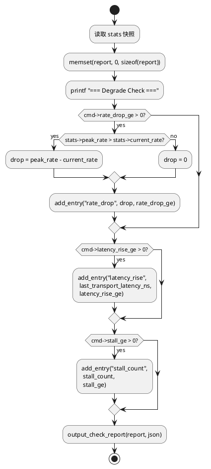

### 退出码体系

6 个退出码覆盖所有执行路径，shell 可通过 `$?` 直接判断校验结果：

| 退出码 | 常量 | 值 | 含义 | 触发场景 |
|--------|------|-----|------|---------|
| 成功 | `FV_OK` | 0 | 命令执行成功 | 所有操作正常完成 |
| 参数错误 | `FV_ERR_ARGS` | 1 | 命令行参数解析失败 | 未知命令/选项、缺少参数值、参数格式错误 |
| 设备错误 | `FV_ERR_DEVICE` | 2 | 设备节点打开失败 | 路径不存在、权限不足、设备未加载 |
| ioctl 错误 | `FV_ERR_IOCTL` | 3 | ioctl/read 系统调用失败 | 驱动异常、fd 非法、数据不完整 |
| 超时 | `FV_ERR_TIMEOUT` | 4 | 等待事件超时 | `poll` 返回 0 或 `remaining <= 0` |
| 断言失败 | `FV_ERR_CHECK` | 5 | 断言检查未通过 | `actual < expected`，`report->failed > 0` |

**退出码判定逻辑：**

```plantuml
@startuml
start
if (参数解析失败?) then (yes)
  :return 1 (FV_ERR_ARGS);<<#pink>>
  stop
elseif (设备打开失败?) then (yes)
  :return 2 (FV_ERR_DEVICE);<<#pink>>
  stop
elseif (ioctl/read 失败?) then (yes)
  :return 3 (FV_ERR_IOCTL);<<#pink>>
  stop
elseif (事件等待超时?) then (yes)
  :return 4 (FV_ERR_TIMEOUT);<<#orange>>
  stop
elseif (断言检查失败?) then (yes)
  :return 5 (FV_ERR_CHECK);<<#orange>>
  stop
else (全部正常)
  :return 0 (FV_OK);<<#lightgreen>>
  stop
endif
@enduml
```

## 接口参考

### CLI 命令

#### `stats get` — 获取统计快照

```bash
fault-verify stats get [--device <path>] [--json]
```

| 选项 | 类型 | 默认值 | 说明 |
|------|------|--------|------|
| `--device` | path | `/dev/vendor_lechao_usbd` | 设备节点路径 |
| `--json` | flag | 关 | JSON 格式输出 |

#### `stats reset` — 重置计数器

```bash
fault-verify stats reset [--device <path>]
```

| 选项 | 类型 | 默认值 | 说明 |
|------|------|--------|------|
| `--device` | path | `/dev/vendor_lechao_usbd` | 设备节点路径 |

#### `config get` — 获取配置

```bash
fault-verify config get [--device <path>] [--json]
```

#### `config set` — 设置配置

```bash
fault-verify config set [--device <path>] --enable <0|1> --flags <hex>
```

| 选项 | 类型 | 默认值 | 说明 |
|------|------|--------|------|
| `--enable` | 0\|1 | 0 | 监控功能启用标志 |
| `--flags` | hex | 0x00000000 | 配置标志位 |

#### `event read` — 读取一条事件

```bash
fault-verify event read [--device <path>] [--timeout-ms <ms>] [--json]
```

| 选项 | 类型 | 默认值 | 说明 |
|------|------|--------|------|
| `--timeout-ms` | int | 5000 | poll 超时（毫秒） |

#### `event wait` — 等待匹配事件

```bash
fault-verify event wait [--device <path>] --type <type> [--timeout-ms <ms>] [--json]
```

| 选项 | 类型 | 默认值 | 说明 |
|------|------|--------|------|
| `--type` | string | 必填 | 事件类型（见下表） |
| `--timeout-ms` | int | 5000 | 总等待超时（毫秒） |

#### `check stats` — 统计阈值断言

```bash
fault-verify check stats [--device <path>] [--stall-ge <n>] [--timeout-ge <n>] [--corrupt-ge <n>] [--disconnect-ge <n>] [--probe-ge <n>] [--json]
```

| 选项 | 类型 | 默认值 | 说明 |
|------|------|--------|------|
| `--stall-ge` | u64 | 0（跳过） | 断言 `stall_count >= N` |
| `--timeout-ge` | u64 | 0（跳过） | 断言 `timeout_count >= N` |
| `--corrupt-ge` | u64 | 0（跳过） | 断言 `corrupt_count >= N` |
| `--disconnect-ge` | u64 | 0（跳过） | 断言 `disconnect_count >= N` |
| `--probe-ge` | u64 | 0（跳过） | 断言 `probe_count >= N` |

#### `check event` — 事件类型断言

```bash
fault-verify check event [--device <path>] --type <type> [--timeout-ms <ms>] [--json]
```

#### `check degrade` — 降级指标断言

```bash
fault-verify check degrade [--device <path>] [--rate-drop-ge <n>] [--latency-rise-ge <n>] [--stall-ge <n>] [--json]
```

| 选项 | 类型 | 默认值 | 说明 |
|------|------|--------|------|
| `--rate-drop-ge` | u64 | 0（跳过） | 断言 `peak_rate - current_rate >= N` |
| `--latency-rise-ge` | u64 | 0（跳过） | 断言 `last_transport_latency_ns >= N` |
| `--stall-ge` | u64 | 0（跳过） | 断言 `stall_count >= N` |

#### `--type` 参数值映射

| 字符串 | 枚举值 | 数值 | 说明 |
|--------|--------|------|------|
| `stall` | `EVENT_STALL` | 2 | USB 端点 STALL |
| `timeout` | `EVENT_TIMEOUT` | 4 | 传输超时 |
| `corrupt` | `EVENT_DATA_CORRUPT` | 3 | 数据完整性校验失败 |
| `reset` | `EVENT_RESET` | 5 | USB 设备总线复位 |
| `transport_error` | `EVENT_TRANSPORT_ERROR` | 1 | 批量传输失败 |
| `disconnect` | `EVENT_RESET` | 5 | 映射到 RESET（无独立 DISCONNECT 类型） |
| `probe` | `EVENT_NONE` | 0 | 映射到 NONE（probe 是统计计数器，非异步事件） |
| `degrade` | `EVENT_RATE_DEGRADED` | 6 | 传输速率显著下降 |

### ioctl 命令

Magic number: `'R'` (0x52)

| 命令 | 宏 | 编码 | 方向 | 数据结构 |
|------|-----|------|------|---------|
| 获取统计 | `VENDOR_LECHAO_USBD_IOC_GET_STATS` | `_IOR('R', 0, ...)` | 内核→用户 | `struct vendor_lechao_usbd_stats` |
| 重置计数器 | `VENDOR_LECHAO_USBD_IOC_RESET_STATE` | `_IO('R', 1)` | 无参数 | — |
| 获取配置 | `VENDOR_LECHAO_USBD_IOC_GET_CONFIG` | `_IOR('R', 2, ...)` | 内核→用户 | `struct vendor_lechao_usbd_config` |
| 设置配置 | `VENDOR_LECHAO_USBD_IOC_SET_CONFIG` | `_IOW('R', 3, ...)` | 用户→内核 | `struct vendor_lechao_usbd_config` |

### 设备操作 API

| 函数 | 原型 | 返回值 | 说明 |
|------|------|--------|------|
| `usbd_open` | `int usbd_open(const char *path)` | `>=0` fd / `-errno` | 以 `O_RDWR` 打开设备节点 |
| `usbd_close` | `void usbd_close(int fd)` | 无 | 安全关闭（`fd<0` 跳过） |
| `usbd_get_stats` | `int usbd_get_stats(int fd, struct vendor_lechao_usbd_stats *stats)` | `0` / `-errno` | 通过 `IOC_GET_STATS` 获取统计快照 |
| `usbd_reset_state` | `int usbd_reset_state(int fd)` | `0` / `-errno` | 通过 `IOC_RESET_STATE` 重置计数器 |
| `usbd_get_config` | `int usbd_get_config(int fd, struct vendor_lechao_usbd_config *config)` | `0` / `-errno` | 通过 `IOC_GET_CONFIG` 获取配置 |
| `usbd_set_config` | `int usbd_set_config(int fd, const struct vendor_lechao_usbd_config *config)` | `0` / `-errno` | 通过 `IOC_SET_CONFIG` 写入配置 |
| `usbd_read_event` | `int usbd_read_event(int fd, struct vendor_lechao_usbd_event *event, int timeout_ms)` | `0` / `-ETIMEDOUT` / `-errno` | `poll` + `read` 读取单条事件 |

### 事件类型枚举

| 枚举常量 | 数值 | 说明 |
|----------|------|------|
| `VENDOR_LECHAO_USBD_EVENT_NONE` | 0 | 无事件（占位） |
| `VENDOR_LECHAO_USBD_EVENT_TRANSPORT_ERROR` | 1 | 批量传输失败（URB 返回错误状态） |
| `VENDOR_LECHAO_USBD_EVENT_STALL` | 2 | USB 端点返回 STALL 握手 |
| `VENDOR_LECHAO_USBD_EVENT_DATA_CORRUPT` | 3 | 传输数据 CRC/完整性校验失败 |
| `VENDOR_LECHAO_USBD_EVENT_TIMEOUT` | 4 | 传输在规定时间内未完成 |
| `VENDOR_LECHAO_USBD_EVENT_RESET` | 5 | USB 设备发生总线复位 |
| `VENDOR_LECHAO_USBD_EVENT_RATE_DEGRADED` | 6 | 传输速率显著下降 |

## 附录 A：编译与部署

### 本地编译（Pi 5 上直接编译）

```bash
cd patchs/rpi5/others/usb-verify/
make
```

生成 `fault-verify` 二进制。

### 交叉编译（aarch64-linux-gnu-gcc）

```bash
cd patchs/rpi5/others/usb-verify/
make CC=aarch64-linux-gnu-gcc
```

### 安装到 /usr/bin/

```bash
sudo cp fault-verify /usr/bin/
sudo chmod +x /usr/bin/fault-verify
```

验证安装：

```bash
fault-verify --help
```

## 附录 B：端到端验证场景

### 场景 1：STALL 注入校验

**Pi Zero 2W（Device 侧）：**

```bash
usb-fault-inject stall --ep out
```

**Pi 5（Host 侧）：**

```bash
fault-verify stats reset
# 触发 Host IO（如 dd/mount 操作）
fault-verify check stats --stall-ge 1 --json
```

**预期输出（JSON）：**

```json
{
  "total": 1,
  "failed": 0,
  "passed": true,
  "entries": [
    {"field": "stall_count", "actual": 1, "expected": 1, "passed": true}
  ]
}
```

退出码：`0`（FV_OK）

### 场景 2：Timeout 注入校验

**Pi Zero 2W（Device 侧）：**

```bash
usb-fault-inject timeout --duration 3000
```

**Pi 5（Host 侧）：**

```bash
fault-verify stats reset
# 触发 Host IO
fault-verify check stats --timeout-ge 1
fault-verify event wait --type timeout --timeout-ms 10000 --json
```

**预期输出（event wait）：**

```json
{
  "timestamp_ns": 1234567890,
  "event_type": "timeout",
  "event_value": 0,
  "status": 0,
  "data_direction": 0,
  "valid": 1
}
```

退出码：`0`（FV_OK）

### 场景 3：CSW Corrupt 注入校验

**Pi Zero 2W（Device 侧）：**

```bash
usb-fault-inject corrupt --field csw-sig
```

**Pi 5（Host 侧）：**

```bash
fault-verify stats reset
# 触发 Host IO
fault-verify check stats --corrupt-ge 1
```

**预期输出（文本表格）：**

```
FIELD               ACTUAL       EXPECTED     PASS
corrupt_count       1            1            OK
Result: 1/1 checks passed (PASS)
```

退出码：`0`（FV_OK）

### 场景 4：Hotplug 观察

**Pi Zero 2W（Device 侧）：**

```bash
usb-fault-inject hotplug --cycles 3
```

**Pi 5（Host 侧）：**

```bash
fault-verify stats reset
# 等待 hotplug 完成
fault-verify check stats --disconnect-ge 3 --probe-ge 3
```

**预期输出：**

```
FIELD               ACTUAL       EXPECTED     PASS
disconnect_count    3            3            OK
probe_count         3            3            OK
Result: 2/2 checks passed (PASS)
```

退出码：`0`（FV_OK）

### 场景 5：Degrade 速率检查

**Pi Zero 2W（Device 侧）：**

```bash
usb-fault-inject degrade --delay 50
```

**Pi 5（Host 侧）：**

```bash
fault-verify stats reset
# 触发足够多的 Host IO 以建立 peak_rate 基线
# 然后等待 degrade 注入使速率下降
fault-verify check degrade --rate-drop-ge 100000 --latency-rise-ge 50000000 --stall-ge 0
```

**预期输出：**

```
=== Degrade Check ===
FIELD               ACTUAL       EXPECTED     PASS
rate_drop           250000       100000       OK
latency_rise        52000000     50000000     OK
Result: 2/2 checks passed (PASS)
```

退出码：`0`（FV_OK）
