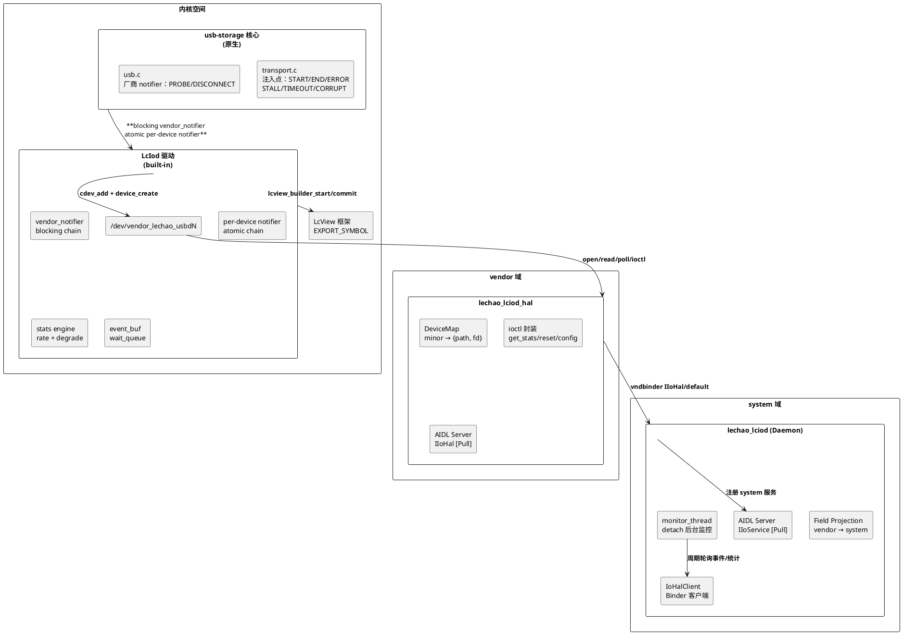
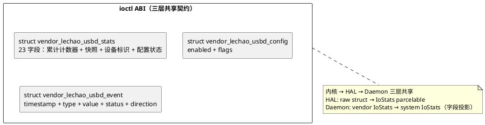
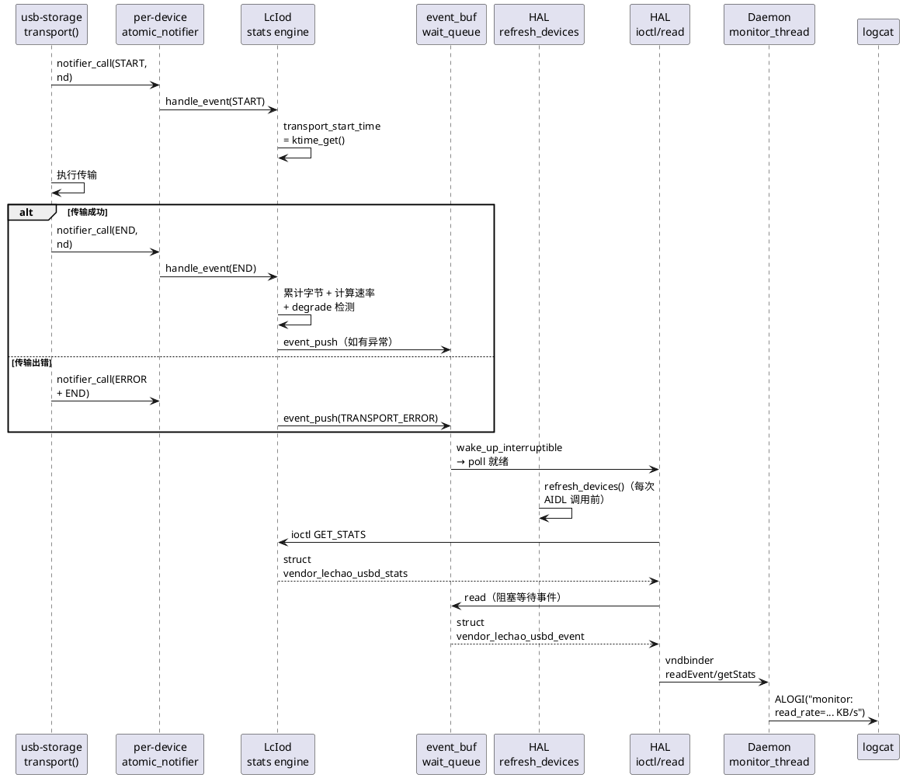
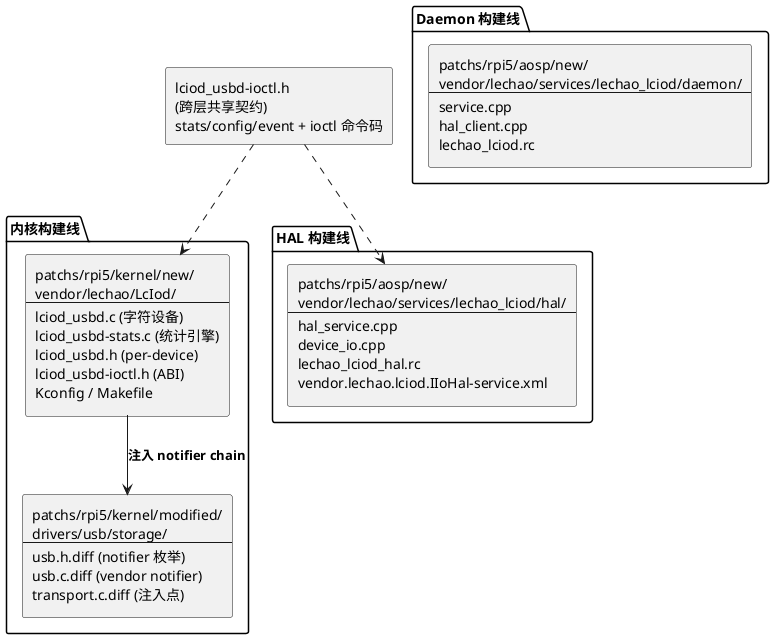
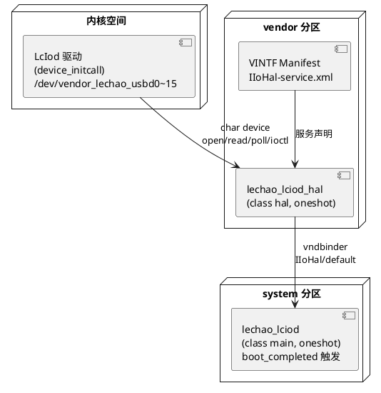
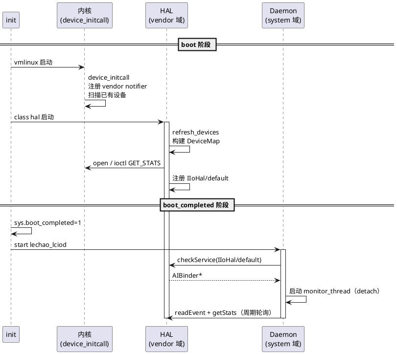
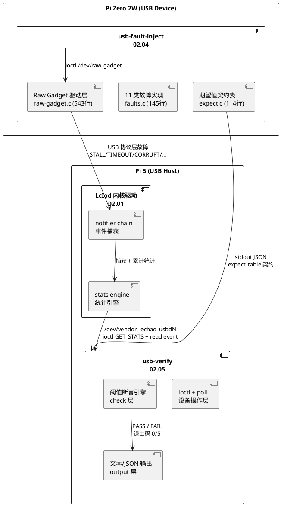

# LcIod IO 监控系统

基于 notifier chain 的 USB 存储传输速率监控框架，覆盖内核态事件注入、驱动统计、用户态 HAL 代理、System 服务暴露全链路。配套外围故障注入与验证工具，构成 **注入 → 检测 → 上报 → 校验** 的完整闭环。

## 文档索引

| 编号 | 名称 | 层级 | 说明 |
|------|------|------|------|
| 02.01 | [内核态增强](./02.01-内核态增强-lciod-kernel.md) | 内核态 | usb-storage notifier 注入 + LcIod 驱动 |
| 02.02 | HAL 增强 | 用户态 (vendor) | IIoHal AIDL + 设备缓存 + ioctl 封装 |
| 02.03 | Daemon 增强 | 用户态 (system) | IIoService 代理 + 字段投影 + 监控线程 |
| 02.04 | [故障注入工具](./02.04-故障注入工具-usb-fault-inject.md) | 外围 (Device 端) | usb-fault-inject — 12 类协议级故障注入 CLI |
| 02.05 | [故障注入验证](./02.05-故障注入验证-usb-verify.md) | 外围 (Host 端) | usb-verify — 统计读取 + 事件等待 + 阈值断言 CLI |

> **阅读建议**：先读本 README 建立全局视角，再按层级深入子文档。02.01-02.03 为监控系统主体，02.04-02.05 为外围验证工具。

## 逻辑视图

### 组件分解

三层架构，双层 AIDL 代理，每层单一职责：



### notifier chain 类型

双层 notifier 链分工明确：

| notifier 链 | 类型 | 事件 | 调用上下文 | 注册位置 |
|-------------|------|------|-----------|---------|
| `usb_stor_vendor_nh` | blocking | PROBE/DISCONNECT | 进程上下文（可睡眠） | usb.c |
| `us->notifier` | atomic | START/END/ERROR/STALL/TIMEOUT/CORRUPT/RESET | 任意上下文（不可睡眠） | transport.c |

**与 LcView 的复用关系**：LcIod 调用 LcView `EXPORT_SYMBOL` 打点 API，将所有 PROBE/DISCONNECT/传输事件同步上送时序分析。LcIod Kconfig `select LCVIEW` 自动启用依赖。

### 跨层契约

ioctl ABI（`vendor_lechao_usbd-ioctl.h`）是三层共享契约：



ioctl 命令码（魔数 `'R'`）：`GET_STATS`、`RESET_STATE`、`GET_CONFIG`、`SET_CONFIG`。

### 设计原则

| 原则 | 说明 |
|------|------|
| notifier chain 注入 | 零侵入 usb-storage 核心逻辑，仅添加事件发射点 |
| per-device 多实例 | 每个 USB 存储设备独立监控实例（最多 16 个），IDA 分配次设备号 |
| 双层 AIDL 代理 | system daemon 抽象 vendor HAL，字段投影屏蔽底层细节 |
| 端到端实时监控 | 内核事件 → notifier → HAL → Daemon → logcat，毫秒级延迟 |

## 过程视图

### 端到端数据流



### 关键指标

| 指标 | 设计值 | 保障机制 |
|------|--------|---------|
| 事件延迟 | 毫秒级 | atomic notifier chain + wait_queue |
| 多设备支持 | 16 个 | IDA 次设备号分配 + kref 引用计数 |
| 热插拔感知 | 实时 | blocking vendor notifier + HAL refresh_devices |
| 端到端监控 | 实时 logcat | Daemon detach 后台线程（50ms 轮询） |
| degrade 检测 | 1 秒滑动窗口 | 速率下降 2x 或延迟上升触发 |

## 开发视图

### 源码组织

三条构建线，共享 ioctl ABI 头文件：



### 构建集成

| 构建线 | 构建系统 | 产物 |
|--------|---------|------|
| 内核驱动 | Kconfig + Makefile (`CONFIG_VENDOR_LECHAO_USBD=y`) | built-in 到 vmlinux |
| HAL 进程 | Soong `cc_binary` (`vendor: true`) | `/vendor/bin/lechao_lciod_hal` |
| Daemon 进程 | Soong `cc_binary` | `/system/bin/lechao_lciod` |
| vendor AIDL | Soong `aidl_interface` (`@VintfStability`) | VINTF 稳定的 NDK 后端 |
| system AIDL | Soong `aidl_interface` (`unstable: true`) | 开发阶段 NDK 后端 |

## 部署视图

### 运行时拓扑



### 安全域隔离

四个 SELinux 域，两次跨域通信：

| 域 | 运行身份 | 核心权限 | 不需要的权限 |
|---|---|---|---|
| 内核空间 | kernel | — | — |
| `lechao_lciod_hal` (vendor) | `system:system` | 读字符设备 + 注册 AIDL + 写 logd | 不写文件、不访问网络 |
| `lechao_lciod` (system) | `system:system` | vndbinder 调用 + 注册服务 + 写 logd | 不读字符设备 |

**跨域通信**：
1. **内核 → HAL**：字符设备 `/dev/vendor_lechao_usbd*`（`lechao_lciod_hal_device` 类型）
2. **HAL → Daemon**：vndbinder AIDL `vendor.lechao.lciod.IIoHal/default`（`lechao_lciod_hal_service` 类型）

### 启动顺序



## 跨层设计决策

| 决策 | 架构动机 | 详细展开 |
|------|---------|---------|
| **notifier chain 注入** | 零侵入核心代码，升级无 merge conflict | [02.01](./02.01-内核态增强-lciod-kernel.md) § usb-storage notifier chain |
| **per-device 多实例** | 每个 USB 设备独立监控，避免统计混淆 | [02.01](./02.01-内核态增强-lciod-kernel.md) § IDA 分配 + kref |
| **双层 AIDL 代理** | system daemon 抽象 vendor HAL，屏蔽 ioctl 细节 | daemon/service.cpp § IoServiceImpl |
| **字段投影** | 管理字段（enabled/flags）不暴露给上层 | daemon/service.cpp § getIoStats |
| **detach 监控线程** | 后台轮询事件/统计，实时 logcat 输出 | daemon/service.cpp § start_monitor |

## 与 LcView 的关系

LcIod 内核驱动 `select LCVIEW`（Kconfig），调用 LcView `EXPORT_SYMBOL` API 进行结构化打点：

| LcView 事件 ID | 字段 | 级别 | 触发时机 |
|---------------|------|------|---------|
| `LCVIEW_EVENT_USB_PROBE` | device_index, vid, pid, vendor, product | INFO | 设备插入 |
| `LCVIEW_EVENT_USB_DISCONNECT` | device_index | INFO | 设备拔出 |
| `LCVIEW_EVENT_USB_TRANSPORT_START` | device_index, direction, data_len | DEBUG | 传输开始 |
| `LCVIEW_EVENT_USB_TRANSPORT_END` | device_index, direction, bytes, elapsed_ns, was_error | INFO | 传输结束 |
| `LCVIEW_EVENT_USB_TRANSPORT_ERROR` | device_index, direction, result | WARN | 传输出错 |
| `LCVIEW_EVENT_USB_STALL/TIMEOUT/CORRUPT/RESET` | device_index, status | WARN | 异常事件 |
| `LCVIEW_EVENT_USB_RATE_DEGRADED` | device_index, latency_ns | WARN | 性能降级 |

LcView 提供 9 个 USB 事件 ID，LcIod 在 notifier 回调中调用 `lcview_builder_start/commit` 上送。

## 与 LcView 的架构对比

| 维度 | LcView (01) | LcIod (02) |
|------|-------------|------------|
| 设备模型 | 单设备 | 多设备（最多 16 个） |
| 内核侵入 | 零侵入（纯 EXPORT_SYMBOL） | 需修改 usb-storage 核心（notifier 注入） |
| AIDL 层级 | 单层 vendor ILcView | 双层（vendor IIoHal + system IIoService） |
| System daemon 角色 | 消费者（校验+落盘） | 代理（转发+投影+监控） |
| 数据传输 | 批量二进制流 read（64KB） | 定长 struct read + ioctl 轮询 |
| 监控对象 | 通用事件打点 | USB 存储传输速率/错误/降级 |
| 事件推送 | HAL 批量累积 flush | 内核 per-device wait_queue 阻塞读 |

## 外围验证组件（故障注入闭环）

02.04-02.05 构成独立于监控主体的外围验证工具链，用于端到端校验 LcIod 监控系统的故障检测能力。

### 闭环架构



### 12 类故障映射

| ID | 故障 | Device 命令 | 内核捕获事件 | 校验命令 |
|----|------|------------|-------------|---------|
| F1/F2 | STALL | `stall-in` / `stall-out` | STALL + ERROR + RESET | `check stats --stall-ge 1` |
| F3 | Timeout | `timeout --duration 5000` | TIMEOUT + ERROR + RESET | `check stats --timeout-ge 1` |
| F4-F7 | Corrupt | `corrupt --field cbw-sig/csw-sig/csw-tag/csw-status` | CORRUPT + ERROR + RESET | `check stats --corrupt-ge 1` |
| F8 | Short | `short --bytes 512` | CORRUPT + ERROR | `check stats --corrupt-ge 1` |
| F9 | Abort | `abort --ep in/out` | ERROR + RESET | `check stats --error-ge 1` |
| F10 | Hotplug | `hotplug --cycles 3` | DISCONNECT + PROBE | 设备节点观察 |
| F11 | Disconnect | `disconnect` | DISCONNECT | 设备节点观察 |
| F12 | Degrade | `degrade --delay 50` | RATE_DEGRADED | `check degrade --rate-drop-ge N` |

### 端到端工作流

```
1. usb-verify stats reset --device /dev/vendor_lechao_usbd0   # Host 清零统计
2. usb-fault-inject stall-out                              # Device 注入故障
   → stdout: {"fault":"stall","expect":{"error_count":1,...}}
3. usb-verify check stats --device /dev/vendor_lechao_usbd0 \  # Host 校验
     --stall-ge 1 --error-ge 1 --reset-ge 1
   → PASS (退出码 0) / FAIL (退出码 5)
```

## 相关资源

- **内核源码**：[`patchs/rpi5/kernel/new/vendor/lechao/LcIod/`](../patchs/rpi5/kernel/new/vendor/lechao/LcIod/) — LcIod 驱动
- **usb-storage 修改**：[`patchs/rpi5/kernel/modified/drivers/usb/storage/`](../patchs/rpi5/kernel/modified/drivers/usb/storage/) — notifier 注入点
- **用户态源码**：[`patchs/rpi5/aosp/new/vendor/lechao/services/lechao_lciod/`](../patchs/rpi5/aosp/new/vendor/lechao/services/lechao_lciod/) — HAL + Daemon + AIDL
- **SELinux 策略**：[`patchs/rpi5/aosp/new/device/brcm/rpi5/sepolicy/`](../patchs/rpi5/aosp/new/device/brcm/rpi5/sepolicy/) — `lechao_lciod.te` + `lechao_lciod_hal.te`
- **故障注入工具**：[`patchs/rpi-zero2w/others/usb-fault-inject/`](../patchs/rpi-zero2w/others/usb-fault-inject/) — Device 端 12 类故障注入
- **故障校验工具**：[`patchs/rpi5/others/usb-verify/`](../patchs/rpi5/others/usb-verify/) — Host 端统计校验 CLI