# LcView 内核模块

## 概述

LcView 是一个**结构化事件打点框架**的内核态组件，以 built-in 模式编译进 vmlinux，为其他内核模块提供 Builder 风格的日志打点 API。数据经环形缓冲区通过字符设备 `/dev/vendor_lechao_lcview` 上报到用户态。

**设计理念：** 不修改任何原生内核代码。其他内核模块通过 `EXPORT_SYMBOL` 导出的 Builder API 调用来打点，字段名由用户态 JSON schema 定义，内核只传 ID + 字段值，体积最小化。

**设计目标：**

1. **Builder 模式** — `start()` → `add_*()` → `commit()` 链式构建，简洁直观
2. **Schema ID 驱动** — 传输只传 ID + 字段值，字段名由用户态 JSON schema 定义
3. **环形缓冲区** — spin_lock 保护的多生产者写入、wait_queue 阻塞的单消费者读取
4. **单实例字符设备** — open 互斥、read 阻塞读、poll 支持、ioctl 控制
5. **级别过滤** — ioctl 动态设置最低上报级别，低于阈值的 commit 静默丢弃

**源码路径：**

- 内核源码根目录：`~/workspace/rpi5-kernel-build/common`
- LcView 模块源码：`vendor/lechao/LcView/`
- 完整源码归档：[`../../code/rpi5/kernel/new/vendor/lechao/LcView/`](../../code/rpi5/kernel/new/vendor/lechao/LcView/)

> **用户态工具：** Daemon（直读内核采集端）的详细设计见 [01.02-Daemon增强](./01.02-Daemon增强-lcview-daemon.md)。系统级架构分析见 [README.md](./README.md)。

## 用例视图

### 正常路径：事件生命周期

一个事件从内核模块打点到用户态读取的完整生命周期：

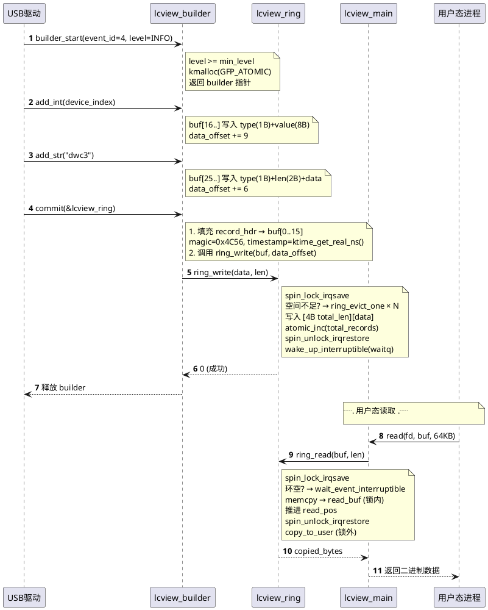

### 异常路径

#### 环满溢出

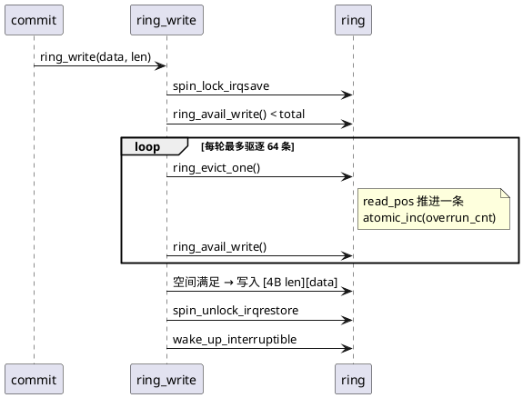

#### 级别过滤短路

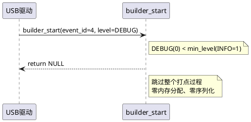

#### Atomic 上下文安全

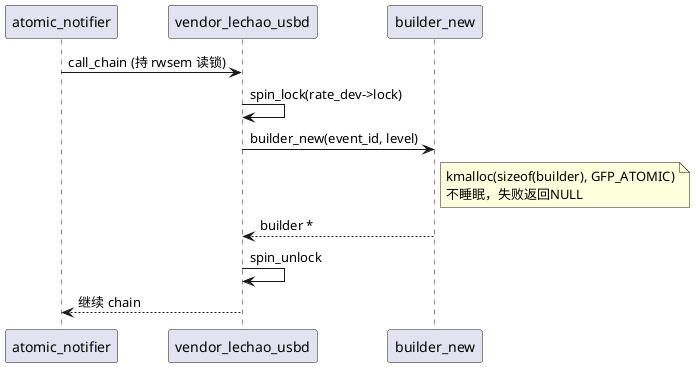

## 逻辑视图

### 模块分解

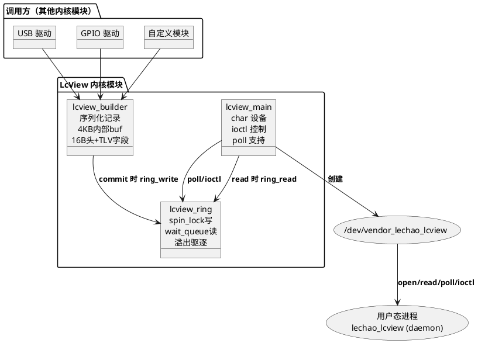

**职责矩阵：**

| 模块 | 职责 | 关键抽象 |
|------|------|---------|
| `lcview_builder` | 链式构建事件记录，TLV 序列化到内部 4KB buf | `struct lcview_builder` — [lcview_internal.h:83](../../code/rpi5/kernel/new/vendor/lechao/LcView/lcview_internal.h#L83) |
| `lcview_ring` | 环形缓冲区读写、溢出驱逐、阻塞等待 | `struct lcview_ring` — [lcview_internal.h:53](../../code/rpi5/kernel/new/vendor/lechao/LcView/lcview_internal.h#L53) |
| `lcview_main` | 字符设备注册、file_operations、级别过滤、模块入口 | `lcview_fops` — [lcview_main.c:268](../../code/rpi5/kernel/new/vendor/lechao/LcView/lcview_main.c#L268) |

### 二进制记录格式

每条事件记录以 TLV (Type-Length-Value) 格式序列化，由定长记录头 + 变长字段区组成：

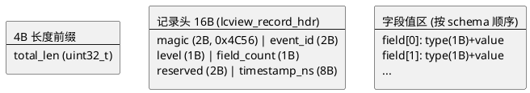

**字段类型编码：**

| 类型 | 编码 | 值布局 |
|------|------|--------|
| INT32 | 1 | type(1B) + int32(4B) |
| INT64 | 2 | type(1B) + int64(8B) |
| FLOAT | 3 | type(1B) + float(4B) |
| STRING | 4 | type(1B) + len(2B) + data |
| BINARY | 5 | type(1B) + len(2B) + data |

> 结构体定义：[`lcview_record_hdr`](../../code/rpi5/kernel/new/vendor/lechao/LcView/lcview_events.h#L76)，[`lcview_field_hdr`](../../code/rpi5/kernel/new/vendor/lechao/LcView/lcview_events.h#L85)。事件 ID 和类型编码定义在 [`lcview_events.h`](../../code/rpi5/kernel/new/vendor/lechao/LcView/lcview_events.h)。

### Schema ID 驱动

每个事件有固定 ID，内核只传 ID + 字段值，字段名由用户态 JSON schema 定义。这种设计使传输体积最小化，且新增字段仅需改 schema，历史数据兼容。

> 系统级对比分析（Schema 方案 vs 传统 printk）见 [README.md Schema 模板 + 数据解耦](./README.md#schema-模板--数据解耦)。

## 过程视图

### 并发模型

环形缓冲区采用 **多生产者 / 单消费者** 模型，spin_lock 保护写指针和读指针：

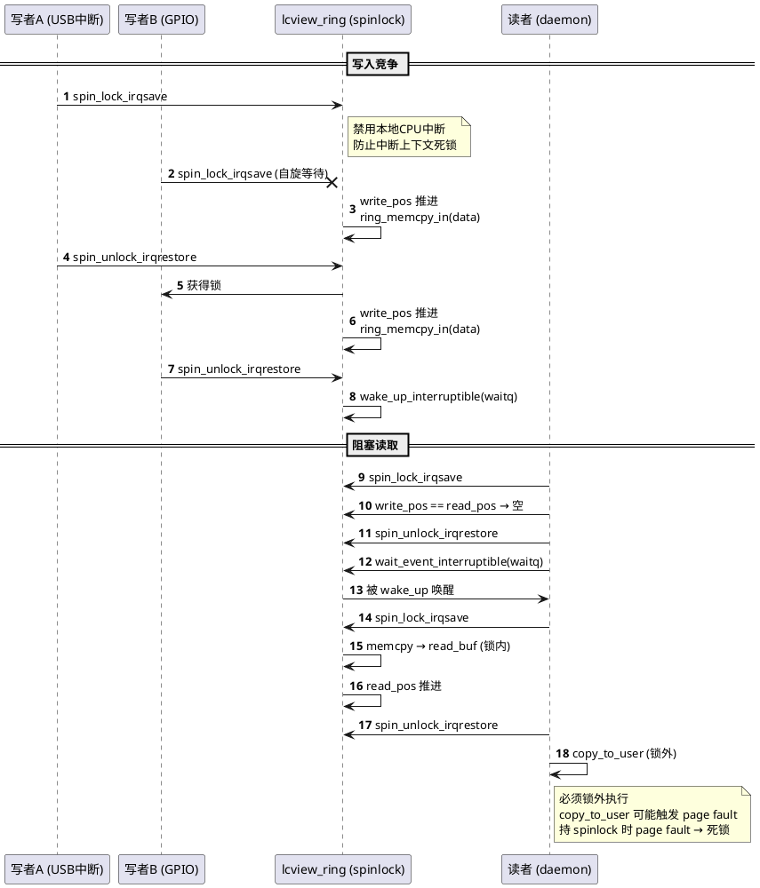

**read_buf 中转机制：** 读者在锁内将环中数据 `memcpy` 到独立的 `read_buf`（vmalloc 分配的 4KB 缓冲区），解锁后在锁外执行 `copy_to_user`。避免持 spinlock 期间 page fault 导致死锁。

> `read_buf` 分配：[`lcview_ring_init`](../../code/rpi5/kernel/new/vendor/lechao/LcView/lcview_ring.c#L120)，锁内拷贝：[`lcview_ring_read`](../../code/rpi5/kernel/new/vendor/lechao/LcView/lcview_ring.c#L427)。

### 上下文安全

`lcview_builder_new` 使用 `GFP_ATOMIC` 分配内存，因为调用者可能处于 atomic 上下文：

```
atomic_notifier_call_chain (持 rwsem 读锁)
  └── vendor_lechao_usbd_handle_event (持 spinlock)
        └── lcview_builder_start → lcview_builder_new → kmalloc(GFP_ATOMIC)
```

`GFP_KERNEL` 在内存压力下会触发直接回收（涉及睡眠），在 spinlock 上下文中会触发 `BUG: sleeping function called from invalid context`。`GFP_ATOMIC` 使用保留内存池，不睡眠，失败时返回 NULL。

> 分配实现：[`lcview_builder.c:88`](../../code/rpi5/kernel/new/vendor/lechao/LcView/lcview_builder.c#L88)

### 溢出驱逐策略

写入空间不足时，批量驱逐最旧记录（每轮最多 64 条），递增 `overrun_cnt`。批量策略将 256KB 环中最坏情况迭代次数从 ~13,000 降至 ~200。

> 驱逐实现：[`ring_evict_one`](../../code/rpi5/kernel/new/vendor/lechao/LcView/lcview_ring.c#L187)，批量逻辑：[`lcview_ring.c:271`](../../code/rpi5/kernel/new/vendor/lechao/LcView/lcview_ring.c#L271)

### 关键不变量

| 不变量 | 保证机制 | 代码位置 |
|--------|---------|---------|
| `write_pos == read_pos` 恒为"空" | 预留 1 字节不可用 | [`ring_avail_write`](../../code/rpi5/kernel/new/vendor/lechao/LcView/lcview_ring.c#L63) |
| 单实例 open | `atomic_cmpxchg` | [`lcview_main.c:119`](../../code/rpi5/kernel/new/vendor/lechao/LcView/lcview_main.c#L119) |
| 单条记录 ≤ 4KB | `LCVIEW_BUILDER_MAX_SIZE` 边界检查 | [`lcview_internal.h:35`](../../code/rpi5/kernel/new/vendor/lechao/LcView/lcview_internal.h#L35) |
| 4B 长度前缀 wrap-around | `ring_memcpy_in/out` 分段拷贝 | [`lcview_ring.c:89`](../../code/rpi5/kernel/new/vendor/lechao/LcView/lcview_ring.c#L89) |
| commit 幂等 | `committed` 标志防重入 | [`lcview_builder.c:277`](../../code/rpi5/kernel/new/vendor/lechao/LcView/lcview_builder.c#L277) |

## 开发视图

### 文件职责矩阵

> **约束：** 目录结构只列出源码文件，不含编译产物（`.o`、`.ko`、`.cmd` 等）。

> **日志头文件：** 模块通过 `ccflags-y` 引用上层 `vendor/lechao/kernel_lechao_log.h`，定义 `KERNEL_LCVIEW_TAG` 日志 tag 常量，文件本身不在 LcView 目录内。

```
code/rpi5/kernel/new/vendor/lechao/LcView/
├── lcview_events.h          # 内核/用户态共享：事件ID、级别、类型编码、record_hdr
├── lcview_internal.h        # 模块内部：ring/builder/stats 结构体 + API 声明
├── lcview_builder.c         # Builder API 实现：链式构建 + TLV 序列化
├── lcview_ring.c            # 环形缓冲区：读写、溢出驱逐、阻塞等待（薄包装）
├── lcview_ring_logic.c      # 环形缓冲区纯索引逻辑（avail/memcpy/驱逐，内核与 host 单测共用）
├── lcview_ring_logic.h      # 纯索引逻辑声明（不依赖内核 API）
├── lcview_main.c            # 字符设备驱动：file_ops + ioctl + 模块入口 + EXPORT_SYMBOL
├── lcview_ioctl.h           # ioctl 命令码定义（魔数 'V'）
├── Makefile                 # 四合一编译配置
├── Kconfig                  # CONFIG_LCVIEW bool 配置
└── tests/                   # host 单测（lcview_ring_host_test.c + Makefile）
```

| 文件 | 职责 | 关键函数 | 行数 |
|------|------|---------|------|
| `lcview_events.h` | 内核/用户态共享的事件 ID、类型编码、记录头结构 | — | 105 |
| `lcview_internal.h` | 模块内部数据结构和 API 声明 | — | 181 |
| `lcview_builder.c` | Builder 模式：`start → add_* → commit` 链式构建 | `lcview_builder_new`/`commit` | 319 |
| `lcview_ring.c` | 环形缓冲区：写入/驱逐/阻塞读取/统计（薄包装调 logic） | `lcview_ring_write`/`read`/`evict_one` | 486 |
| `lcview_ring_logic.c` | 环形缓冲区纯索引逻辑：avail/memcpy/驱逐（内核 API 剥离） | `ring_avail_write_core`/`ring_evict_one_core` | 88 |
| `lcview_ring_logic.h` | 纯索引逻辑声明（内核与 host 单测共用） | — | 73 |
| `lcview_main.c` | 字符设备注册、`file_operations`、`EXPORT_SYMBOL`、模块入口 | `lcview_init`/`lcview_exit`/`lcview_stats_show`/`builder_start` | 406 |
| `lcview_ioctl.h` | ioctl 命令码（`_IOR`/`_IOW` 宏生成） | — | 48 |
| `tests/lcview_ring_host_test.c` | ring 纯逻辑 host 单测（51 断言，不引 KUnit） | `main` | 205 |
| `tests/Makefile` | host 单测编译运行入口 | — | 17 |

### 头文件依赖图

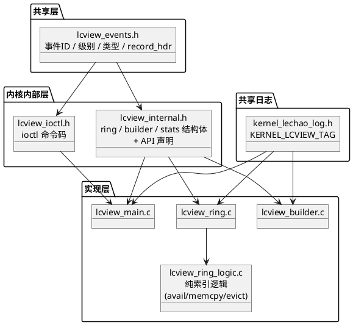

### EXPORT_SYMBOL 契约

LcView 通过 `EXPORT_SYMBOL` 导出 8 个 Builder API 符号，供其他内核模块调用：

| 符号 | 说明 | 定义位置 |
|------|------|---------|
| `lcview_builder_start(event_id, level)` | 分配 builder，低于级别阈值返回 NULL | [lcview_main.c:294](../../code/rpi5/kernel/new/vendor/lechao/LcView/lcview_main.c#L294) |
| `lcview_builder_add_int(b, int64_t)` | 添加 INT64 字段 | [lcview_builder.c:154](../../code/rpi5/kernel/new/vendor/lechao/LcView/lcview_builder.c#L154) |
| `lcview_builder_add_int32(b, int32_t)` | 添加 INT32 字段 | [lcview_builder.c:160](../../code/rpi5/kernel/new/vendor/lechao/LcView/lcview_builder.c#L160) |
| `lcview_builder_add_str(b, val)` | 添加 STRING 字段 | [lcview_builder.c:177](../../code/rpi5/kernel/new/vendor/lechao/LcView/lcview_builder.c#L177) |
| `lcview_builder_add_float(b, float)` | 添加 FLOAT 字段 | [lcview_builder.c:200](../../code/rpi5/kernel/new/vendor/lechao/LcView/lcview_builder.c#L200) |
| `lcview_builder_add_binary(b, ptr, len)` | 添加 BINARY 字段 | [lcview_builder.c:216](../../code/rpi5/kernel/new/vendor/lechao/LcView/lcview_builder.c#L216) |
| `lcview_builder_commit(b, ring)` | 序列化 → 写入环形缓冲区 → 释放 builder | [lcview_builder.c:271](../../code/rpi5/kernel/new/vendor/lechao/LcView/lcview_builder.c#L271) |
| `lcview_builder_cancel(b)` | 释放 builder 不写入 | [lcview_builder.c:245](../../code/rpi5/kernel/new/vendor/lechao/LcView/lcview_builder.c#L245) |

**使用示例：**

```c
#include "lcview_events.h"

struct lcview_builder *b = lcview_builder_start(LCVIEW_EVENT_USB_CONNECT, LCVIEW_LEVEL_INFO);
if (b) {
    lcview_builder_add_int(b, port);
    lcview_builder_add_str(b, chipset);
    lcview_builder_add_int(b, vid);
    lcview_builder_add_int(b, pid);
    lcview_builder_commit(b, &lcview_ring);
}
```

**调用方契约：**
- 字段按 schema 顺序添加，不传字段名
- `commit` 失败（环满）时 builder 不释放，调用方可重试或 `cancel`
- `add_binary(ptr=NULL, len>0)` 返回 `-EINVAL`
- 字符串自动截断到 65535 字节

### 构建集成

#### Kconfig / Makefile

> 完整定义：[`Kconfig`](../../code/rpi5/kernel/new/vendor/lechao/LcView/Kconfig)，[`Makefile`](../../code/rpi5/kernel/new/vendor/lechao/LcView/Makefile)

| 配置项 | 值 | 说明 |
|--------|-----|------|
| `config LCVIEW` | `bool` | built-in 模式（非可卸载模块） |
| `obj-$(CONFIG_LCVIEW)` | `lcview.o` | 四合一编译 |
| `lcview-objs` | `lcview_main.o lcview_ring.o lcview_ring_logic.o lcview_builder.o` | 编译单元 |
| `ccflags-y` | `-I$(src) -I$(srctree)/vendor/lechao` | 头文件搜索路径 |

#### 集成步骤

1. 将 `code/rpi5/kernel/new/vendor/` 拷贝到内核源码根目录
2. 确保上层 Kconfig 已 `source "vendor/lechao/LcView/Kconfig"`
3. 内核配置启用 `CONFIG_LCVIEW=y`：

```bash
cd ~/workspace/rpi5-kernel-build/common
make ARCH=arm64 CROSS_COMPILE=aarch64-linux-gnu- menuconfig
# Device Drivers → Vendor Lechao → LcView logging trace subsystem → Y
```

4. 编译内核：

```bash
make ARCH=arm64 CROSS_COMPILE=aarch64-linux-gnu- Image
```

LcView 随 vmlinux 启动，`module_init(lcview_init)` 映射为 `device_initcall`。

## 物理视图

### 运行时拓扑

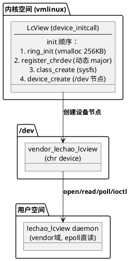

> 初始化入口：[`lcview_init`](../../code/rpi5/kernel/new/vendor/lechao/LcView/lcview_main.c#L337)

### 设备节点与权限

| 配置项 | 文件 | 说明 |
|--------|------|------|
| ueventd 权限 | `ueventd.rpi5.rc` | 设备节点 `/dev/vendor_lechao_lcview` 的访问权限 |
| SELinux 设备类型 | `file_contexts` | `lechao_lcview_hal_device` 标签 |
| Daemon 域权限 | `lechao_lcview.te` | `allow lechao_lcview lechao_lcview_hal_device:chr_file { open read write ioctl getattr }` |

### 内核启动参数

`ring_size_kb` 通过内核 cmdline 传递：

```bash
# kernel cmdline 示例
lcview.ring_size_kb=512
```

| 参数 | 默认值 | 最大值 | 说明 |
|------|--------|--------|------|
| `ring_size_kb` | 256KB | 4096KB | 环形缓冲区容量 |

### 验证

```bash
# 验证设备节点
ls -l /dev/vendor_lechao_lcview

# 查看内核日志
dmesg | grep kernel_lechao_lcview
# 期望: kernel_lechao_lcview: initialized (ring=256KB, major=N)

# 调整环形缓冲区大小（需重启，添加到 kernel cmdline）
# lcview.ring_size_kb=512

# sysfs 只读统计直读（host 侧 perf 直读 total_records，100ms 采样粒度）
cat /sys/class/lcview/vendor_lechao_lcview/lcview_stats
# 期望: total_records=N overrun=M ring_usage_bytes=K ring_size_bytes=262144
```

## 关键设计与实现

本章节从架构与源码两个维度，提炼 LcView 中 9 项关键设计决策及其实现细节。

### Schema ID 驱动 — 传输体积最小化

**设计思路：** 内核只传 `event_id`（2 字节）+ 字段值（TLV 编码），字段名由用户态 JSON schema 定义。新增事件仅需在 `lcview_events.h` 中分配新 ID，用户态更新 schema 即可，无需改内核传输协议。

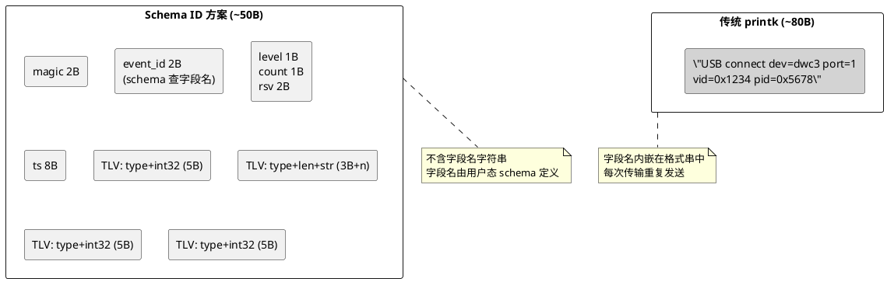

**源码实现：**

`lcview_record_hdr` 固定 16 字节，`__attribute__((packed))` 确保内核/用户态布局一致：

```c
// lcview_events.h:76
struct lcview_record_hdr {
    uint16_t magic;        // 0x4C56 ('LV')
    uint16_t event_id;     // schema 查找键
    uint8_t  level;        // DEBUG/INFO/WARN/ERROR
    uint8_t  field_count;  // 字段计数
    uint16_t reserved;
    uint64_t timestamp_ns; // ktime_get_real_ns()
} __attribute__((packed));
```

`event_id` 是用户态 schema 查找键，当前已定义 13 个事件 ID（[`lcview_events.h:47-69`](../../code/rpi5/kernel/new/vendor/lechao/LcView/lcview_events.h#L47)），覆盖 USB（1,4-13）、GPIO（2）、SENSOR（3）三类来源。传输中不含任何字段名字符串，一条含 4 个字段的 USB 连接事件序列化后仅 ~50 字节，而传统 `printk("device=%s port=%d vid=0x%04x pid=0x%04x")` 需 ~80 字节。

### Builder 模式 — 链式零拷贝序列化

**设计思路：** `start() → add_*() → commit()` 三段式，所有字段直接在 builder 内部 `buf[4096]` 中组装，`commit` 时一次性 `memcpy` 到环形缓冲区，无中间格式化开销。

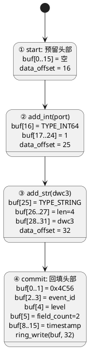

**源码实现：**

`lcview_builder_new` 分配 `sizeof(lcview_builder) ≈ 4100` 字节（含 4096B buf），`data_offset` 初始为 `sizeof(lcview_record_hdr) = 16`，预留头部空间：

```c
// lcview_builder.c:106
b->data_offset = sizeof(struct lcview_record_hdr);  // = 16
```

`add_*` 系列直接写 `b->buf[data_offset]`，每次写入后推进 `data_offset` 并递增 `field_count`。固定长度字段（INT32/INT64/FLOAT）共用 [`builder_write_field()`](../../code/rpi5/kernel/new/vendor/lechao/LcView/lcview_builder.c#L134)（`lcview_builder.c:134`），变长字段（STRING/BINARY）有独立函数处理 2 字节长度前缀。

`commit` 时将 16B 头部 `memcpy` 到 `buf[0..15]`，然后一次性调用 `lcview_ring_write(ring, b->buf, total_len)`，整个序列化过程中无动态内存再分配。

### 级别过滤短路 — 零开销丢弃

**设计思路：** 在 `builder_start` 入口即判断 `level < min_level`，直接返回 NULL。调用方检测到 NULL 后跳过整个 `add_*` 和 `commit` 流程，**零内存分配、零序列化、零写入**。

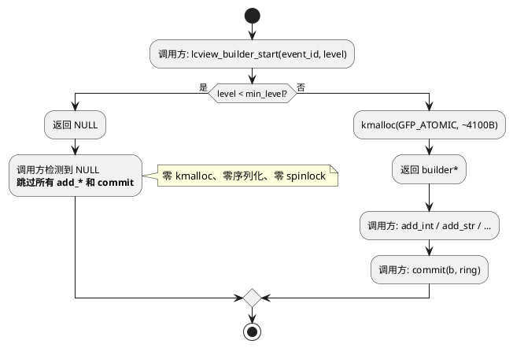

**源码实现：**

```c
// lcview_main.c:294
struct lcview_builder *lcview_builder_start(uint16_t event_id, uint8_t level)
{
    if (level < min_level)   // 短路返回
        return NULL;
    return lcview_builder_new(event_id, level);  // 仅通过时才 kmalloc
}
```

`min_level` 默认 `LCVIEW_LEVEL_DEBUG(0)`（不过滤），由用户态通过 `LCVIEW_SET_LEVEL` ioctl 动态调整（[`lcview_main.c:236`](../../code/rpi5/kernel/new/vendor/lechao/LcView/lcview_main.c#L236)）。对比传统 `printk` 的"先格式化再判断 level"，此设计在 DEBUG 级别被过滤时节省了完整的 `kmalloc(4100B) + 字段序列化 + spinlock 写入` 开销。

### read_buf 中转 — 规避 spinlock 死锁

**设计思路：** `copy_to_user` 可能触发 page fault（用户态页不在内存中），持 `spinlock` 时 page fault 会死锁。解法：锁内 `memcpy` 到独立的 `read_buf`，解锁后执行 `copy_to_user`。

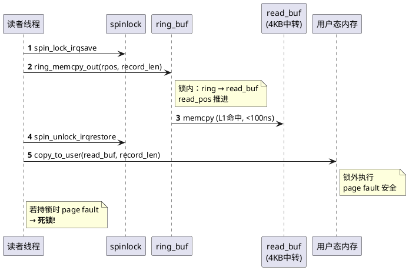

**源码实现：**

`read_buf` 在 `lcview_ring_init` 中分配，固定 4KB（单条记录最大长度）：

```c
// lcview_ring.c:120
ring->read_buf = vmalloc(LCVIEW_BUILDER_MAX_SIZE);  // 4096B
```

读取路径的关键步骤（[`lcview_ring_read`](../../code/rpi5/kernel/new/vendor/lechao/LcView/lcview_ring.c#L328)，`lcview_ring.c:328`）：

```c
spin_lock_irqsave(&ring->lock, flags);
ring_memcpy_out(ring, ring->read_buf, rpos, record_len);  // 锁内：ring → read_buf
ring->read_pos = (rpos + record_len) % ring->size;        // 锁内：推进读指针
spin_unlock_irqrestore(&ring->lock, flags);

copy_to_user(buf + copied_total, ring->read_buf, record_len);  // 锁外：read_buf → 用户态
```

为什么不能锁外直接 ring → user？因为 `read_pos` 必须在锁内推进，否则写者可能驱逐正在被读取的记录。`read_buf` 中转将"推进读指针"与"拷贝到用户态"解耦，实测额外 `memcpy` 开销 < 100ns/4KB（L1 cache 命中）。

### GFP_ATOMIC 分配 — Atomic 上下文安全

**设计思路：** 调用链 `atomic_notifier_call_chain`（持 rwsem 读锁）→ `spin_lock` → `kmalloc`，必须用 `GFP_ATOMIC`（保留内存池，不睡眠），`GFP_KERNEL` 会触发 direct reclaim 导致 `scheduling while atomic` 崩溃。

**源码实现：**

```c
// lcview_builder.c:88
b = kmalloc(sizeof(*b), GFP_ATOMIC);  // sizeof(*b) ≈ 4100 字节
```

调用链上下文：

```
atomic_notifier_call_chain (持 rwsem 读锁)
  └── vendor_lechao_usbd_handle_event (持 spinlock)
        └── lcview_builder_start → lcview_builder_new → kmalloc(GFP_ATOMIC)
```

`GFP_ATOMIC` 使用 watermark 高于普通阈值的保留内存池，不执行直接内存回收（不睡眠）。代价是分配失败率略高，但 4KB 分配在嵌入式系统上通常成功。失败时返回 NULL，调用方跳过这条日志，不影响功能性逻辑。

> 详见 [过程视图 · Atomic 上下文安全](#atomic-上下文安全)。

### 批量驱逐策略 — O(1) 摊还

**设计思路：** 环满时逐条驱逐最旧记录。单条驱逐在最坏情况下（环中全是小记录）需迭代 ~13,000 次，批量策略每轮最多驱逐 64 条再重新检查空间，将最坏迭代降至 ~200 次。

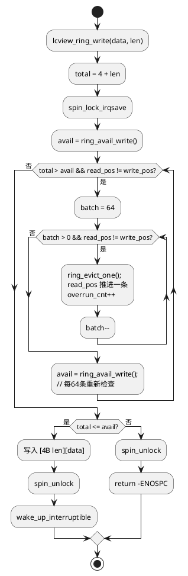

**源码实现：**

```c
// lcview_ring.c:271
while (total > avail && ring->read_pos != ring->write_pos) {
    int batch = 64;
    while (batch-- > 0 && ring->read_pos != ring->write_pos) {
        ring_evict_one(ring);  // 推进 read_pos，atomic_inc(overrun_cnt)
    }
    avail = ring_avail_write(ring);
}
```

[`ring_evict_one`](../../code/rpi5/kernel/new/vendor/lechao/LcView/lcview_ring.c#L187)（`lcview_ring.c:187`）读取被驱逐记录的 4B 长度前缀，推进 `read_pos`，递增 `overrun_cnt`。纯索引驱逐逻辑已抽至 [`lcview_ring_logic.c:53`](../../code/rpi5/kernel/new/vendor/lechao/LcView/lcview_ring_logic.c#L53)（`ring_evict_one_core`，内核 API 剥离供 host 单测），此处为薄包装。包含防御性处理：若长度前缀异常（0 或 > ring->size），使用保守默认值（前缀 + 记录头 = 20B）跳过，避免数据损坏导致永久性错乱。

### 4B 长度前缀 wrap-around — 分段拷贝

**设计思路：** 环形缓冲区回绕时，一条记录可能跨越缓冲区尾部和头部。`ring_memcpy_in/out` 自动将一次拷贝拆为两段，保证 4B 长度前缀和记录数据不被截断。


**源码实现：**

```c
// lcview_ring_logic.c:41
void ring_memcpy_in_core(uint8_t *buf, uint32_t size, uint32_t pos,
                         const uint8_t *src, uint32_t len)
{
    if (pos + len <= size) {
        memcpy(buf + pos, src, len);              // 无回绕：一次拷贝
    } else {
        uint32_t part1 = size - pos;              // 回绕：分两段
        memcpy(buf + pos, src, part1);            //   尾部 → 末尾
        memcpy(buf, src + part1, len - part1);    //   头部 ← 开头
    }
}
```

[`ring_memcpy_out`](../../code/rpi5/kernel/new/vendor/lechao/LcView/lcview_ring.c#L78)（`lcview_ring.c:78`）为对称的读取版本，同样为薄包装（逻辑在 `lcview_ring_logic.c`）。写入时先 `ring_memcpy_in` 写 4B 长度前缀，再 `ring_memcpy_in` 写记录数据（`lcview_ring.c:288-294`），两次调用各自独立处理回绕。`write_pos` 推进使用 `% ring->size` 取模。

### 不变量守护设计

**设计思路：** 多个关键不变量通过轻量机制守护，避免重量级锁或复杂协议。

| 不变量 | 守护机制 | 源码位置 |
|--------|---------|---------|
| 单实例 open | `atomic_cmpxchg(&device_opened, 0, 1)` — 无锁 CAS，多线程并发仅一个成功 | [`lcview_main.c:119`](../../code/rpi5/kernel/new/vendor/lechao/LcView/lcview_main.c#L119) |
| commit 幂等 | `committed` 标志，二次 commit 返回 `-EINVAL` | [`lcview_builder.c:277`](../../code/rpi5/kernel/new/vendor/lechao/LcView/lcview_builder.c#L277) |
| 空环判定 | `ring_avail_write()` 返回 `ring->size - used - 1`，预留 1 字节 | [`lcview_ring.c:65`](../../code/rpi5/kernel/new/vendor/lechao/LcView/lcview_ring.c#L65) |
| 单条 ≤ 4KB | `LCVIEW_BUILDER_MAX_SIZE` 边界检查，溢出返回 `-ENOSPC` | [`lcview_internal.h:35`](../../code/rpi5/kernel/new/vendor/lechao/LcView/lcview_internal.h#L35) |
| shutdown 顺序 | 先设 `shutdown=true` 再 `wake_up`，确保等待中的 reader 退出后才释放内存 | [`lcview_ring.c:159`](../../code/rpi5/kernel/new/vendor/lechao/LcView/lcview_ring.c#L159) |
| 字符串 NULL 安全 | `compute_str_len(NULL)` 返回 0，NULL 字符串写为空串 | [`lcview_builder.c:57`](../../code/rpi5/kernel/new/vendor/lechao/LcView/lcview_builder.c#L57) |

### 零侵入内核 — 纯增量设计

**设计思路：** 不修改任何原生内核源码，全部通过 `EXPORT_SYMBOL` + `vendor/` 目录 built-in 编译。升级内核版本时无 merge conflict 风险。

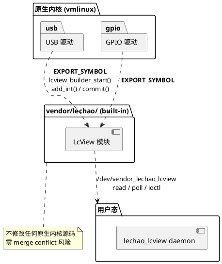

**源码实现：**

8 个 Builder API 通过 `EXPORT_SYMBOL` 导出到内核符号表（[`lcview_main.c:300-318`](../../code/rpi5/kernel/new/vendor/lechao/LcView/lcview_main.c#L300-318)），其他模块通过 `extern` 声明或包含 `lcview_events.h` 调用：

```c
EXPORT_SYMBOL(lcview_builder_start);
EXPORT_SYMBOL(lcview_builder_add_int);
// ... 共 8 个符号
```

构建集成通过 Kconfig/Makefile 独立配置（`Kconfig` 中 `CONFIG_LCVIEW=y`），`module_init(lcview_init)` 映射为 `device_initcall`（[`lcview_main.c:405`](../../code/rpi5/kernel/new/vendor/lechao/LcView/lcview_main.c#L405)），随 vmlinux 启动。上层 Kconfig 仅需 `source "vendor/lechao/LcView/Kconfig"` 一行即可接入。

## 接口参考

### Builder API

| 函数 | 参数 | 返回值 | 说明 |
|------|------|--------|------|
| `lcview_builder_start(event_id, level)` | `u16, u8` | `builder*` 或 `NULL` | 低于级别阈值返回 NULL |
| `lcview_builder_add_int(b, val)` | `builder*, int64` | `int` (0/-ENOSPC) | 添加 INT64 字段 (9B) |
| `lcview_builder_add_int32(b, val)` | `builder*, int32` | `int` | 添加 INT32 字段 (5B) |
| `lcview_builder_add_str(b, val)` | `builder*, const char*` | `int` | 添加 STRING (3B+len)，NULL 写空串 |
| `lcview_builder_add_float(b, val)` | `builder*, uint32` | `int` | 添加 FLOAT 字段 (5B) |
| `lcview_builder_add_binary(b, ptr, len)` | `builder*, void*, u16` | `int` (0/-EINVAL/-ENOSPC) | ptr=NULL && len>0 返回 -EINVAL |
| `lcview_builder_commit(b, ring)` | `builder*, ring*` | `int` (0/-ENOSPC/-EINVAL) | 成功释放 builder，失败保留 |
| `lcview_builder_cancel(b)` | `builder*` | `void` | 释放 builder 不写入 |

### ioctl 命令

| 命令 | 方向 | 参数 | 功能 |
|------|------|------|------|
| `LCVIEW_GET_AVAIL_BYTES` | 内核→用户 | `uint32_t*` | 查询环中可读字节数 |
| `LCVIEW_GET_OVERRUN` | 内核→用户 | `uint32_t*` | 查询溢出次数，读后清零 |
| `LCVIEW_GET_STATS` | 内核→用户 | `struct lcview_stats*` | 返回完整统计 |
| `LCVIEW_SET_LEVEL` | 用户→内核 | `uint8_t` | 设置最低上报级别 (0~3) |

> 命令码定义：[`lcview_ioctl.h`](../../code/rpi5/kernel/new/vendor/lechao/LcView/lcview_ioctl.h)

### file_operations

| 操作 | 行为 |
|------|------|
| `open()` | 单实例互斥（`atomic_cmpxchg`），已打开返回 `-EBUSY` |
| `read(buf, len)` | 阻塞读取，尽量填满 buf，返回实际字节数 |
| `poll(POLLIN)` | 环非空时返回 `POLLIN | POLLRDNORM`，支持 epoll |
| `compat_ioctl` | 与 `unlocked_ioctl` 共用，32/64-bit 兼容 |
| `close()` | 原子复位单实例锁，未读数据保留 |

> `file_operations` 定义：[`lcview_main.c:268`](../../code/rpi5/kernel/new/vendor/lechao/LcView/lcview_main.c#L268)

## 版本历史

| 版本 | 日期 | 变更 |
|------|------|------|
| **v3.8** | **2026-08-30** | **sysfs 统计导出 + 卸载支持**：(1) 新增 `DEVICE_ATTR_RO(lcview_stats)` 只读统计文件 `/sys/class/lcview/vendor_lechao_lcview/lcview_stats`，`cat` 直读 `total_records/overrun/ring_usage_bytes/ring_size_bytes`（绕过设备节点单打开限制，host 侧 perf 100ms 采样粒度）；(2) 新增 `module_exit(lcview_exit)` 完整反注册（sysfs 文件移除、设备/类销毁、`unregister_chrdev`、ring destroy），支持模块卸载 |
| **v3.6** | **2026-06-27** | **P0 检视修复（并发安全 + 字节序 + 防御）**：(1) **S1** `lcview_ring_destroy` 引入 `atomic_t readers` 引用计数，open inc/release dec，destroy 中 `wait_event(readers==0)` 后再 vfree，消除 use-after-free；(2) **S2** `lcview_ring_read` 调整为"锁内拷出 + 暂存 rpos → 锁外 copy_to_user → 成功才推进 read_pos"，`copy_to_user` 失败不再丢失记录；(3) **S3** `lcview_ring_write` 入口加 `len > LCVIEW_BUILDER_MAX_SIZE` 校验，防整数溢出；(4) **S5** 4B/2B 长度前缀统一小端序（`cpu_to_le32/le16` 序列化，用户态 `le32toh/le16toh` 读取），修正 builder 注释 big-endian→little-endian |
| **v3.7** | **2026-06-27** | **测试防护体系建立**：(1) 提炼 4 类 bug 模式为硬规范 [CXX-001~004](../../harness/rules/cxx-coding-rules.md)；(2) 用户态 daemon/HAL 单元测试（gmock 框架）落地 `tests/` 目录；(3) `mk_rpi5_full_image.sh` 编译阶段集成测试模块编译校验 |
