# LcView Daemon 服务

## 概述

`lechao_lcview` 是 lechao vendor 的**结构化日志打点框架**的 vendor 域 Daemon 进程，经 `EpollDeviceReader` 直读内核字符设备 `/dev/vendor_lechao_lcview`，攒批后由 `SchemaParser` 逐字段校验、`FileWriter` 按事件 ID 分文件写入 JSONL 格式到本地磁盘。

- **职责**：数据校验层 + 持久化层——直读内核批量二进制数据，按 Schema 校验字段类型和数量，合法记录按事件 ID 写入独立 JSONL 文件
- **进程域**：vendor 域常驻进程（`/vendor/bin/lechao_lcview`），由 `lechao_lcview.rc` 启动
- **数据源**：直读内核字符设备 `/dev/vendor_lechao_lcview`（open/epoll/read/ioctl）；设备节点单打开限制，部署须先停 HAL

**设计理念：** 直读模式——daemon 崩溃重启后重新 open 设备节点即恢复，无 Binder 生命周期、无回调管理；daemon 处理慢时内核环形缓冲自然形成背压（溢出按 overrun 计数）。

**设计目标：**

1. **直读模式健壮** — daemon 经 `EpollDeviceReader` 直读内核字符设备，无 Binder 生命周期、无回调管理、无死亡监听；崩溃重启后重新 open 设备节点即恢复
2. **Schema 驱动校验** — 每个事件 ID 对应固定字段 schema（JSON 配置），daemon 逐字段校验类型和数量，不合法记录拒绝落盘
3. **按 ID 分文件** — 不同 event_id 写入独立 JSONL 文件，便于云端一对一建表和前端查询
4. **自动滚动** — 按时间（每天）+ 大小（50MB）双重滚动，总占用超限自动删除最旧文件

**源码路径：**

- AOSP 源码根目录：`~/workspace/aosp`
- Daemon 源码目录：`vendor/lechao/services/lechao_lcview/daemon/`
- 完整源码归档：[`../../code/rpi5/aosp/new/vendor/lechao/services/lechao_lcview/daemon/`](../../code/rpi5/aosp/new/vendor/lechao/services/lechao_lcview/daemon/)

> **关联文档：** 内核打点 API 设计见 [01.01-内核态增强](./01.01-内核态增强-lcview-kernel.md)。系统级架构分析见 [README.md](./README.md)。

## 用例视图

### 正常路径：数据校验与落盘生命周期

二进制数据从内核字符设备直读到写入磁盘的完整生命周期：

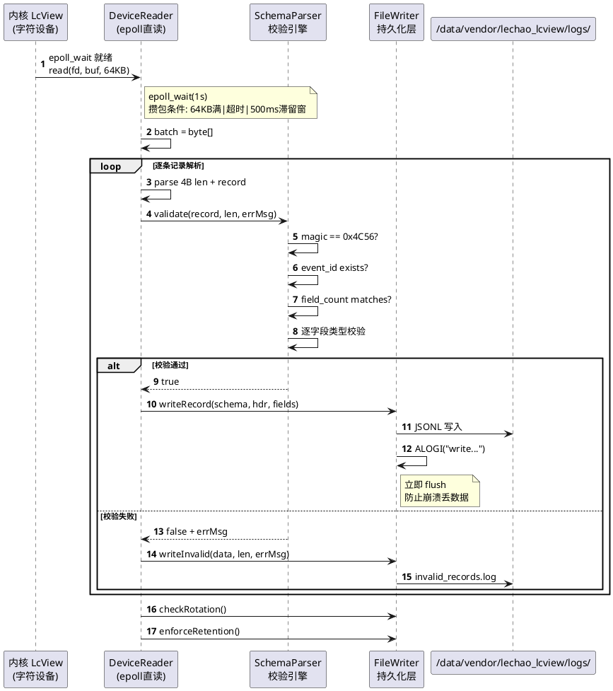

### 异常路径

#### Schema 文件未就绪

vendor 分区可能在 daemon 启动后才挂载完成，schema 加载需要重试：

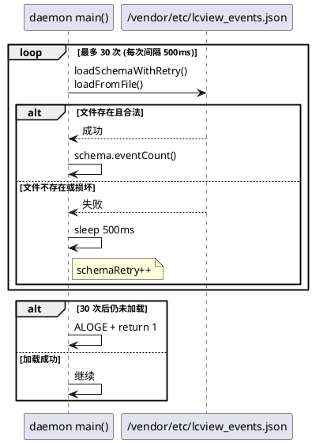

> 源码引用：`loadSchemaWithRetry()`（[batch_parser.cpp:96](../../code/rpi5/aosp/new/vendor/lechao/services/lechao_lcview/daemon/batch_parser.cpp#L96)），调用点 [lechao_lcview.cpp:226](../../code/rpi5/aosp/new/vendor/lechao/services/lechao_lcview/daemon/lechao_lcview.cpp#L226)。

#### 设备节点未就绪

内核字符设备节点可能在 daemon 启动后才创建，需要优雅重试：

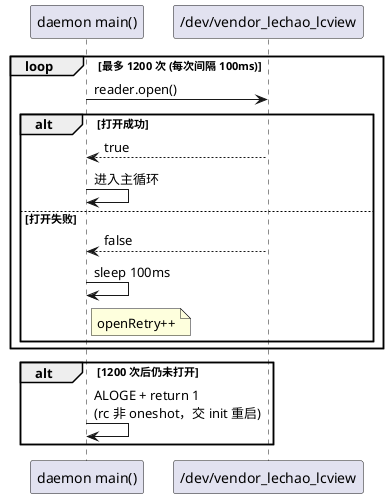

> 源码实现见 [关键设计「设备打开重试」](#设备打开重试--启动顺序解耦)（[lechao_lcview.cpp:246](../../code/rpi5/aosp/new/vendor/lechao/services/lechao_lcview/daemon/lechao_lcview.cpp#L246)）。

#### 致命读错误退出

读设备出现致命错误（fd 失效/epoll 损坏）时退出交 init 重启：

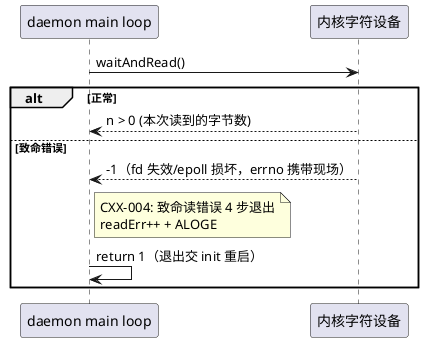

> 源码实现：`readOnce`（[lechao_lcview.cpp:58](../../code/rpi5/aosp/new/vendor/lechao/services/lechao_lcview/daemon/lechao_lcview.cpp#L58)），`waitAndRead` 返回 `-1` 视为致命（[DeviceReader.h:36](../../code/rpi5/aosp/new/vendor/lechao/services/lechao_lcview/daemon/DeviceReader.h#L36)）。

#### 磁盘空间不足

总日志量超限时删除最旧文件腾空间：

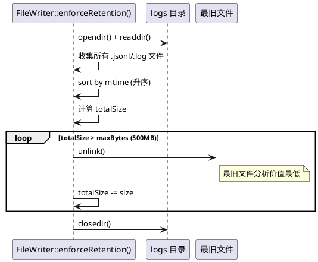

## 逻辑视图

### 模块分解

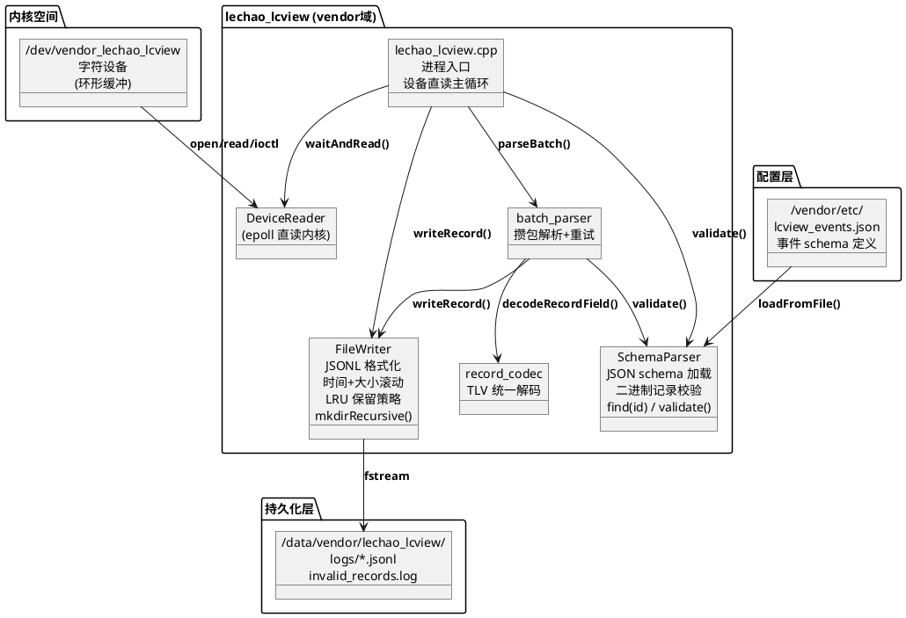

**职责矩阵：**

| 模块 | 职责 | 关键抽象 |
|------|------|---------|
| `lechao_lcview.cpp` | 设备直读、主循环、信号处理 | `main()` — [lechao_lcview.cpp:207](../../code/rpi5/aosp/new/vendor/lechao/services/lechao_lcview/daemon/lechao_lcview.cpp#L207) |
| `DeviceReader` | 设备抽象（open/waitAndRead/getOverrun/getTotalRecords/close） | `class DeviceReader` — [DeviceReader.h:25](../../code/rpi5/aosp/new/vendor/lechao/services/lechao_lcview/daemon/DeviceReader.h#L25) |
| `record_codec` | TLV 字段统一解码 | `decodeRecordField` — [record_codec.h:41](../../code/rpi5/aosp/new/vendor/lechao/services/lechao_lcview/daemon/record_codec.h#L41) |
| `SchemaParser` | JSON schema 加载、二进制记录校验、热重载 | `class SchemaParser` — [SchemaParser.h:54](../../code/rpi5/aosp/new/vendor/lechao/services/lechao_lcview/daemon/SchemaParser.h#L54) |
| `FileWriter` | JSONL 格式化、文件轮转、容量限制 | `class FileWriter` — [FileWriter.h:45](../../code/rpi5/aosp/new/vendor/lechao/services/lechao_lcview/daemon/FileWriter.h#L45) |

### 二进制记录格式

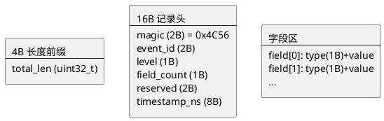

**字段编码表：**

| 字段 | 类型 | 说明 |
|------|------|------|
| `magic` | `uint16_t` | 魔数 `0x4C56` ('LV')，用于快速校验数据完整性 |
| `event_id` | `uint16_t` | 事件类型 ID，映射到 JSON schema 定义 |
| `level` | `uint8_t` | 日志级别 (0=DEBUG, 1=INFO, 2=WARN, 3=ERROR) |
| `field_count` | `uint8_t` | 字段数量，必须与 schema 中定义的字段数一致 |
| `reserved` | `uint16_t` | 保留字段，对齐用 |
| `timestamp_ns` | `uint64_t` | 内核打点时的纳秒时间戳 (`ktime_get_real_ns()`) |

**字段值编码：**

| type | 值格式 | 说明 |
|------|--------|------|
| `LCVIEW_TYPE_INT32 (1)` | 4 字节定长 | 有符号 32 位整数 |
| `LCVIEW_TYPE_INT64 (2)` | 8 字节定长 | 有符号 64 位整数 |
| `LCVIEW_TYPE_FLOAT (3)` | 4 字节定长 | IEEE 754 单精度浮点 |
| `LCVIEW_TYPE_STRING (4)` | 2B 长度 + UTF-8 文本 | 变长字符串 |
| `LCVIEW_TYPE_BINARY (5)` | 2B 度 + 原始字节 | 变长二进制数据 |

### JSONL 输出格式

每行一个 JSON 对象，不含字段名，`f` 数组按 schema 顺序排列：

```jsonl
{"ts":1738900000123456789,"id":4,"level":1,"f":[0,1,4096]}
{"ts":1738900001123456789,"id":5,"level":1,"f":[0,1,4096,12345678,0]}
```

| 字段 | 说明 |
|------|------|
| `ts` | 内核打点时的纳秒时间戳 (`ktime_get_real_ns()`) |
| `id` | 事件 ID（对应 schema） |
| `level` | 日志级别 (0=DEBUG, 1=INFO, 2=WARN, 3=ERROR) |
| `f` | 字段值数组，按 schema 顺序排列 |

### Schema JSON 格式

```json
// /vendor/etc/lcview_events.json （严格 JSON，禁止注释）
{
  "version": 1,
  "events": [{
    "id": 4,
    "name": "usb_transport_start",
    "desc": "USB bulk transport starts",
    "fields": [
      {"name": "device_index",    "type": "int64"},
      {"name": "data_direction",  "type": "int64"},
      {"name": "bytes_to_xfer",   "type": "int64"}
    ]
  }]
}
```

> **严格 JSON 模式**：`SchemaParser::parseJson` 设置 `allowComments = false`，禁止 JSON 注释（`//` 或 `/* */`）。内核和 daemon 共享 `lcview_events.h` 中的事件 ID 宏。JSON 文件定义字段名和类型，云端根据 ID 一对一建表。

## 过程视图

### 并发模型

Daemon 采用**单线程模型**：主线程同时负责 epoll 直读、Schema 校验、文件写入。无需多线程同步，简化架构。

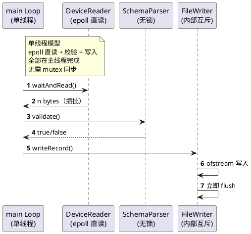

**线程安全分析：**
- `SchemaParser::mSchemaMap` 仅在启动时加载，主循环期间只读，无需锁
- `FileWriter::mFiles` 仅在主线程访问，ofstream 本身无多线程写入，无需锁
- `gRunning` 使用 `std::atomic<bool>` 保证信号处理器与主循环的可见性
- `FileWriter::mDrops` / `mTimings` 仅主线程访问（心跳输出与写路径同线程），无需锁

### 校验流程

每条二进制记录消费路径：

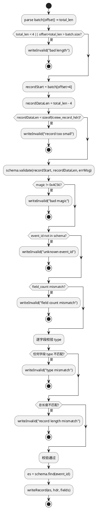

### 关键不变量

| 不变量 | 保证机制 | 代码位置 |
|--------|---------|---------|
| Schema 加载成功后主循环期间只读 | `loadSchemaWithRetry()` 成功后 `mSchemaMap` 不修改 | [`lechao_lcview.cpp:226`](../../code/rpi5/aosp/new/vendor/lechao/services/lechao_lcview/daemon/lechao_lcview.cpp#L226) |
| 每条记录写入后立即 flush | `FileWriter::writeLineFlush()` 内 `stream.flush()` | [`FileWriter.cpp:365`](../../code/rpi5/aosp/new/vendor/lechao/services/lechao_lcview/daemon/FileWriter.cpp#L365) |
| 空缓冲不产生写放大 | `shouldFlushBatch(buffered==0)` 返回 false，空批不 flush 攒包 | [`batch_parser.cpp:109`](../../code/rpi5/aosp/new/vendor/lechao/services/lechao_lcview/daemon/batch_parser.cpp#L109) |
| 文件轮转不丢数据 | 轮转时先关闭旧文件再打开新文件，追加模式写入 | [`FileWriter.cpp:524`](../../code/rpi5/aosp/new/vendor/lechao/services/lechao_lcview/daemon/FileWriter.cpp#L524) |

## 开发视图

### 文件职责矩阵

> **约束：** 目录结构只列出源码文件，不含编译产物（`.o`、`.cmd`、`bazel-out` 等）。

```
code/rpi5/aosp/new/vendor/lechao/services/lechao_lcview/daemon/
├── lechao_lcview.cpp          # 进程入口：设备直读 + 主循环 + 信号处理
├── DeviceReader.h             # 设备读取抽象（open/epoll/read/ioctl 接口）
├── DeviceReader.cpp           # EpollDeviceReader 生产实现
├── batch_parser.h             # 攒包解析/schema重试/flush判定（可测函数）
├── batch_parser.cpp           # parseBatch / loadSchemaWithRetry / shouldFlushBatch
├── record_codec.h             # TLV 字段统一解码器声明
├── record_codec.cpp           # decodeRecordField 实现
├── SchemaParser.h             # Schema 解析器声明（字段类型/事件 schema）
├── SchemaParser.cpp           # JSON 加载 + 二进制记录校验 + 热重载
├── FileWriter.h               # 文件写入器声明（配置/状态/接口）
├── FileWriter.cpp             # JSONL 格式化 + 滚动 + 保留策略 + mkdirRecursive
├── Android.bp                 # cc_binary 编译配置（vendor: true）
└── lechao_lcview.rc           # init 启动脚本
```

| 文件 | 职责 | 关键函数 | 行数 |
|------|------|---------|------|
| `lechao_lcview.cpp` | 设备直读、主循环、信号处理 | `main()` / `runMainLoop()` / `readOnce()` / `flushSegment()` / `emitHeartbeat()` | 265 |
| `DeviceReader.h` | 设备读取抽象声明 | `open()` / `waitAndRead()` / `getOverrun()` / `getTotalRecords()` / `close()` | 74 |
| `DeviceReader.cpp` | EpollDeviceReader 生产实现 | `open()` / `waitAndRead()` | 155 |
| `batch_parser.h` | 可测函数声明 | `parseBatch()` / `loadSchemaWithRetry()` / `shouldFlushBatch()` | 56 |
| `batch_parser.cpp` | 攒包解析、schema 重试、flush 判定 | `parseBatch()` / `loadSchemaWithRetry()` / `shouldFlushBatch()` | 114 |
| `record_codec.h` | TLV 解码器声明 | `decodeRecordField()` | 48 |
| `record_codec.cpp` | TLV 解码实现 | `decodeRecordField()` | 82 |
| `SchemaParser.h` | Schema 解析器声明 | `loadFromFile()` / `find()` / `validate()` | 84 |
| `SchemaParser.cpp` | JSON 解析、二进制校验、热重载 | `parseJson()` / `validate()` / `validateFields()` | 312 |
| `FileWriter.h` | 文件写入器声明 | `writeRecord()` / `writeInvalid()` / `checkRotation()` / `enforceRetention()` | 147 |
| `FileWriter.cpp` | JSONL 格式化、滚动、容量管理 | `formatJsonLine()` / `writeLineFlush()` / `nextSeqFor()` / `enforceRetention()` | 666 |
| `Android.bp` | Soong 编译配置 | — | 63 |
| `lechao_lcview.rc` | init 启动脚本 | — | 32 |

### 模块依赖图

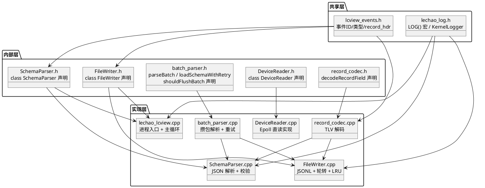

### 构建集成

#### Soong 配置

> 完整定义见 [`Android.bp` (daemon/)](../../code/rpi5/aosp/new/vendor/lechao/services/lechao_lcview/daemon/Android.bp)

| 模块 | 类型 | 说明 |
|------|------|------|
| `lechao_lcview` | `cc_binary` | Daemon 进程二进制，`vendor: true`（vendor 分区） |
| `vendor.lechao.lcview_headers` | `cc_library_headers` | 共享头文件依赖（lcview_events.h），定义已迁至 `include/Android.bp`（原根 Android.bp 随 aidl_interface 删除） |
| `lechao_lcview_daemon_sources` | `filegroup` | SchemaParser/FileWriter/batch_parser/record_codec（供 UT 复用） |
| `lechao_lcview_device_sources` | `filegroup` | DeviceReader.cpp（daemon 与回滚态共用） |

#### device tree 集成（必须）

> **lcview 的 `cc_binary` 必须显式加入 `PRODUCT_PACKAGES`**，否则不会被打包进镜像。

device tree 集成配置（BoardConfig.mk、aosp_rpi5.mk、config.txt）中，`PRODUCT_PACKAGES` 需显式声明 daemon 与 config 模块，否则不进镜像。

`PRODUCT_PACKAGES` 中 daemon 与 config 模块都需要声明：

```makefile
# lechao lcview service
PRODUCT_PACKAGES += \
    lechao_lcview \
    vendor.lechao.lcview-config
```

#### 编译与部署

```bash
cd $AOSP_WS
source build/envsetup.sh && lunch aosp_rpi5-bp1a-userdebug
m lechao_lcview           # 编译 daemon

# 验证部署
adb shell ls -l /vendor/bin/lechao_lcview
adb reboot

# 验证 daemon 进程
adb shell ps -A | grep lechao_lcview

# 验证设备直读链路（内核 sysfs 统计）
adb shell cat /sys/class/lcview/vendor_lechao_lcview/lcview_stats

# 验证日志目录
adb shell ls -l /data/vendor/lechao_lcview/logs/
```

## 部署视图

### 运行时拓扑

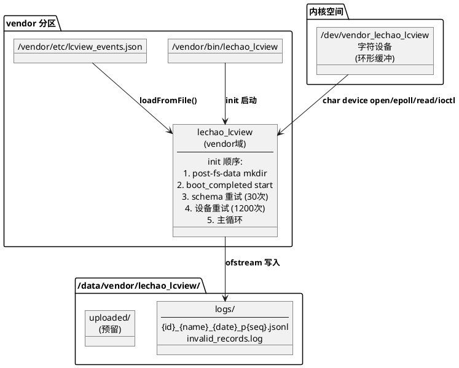

### init 启动配置

```bash
# lechao_lcview.rc
on post-fs-data
    mkdir /data/vendor/lechao_lcview 0750 system system

service lechao_lcview /vendor/bin/lechao_lcview
    class main
    user system
    group system

on property:sys.boot_completed=1
    start lechao_lcview
```

| 配置项 | 值 | 说明 |
|--------|-----|------|
| `mkdir` | `/data/vendor/lechao_lcview 0750 system system` | post-fs-data 阶段创建父目录，init 自动 `restorecon` 打 SELinux 标签 |
| `class` | `main` | 随 main 类服务启动 |
| `user/group` | `system` | 以 system 身份运行，有限文件系统权限 |
| 非 `oneshot` | — | 设备打开/直读错误 `exit(1)` 交 init 重启拉起采集链路；init 自带重启限速防日志风暴，oneshot 会让故障被无限期掩盖 |
| `boot_completed` | `sys.boot_completed=1` | 等待系统完全启动后再启动日志采集服务 |

### 目录自动创建

数据目录 `/data/vendor/lechao_lcview/` 由两层保障创建：

1. **init.rc 层**：`lechao_lcview.rc` 中 `mkdir /data/vendor/lechao_lcview 0750 system system`，init 阶段创建父目录并自动 `restorecon` 打 SELinux 标签
2. **C++ 兜底层**：`FileWriter` 构造函数中使用 `mkdirRecursive()` 递归创建 `logs/` 和 `uploaded/` 子目录（`mkdir -p` 等价实现），当父目录不存在时逐级向上创建

> **设计原因**：init 的 `mkdir` 只能创建路径的最后一级目录，POSIX `mkdir()` 同理。旧代码中 `mkdir(logDir.c_str())` 在父目录 `/data/vendor/lechao_lcview/` 不存在时静默失败（返回值被忽略），导致 `/data/vendor/lechao_lcview/logs/` 从未被创建。

### 文件滚动策略

| 维度 | 策略 | 可配参数 |
|------|------|---------|
| 按时间切分 | 每天凌晨自动新建文件 | `rotation_interval=24h` |
| 按大小切分 | 单文件超 50MB 后新建续写 | `maxFileSizeMb=50` |
| 保留策略 | 总占用超 500MB 删除最旧 | `maxTotalSizeMb=500` |
| 文件命名 | `{id}_{name}_{date}_p{seq}.jsonl` | seq 当天同 ID 多切片递增 |

示例：`4_usb_transport_start_20260606_p0.jsonl` → 满 50MB → `4_usb_transport_start_20260606_p1.jsonl`

### 目录结构

```
/data/vendor/lechao_lcview/
├── logs/                              # daemon 写入
│   ├── 4_usb_transport_start_20260606_p0.jsonl
│   ├── 5_usb_transport_end_20260606_p0.jsonl
│   └── invalid_records.log           # 校验失败的记录
├── uploaded/                          # uploader 归档（二期）
│   └── 4_usb_transport_start_20260605_p0.jsonl.gz
```

### SELinux 策略

> 完整定义见 [`lechao_lcview.te`](../../code/rpi5/aosp/new/device/brcm/rpi5/sepolicy/lechao_lcview.te)

| 配置项 | 文件 | 说明 |
|--------|------|------|
| Daemon 域 | `lechao_lcview.te` | `type lechao_lcview, domain;` |
| 可执行文件标签 | `file_contexts` | `/vendor/bin/lechao_lcview → lechao_lcview_exec` |
| 数据目录标签 | `file_contexts` | `/data/vendor/lechao_lcview(/.*)? → lechao_lcview_data_file` |
| 设备节点类型 | `lechao_lcview.te` | `type lechao_lcview_hal_device, dev_type, file_type;`（原定义于 hal.te，并入本域） |
| 设备节点标签 | `file_contexts` | `/dev/vendor_lechao_lcview → lechao_lcview_hal_device` |

```te
type lechao_lcview, domain;
type lechao_lcview_exec, exec_type, file_type;
type lechao_lcview_hal_device, dev_type, file_type;

init_daemon_domain(lechao_lcview)

allow lechao_lcview lechao_lcview_hal_device:chr_file { open read write ioctl getattr };
allow lechao_lcview device:dir { search read };
```

> **补注：** file_contexts 匹配 `/dev/vendor_lechao_lcview → lechao_lcview_hal_device`。

### 验证

```bash
# 确认二进制已部署
adb shell ls -l /vendor/bin/lechao_lcview

# 确认 schema 配置
adb shell cat /vendor/etc/lcview_events.json

# 重启触发 init 启动
adb reboot

# 验证 daemon 进程
adb shell ps -A | grep lechao_lcview

# 验证日志目录
adb shell ls -l /data/vendor/lechao_lcview/logs/

# 查看落盘数据（logcat 实时输出）
adb logcat -s lechao_lcview:V | grep "write"
```

## 关键设计与实现

本章节从架构与源码两个维度，提炼 Daemon 中的关键设计决策及其实现细节。

### Schema 重试 — 启动顺序解耦

**设计思路：** vendor 分区可能在 daemon 启动后才挂载完成，schema 文件 `lcview_events.json` 短暂不可访问。30 次重试（每次 500ms，最多 15 秒）替代旧版本直接 FATAL 退出策略，提高启动可靠性。

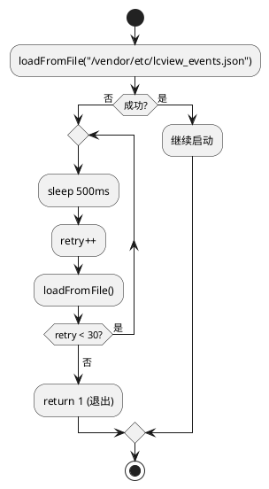

**源码实现：**

```c
// batch_parser.cpp:96 (loadSchemaWithRetry)
int schemaRetry = 0;
while (!schema.loadFromFile(path) && schemaRetry < maxRetries) {
    ALOGW("lechao_lcview: schema not ready, retrying... (%d/%d)",
          ++schemaRetry, maxRetries);
    std::this_thread::sleep_for(interval);
}
return schema.eventCount() > 0;
```

```c
// 调用点：lechao_lcview.cpp:226
const bool schemaOk = loadSchemaWithRetry(schema, schemaPath, 30);
if (!schemaOk) {
    ALOGE("lechao_lcview: failed to load schema from %s", schemaPath.c_str());
    return 1;
}
```

### 设备打开重试 — 启动顺序解耦

**设计思路：** 内核字符设备节点可能晚于 daemon 创建。daemon 通过 `reader.open()` + 100ms×1200 次重试循环等待设备就绪；超限 `ALOGE` + `return 1` 交 init 重启（rc 非 oneshot）。设备节点单打开限制，部署须先停 HAL，否则 open 返 EBUSY。

**源码实现：**

```c
// lechao_lcview.cpp:246
while (gRunning && !reader.open()) {
    if (++openRetry >= 1200) {
        ALOGE("lechao_lcview: cannot open device after retries, exiting for init restart");
        return 1;
    }
    std::this_thread::sleep_for(std::chrono::milliseconds(100));
}
```

### 直读攒包 — 消除 Binder 层

**设计思路：** daemon 经 `EpollDeviceReader` 直读内核字符设备，攒包后 `parseBatch` 解析；无 AIDL/Binder/服务注册，崩溃重启后重新 open 设备节点即恢复，无任何回调/死亡监听生命周期。

**源码实现：**

```c
// batch_parser.cpp:109
shouldFlushBatch(buffered, timedOut, ageExpired, capacity)
// 64KB 满 | epoll 超时 | 500ms 滞留窗（与旧 HAL readerLoop 同语义）
```

### 攒包 flush 策略 — 空批零写放大

**设计思路：** `epoll_wait(1s)` 超时无数据即继续循环；空缓冲（buffered==0）不 flush（`shouldFlushBatch` 首条判定），避免空批次写放大。

**源码实现：**

```c
// flushSegment（lechao_lcview.cpp:127-151）：readOnce → emitHeartbeat(时间驱动30s) → flushSegment
// batch_parser.cpp:109-114
bool shouldFlushBatch(size_t buffered, bool timedOut, bool ageExpired,
                      size_t bufferCapacity)
{
    if (buffered == 0) return false;  // 空批不 flush（避免空批次写放大）
    return buffered >= bufferCapacity || timedOut || ageExpired;
}
```

直读主循环每轮：`readOnce` 读内核 → 距上次满 30s `emitHeartbeat`（时间驱动，重载下 epoll 立返不刷屏）→ `flushSegment` 攒包写盘；epoll 内部阻塞机制保证 CPU 零开销等待。

### Schema 驱动校验 — 拒绝损坏数据

**设计思路：** 每个事件 ID 对应固定字段 schema（JSON 配置），daemon 逐字段校验类型和数量。内核 ring buffer 可能出现数据错位、部分写入等异常，严谨校验防止损坏数据被写入 JSONL 文件。

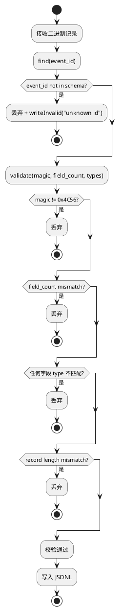

**源码实现：**

```c
// SchemaParser.cpp:264
bool SchemaParser::validate(const uint8_t* data, size_t len,
                             std::string& errMsg) const
{
    // 最小长度必须能容纳记录头
    if (len < sizeof(struct lcview_record_hdr)) {
        errMsg = "data too short for header";
        return false;
    }

    const struct lcview_record_hdr* hdr =
        reinterpret_cast<const struct lcview_record_hdr*>(data);

    // 魔数校验：快速识别数据损坏
    if (hdr->magic != LCVIEW_MAGIC) {
        errMsg = "bad magic";
        return false;
    }

    const EventSchema* schema = find(hdr->event_id);
    if (!schema) {
        errMsg = "unknown event_id " + std::to_string(hdr->event_id);
        return false;
    }

    // field_count 必须与 schema 定义一致
    /* hdr->field_count 是 uint8_t，自然提升为 int 比较；
     * size() 直接比较防止 schema 字段数 > 255 时强转截断匹配 */
    if ((size_t)hdr->field_count != schema->fields.size()) {
        errMsg = "field count mismatch: expected " +
                 std::to_string(schema->fields.size()) +
                 ", got " + std::to_string(hdr->field_count);
        return false;
    }

    // 逐字段校验（TLV 解码 + 类型匹配 + 越界拦截，拆入 validateFields），
    // 字段推进统一走 record_codec::decodeRecordField
    size_t consumed = 0;
    if (!validateFields(*schema, data, len, consumed, errMsg))
        return false;

    // 验证总长度匹配：确保没有多余或缺失的字节
    if (consumed != len) {
        errMsg = "record length mismatch: expected " +
                 std::to_string(consumed) + ", got " + std::to_string(len);
        return false;
    }

    return true;
}
```

### ostringstream 复用 — 减少堆分配

**设计思路：** `formatJsonLine()` 使用 `thread_local std::ostringstream` 复用，避免每次调用创建/销毁 `ostringstream` 的堆分配开销。`std::str("")` + `clear()` 重置流状态，不释放底层 buffer。字符串字段经 `jsonEscapeString` 转义（`\b \f \n \r \t` 具名转义，其余 `<0x20` 控制字符按 `\u00XX`，按 unsigned char 判读）——USB 描述符等含换行/控制字符的字符串不裂行，输出行恒为合法 JSONL。

**源码实现：**

```c
// FileWriter.cpp:291
std::string FileWriter::formatJsonLine(const EventSchema& schema,
                                       const struct lcview_record_hdr* hdr,
                                       const uint8_t* fields,
                                       size_t fieldsLen)
{
    thread_local std::ostringstream oss;
    oss.str("");   // 清空内容
    oss.clear();   // 重置错误状态

    oss << "{\"ts\":" << hdr->timestamp_ns
        << ",\"id\":" << hdr->event_id
        << ",\"level\":" << (int)hdr->level
        << ",\"f\":[";

    const uint8_t* ptr = fields;
    const uint8_t* const end = fields + fieldsLen;

    // 字段推进统一走 record_codec::decodeRecordField（原 LCVIEW_NEED 宏
    // + 手写 switch 的越界/推进逻辑已收敛到解码器）
    for (size_t i = 0; i < schema.fields.size(); i++) {
        if (i > 0) oss << ",";

        if (ptr >= end) {
            ALOGE("FileWriter: formatJsonLine: out-of-bounds at field %zu", i);
            mDrops.formatOob++;
            return std::string();
        }

        DecodedField df;
        FieldDecodeResult r = decodeRecordField(&ptr, end, &df);
        if (r == FieldDecodeResult::kTruncated) {
            ALOGE("FileWriter: formatJsonLine: truncated at field %zu", i);
            mDrops.formatOob++;
            return std::string();
        }
        appendFieldValue(oss, df);
    }
    oss << "]}\n";
    return oss.str();
}
```

> **NOTE**：`thread_local` 在此场景下等价于 `static`，因为 `writeRecord()` 仅在 daemon 主线程中被调用（单线程模型）。若将来多线程写入，`thread_local` 可保证每个线程独立，无需额外同步。

### mkdirRecursive — 递归创建目录

**设计思路：** Android 上 `mkdir` 不自动创建父目录，需要逐级创建。C++ 用户态程序不能依赖 shell 环境，递归实现更可靠。

**源码实现：**

```c
// FileWriter.cpp:43
static bool mkdirRecursive(const std::string& path, mode_t mode)
{
    if (path.empty() || path == "/") return true;

    std::string parent = path;
    while (!parent.empty() && parent.back() == '/')
        parent.pop_back();

    size_t pos = parent.rfind('/');
    if (pos != std::string::npos && pos > 0) {
        std::string parentDir = parent.substr(0, pos);
        struct stat st;
        if (stat(parentDir.c_str(), &st) != 0) {
            if (!mkdirRecursive(parentDir, mode))
                return false;
        }
    }

    if (mkdir(path.c_str(), mode) == 0 || errno == EEXIST)
        return true;

    ALOGE("FileWriter: mkdir %s failed: %s", path.c_str(), strerror(errno));
    return false;
}
```

### 立即 flush — 防止崩溃丢数据

**设计思路：** 每条记录写入后立即 `flush()`，防止进程崩溃导致缓冲区数据丢失。权衡性能与可靠性：高频场景下 flush 开销可接受，数据完整性优先。

**源码实现：**

```c
// FileWriter.cpp:365（writeLineFlush 内 flush 段）
fs.stream << line;
fs.stream.flush();
if (fs.stream.fail()) {
    ALOGE("FileWriter: write failed for event %u, attempting recovery",
          fs.eventId);
    // CXX-002: failbit 粘滞不清除会让该事件流从此永久失败，
    // 恢复路径：清错误状态 → 回退首写残留 → 重开流 → 重试一次
    fs.stream.clear();
    fs.stream.close();
    rollbackFileTo(fs.currentFilename, writeBase);
    fs.stream.open(fs.currentFilename, std::ios::app);
    ...
}
```

### LRU 淘汰 — 最旧文件优先删除

**设计思路：** 总日志量超限（500MB）时，按 mtime 从小到大排序，删除最旧文件腾空间。日志文件按日期命名，最旧的文件分析价值最低。

**源码实现：**

```c
// FileWriter.cpp:651
void FileWriter::enforceRetention()
{
    // 方向 4 降频：按写入计数触发，未达阈值直接跳过，
    // 避免无数据时反复全目录扫描
    if (mCfg.retentionScanEveryWrites > 0 &&
        mWritesSinceRetention < mCfg.retentionScanEveryWrites) {
        return;
    }
    mWritesSinceRetention = 0;

    // 扫描 → 淘汰 两段（行为不变）
    std::vector<LogFile> files = scanLogFiles();
    evictOldFiles(files);
}
```

## 接口参考

### DeviceReader API

| 方法 | 参数 | 返回值 | 说明 |
|------|------|--------|------|
| `open()` | 无 | `bool` | 单次尝试打开设备；重试节奏由主循环控制 |
| `waitAndRead(buf, offset, cap, timeoutMs)` | `uint8_t*` + `size_t` + `size_t` + `int` | `ssize_t` | `>0` 数据 / `0` 超时（含 EINTR·EAGAIN） / `-1` 致命 |
| `getOverrun()` | 无 | `uint32_t` | 查询并清零内核溢出计数 |
| `getTotalRecords()` | 无 | `uint32_t` | 内核累计记录总数（守恒校验） |
| `close()` | 无 | `void` | 幂等关闭 |

> 完整定义：[`DeviceReader.h`](../../code/rpi5/aosp/new/vendor/lechao/services/lechao_lcview/daemon/DeviceReader.h)

### batch_parser API

| 函数 | 参数 | 返回值 | 说明 |
|------|------|--------|------|
| `parseBatch(schema, writer, batch)` | `SchemaParser&` + `FileWriter&` + `vector<uint8_t>` | `BatchParseResult` | 批次解析写盘（validCnt/invalidCnt） |
| `loadSchemaWithRetry(schema, path, maxRetries, interval)` | `SchemaParser&` + `string` + `int` + `chrono::milliseconds` | `bool` | schema 重试加载（eventCount>0 即成功） |
| `shouldFlushBatch(buffered, timedOut, ageExpired, capacity)` | `size_t` + `bool` + `bool` + `size_t` | `bool` | flush 触发判定 |

> 完整定义：[`batch_parser.h`](../../code/rpi5/aosp/new/vendor/lechao/services/lechao_lcview/daemon/batch_parser.h)

### SchemaParser API

| 函数 | 参数 | 返回值 | 说明 |
|------|------|--------|------|
| `loadFromFile(path)` | `string` | `bool` | 从 JSON 文件加载 schema，失败返回 false |
| `reload(path)` | `string` | `bool` | 热重载 schema，失败时自动回滚到旧版本 |
| `find(eventId)` | `uint16_t` | `const EventSchema*` | 按 event_id 查找 schema，未找到返回 nullptr |
| `validate(data, len, errMsg)` | `uint8_t*` + `size_t` + `string&` | `bool` | 校验二进制记录是否匹配 schema 定义 |
| `eventCount()` | 无 | `size_t` | 返回已加载的 schema 数量 |

### FileWriter API

| 函数 | 参数 | 返回值 | 说明 |
|------|------|--------|------|
| `writeRecord(schema, hdr, fields)` | `EventSchema&` + `lcview_record_hdr*` + `uint8_t*` | 无 | 写入一条合法记录到对应的 event 文件 |
| `writeInvalid(data, len, reason)` | `uint8_t*` + `size_t` + `string` | 无 | 写入非法记录到 `invalid_records.log`（reason 经 jsonEscapeString 转义；写失败 clear+reopen+retry 自愈，仍失败计 `invalidWriteFailed` 并清粘滞）|
| `checkRotation()` | 无 | 无 | 检查所有已打开文件是否需要轮转 |
| `enforceRetention()` | 无 | 无 | 清理超出总容量上限的最旧日志文件 |

### 运行时配置常量

| 常量 | 值 | 定义位置 | 说明 |
|------|-----|---------|------|
| Schema 重试次数 | 30 | `batch_parser.cpp:96`（调用点 `lechao_lcview.cpp:226`） | 每次 500ms，最多 15 秒 |
| 设备打开重试次数 | 1200 | `lechao_lcview.cpp:246` | 每次 100ms，最多 120 秒 |
| 心跳间隔 | 30 秒 | `lechao_lcview.cpp:186` | 距上次满 30s 输出一次心跳日志（时间驱动，与负载解耦）|
| 单文件大小上限 | 50MB | `FileWriterConfig::maxFileSizeMb`（FileWriter.h:33） | 超过触发轮转 |
| 总容量上限 | 500MB | `FileWriterConfig::maxTotalSizeMb`（FileWriter.h:34） | 超限删除最旧文件 |
| 日志目录 | `/data/vendor/lechao_lcview/logs` | `FileWriterConfig::logDir`（FileWriter.h:32） | JSONL 文件存储位置 |
| 保留策略扫描降频 | 256 次写入 | `FileWriterConfig::retentionScanEveryWrites`（FileWriter.h:35） | enforceRetention 按写入计数降频 |

## 版本历史

| 版本 | 日期 | 变更内容 |
|------|------|----------|
| **v4.1** | **2026-09-01** | **心跳时间驱动 + JSON 转义修复 + 解码器测真化**：(1) 心跳改时间驱动（距上次满 30s 才发，替换 loopCount 取模 30，重载下 epoll 立返不再刷屏）；(2) `jsonEscapeString` 补 `\b \f \n \r \t` 具名转义与其余 `<0x20` 控制字符 `\u00XX` 转义（USB 描述符含换行裂行 P0 修复），reason 转义并入同一函数；(3) `writeInvalid` 写失败 clear+reopen+retry 自愈，仍失败计 `invalidWriteFailed`（新 DROP 分项 `drop_invalidwrite` 入心跳与 dropped 求和），消除 failbit 粘滞空转；`writeLineFlush` retryFailed 分支补 rollbackFileTo 防残留半行粘连；(4) `record_codec_test` 解析循环改调生产 `decodeRecordField`（23 例不再测文件副本）；(5) verify-cases：liveness 增 `drop_invalidwrite=0` 判据、pipeline-warn ts 前插 dd 产载使 ts 检查组内自洽 |
| **v4.0** | **2026-08-29** | **HAL 退役、daemon 直读内核**：(1) `hal/` + AIDL + VINTF + hal.rc + `lechao_lcview_hal.te` 全删，`DeviceReader` 迁入 daemon；(2) 主循环改直读（`readOnce`/`flushSegment`/`emitHeartbeat` 拆分），getBatch/waitForHal 分支取消；(3) 新增 `record_codec`（TLV 统一解码器）与 `batch_parser`（可测函数抽取）；(4) 写路径耗时指标进心跳、`enforceRetention` 按写入计数降频（方向 3/4）；(5) 内核新增 sysfs 只读统计导出；daemon 移至 vendor 分区（rc 去 oneshot 交 init 重启）；(6) 测试: LcView_test 删，DeviceReader_test/DaemonLoop_test 承接 flush/打开重试语义 |
| **v2.1** | **2026-06-05** | **数据目录创建修复 + 日志可见性**：(1) `FileWriter.cpp` 构造函数用 `mkdirRecursive()` 递归创建 `logs/`/`uploaded/` 目录，替代非递归 `mkdir()` 且返回值不再忽略；(2) `lechao_lcview.rc` 新增 `mkdir /data/vendor/lechao_lcview 0755 system system` 指令和 `on property:sys.boot_completed=1 start lechao_lcview` 显式启动触发；(3) `FileWriter::writeRecord()` 每条 JSONL 落盘前通过 `ALOGI` 输出到 logcat |
| **v2.2** | **2026-06-05** | **日志链路完整修复 + 心跳 + 断连重试**：(1) daemon 日志方案从 `<android-base/logging.h>` `LOG(INFO/ERROR)` 全面切换为 `<log/log.h>` `ALOGI/ALOGE`，Android.bp 加 `liblog` 依赖；(2) daemon 主循环每 300 次（≈30s）输出 `ALOGI("lechao_lcview: heartbeat")`；(3) daemon `getService` 从一次性调用改为 `AServiceManager_checkService` + 100ms×100 次重试循环 |
| **v2.3** | **2026-06-06** | **性能优化**：(1) Daemon schema 重试：schema 加载失败时重试 30 次（最多 15 秒）；(2) Daemon 主循环去 sleep：去除了 daemon `getBatch()` 空批次后的 100ms sleep；(3) FileWriter ostringstream 复用：`formatJsonLine()` 使用 `thread_local std::ostringstream` 复用 |
| **v3.4** | **2026-06-07** | **架构文档重构**：按照 templates/module-template.md 重构文档结构，新增用例视图、逻辑视图、过程视图、开发视图、部署视图、关键设计与实现、接口参考章节，补充 plantuml 图和精确行号引用 |
| **v3.5** | **2026-06-14** | **健壮性加固**：(1) `SchemaParser::validate` 新增 string/binary 字段 `fieldLen > (end - ptr)` 越界检查，`field_count` 比较改为 `(size_t)hdr->field_count != schema->fields.size()` 防止 uint8_t 截断；(2) `FileWriter::formatJsonLine/writeRecord` 新增 `fieldsLen` 参数 + `LCVIEW_NEED(n)` 宏逐字段越界保护，格式化失败时丢弃记录；(3) `SchemaParser::parseJson` 改为原子提交（先解析到局部 map，全部成功后 swap）+ `allowComments = false` 严格模式；(4) `lcview_events.json` 移除所有注释（严格 JSON 兼容） |
| **v3.6** | **2026-06-27** | **P0 检视修复（字节序 + 轮转恢复 + schema 防御）**：(1) **S5** `lechao_lcview.cpp` 4B record 长度前缀读取改 `le32toh`，`FileWriter::formatJsonLine` 与 `SchemaParser::validate` 的 2B 字段长度前缀读取改 `le16toh`，与内核小端序序列化对齐；(2) **S8** `FileWriter::openFile` 通过 `fstat` 恢复 `currentSize`，修复 daemon 重启后轮转失效（原实现恒为 0，单文件可达 原有+50MB）；(3) **S9** `SchemaParser::parseJson` 对 `id/name/fields/type` 等关键字段加 `isMember+isXxx` 类型前置校验（Android 默认 `-fno-exceptions` 无法用 try/catch，改用前置校验避免 jsoncpp 类型不符时抛 RuntimeError 导致 crash），重复 event_id 打 WARNING；(4) **M-D10** HAL 重试次数注释从 100 修正为 1200（与代码、运行时常量表一致） |
| **v3.7** | **2026-06-27** | **测试防护体系建立**：(1) `SchemaParser_test.cpp` 覆盖 validate 全部 11 个出口分支 + parseJson 全部字段校验分支；`FileWriter_test.cpp` 覆盖 formatJsonLine 全部 6 个 switch case + writeRecord/openFile/writeInvalid/checkRotation 全分支；`record_codec_test.cpp` 覆盖 4B/2B 前缀小端序 + 端到端往返全分支；(2) `daemon/Android.bp` 新增 `lechao_lcview_daemon_sources` filegroup 供测试引用；(3) 编码规范 CXX-001~004 落地 |

## 后续规划

### 上传器（二期）

独立进程 `lcview_uploader`，扫描 `/data/vendor/lechao_lcview/logs/` 中已完成的日志文件（通过文件轮换识别），批量上传云端后移动到 `uploaded/` 并压缩。与 daemon 通过文件系统解耦。