# LcView HAL 服务

## 概述

`lechao_lcview_hal` 是 lechao vendor 的**结构化日志打点框架**的 vendor 域 HAL 进程，直接 open + epoll 读取内核字符设备 `/dev/vendor_lechao_lcview`，对外暴露 `vendor.lechao.lcview.ILcView` AIDL Pull 接口，供 system 域 Daemon 拉取批量二进制数据。

**设计理念：** HAL 只做搬运——从字符设备批量读取二进制数据，不做解析，缓存后通过 AIDL 接口暴露给 Daemon。解析和校验由 Daemon 完成，保持 HAL 轻量。

**设计目标：**

1. **Pull 模式** — daemon 调用 `getBatch()` 拉取数据，无回调注册、无 DeathRecipient 生命周期管理
2. **批量读取** — epoll + 64KB 累积缓冲区，减少 IPC 调用次数
3. **双缓冲队列** — 最多缓存 4 批次，daemon 处理慢时不丢数据
4. **阻塞式 getBatch** — condition_variable 等待数据到达，消除 daemon 无效轮询
5. **ageExpired 投递** — 首字节滞留超过 500ms 强制投递，消除低频事件延迟

**源码路径：**

- AOSP 源码根目录：`~/workspace/aosp`
- HAL 源码目录：`vendor/lechao/services/lechao_lcview/`
- 完整源码归档：[`../../code/rpi5/aosp/new/vendor/lechao/services/lechao_lcview/`](../../code/rpi5/aosp/new/vendor/lechao/services/lechao_lcview/)

> **内核模块：** 内核打点 API 的详细设计见 [01.01-内核态增强](./01.01-内核态增强-lcview-kernel.md)。Daemon（system 域）的详细设计见 [01.03-Daemon增强](./01.03-Daemon增强-lcview-daemon.md)。系统级架构分析见 [README.md](./README.md)。

## 用例视图

### 正常路径：数据搬运生命周期

内核事件经 HAL 搬运到 Daemon 的完整生命周期：

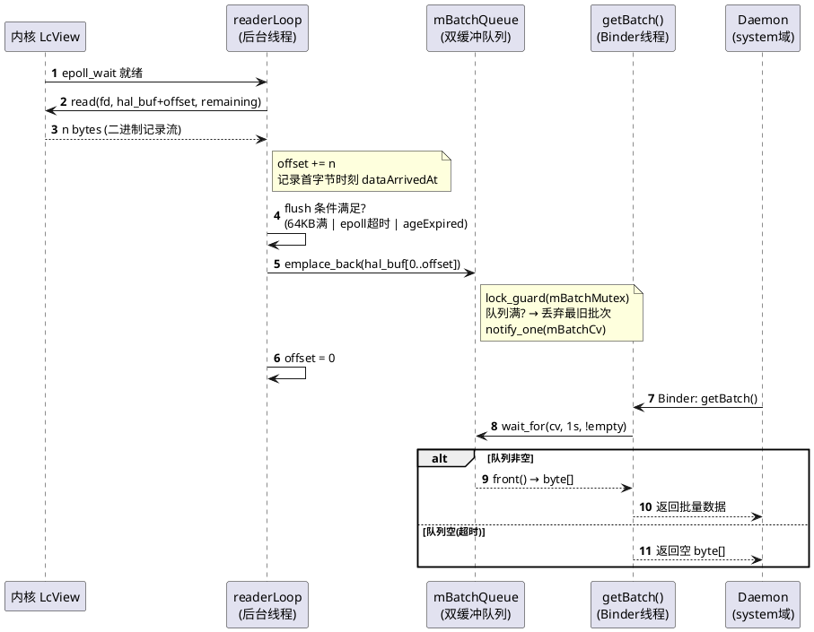

### 异常路径

#### 设备节点未就绪

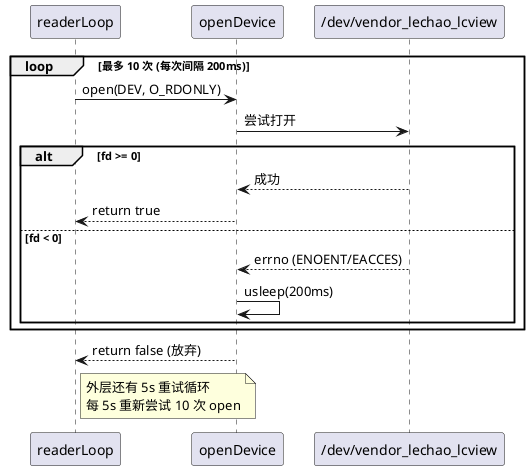

#### 队列满丢弃最旧批次

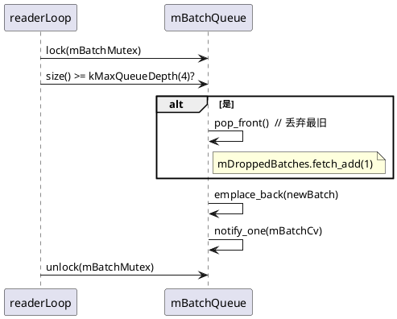

#### ageExpired 强制投递

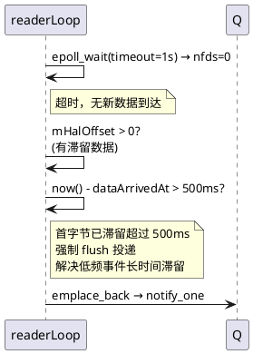

## 逻辑视图

### 模块分解

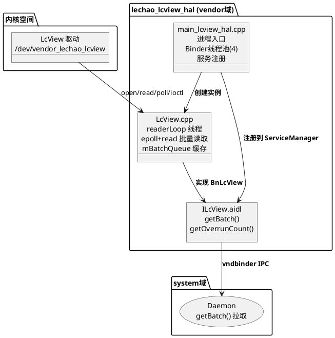

**职责矩阵：**

| 模块 | 职责 | 关键抽象 |
|------|------|---------|
| `main_lcview_hal.cpp` | 进程入口、日志初始化、Binder 线程池、服务注册 | `main()` — [main_lcview_hal.cpp:25](../../code/rpi5/aosp/new/vendor/lechao/services/lechao_lcview/hal/main_lcview_hal.cpp#L25) |
| `LcView.cpp` | epoll 批量读取、双缓冲队列、阻塞式 getBatch | `class LcView` — [LcView.h:29](../../code/rpi5/aosp/new/vendor/lechao/services/lechao_lcview/hal/LcView.h#L29) |
| `ILcView.aidl` | AIDL 接口定义（VINTF 稳定） | `getBatch()` / `getOverrunCount()` |

### AIDL 接口

> 完整定义见 [`../../code/rpi5/aosp/new/vendor/lechao/services/lechao_lcview/vendor/lechao/lcview/ILcView.aidl`](../../code/rpi5/aosp/new/vendor/lechao/services/lechao_lcview/vendor/lechao/lcview/ILcView.aidl)

服务名：`vendor.lechao.lcview.ILcView/default`

```aidl
package vendor.lechao.lcview;

interface ILcView {
    /** 拉取批量数据。有数据立即返回，无数据阻塞最多1s返回空 */
    byte[] getBatch();

    /** 查询溢出计数 */
    int getOverrunCount();
}
```

| 方法 | 返回值 | 说明 |
|------|--------|------|
| `getBatch()` | `byte[]` | Pull 模式：有已缓存 batch 立即返回并清空；无数据阻塞等待最多 1s 后返回空 |
| `getOverrunCount()` | `int` | 返回内核环形缓冲区累计溢出次数，用于监控是否需要扩容 |

> **设计要点：** Pull 模式对比 Push 回调更健壮——daemon 崩溃重启后直接调 `getBatch()` 无需重新注册回调；daemon 处理慢时自然形成背压，数据在 HAL 内部排队；无 DeathRecipient 生命周期管理。

### 通信模型

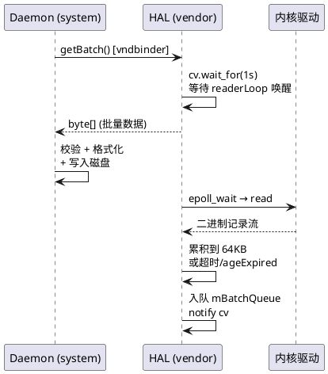

## 过程视图

### 并发模型

HAL 内部采用 **生产者-消费者** 模型：readerLoop 线程生产数据入队，Binder 线程消费数据出队，通过 `std::mutex` + `std::condition_variable` 协调：

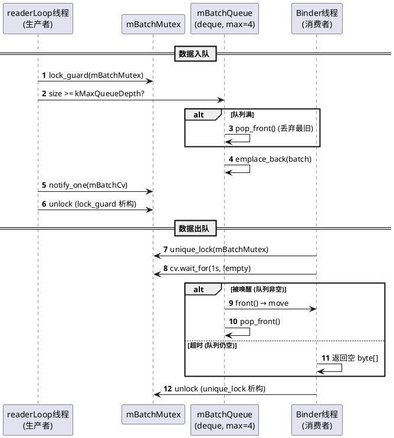

**线程安全：** `mBatchQueue` 由 `mBatchMutex` 保护；`mOverrun` 和 `mDroppedBatches` 使用 `std::atomic` 避免锁竞争；`mHalBuf` / `mHalOffset` 仅在 readerLoop 线程访问，无需同步。

### readerLoop 主循环

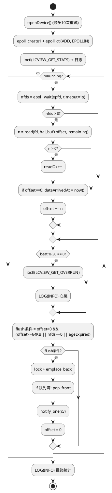

### flush 策略

三条 flush 路径覆盖不同场景：

| 条件 | 触发时机 | 场景 |
|------|---------|------|
| `bufferFull` | `mHalOffset >= 64KB` | 高频事件（USB 批量传输），累积满即投递 |
| `timedOut` | `epoll_wait` 返回 0（1s 超时） | 低频事件间隙，确保不无限滞留 |
| `ageExpired` | 首字节到达后 > 500ms | 低频事件，已有部分数据但未满 64KB，避免长时间等待 |

> `ageExpired` 在 v2.4 引入，解决低频 USB 事件数据在 `mHalBuf` 中长时间滞留（最坏情况等满 64KB 才投递）的问题。

### 异常处理

| 异常 | 处理 |
|------|------|
| 设备节点不存在/无权限 | `openDevice()` 内层 10 次重试（200ms 间隔），外层 5s 循环重试 |
| `read()` 返回错误 | `readErr++`，非 EAGAIN/EINTR 则 break 退出 readerLoop |
| `epoll_wait` EINTR | `continue` 忽略信号中断 |
| 队列满（daemon 未取走） | 丢弃最旧批次，`mDroppedBatches++` |
| Binder 服务注册失败 | `main()` 返回 1，`oneshot` 不重启 |
| Daemon 未及时取走数据 | 双缓冲队列缓存，超限丢弃最旧批次 |

## 开发视图

### 目录结构

```
../../code/rpi5/aosp/new/vendor/lechao/services/lechao_lcview/
├── Android.bp                             # 顶层 Soong 配置
├── include/
│   └── lcview_events.h                    # 共享头文件（事件ID/级别/类型/record结构体）
├── config/
│   ├── Android.bp                         # 配置文件编译规则（prebuilt_etc）
│   └── lcview_events.json                 # Schema 配置文件（运行时 /vendor/etc/lcview_events.json）
├── vendor/
│   └── lechao/lcview/
│       └── ILcView.aidl                   # AIDL 接口定义（源文件）
├── aidl_api/
│   └── vendor.lechao.lcview/current/vendor/lechao/lcview/
│       └── ILcView.aidl                   # AIDL API 冻结快照
├── hal/                                   # vendor 域 HAL 实现
│   ├── LcView.h                           # HAL 类声明
│   ├── LcView.cpp                         # HAL 实现（epoll批量读取 + AIDL服务）
│   ├── main_lcview_hal.cpp                # 进程入口 + 服务注册
│   ├── Android.bp                         # cc_binary 编译配置
│   ├── lechao_lcview_hal.rc               # init 启动脚本
│   └── vendor.lechao.lcview.ILcView-service.xml  # VINTF manifest 声明
└── daemon/                                # system 域 Daemon（详见 01.03）
    └── ...
```

### 文件职责矩阵

| 文件 | 职责 | 关键函数/类 | 行数 |
|------|------|------------|------|
| `ILcView.aidl` | VINTF 稳定 AIDL 接口定义 | `getBatch()` / `getOverrunCount()` | 36 |
| `LcView.h` | HAL 服务类声明，成员变量与常量定义 | `class LcView` | 63 |
| `LcView.cpp` | epoll 批量读取、双缓冲队列、阻塞 getBatch 实现 | `readerLoop()` / `getBatch()` | 246 |
| `main_lcview_hal.cpp` | 进程入口、日志初始化、Binder 线程池、服务注册 | `main()` | 54 |
| `lechao_lcview_hal.rc` | init 启动脚本（oneshot，class hal） | — | 26 |
| `vendor.lechao.lcview.ILcView-service.xml` | VINTF manifest 声明 | — | 30 |
| `Android.bp` (顶层) | AIDL 接口 + 共享头文件库编译配置 | — | 35 |
| `Android.bp` (hal/) | HAL cc_binary + VINTF prebuilt_etc | — | 49 |

### 头文件依赖图

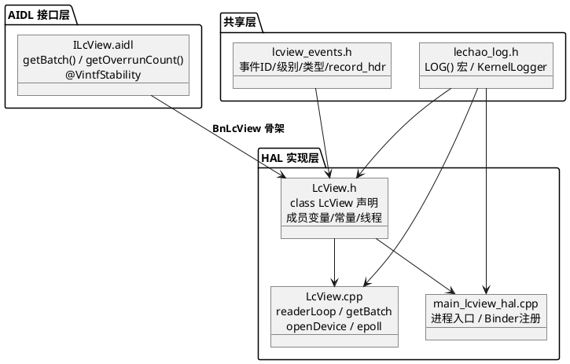

### 构建集成

#### Soong 配置

> 完整定义：[`Android.bp` (顶层)](../../code/rpi5/aosp/new/vendor/lechao/services/lechao_lcview/Android.bp)，[`Android.bp` (hal/)](../../code/rpi5/aosp/new/vendor/lechao/services/lechao_lcview/hal/Android.bp)

| 模块 | 类型 | 说明 |
|------|------|------|
| `vendor.lechao.lcview` | `aidl_interface` | VINTF 稳定 AIDL 接口，NDK 后端 |
| `vendor.lechao.lcview_headers` | `cc_library_headers` | 共享头文件（lcview_events.h） |
| `lechao_lcview_hal` | `cc_binary` | HAL 进程二进制，`vendor: true` |
| `vendor.lechao.lcview.ILcView-vintf` | `prebuilt_etc` | VINTF manifest，安装到 `/vendor/etc/vintf/manifest/` |

#### device tree 集成（必须）

> **lcview 的两个 `cc_binary` 必须显式加入 `PRODUCT_PACKAGES`**，否则不会被打包进镜像。

**`device/<vendor>/<device>/device.mk`：**

```makefile
# lechao lcview service
PRODUCT_PACKAGES += \
    lechao_lcview \
    lechao_lcview_hal \
    vendor.lechao.lcview-service
```

**`BoardConfig.mk`：**

```makefile
# SELinux 开发模式（允许自定义策略编译通过）
SELINUX_IGNORE_NEVERALLOWS := true

# 内核 cmdline：修正 ttyAMA10→ttyAMA0，关闭验证启动
BOARD_KERNEL_CMDLINE := console=ttyAMA0,115200 no_console_suspend \
    root=/dev/ram0 rootwait androidboot.hardware=rpi5 \
    androidboot.verifiedbootstate=orange

# 禁用 dm-verity（开发调试需要）
BOARD_BUILD_DISABLED_VBMETAIMAGE := true
```

| 选项 | 说明 |
|------|------|
| `SELINUX_IGNORE_NEVERALLOWS` | 允许自定义 SELinux 策略通过编译 |
| `androidboot.verifiedbootstate=orange` | 标记设备为 unlocked，允许未签名模块运行 |
| `BOARD_BUILD_DISABLED_VBMETAIMAGE` | 跳过 vbmeta 签名 |

**`aosp_rpi5.mk`：**

```makefile
# Bypass VINTF kernel requirement check for self-compiled kernel
PRODUCT_OTA_ENFORCE_VINTF_KERNEL_REQUIREMENTS := false
```

#### 编译与部署

```bash
cd /home/lechao/workspace/aosp
source build/envsetup.sh && lunch aosp_rpi5-bp1a-userdebug
m lechao_lcview_hal       # 编译 HAL

# 验证部署
adb shell ls -l /vendor/bin/lechao_lcview_hal
adb reboot

# 验证 HAL 服务
adb shell service list | grep vendor.lechao.lcview
# 期望：vendor.lechao.lcview.ILcView: [vendor.lechao.lcview.ILcView/default]
```

## 物理视图

### 运行时拓扑

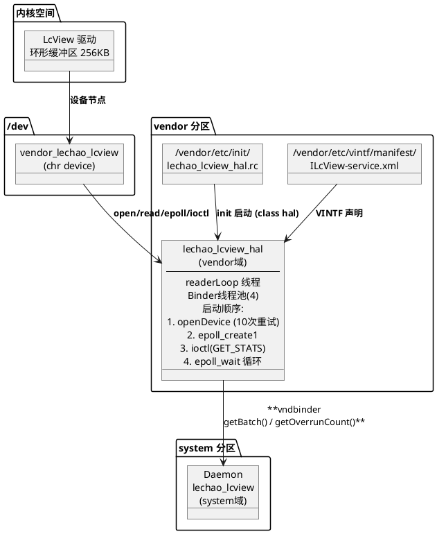

### init 启动配置

```bash
# lechao_lcview_hal.rc
service lechao_lcview_hal /vendor/bin/lechao_lcview_hal
    class hal
    user system
    group system
    interface aidl vendor.lechao.lcview.ILcView/default
    oneshot
```

| 配置项 | 值 | 说明 |
|--------|-----|------|
| `class` | `hal` | 随 hal 类启动 |
| `user/group` | `system` | 以 system 身份运行 |
| `interface` | `vendor.lechao.lcview.ILcView/default` | Treble 架构要求的 AIDL 声明 |
| `oneshot` | — | 退出后不重启（设备未就绪时避免重启循环） |

### SELinux 策略

> 完整定义：[`lechao_lcview_hal.te`](../../code/rpi5/aosp/new/device/brcm/rpi5/sepolicy/lechao_lcview_hal.te)

```te
type lechao_lcview_hal, domain;
type lechao_lcview_hal_exec, exec_type, vendor_file_type, file_type;
type lechao_lcview_hal_device, dev_type, file_type;
type lechao_lcview_hal_service, service_manager_type;

init_daemon_domain(lechao_lcview_hal)
vndbinder_use(lechao_lcview_hal)
binder_call(lechao_lcview_hal, servicemanager)

allow lechao_lcview_hal lechao_lcview_hal_device:chr_file { open read write ioctl getattr };
allow lechao_lcview_hal lechao_lcview_hal_service:service_manager add;
allow lechao_lcview_hal device:dir { search read };
allow lechao_lcview_hal logd:unix_dgram_socket write;
```

**关联标签配置：**

| 文件 | 规则 |
|------|------|
| `file_contexts` | `/vendor/bin/lechao_lcview_hal → lechao_lcview_hal_exec` |
| `file_contexts` | `/dev/vendor_lechao_lcview → lechao_lcview_hal_device` |
| `service_contexts` | `vendor.lechao.lcview.ILcView → lechao_lcview_hal_service` |
| `service_contexts` | `vendor.lechao.lcview.ILcView/default → lechao_lcview_hal_service` |

> **注意：** `service_contexts` 两条规则都需要，`selabel_lookup` 会匹配含 `/default` 后缀的完整服务名。

## 关键设计与实现

本章节从架构与源码两个维度，提炼 HAL 中关键设计决策及其实现细节。

### Pull 模式 — 无回调生命周期管理

**设计思路：** daemon 通过 `getBatch()` 主动拉取数据，而非 HAL push 回调。daemon 崩溃重启后直接调 `getBatch()` 无需重新注册回调，无 DeathRecipient 生命周期管理。daemon 处理慢时自然形成背压，数据在 HAL 队列中排队。

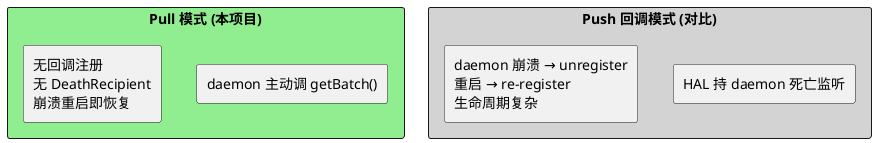

**源码实现：**

`getBatch()` 使用 `condition_variable::wait_for` 阻塞等待数据，readerLoop 产出数据时 `notify_one` 唤醒：

```c
// LcView.cpp:221
ndk::ScopedAStatus LcView::getBatch(std::vector<uint8_t>* _aidl_return)
{
    std::unique_lock<std::mutex> lock(mBatchMutex);
    mBatchCv.wait_for(lock, std::chrono::seconds(1),
                      [this]{ return !mBatchQueue.empty(); });
    if (!mBatchQueue.empty()) {
        *_aidl_return = std::move(mBatchQueue.front());
        mBatchQueue.pop_front();
    } else {
        _aidl_return->clear();  // 超时返回空
    }
    return ndk::ScopedAStatus::ok();
}
```

### 双缓冲队列 — 背压缓存

**设计思路：** 单 `mBatch` 在 daemon 未取走时直接丢弃新数据。双端队列 `mBatchQueue`（最多 4 批次）缓存多批数据，队列满时丢弃最旧批次而非阻塞 readerLoop。

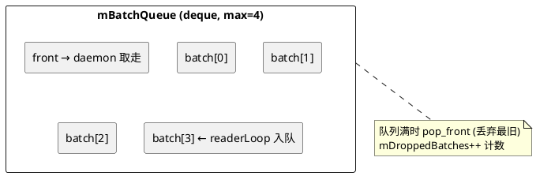

**源码实现：**

```c
// LcView.cpp:198
std::lock_guard<std::mutex> lock(mBatchMutex);
if (mBatchQueue.size() >= kMaxQueueDepth) {
    mBatchQueue.pop_front();                    // 丢弃最旧批次
    mDroppedBatches.fetch_add(1, std::memory_order_relaxed);
}
mBatchQueue.emplace_back(mHalBuf, mHalBuf + mHalOffset);
mBatchCv.notify_one();
```

### 阻塞式 getBatch — 消除无效轮询

**设计思路：** v3.4 将 `getBatch()` 从"立即返回空"改为阻塞等待（`condition_variable::wait_for 1s`）。数据到达时由 readerLoop 通过 `notify_one()` 唤醒，消除 daemon 端每 100ms 无效 Binder 轮询调用。

**源码实现：**

readerLoop 入队后唤醒等待的 Binder 线程：

```c
// LcView.cpp:211
mBatchCv.notify_one();   // 唤醒 getBatch 中 wait_for 的 Binder 线程
```

`getBatch()` 中 `wait_for` 的谓词为 `!mBatchQueue.empty()`，被唤醒后检查谓词：队列非空则取数据，超时则返回空。daemon 主循环紧循环调用 `getBatch()` 即可，内部阻塞机制保证 CPU 零开销等待。

### ageExpired 投递 — 低频事件消除滞留

**设计思路：** 低频事件（如 USB disconnect）首字节到达后，可能长时间凑不满 64KB。`ageExpired` 条件在首字节滞留超过 500ms 时强制 flush，确保低频事件及时投递。

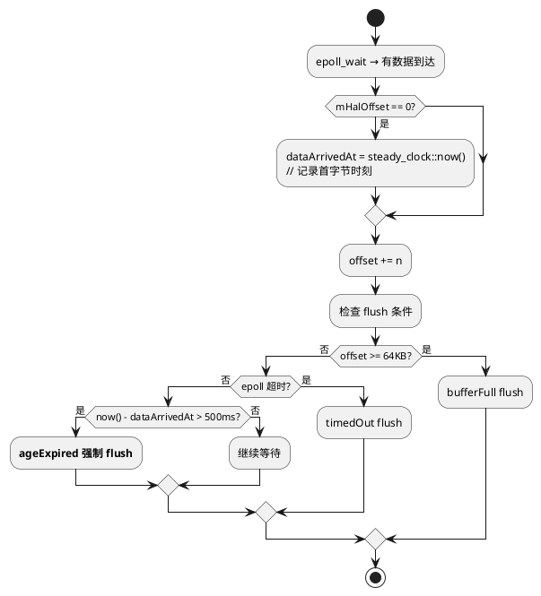

**源码实现：**

```c
// LcView.cpp:134
static constexpr auto kMaxBufferAge = milliseconds(500);
auto dataArrivedAt = steady_clock::time_point::max();

// 首字节到达时记录时刻 (LcView.cpp:169)
if (mHalOffset == 0)
    dataArrivedAt = steady_clock::now();

// flush 条件检查 (LcView.cpp:194)
bool ageExpired = (mHalOffset > 0 &&
                   steady_clock::now() - dataArrivedAt > kMaxBufferAge);
```

### 设备打开重试 — 启动顺序解耦

**设计思路：** HAL 进程可能在内核设备节点创建之前启动。双层重试机制：内层 10 次快速重试（200ms 间隔），外层 5s 慢速循环，容忍启动顺序差异。

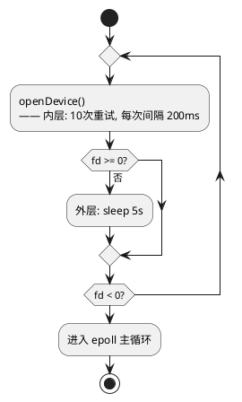

**源码实现：**

```c
// LcView.cpp:61 — 内层 10 次快速重试
bool LcView::openDevice()
{
    for (int i = 0; i < OPEN_RETRY_MAX; i++) {
        mDevFd = open("/dev/vendor_lechao_lcview", O_RDONLY);
        if (mDevFd >= 0) return true;
        usleep(OPEN_RETRY_DELAY_MS * 1000);  // 200ms
    }
    return false;
}

// LcView.cpp:92 — 外层 5s 慢速循环
static constexpr int kDevRetryIntervalSec = 5;
while (mRunning && !openDevice()) {
    for (int i = 0; i < kDevRetryIntervalSec * 10 && mRunning; i++)
        std::this_thread::sleep_for(std::chrono::milliseconds(100));
}
```

### ioctl 降频 — 减少 syscall 开销

**设计思路：** overrun 计数查询从每轮 epoll 循环降频到每 30 次心跳一次，减少 ioctl syscall 开销。心跳日志同步输出诊断计数器（readOk/readErr/flush）。

**源码实现：**

```c
// LcView.cpp:184 — 每 30 次循环查询一次
if (beat % 30 == 0) {
    uint32_t overrun;
    if (ioctl(mDevFd, LCVIEW_GET_OVERRUN, &overrun) == 0)
        mOverrun.fetch_add((int32_t)overrun, std::memory_order_relaxed);
}

// LcView.cpp:149 — 同步输出心跳
if (beat % 30 == 0) {
    LOG(INFO) << "LcView: alive beat=" << beat << " buffered=" << mHalOffset
              << "B overrun=" << mOverrun.load()
              << " readOk=" << readOk << " readEmpty=" << readEmpty
              << " readErr=" << readErr << " flush=" << flushCount;
}
```

### HAL 不解析 — 职责单一

**设计思路：** HAL 只负责搬运二进制数据，不解析记录格式。JSON schema 解析、字段校验、格式化输出由 daemon 完成。HAL 不依赖 `libjsoncpp`，编译产物更轻量。

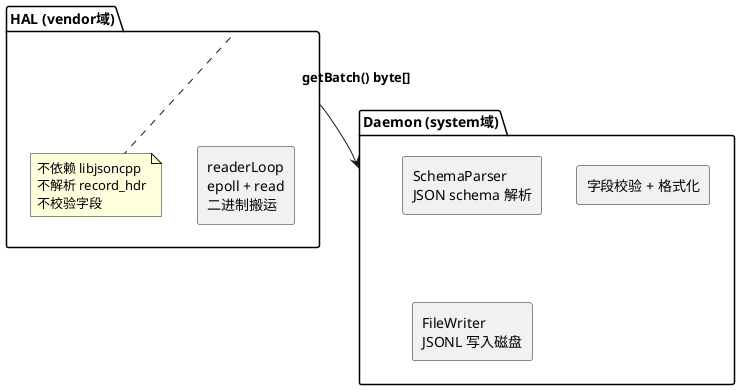

## 接口参考

### AIDL 接口

| 方法 | 参数 | 返回值 | 说明 |
|------|------|--------|------|
| `getBatch()` | 无 | `byte[]` | 阻塞等待数据（最多 1s），返回批量二进制记录 |
| `getOverrunCount()` | 无 | `int32_t` | 返回内核环形缓冲区累计溢出次数 |

> 完整定义：[`ILcView.aidl`](../../code/rpi5/aosp/new/vendor/lechao/services/lechao_lcview/vendor/lechao/lcview/ILcView.aidl)

### 内核 ioctl 命令

HAL 通过以下 ioctl 与内核交互：

| 命令 | 方向 | 用途 | 调用频率 |
|------|------|------|---------|
| `LCVIEW_GET_STATS` | 内核→HAL | 启动时查询 ring 初始统计（total_records/usage/overrun） | 1 次（启动） |
| `LCVIEW_GET_OVERRUN` | 内核→HAL | 查询溢出计数（读后清零） | 每 30 次循环 |

### 运行时配置常量

| 常量 | 值 | 定义位置 | 说明 |
|------|-----|---------|------|
| `kHalBufSize` | 64KB | `LcView.h:45` | HAL 内部累积缓冲区 |
| `kEpollTimeoutMs` | 1000ms | `LcView.h:46` | epoll 超时，保证低频数据最多 1s 延迟 |
| `kMaxBufferAge` | 500ms | `LcView.cpp:134` | 首字节到达后最多等待 500ms 即强制投递 |
| `kMaxQueueDepth` | 4 | `LcView.h:47` | 双缓冲队列最大深度，超过丢弃最旧批次 |
| `OPEN_RETRY_MAX` | 10 | `LcView.cpp:59` | 内层 open 重试次数 |
| `OPEN_RETRY_DELAY_MS` | 200ms | `LcView.cpp:60` | 内层重试间隔 |
| `kDevRetryIntervalSec` | 5s | `LcView.cpp:92` | 外层重试间隔 |
| Binder 线程池 | 4 | `main_lcview_hal.cpp:33` | 单 daemon 调用者，4 线程足够 |

## 版本历史

| 版本 | 日期 | 变更内容 |
|------|------|----------|
| **v2.1** | **2026-06-05** | `lechao_lcview.rc` 新增 `mkdir /data/vendor/lechao_lcview 0755 system system` 指令和 `on property:sys.boot_completed=1 start lechao_lcview` 显式启动触发；HAL te 添加 `vndbinder_use` 宏，确保 AIDL vendor. 前缀服务通过 `/dev/vndbinder` 正确路由到 vndservicemanager |
| **v2.2** | **2026-06-05** | `main_lcview_hal.cpp` 加 `android::base::InitLogging(argv)` 确保 HAL 日志正常工作；`service_contexts` 补全 `/default` 后缀规则，确保 `selabel_lookup` 匹配成功；文档新增 device tree 集成章节 |
| **v2.3** | **2026-06-06** | **性能优化**：(1) HAL 阻塞式 getBatch：`getBatch()` 从"立即返回空"改为通过 `std::condition_variable` 阻塞等待数据（最多 1s）；(2) 双缓冲队列：HAL 内部单 `mBatch` 替换为 `std::deque<std::vector<uint8_t>>` 双端队列（最多 4 批次）；(3) overrun ioctl 降频：从每轮循环查询改为每 30 次心跳输出时查询一次 |
| **v2.4** | **2026-06-07** | **HAL 日志统一改造 + ageExpired 投递条件**：(1) 日志体系统一为 `<android-base/logging.h>` `LOG()` 体系，移除 ALOG* 宏混用；(2) `SetDefaultTag("lechao_lcview_hal")` + `KernelLogger`，日志 tag 固定且双写 logd + dmesg；(3) readerLoop 诊断增强：`readOk/readEmpty/readErr/flushCount` 计数器 + `LCVIEW_GET_STATS` 启动查询 + 退出最终统计；(4) ageExpired 500ms 强制投递条件，解决低频 USB 事件数据滞留；(5) flush DEBUG 日志 |
| **v3.6** | **2026-06-27** | **P0 检视修复（故障可见化 + AIDL 冻结 + sepolicy 收紧）**：(1) **S6** `Android.bp` 加 `versions: ["1"]`，生成 `aidl_api/.../1/` 冻结快照，AIDL 接口正式冻结；(2) **S7** readerLoop 故障可见化：新增 `mReaderAlive` 标志，致命错误（epoll/read 失败、设备 5 分钟未就绪）`exit(1)` 让 init 重启；`openDevice` 加 `kMaxDeviceWaitSec=300` 总时长上限；readerLoop 退出前 `closeDevice()` + `notify_all()`；`getBatch` 检测 reader 死亡时打 ERROR；`lechao_lcview_hal.rc` 移除 `oneshot`；(3) **M-D1** `ILcView.aidl` getBatch 注释明确"返回值为完整 record 整数倍"边界不变量；(4) **M-H1** `getBatch` 心跳计数改 `std::atomic<int>` 消除多 Binder 线程竞态；(5) **S10** sepolicy 注释"显示"→"日志/事件打点"，`lechao_lcview_hal.te` 设备节点权限收紧为 `{ open read ioctl getattr }` 移除 `write`，`lechao_lcview.te` 用 `binder_call` 宏替代裸 allow |
| **v3.7** | **2026-06-27** | **测试防护体系建立**：(1) **可测性改造**：抽出 `DeviceReader` 接口，`readerLoop` 面向接口编程，支持 gmock 注入模拟 epoll/read 故障（S7 测试化）；(2) `hal/Android.bp` 新增 `lechao_lcview_hal_sources` filegroup 供测试引用；(3) 单元测试 `LcView_test.cpp` 覆盖 readerLoop 6 条分支路径（open 重试、超限 exit、致命 read、正常 flush、队列满丢弃、正常退出） |
