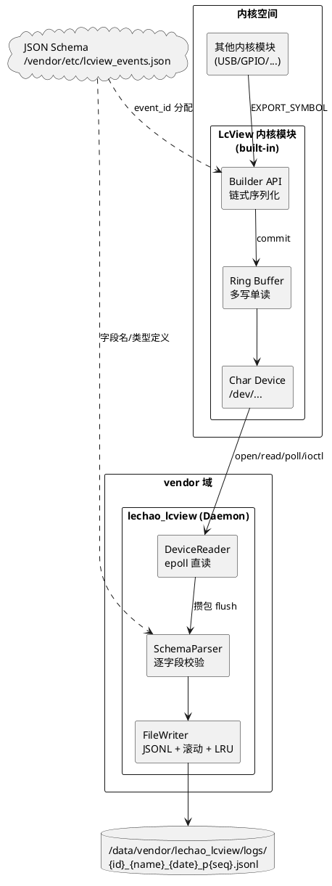
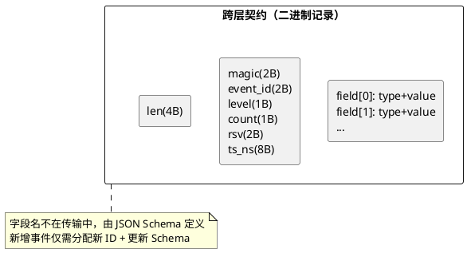
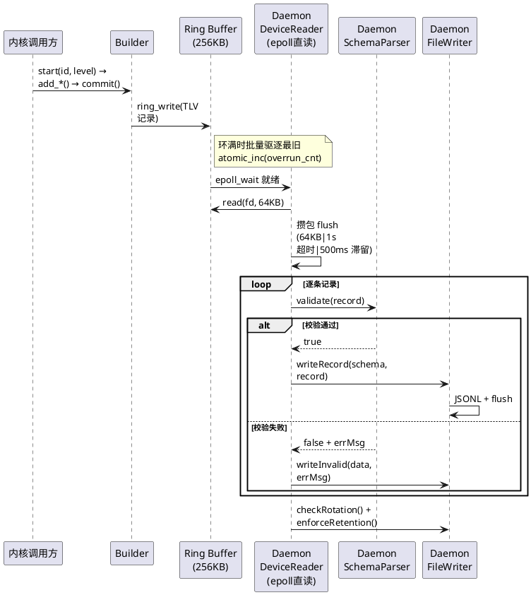
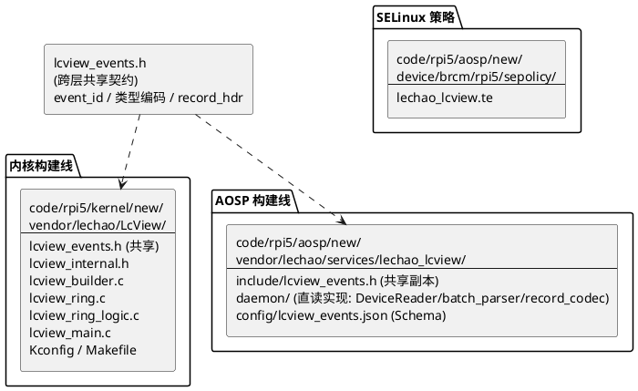
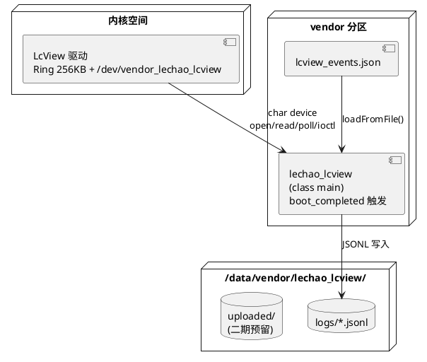
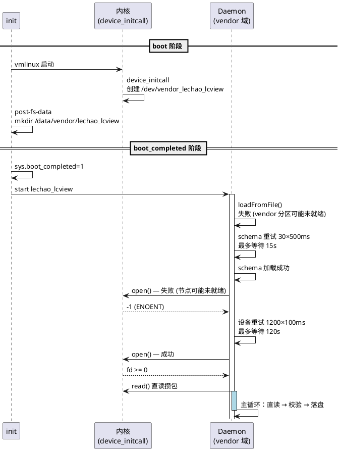

# LcView 日志打点系统

基于 Schema ID 的结构化日志打点框架，替代传统 `printk` 字符串日志，实现带宽友好、类型安全、可查询的结构化采集。覆盖内核态 Builder API 打点、环形缓冲区传输、用户态 Daemon 直读采集（epoll 攒包）、校验落盘全链路。

## 文档索引

| 编号 | 名称 | 层级 | 说明 |
|------|------|------|------|
| 01.01 | [内核态增强](./01.01-内核态增强-lcview-kernel.md) | 内核态 | Builder API + 环形缓冲区 + 字符设备 + ioctl |
| 01.02 | [Daemon 增强](./01.02-Daemon增强-lcview-daemon.md) | 用户态 (vendor) | Schema 校验 + JSONL 分文件落盘 + 文件滚动 |

> **阅读建议**：先读本 README 建立全局视角，再按层级深入子文档。每个子文档均采用 4+1 视图（用例/逻辑/过程/开发/部署）组织。

## 逻辑视图

### 组件分解

三层架构，每层单一职责，通过明确的契约解耦：

### 跨层契约

三层共享的 **Schema ID + TLV 二进制格式** 是唯一的跨层契约，也是整个系统的核心抽象：

- **内核层**只传 `event_id`（2B）+ 字段值（TLV 编码），不传字段名
- **Daemon 直读层**直接 open/epoll 读取内核字符设备，攒批后逐条校验
- **Daemon 层**用 JSON Schema 将 `event_id` 映射回字段名，逐字段校验后输出

> 二进制格式的完整字段编码表、类型定义、源码结构体详见各子文档的"逻辑视图"章节。

### 设计原则

| 原则 | 说明 |
|------|------|
| Schema ID 驱动 | 传输只传 ID + 值，字段名由 JSON Schema 定义，带宽友好 |
| 直读模式 | Daemon 直读内核字符设备，无 Binder 生命周期、无回调管理 |
| 按事件 ID 分文件 | 不同 `event_id` 写入独立 JSONL 文件，云端一对一建表 |
| 各层独立重试 | 启动顺序差异由重试机制吸收，不依赖严苛的启动先后 |
| Daemon 单一解析 | 校验职责集中在 Daemon 一处 |

## 过程视图

### 端到端数据流

### 关键指标

| 指标 | 设计值 | 保障机制 |
|------|--------|---------|
| 单条记录传输开销 | ~50B（4 字段）vs ~80B printk | Schema ID 驱动，不传字段名 |
| 高频场景延迟 | 毫秒级 | Daemon 64KB 攒包满即 flush |
| 低频场景延迟上限 | ≤ 1s | epoll 超时 + ageExpired 500ms 强制投递 |
| 数据完整性 | 每条逐字段校验 | Daemon SchemaParser 防御内核数据损坏 |
| 崩溃恢复 | 无状态恢复 | 重启后重新 open 设备节点续读 |
| 磁盘占用 | ≤ 500MB | LRU 淘汰最旧文件 + 50MB 单文件滚动 |
| 背压 | 溢出驱逐 | 内核环形缓冲溢出驱逐（overrun 计数），daemon 读空即等 |

> 并发模型（spinlock / condition_variable / 单线程）、上下文安全（GFP_ATOMIC / read_buf 中转）、重试策略等实现细节详见各子文档的"过程视图"章节。

## 开发视图

### 源码组织

两条独立的构建线，通过共享头文件 `lcview_events.h` 保持 event_id / 类型编码 / 记录头布局一致：

### 构建集成

| 构建线 | 构建系统 | 产物 |
|--------|---------|------|
| 内核模块 | Kconfig + Makefile (`CONFIG_LCVIEW=y`) | built-in 到 vmlinux，`device_initcall` 启动 |
| Daemon 进程 | Soong `cc_binary` (`vendor: true`) | `/vendor/bin/lechao_lcview` |
| Schema 配置 | Soong `prebuilt_etc` | `/vendor/etc/lcview_events.json` |

> Kconfig/Makefile 详情、Android.bp 配置、device.mk `PRODUCT_PACKAGES` 清单详见各子文档的"开发视图"章节。

## 部署视图

### 运行时拓扑

### 安全域隔离

两个 SELinux 域，一次跨域通信，权限最小化：

| 域 | 运行身份 | 核心权限 | 不需要的权限 |
|---|---|---|---|
| 内核空间 | kernel | — | — |
| `lechao_lcview` (vendor 域) | `system:system` | 读字符设备 + 读写数据目录 + 写 logd | 不注册任何 binder 服务 |

**跨域通信**：
1. **内核 → Daemon**：字符设备 `/dev/vendor_lechao_lcview`（`lechao_lcview_device` 类型）

> 各域的完整 `.te` 策略、`file_contexts`、`service_contexts` 规则详见各子文档的"部署视图"章节。

### 启动顺序

各层通过独立重试机制解耦启动顺序依赖，不要求严格的先后关系：

## 跨层设计决策

以下决策需要三层协同才能理解其完整含义，此处仅给出结论。实现细节在对应子文档中展开。

| 决策 | 架构动机 | 详细展开 |
|------|---------|---------|
| **Schema ID 驱动** | 传输体积最小化（~50B vs ~80B printk），新增事件仅改 Schema | [01.01](./01.01-内核态增强-lcview-kernel.md) §关键设计 · [01.02](./01.02-Daemon增强-lcview-daemon.md) §逻辑视图 |
| **直读模式** | 无回调、无 Binder 生命周期、无 DeathRecipient、崩溃重启即恢复 | [01.01](./01.01-内核态增强-lcview-kernel.md) §关键设计 · [01.02](./01.02-Daemon增强-lcview-daemon.md) §关键设计 |
| **攒包批量** | Daemon 64KB 攒包 + 1s epoll 超时 + 500ms 滞留窗，减少 syscall 频率 | [01.02](./01.02-Daemon增强-lcview-daemon.md) §过程视图 |
| **各层独立重试** | 启动顺序解耦：内核节点延迟创建、vendor 分区延迟挂载均可容忍 | [01.02](./01.02-Daemon增强-lcview-daemon.md) §关键设计 |
| **校验集中 Daemon** | 校验集中在 Daemon 一处 | [01.02](./01.02-Daemon增强-lcview-daemon.md) §关键设计 |
| **立即 flush** | 每条记录写后即 flush，防崩溃丢数据，牺牲少量性能换可靠性 | [01.02](./01.02-Daemon增强-lcview-daemon.md) §关键设计 |

## 相关资源

- **内核源码**：[`code/rpi5/kernel/new/vendor/lechao/LcView/`](../../code/rpi5/kernel/new/vendor/lechao/LcView/) — Builder API + 环形缓冲区 + 字符设备
- **用户态源码**：[`code/rpi5/aosp/new/vendor/lechao/services/lechao_lcview/`](../../code/rpi5/aosp/new/vendor/lechao/services/lechao_lcview/) — Daemon（直读）+ Schema 配置
- **SELinux 策略**：[`code/rpi5/aosp/new/device/brcm/rpi5/sepolicy/`](../../code/rpi5/aosp/new/device/brcm/rpi5/sepolicy/) — `lechao_lcview.te`
- **上传器 Spec**：二期独立进程 `lcview_uploader` 设计（待补充）
- **开发效率工具**：[`../development-tools.md`](../development-tools.md) — VS Code / OpenGrok 源码阅读环境搭建（人类开发者向）
