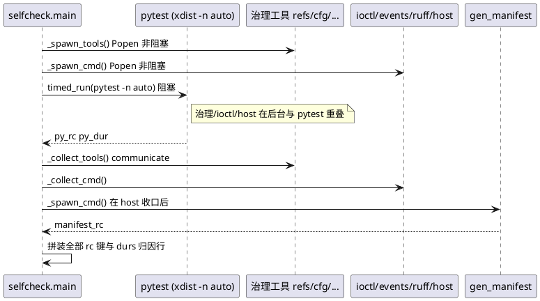

# 自检并行编排：两阶段 spawn/collect + pytest 重叠 + 耗时归因

> 证据：`harness/lib/selfcheck.py`（`-s` 批次自检）。
> 关联规则：`CDP-DOD-001`（检查器门禁三要件）、`HPY-003`（守卫须有红灯用例）。

## 目标

`-s` 自检要在一次运行里采集 `pytest` 与十余个独立检查器（refs/config/
contract/ioctl/manifest/discipline/scan/quotepath/known_issues/
commit_coverage/lcview_events/ruff/host）的退出码，并保证：

1. **总墙钟 ≈ 最慢的单个检查器**，而非各检查器耗时之和；
2. **任一检查器 rc 非零可归因**（是谁、多久、结论行）；
3. 挂死可兜住（超时 kill，不拖垮自检链）。

## 关键设计一：两阶段 spawn/collect

工具启动与结果收口被拆成两个显式阶段，中间的空档用来跑别的活：

- **spawn 阶段**：`_spawn_cmd`（`selfcheck.py:157`）只做
  `subprocess.Popen` 立即返回，不阻塞；`_spawn_tools`
  （`selfcheck.py:267`）批量 spawn refs/cfg/discipline/scan/quotepath/
  known_issues/commit_coverage。
- **collect 阶段**：`_collect_cmd`（`selfcheck.py:198`）才
  `communicate` + 等退出码；`_collect_tools`（`selfcheck.py:294`）逐个收口
  并把各自的 rc 与结论行打包成统一 `tools` dict。

两阶段拆分的意义在于：spawn 与 collect 之间可以插入**任意耗时的独立工作**，
进程在后台与这段工作重叠执行。`run_parallel_tools`（`selfcheck.py:340`）
只是两阶段的即时组合（供测试/兼容），真正的编排在 `main`。

## 关键设计二：与 pytest 重叠

`main`（`selfcheck.py:851`）先 Popen 全部治理工具与 ioctl/events/ruff/host，
**再**用 `timed_run` 跑 pytest（`selfcheck.py:865`），pytest 结束后才开始收口
治理工具：

- 治理工具的墙钟因此取 **max 而非 sum**（注释见 `selfcheck.py:343`）。
- pytest 并行依赖 `pytest-xdist`（`-n auto` 按核数分流），缺失时自动回落串行
  （`selfcheck.py:847`；环境准备见 `harness/README.md`）。

## 关键设计三：逐检查器耗时归因

只报「自检总耗时」无法定位慢点。本实现把每个工具的**真实运行时长**透出：

- `timed_run`（`selfcheck.py:127`）对串行工具记真实墙钟。
- 并行工具在 `_spawn_cmd` 记录 `_spawn_t0`（`selfcheck.py:181`），并由一个
  daemon wait 线程在进程退出时记录 `_exit_t0`（`selfcheck.py:183`）——
  `collect` 发生在 pytest 之后，若直接取「收口时刻减 spawn」，所有并行工具的
  dur 会恒等于 pytest 总时长，失去归因意义；取「退出时刻减 spawn」才反映工具
  自身耗时。
- 最终输出 `durs:` 行（`selfcheck.py:1027`）逐项列出各检查器耗时；
  `pytest` 另经 `--durations` 段提取最慢 5 用例（`durations_summary`，
  `selfcheck.py:83`）。durs 前缀 `*_dur` 不匹配 ws_report 的 `*_rc` 判红正则，
  不干扰判定。

## 配套硬化（易踩的坑）

- **大输出工具改临时文件重定向**（`selfcheck.py:154`）：`check_host_tests.py`
  的 `make` 编译诊断输出可能超过 64KB 管道缓冲，而 pytest 并行窗口内无人排空
  PIPE，会让子进程写阻塞。这类工具在 `_spawn_cmd` 改重定向到临时文件，收口后
  读取（`selfcheck.py:162`）。
- **超时兜死**：治理工具默认 120s（`selfcheck.py:138`）、pytest 900s
  （`selfcheck.py:140`）、host 按最坏 `make test` 估算
  （`selfcheck.py:147`），超时 kill 返约定 `rc=124`。
- **manifest 延后到 host 收口之后**（`selfcheck.py:875`）：host 单测编译产生
  无扩展名二进制，会短暂出现在工作树；若 `gen_manifest --check-only` 与 host
  并发扫描 `git ls-files`，会把编译产物误判为「未登记 patch」（KIR-002 当批
  修）。故 manifest 在 host 收口后单独校验，换取 `manifest_rc` 确定性。

## 结果如何进入判红链

`selfcheck` 只如实采集，退出码恒 0；真正的判红在 `ws_report`——全部 `*_rc`
键须进入 `REQUIRED_RC_KEYS`（`selfcheck.py:68`）必查集合，任一缺失或非零即
拒写收据（`CDP-DOD-001` 的「结果接入判红链」）。

## 可复用清单

- 多个独立检查器编排 **MUST** 用「先全部 spawn、后统一 collect」两阶段，
  中间插入最耗时的那一路（通常是测试套件）。
- 并行工具耗时 **MUST** 取「进程退出时刻 − spawn 时刻」，不得取收口时刻。
- 大输出子进程 **MUST NOT** 在无人排空的窗口使用 `PIPE`，改临时文件重定向。
- 新增检查器 **MUST** 同步登记进 `REQUIRED_RC_KEYS`，并配「破坏即判红」用例。
