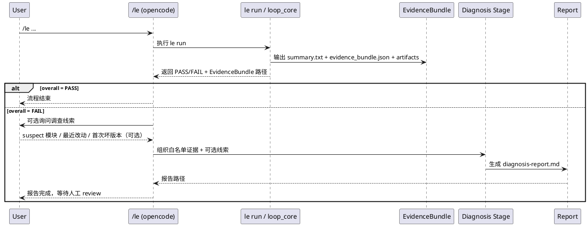

# `/le` 第 4-5 步：zygote 症状诊断与候选补丁草案设计

> **日期**：2026-06-20
> **状态**：待用户审阅
> **范围**：在现有 Loop Engineering v2 与 live reboot 诊断能力之上，补齐 `/le` 工作流后半段：`le run` 失败后自动进入证据分析，围绕“reboot 后 zygote 未正常起来”这一首版目标症状，生成结构化 `diagnosis-report.md` 与指向 `~/workspace/` 的候选补丁草案。**不含**自动 apply、自动编译部署、自动多轮循环。
> **前序**：基于 `docs/specs/2026-06-19-loop-engineering-v2-design.md` 与 `docs/specs/2026-06-20-live-reboot-diagnosis-loop-design.md`，以及当前已落地实现。

---

## 1. 背景

### 1.1 当前已具备的能力

Loop Engineering 现已完成“执行用例 → 输出 EvidenceBundle”主链：

- `le run` 执行 suite，输出 `evidence_bundle.json` 与 `summary.txt`
- `action: reboot` 已支持跨重启等待与 boot marker 判定
- `serial_context`、`serial_recent`、`init_log`、`crash_dump`、`kmsg` 已可作为 boot 诊断证据
- `/le` slash command 已将 `engineering/loop/WORKFLOW.md` 作为工作流契约入口

相关实现与契约见：

- `engineering/loop/core/python/loop_core/cli.py`
- `engineering/loop/core/python/loop_core/executor.py`
- `engineering/loop/core/python/loop_core/runner.py`
- `engineering/loop/cases/system/boot-success.yaml`
- `engineering/loop/cases/common/shell.yaml`
- `.opencode/commands/le.md`
- `engineering/loop/WORKFLOW.md`

### 1.2 当前缺口

当前缺口集中在 `WORKFLOW.md` 第 4-5 步，而不在执行内核：

1. **失败后缺少统一诊断入口**：`le run` 返回 FAIL 后，没有固定的 `/le` 后半段去读取 EvidenceBundle 并生成诊断报告。
2. **报告契约过于单根因化**：现有 `engineering/harness/templates/diagnosis-report-template.md` 使用“根因假设 / 根因分析”表述，不适合 zygote 启动失败这类常见多因子系统问题。
3. **缺少用户线索输入机制**：实际现场中，用户常掌握“最近改过哪个模块 / 从哪个版本开始坏 / 哪个问题单触发”这类高价值线索，但当前体系没有显式容纳它们的位置。
4. **`trigger_reboot` 早期失败证据覆盖不足**：当前 `boot-success.yaml` 中 `trigger_reboot` 没有 `on_fail.collectors`，一旦 reboot 失败，`zygote_running` 等下游 case 会被 skip，导致 zygote 专项 collector 不一定有机会执行。
5. **第 5 步语义过强**：`WORKFLOW.md` 直接写“AI 修改 workspace 代码”，但首版更合理的目标应是“生成候选补丁草案，人工 review 后实施”，否则风险过高。

### 1.3 本次设计范围

本次设计只补齐 `/le` 的第 4-5 步首版闭环：

- `le run` FAIL 后自动进入诊断阶段
- 首版以“reboot 后 zygote 未正常进入稳定 running 状态”为目标症状
- 生成 `engineering/output/runs/<run-id>/diagnosis-report.md`
- 报告中内嵌指向 `~/workspace/` 的候选补丁草案
- 用户可在诊断前提供可选“调查线索”帮助收敛

---

## 2. 目标

1. **补齐 `/le` 后半段**：`/le` 在 `le run` FAIL 后自动进入诊断分支，而不是停在 EvidenceBundle 输出。
2. **围绕 zygote 症状做首版收敛**：先针对“zygote 未正常起来”这一高频 boot 症状打通闭环，不一次性泛化到所有 boot 故障。
3. **坚持多因子诊断表达**：报告输出“确定事实 / 现象归类 / 候选修复方向”，禁止强行下唯一根因结论。
4. **支持用户线索输入**：允许用户补充 suspect 模块、最近改动范围、首次出现版本等线索，但明确其不是客观证据。
5. **生成可 review 的补丁草案**：当证据足够时，在报告内嵌 `~/workspace/` 级候选 diff、风险说明与验证命令；证据不足时允许拒绝给补丁草案。
6. **尽量不污染 `loop_core`**：首版不在 `engineering/loop` 内新增 analyzer/diagnoser 模块，保持 `loop_core` 继续专注执行与证据输出。

---

## 3. 非目标

1. **不**实现 `gen-cases`
2. **不**实现自动 apply 补丁到 `~/workspace/`
3. **不**实现自动编译、自动部署、自动重测多轮循环
4. **不**实现 `loop_core` 内建诊断引擎或 root-cause analyzer
5. **不**自动修改 `boot-success.yaml`；新增/调整 case 只在报告中给建议
6. **不**将所有 boot 故障统一建模到首版；非 zygote 类 FAIL 只要求能输出通用诊断报告

---

## 4. 已确认决策

| # | 议题 | 决策 | 说明 |
|---|------|------|------|
| 1 | 主目标 | **单场景闭环** | 先把 zygote 启动失败这一类症状打通 |
| 2 | 第 5 步深度 | **候选补丁草案 + 人工确认** | 不直接自动改 workspace |
| 3 | `gen-cases` | **本轮不做** | 聚焦第 4-5 步 |
| 4 | 触发入口 | **挂到现有 `/le` 后半段** | 不新增独立命令作为首入口 |
| 5 | 验收强度 | **必须 live 跑通一次** | 历史样本可用于干跑验证，但不作为最终验收替代 |
| 6 | 故障覆盖面 | **通用 zygote 症状** | 先做“zygote 未正常起来”而非特定单一根因 |
| 7 | 补丁产物 | **报告内嵌候选 diff** | 不额外生成 `.patch` 文件作为首版必需品 |
| 8 | FAIL 触发策略 | **任何 FAIL 都进入诊断** | 再由诊断阶段决定是否命中 zygote 症状 |
| 9 | 补丁目标 | **优先指向 `~/workspace/` Android 源码** | loop/用例层改动只作为框架完善的一部分 |
| 10 | 诊断分层 | **opencode 编排层优先** | `loop_core` 不内建 analyzer |
| 11 | 根因表达 | **禁止强行唯一根因** | 允许多因子并存 |
| 12 | 用户线索 | **纳入 `/le` 诊断上下文** | 仅作为可选收敛线索，不是客观证据 |

---

## 5. 架构设计

### 5.1 分层职责

```text
/opencode /le 编排层
    ├── 调用 le run
    ├── 读取 run 目录与 EvidenceBundle
    ├── 可选询问用户调查线索
    ├── 组织白名单证据输入
    └── 生成 diagnosis-report.md

loop_core
    ├── 加载 suite / 执行 case / 触发 collector
    ├── 产出 summary.txt / evidence_bundle.json
    └── 不负责根因判断与补丁草案生成

connection / cases
    ├── transport.reboot_and_wait
    ├── boot-success.yaml / common collectors
    └── 提供客观证据来源

人工
    └── review 诊断报告与候选补丁草案，决定是否进入真实改码
```

### 5.2 核心原则

1. **`loop_core` 继续做确定性执行器**，不膨胀成诊断系统。
2. **诊断与补丁草案生成放在 `/le` 后半段**，由 opencode 按固定契约完成。
3. **用户线索和客观证据分层管理**，任何时候证据优先于线索。
4. **报告可拒绝给补丁草案**，避免在证据不足时输出误导性修复建议。

### 5.3 数据流



### 5.4 为什么不把诊断塞进 `loop_core`

原因如下：

- 当前执行主链已经稳定，`loop_core` 的职责边界清晰
- zygote 启动失败属于高不确定性系统问题，不适合在执行框架中硬编码大量诊断规则
- 用户已经确认采用“opencode 编排层优先”的分层方式
- 首版要验证的是 `/le` 后半段闭环价值，而不是重写 `loop_core`

---

## 6. 诊断输入契约

### 6.1 白名单输入

首版诊断阶段只允许读取以下输入：

#### A. run 级主入口

- `engineering/output/runs/<run-id>/summary.txt`
- `engineering/output/runs/<run-id>/evidence_bundle.json`

#### B. bundle 内允许消费的字段

- `summary.overall`
- `cases[*].status`
- `cases[*].failure_reason`
- `cases[*].output`
- `cases[*].output_preview`
- `cases[*].triggered_collectors`
- `evidence[*].outputs`
- `evidence[*].artifact_paths`
- `serial_context.transcript_path`
- `serial_context.serial_snippet`
- `serial_context.reboot_cycles`

#### C. bundle 已引用的 artifact

仅当 artifact 已由 `evidence_bundle.json` 引用时，才允许继续读取：

- transcript 文件
- crash/tombstone artifact
- kmsg artifact
- 其他 collector 关联 artifact

#### D. 报告结构约束

- `engineering/harness/templates/diagnosis-report-template.md`
- `engineering/loop/WORKFLOW.md` 中与 AI 报告相关的约束

### 6.2 明确禁止

诊断阶段不得：

- 脱离本次 run 到仓库中自由漫游搜“可能有关”的日志
- 直接把用户线索当成事实结论
- 仅凭单条异常日志就输出唯一根因

### 6.3 用户调查线索输入

当 `overall=FAIL` 后，`/le` 可选收集一次人工补充线索，首版只支持单轮输入，不做复杂多轮问答。

建议收集字段：

- `suspected_modules`
- `recent_change_scope`
- `first_bad_version_or_build`
- `known_related_commits`
- `operator_notes`

这些字段不进入 `EvidenceBundle`，只作为本次诊断会话的 **analysis context**。

### 6.4 用户线索的使用规则

用户线索：

- **可以**用于排序候选修复方向
- **可以**用于优先检查相关源码路径
- **不可以**覆盖客观证据
- **不可以**被写成“已确认事实”
- 若与证据冲突，必须优先客观证据

---

## 7. zygote 症状判定与多因子原则

### 7.1 首版目标症状

首版目标不是识别单一根因，而是识别这一类可操作症状：

> reboot 后系统未恢复到 zygote 稳定 `running` 状态，导致 boot 后续检查失败或被短路。

这一定义覆盖两类典型表现：

1. **reboot 阶段提前失败**
   - `trigger_reboot` timeout
   - `failure_reason` 指向 `stage: l1_boot_start` / `l2_init_ready` / `l3_verified` 之前失败
   - 后续 `boot_completed` / `zygote_running` / `surfaceflinger_running` 被 skip

2. **reboot 返回后 zygote 检查失败**
   - `trigger_reboot` pass
   - `zygote_running` fail
   - `getprop init.svc.zygote` 不为 `running`

### 7.2 触发策略

- **任何 FAIL 都进入诊断阶段**
- 进入诊断后，再判断：
  - 是否命中 zygote 症状
  - 是否只需输出通用诊断报告
  - 是否有足够证据进入候选补丁草案阶段

### 7.3 诊断表达层级

报告必须分三层表达：

#### A. 确定事实

只陈述证据直接支持的内容，例如：

- `trigger_reboot` 在某阶段 timeout
- `zygote_running` fail 或 skip
- transcript 中出现 repeated service restart
- `serial_context` 中出现大量 AVC denied

#### B. 现象归类

在事实之上做有限归类，例如：

- 属于“zygote 未正常进入稳定 running 状态”
- 属于“boot 过程中 init / 服务链异常”
- 存在明显 SELinux / 依赖服务 / 服务重启噪声

#### C. 候选修复方向

不输出“根因已确认”，而输出 1~3 个候选方向；每个方向都要写明：

- 支撑证据
- 不确定点或反证
- 推荐检查的 `~/workspace/` 源码位置
- 候选补丁草案
- 验证方式

### 7.4 排除条件

若证据更明显指向以下类型，则允许只出通用诊断报告，不出 zygote 专项补丁草案：

- kernel panic
- host/串口链路异常
- 设备根本未 reboot
- 与 zygote 无关的单一业务 case fail

---

## 8. `diagnosis-report.md` 契约

### 8.1 报告路径

固定输出到：

- `engineering/output/runs/<run-id>/diagnosis-report.md`

必须与本次 `evidence_bundle.json` 同目录。

### 8.2 报告章节

首版建议在现有模板基础上升级为以下结构：

1. **结论**
   - 是否命中 zygote 症状
   - 当前是否建议进入源码试探性修复

2. **证据链**
   - suite/case 结果
   - reboot transcript / serial snippet
   - init/service 状态
   - crash/tombstone
   - kmsg 等辅助信号

3. **现象归类与不确定性**
   - 确定事实
   - 相关异常现象
   - 当前不确定点

4. **调查线索（用户提供，未验证）**
   - 最近改动模块
   - suspect 范围
   - 首次出现版本/构建
   - 备注

5. **候选修复方向（人工执行）**
   - 每个方向的证据、不确定点、目标源码、候选 diff、风险、验证命令

6. **建议新增/调整 case**
   - 只给建议，不自动修改 YAML

7. **循环终止建议**
   - 是否建议人工 review
   - 是否建议进入下一轮改码/编译/重测
   - 若证据不足，明确写“不建议直接改码”

### 8.3 候选补丁草案格式

首版统一要求每个候选方向包含以下 5 段：

#### A. 目标源码范围

必须落到 `~/workspace/` 下具体位置，例如：

- 文件路径
- 模块名
- 函数 / rc stanza / sepolicy rule / service 定义位置

#### B. 修改意图

一句话说明：

- 试图缓解什么现象
- 为什么与当前证据相关

#### C. 候选 diff

以 fenced code block 展示最小修改草案，语义必须是“候选”，而不是“已验证正确修复”。

#### D. 风险说明

必须写清：

- 可能无效
- 可能只覆盖部分症状
- 可能引入哪些副作用

#### E. 验证命令

至少包含：

- 编译目标
- 部署方式
- 重测命令（回到 `/le run`）
- 观察点（哪些 case/日志应变化）

### 8.4 何时拒绝给补丁草案

以下场景允许只出报告、不出补丁草案：

1. 证据主要指向 host/串口链路问题
2. 证据不足以落到任何 `~/workspace/` 可操作范围
3. 只有症状，没有足够上下文支撑源码方向
4. 明显属于非 zygote 类故障
5. 多个方向证据强度接近，无法合理优先化

---

## 9. 需要补强的框架与用例点

### 9.1 `/le` 后半段编排能力

首版真正新增的核心不在 `loop_core`，而在 `/le` 编排层：

1. 识别本次 run 的 artifacts 目录与 `EvidenceBundle` 路径
2. 在 FAIL 后自动进入诊断分支
3. 可选收集用户调查线索
4. 按白名单证据契约生成 `diagnosis-report.md`
5. 报告完成后回到人工 review 阶段

### 9.2 `trigger_reboot` 的失败证据覆盖补强

当前 `engineering/loop/cases/system/boot-success.yaml` 中：

- `trigger_reboot` 为 `action: reboot`
- 但没有 `on_fail.collectors`

这会导致 live 早期失败时，下游 zygote case 被 skip，而 zygote 相关 collector 不一定能跑到。

首版建议给 `trigger_reboot` 增加至少以下 `on_fail.collectors`：

- `serial_recent`
- `init_log`
- `crash_dump`
- `kmsg`

原因：

- `serial_recent` 和 `kmsg` 是 reboot 早期失败的根证据
- 即使 shell 不可达，collector 失败也会在执行器中安全降级，不阻断 suite

### 9.3 `common/shell.yaml` 的定位保持稳定

当前公共 collector 库已经足以支撑首版，不建议新增大量 zygote 专属 collector。首版优先解决“报告层收敛”问题，而不是不断扩展命令采集面。

建议只补文档语义：

- `serial_recent` 归类为**无 shell 依赖证据**
- `boot_log` / `init_log` / `crash_dump` / `kmsg` 归类为**需系统至少部分起来后更有价值的证据**

### 9.4 `diagnosis-report` 模板与 `WORKFLOW.md` 语义同步

需要同步更新以下契约文件：

- `engineering/harness/templates/diagnosis-report-template.md`
- `engineering/loop/WORKFLOW.md`
- `.opencode/commands/le.md`

同步目标：

1. 把“根因分析 / 修改代码”改成“现象归类 / 候选修复方向 / 候选补丁草案”
2. 明确用户线索是“未验证调查线索”
3. 明确首版不自动 apply、不自动改 YAML、不自动多轮循环

---

## 10. 错误处理与降级策略

### 10.1 `le run` 非 0 但 bundle 存在

只要 run 目录中存在 `evidence_bundle.json`，就继续进入诊断阶段，不因 `le run` 返回非 0 而直接终止。

### 10.2 EvidenceBundle 不完整

当出现以下情况时：

- collector 输出为空
- `serial_context` 字段缺失
- transcript path 不可读
- `trigger_reboot` transcript 不完整

处理原则：

- 报告必须显式记录证据缺口
- 仍尽量输出“现象归类”
- 若无法落到 `~/workspace/` 方向，则只出报告，不出补丁草案

### 10.3 用户未提供线索

属于正常情况，不阻断诊断。报告中应写明“本轮无额外人工线索”。

### 10.4 线索与证据冲突

若用户怀疑的模块与客观证据不一致：

- 证据优先
- 报告需单列“线索与证据不一致”
- 可保留该线索为次级候选方向，但不得提升为主要结论

### 10.5 非 zygote 类 FAIL

仍输出 `diagnosis-report.md`，但只给：

- 客观证据
- 现象归类
- 为什么未命中 zygote 症状
- 为什么不建议生成 zygote 专项补丁草案

### 10.6 多因子并发异常

允许并列多个候选修复方向；若证据强度接近，可明确写：

- 当前无法判定单一主因
- 建议按低风险方向先试探验证

---

## 11. 验收标准

### 11.1 首版必须满足的验收项

1. **端到端链路成立**
   - 真实执行一次 `/le`
   - `le run` FAIL 后自动进入诊断后半段
   - 成功输出 `diagnosis-report.md`

2. **报告路径正确**
   - 报告与本次 `evidence_bundle.json` 同目录

3. **报告结构符合契约**
   - 包含结论、证据链、现象归类与不确定性、调查线索、候选修复方向、建议新增/调整 case、循环终止建议

4. **能处理真实 live zygote 症状**
   - 对至少一次真实 live 失败，报告能识别为 zygote 症状候选或明确说明未命中
   - 能引用 `trigger_reboot` / `serial_context` / collector 证据
   - 不强行给唯一根因

5. **至少一个候选方向可 review**
   - 落到 `~/workspace/` 具体路径
   - 给出最小候选 diff
   - 包含风险说明与验证命令

6. **失败保护生效**
   - 对证据不足或非 zygote 场景，允许只出报告、不出补丁草案

### 11.2 非首版验收项

以下内容不纳入首版成功标准：

- 自动 apply patch
- 自动编译部署
- 自动重测多轮循环
- 通用 boot 故障统一建模
- `gen-cases`
- `loop_core` 内建 analyzer

---

## 12. 推荐实施顺序

1. **先固化报告契约**
   - 去单根因化
   - 加入调查线索章节
   - 明确补丁草案格式与拒绝条件

2. **补 `boot-success.yaml` 证据覆盖**
   - 给 `trigger_reboot` 增加 `on_fail.collectors`

3. **接 `/le` 后半段诊断编排**
   - FAIL 后读取 bundle
   - 可选收集用户线索
   - 输出 `diagnosis-report.md`

4. **先用历史 run 目录干跑验证**
   - 验证报告结构、症状分流、补丁草案格式

5. **最后做 live 验收**
   - 用真实 rp5 现场跑一次端到端闭环

---

## 13. 预期收益

1. 把现有 `le run` 的“证据产出能力”真正接成可用闭环，而不是停在 JSON 文件层。
2. 让 zygote 启动失败这类复杂系统问题的诊断输出更克制、更真实，减少误导性“唯一根因”结论。
3. 把用户现场线索显式纳入体系，提高从现象收敛到真实改动范围的效率。
4. 在不改重 `loop_core` 的前提下，为后续范围 B/C（真正改码、部署、循环控制）建立稳定接口。
