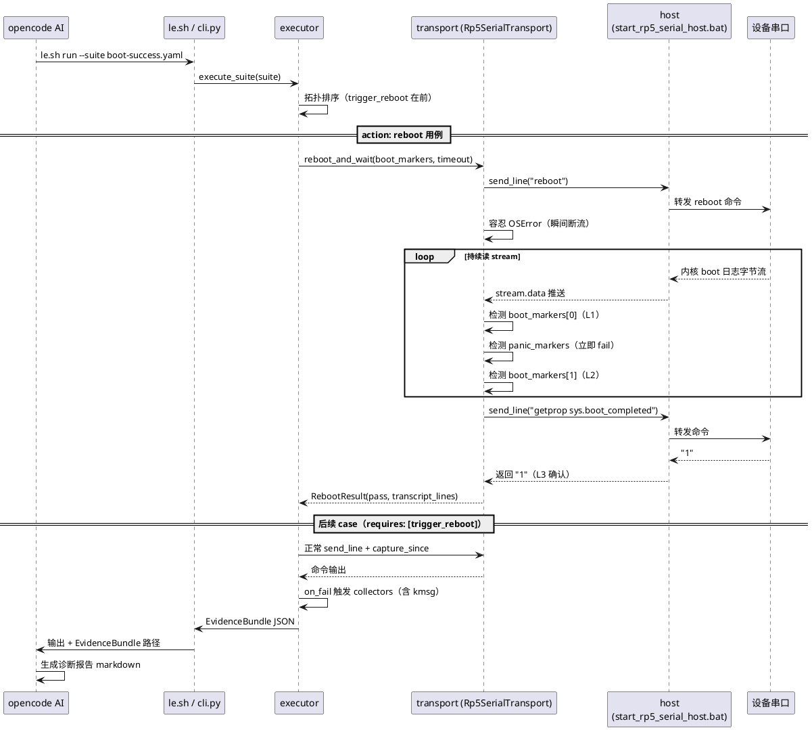

# Live Reboot 诊断闭环设计

> **日期**：2026-06-20
> **状态**：已确认
> **范围**：在 Loop Engineering v2 基线之上，新增"AI 主导的 live reboot 启动诊断半闭环"——脚本发 reboot → 抓启动全程日志 → 设备回来后主动采集多源证据 → AI 产出结构化诊断报告 + 修复建议 + YAML 沉淀建议。**不含**自动改码 / deploy / loop_ctrl。
> **前序**：基于 `docs/specs/2026-06-19-loop-engineering-v2-design.md` 与当前已落地实现。
> **实测依据**：boot markers 取值来自 2026-06-20 真实 reboot 探针采集（`engineering/output/runs/probe-reboot.log`，930 行完整 boot 序列）。

---

## 1. 背景

### 1.1 当前能力（v2 第一步 MVP）

LE v2 已落地用例驱动验收器：

- `le run` 执行 suite → EvidenceBundle JSON（`engineering/loop/core/python/loop_core/cli.py:87-164`）
- 断言引擎 6 种类型（contains / regex / equals / prompt_visible / not_contains / exit_code_zero）
- 公共 collector 库 4 个：`boot_log` / `init_log` / `crash_dump` / `serial_recent`（`engineering/loop/cases/common/shell.yaml:23-41`）
- host 持续 transcript 落盘（`engineering/loop/connection/providers/rp5-serial/python/rp5_serial/host/serial_runtime.py:139-155`）
- EvidenceBundle `serial_context` 字段（`engineering/loop/core/python/loop_core/evidence.py:94-95`）

### 1.2 核心缺口

当前架构**假设设备一直在线**，无法回答"设备为什么起不来 / 启动卡在哪里"：

1. **无 reboot 触发与跨重启能力**：`AutomationClient` 无重连逻辑（`engineering/loop/connection/providers/rp5-serial/python/rp5_serial/client/automation.py` 全文无 retry）；`LoopRunner.run()` 一次性执行整个 suite（`engineering/loop/core/python/loop_core/runner.py:52-72`），假设从 `acquire_writer` 到 `release` 设备始终在线
2. **无"设备回来"判定机制**：`capture_since` 只是固定 timeout 窗口（`engineering/loop/connection/providers/rp5-serial/python/rp5_serial/transport.py:289-329`），无 boot marker 检测；`DeviceProfile.boot_markers` 字段已定义（`engineering/loop/core/python/loop_core/config.py:37`）但**未被任何代码消费**
3. **case schema 无时序/动作语义**：当前 `cases/*.yaml` 只有 `command`/`assert`/`requires`/`on_fail`（`engineering/harness/templates/case-template.md` 无对应模板，见 `engineering/loop/templates/case-template.md`），无法表达"这条用例需要先 reboot"
4. **profile.reboot_markers 配置不准**：实测真实 reboot 序列里 `U-Boot` 未出现，现有配置 `["reboot: Restarting system", "U-Boot"]` 不可靠
5. **无 kmsg / last_kmsg 采集**：诊断 reboot 原因需要上次启动的内核日志，现有 4 collector 无此能力
6. **无 AI 诊断报告契约**：AI 读 EvidenceBundle 后产出格式不统一，无法沉淀

### 1.3 本次设计范围

以 **live reboot 诊断半闭环** 为目标，不扩成"全自动改码平台"：

- **中心**：AI 用 `/le` 触发 reboot 诊断，拿到结构化证据 + 报告 + 修复建议
- **不做**：AI 自动改 workspace 代码（→ 后续范围 B）、le deploy binary/image（→ 后续范围 B/C）、loop_ctrl N=5 自动循环（→ 后续范围 C）、AI 自动追加 case 到 boot-success.yaml（→ G2：AI 建议，人工 review 后加）

---

## 2. 目标

1. **case 级 reboot 表达**：用例 YAML 用 `action: reboot` 声明"这条用例触发重启"，后续用例靠 `requires: [trigger_reboot]` 拓扑保证执行顺序
2. **transport 跨重启能力**：新增 `reboot_and_wait(boot_markers, panic_markers, timeout)` 方法，三级渐进判定设备回来（L1 boot 开始 / L2 init 阶段 / L3 boot_completed 验证）
3. **boot_markers 真实标定**：profile 填入实测稳定的 boot marker 字符串，新增 panic_markers
4. **kmsg collector**：新增公共 collector，诊断上次 reboot 原因
5. **AI 诊断报告契约**：统一 markdown 格式，含根因 / 证据 / 修复建议 / YAML 沉淀建议 / 循环终止建议
6. **向后兼容**：现有 case YAML、FixtureTransport、4 个 collector 全部不受影响

---

## 3. 非目标

1. **不**实现 AI 自动改 workspace 代码（source-code-modify.md 要求 build+package+board_verify 三段证据，本范围 A 不触及）
2. **不**实现 `le deploy` 子命令（cli.py:81-83 占位保持不变）
3. **不**实现 `loop_ctrl.py` 循环控制器（v2 第三步目标）
4. **不**让 AI 自动修改 `boot-success.yaml`（G2 决策：AI 在报告里给出建议 YAML 片段，人工 review 后手动加）
5. **不**引入 phase 段或多阶段执行引擎（B1 决策：用例 action 字段够用）
6. **不**修改 host 端（`start_rp5_serial_host.bat` + `rp5_serial/host/`）——host 已常驻独占 COM，TCP 不会因设备 reboot 断开
7. **不**修改 harness 核心机制（rules / config / lib 不动）

---

## 4. 已确认决策

| # | 议题 | 决策 | 说明 |
|---|------|------|------|
| 1 | 闭环范围 | **A（最小可用）** | 先打通 reboot→采集→AI 分析半闭环，验证可行后再扩展 B/C |
| 2 | reboot 触发 | **A2（脚本发 reboot）** | 完全自动化，不依赖人 |
| 3 | case 级表达 | **B1（用例 action 字段）** | 粒度精准，向前兼容，复用 requires 拓扑 |
| 4 | 设备回来判定 | **C1 调整版（stream + boot_markers）** | 复用 host 常驻架构（TCP 不断），全程用同一 client 的 stream |
| 5 | boot_markers 值 | **D2（分阶段判定）** | L1=`Booting Linux on physical CPU`，L2=`init: ... started service 'zygote' has pid` |
| 6 | 日志源 | **E3（transcript + 4 collector + kmsg）** | 完整证据链，新增 kmsg collector |
| 7a | AI 产出 | **F1（诊断报告 + 修复建议）** | markdown，存 `engineering/output/runs/<run-id>/diagnosis-report.md` |
| 7b | YAML 沉淀 | **G2（AI 建议但人工加）** | 报告里附「建议新增 case」片段，不自动改 yaml |
| 8 | reboot 命令 OSError | **容忍** | `send_line("reboot")` 可能触发瞬间断流，捕获后继续等 stream |
| 9 | panic 优先 | **立即 fail** | 任何阶段命中 panic_markers 立即返回 fail，不等超时 |
| 10 | FixtureTransport | **向后兼容** | `reboot_and_wait` 在 fixture 上走分支：检测 fixture 里的 reboot marker（如果有），不动真实设备 |

---

## 5. 架构设计

### 5.1 闭环数据流



### 5.2 组件改动清单

| 层 | 组件 | 文件 | 动作 |
|----|------|------|------|
| config | DeviceProfile | `loop_core/config.py` | 改：`boot_markers` / `panic_markers` 字段语义激活（已定义，开始消费） |
| config | 设备 profile | `connection/profiles/devices/rp5/default.json` | 改：填 `boot_markers` + `panic_markers`，补 `reboot_markers` |
| provider | Transport | `rp5_serial/transport.py` | 改：新增 `reboot_and_wait()` + `RebootResult` dataclass |
| provider | FixtureTransport | `loop_core/transport.py` | 改：新增 `reboot_and_wait()` 兼容实现（fixture 分支） |
| core | TestCase model | `loop_core/models.py` | 改：加 `action: str` 字段（可选） |
| core | case_loader | `loop_core/case_loader.py` | 改：解析 `action`，校验 `action` 与 `command` 互斥 |
| core | executor | `loop_core/executor.py` | 改：action case 走特殊分支调 `reboot_and_wait` |
| core | runner | `loop_core/runner.py` | 改：注入 boot_markers / panic_markers 给 transport |
| data | common/shell.yaml | `cases/common/shell.yaml` | 改：新增 `kmsg` collector |
| data | boot-success.yaml | `cases/system/boot-success.yaml` | 改：首条加 `trigger_reboot` action case |
| docs | case-template | `loop/templates/case-template.md` | 改：文档化 `action` 字段 |
| docs | 诊断报告模板 | `harness/templates/diagnosis-report-template.md` | 新：统一 AI 产出格式 |

---

## 6. 核心机制设计

### 6.1 case schema 扩展（B1：用例 action 字段）

**YAML 形态**（boot-success.yaml 示例）：

```yaml
suite: system.boot
version: 1
include: [common/shell]
cases:
  - id: trigger_reboot
    action: reboot                    # 新字段：声明动作而非命令
    description: "触发设备重启并等待启动完成"
    severity: critical

  - id: boot_completed
    command: "getprop sys.boot_completed"
    assert: {type: contains, value: "1"}
    requires: [trigger_reboot]        # 拓扑保证：reboot 完成后才跑
    on_fail: {collectors: [boot_log, init_log, kmsg]}
```

**校验规则**（case_loader 强制）：

1. `action` 与 `command` **互斥**：任一必须且只能有一个
2. `action: reboot` 的 case **不需要 `assert`**（动作型，不产断言结果，只产状态）
3. `action: reboot` 的 case 如果被其他 case `requires`，靠现有拓扑排序自然保证顺序
4. 本次只支持 `action: reboot`；未来 `action: sleep` / `action: wait_for` 可复用此字段（但不在本范围）

**TestCaseResult 如何记录 action case**：

| 字段 | 取值 |
|------|------|
| `status` | `pass`（reboot_and_wait 成功）/ `fail`（超时或 panic marker 命中） |
| `output` | 整个 boot 过程的 transcript 片段（从 reboot 命令到判定设备回来） |
| `failure_reason` | `timeout` / `panic_detected: <panic_line>` / `writer_busy` |
| `assertion` | `{"type": "action", "action": "reboot"}`（标记非断言型） |

### 6.2 transport.reboot_and_wait 设计

**接口签名**：

```python
@dataclass
class RebootResult:
    status: str                      # "pass" | "fail"
    transcript_lines: list[str]      # 整个 reboot 过程采集的串口行
    failure_reason: str              # "" | "timeout" | "panic_detected: ..." | "writer_busy"
    stage_reached: str               # "l1_boot_start" | "l2_init_ready" | "l3_verified" | "none"
    boot_duration_sec: float         # 从 reboot 命令到 L3 验证通过的耗时

def reboot_and_wait(
    self,
    boot_markers: list[str],         # [L1_early, L2_init_ready]
    panic_markers: list[str],        # ["Kernel panic", "BUG:", "Internal error"]
    boot_complete_timeout: float = 180.0,
    l1_timeout: float = 30.0,        # 等 boot_markers[0] 的上限
    l2_timeout: float = 90.0,        # 等 boot_markers[1] 的上限
    l3_timeout: float = 60.0,        # 等 getprop 返回 boot_completed=1 的上限
    prompt_markers: list[str] | None = None,
) -> RebootResult:
    """发 reboot 并等待设备回来。

    流程：
    1. mark boundary（记录 reboot 前位置）
    2. send_line("reboot")（容忍 OSError）
    3. L1 等待：持续 read_until_timeout，检测 panic_markers（立即 fail）或 boot_markers[0]
       - panic 命中 → 返回 fail(panic_detected)
       - L1 超时（30s）未到 boot_markers[0] → 返回 fail(timeout, stage=l1)
    4. L2 等待：继续读 stream，检测 boot_markers[1]
       - L2 超时（90s）未到 boot_markers[1] → 返回 fail(timeout, stage=l2)
    5. L3 验证：发 getprop sys.boot_completed，检查返回含 "1"
       - L3 前提：L2 命中证明 zygote 进程已起来，此时 shell 才真正可交互
       - L3 超时（60s）未返回 "1" → 返回 fail(timeout, stage=l3)
    6. 全程保留 transcript_lines 作为证据
    """
```

**关键设计点**：

- **三级渐进判定**：L1（boot 开始）→ L2（init 阶段）→ L3（boot_completed 验证）。每级独立超时，任一级超时即 fail，保留已采集 transcript 作为证据
- **panic 优先**：任何阶段命中 panic_markers 立即 fail（不等超时），transcript 里含 panic 行作为根因证据
- **transcript 完整保留**：整个 reboot_and_wait 期间读到的所有行都进 `RebootResult.transcript_lines`，作为 action case 的 `output`
- **不依赖 client 重连**：host 常驻独占 COM，TCP 不会因设备 reboot 断开（实测验证），全程用同一个 client 的 stream
- **reboot 命令 OSError 容忍**：`send_line("reboot")` 可能因 reboot 系统调用日志瞬间触发 host 断流，捕获 OSError 后继续等 stream（不等 send_line 成功返回）

### 6.3 FixtureTransport 兼容实现

`reboot_and_wait` 在 FixtureTransport 上走分支，不动真实设备：

```python
def reboot_and_wait(self, boot_markers, panic_markers, **kwargs) -> RebootResult:
    """fixture 模式：在 fixture 数据里检测 reboot marker。

    若 fixture 含 reboot marker（如 "Booting Linux on physical CPU"），
    按顺序消费 fixture 行直到检测到 boot_markers，返回 pass。
    若 fixture 不含 reboot marker，返回 fail("fixture_no_reboot")。
    """
```

**设计意图**：保证离线回放仍可测 action case 逻辑，不强制 live 模式。

### 6.4 boot_markers 实测取值

基于 2026-06-20 真实 reboot 探针采集（`engineering/output/runs/probe-reboot.log`，930 行，reboot 后 31 秒采集）：

| 阶段 | uptime | marker 字符串 | 行号 | 选定理由 |
|------|--------|--------------|------|---------|
| reboot 生效 | reboot+14.27s | （空窗期，设备重启中） | — | reboot_markers 边界 |
| **L1 boot 开始** | `[0.000000]` | **`Booting Linux on physical CPU`** | L79 | uptime [0.0]，reboot 后约 14s 出现，极稳定 |
| L1 备选 | `[0.000000]` | `Linux version 6.6.116-v8` | L80 | 同时刻，可与 L1 主 marker 组合 |
| L2 候选 | `[18.020343]` | `init: starting service 'zygote'` | L911 | zygote 反复重启时会重复出现，不适合单独判定 |
| **L2 init 阶段** | `[18.043323]` | **`init: ... started service 'zygote' has pid`** | L914 | 比 starting 更确定（带 pid 证明进程真起来） |

**实测关键发现**：

1. **prompt_markers 不能作"设备回来"判据**：`console:/ $` 在 uptime 5.6s 就出现（L703），但那时 kernel 还在刷日志（`console:/ $ [    5.637173] logd.auditd: start`——prompt 和内核日志混在一行），shell 不可交互
2. **现有 profile.reboot_markers 不可靠**：`U-Boot` 在实测 reboot 序列里完全未出现；`reboot: Restarting system` 在发命令瞬间可能已被 host 缓冲过
3. **`sys.boot_completed` 在探针 31s 内未出现**：boot 未走完，需 L3 主动发 getprop 验证

### 6.5 DeviceProfile marker 配置

```json
{
  "device_id": "rp5",
  "transport": "serial",
  "prompt_markers": ["console:/ $", "console:/ #", "localhost:/ #", "# ", "$ "],
  "boot_markers": [
    "Booting Linux on physical CPU",
    "init: ... started service 'zygote' has pid"
  ],
  "reboot_markers": [
    "reboot: Restarting system",
    "U-Boot",
    "Booting Linux on physical CPU"
  ],
  "panic_markers": ["Kernel panic", "BUG:", "Internal error"],
  "line_ending": "\n"
}
```

**改动说明**：

- **新增 `boot_markers`**（当前 profile 缺失）：两级，L1 确认 boot 开始，L2 确认 zygote 起来
- **`reboot_markers` 补 `Booting Linux on physical CPU`**：实测 `U-Boot` 不可靠，用 Linux boot 首行作为 reboot 边界更准
- **新增 `panic_markers`**（DeviceProfile 已定义字段 `config.py:39` 但 profile 未填）：L1/L2/L3 任一阶段命中即 fail

### 6.6 新增 kmsg collector

在 `cases/common/shell.yaml` 加：

```yaml
collectors:
  # ... 现有 4 个（serial_recent / boot_log / init_log / crash_dump）...
  kmsg:
    commands:
      - "cat /proc/last_kmsg 2>/dev/null || dmesg | head -200"
    hints: "上一次启动的内核日志（诊断 reboot 原因关键，last_kmsg 优先，回退 dmesg）"
```

**设计意图**：

- `last_kmsg` 保留上次启动完整内核日志（reboot 原因诊断黄金证据），多数 Android 设备支持
- `2>/dev/null || dmesg | head -200` 回退：若 `last_kmsg` 不存在（首次启动或 pstore 未配置），用当前 dmesg 前 200 行兜底
- 复用现有 collector 机制（`loop_core/collector.py:42-64`），**无需改 loop_core 代码**
- 自动注入：业务 suite 通过 `include: [common/shell]` 自动获得

### 6.7 AI 诊断报告契约

**输入**：EvidenceBundle JSON（完整，含 reboot transcript + collector 证据）

**输出**：markdown 报告，存 `engineering/output/runs/<run-id>/diagnosis-report.md`

**模板路径**：`engineering/harness/templates/diagnosis-report-template.md`（新增）

**报告结构**：

```markdown
# Boot 诊断报告 - <run-id>

## 1. 结论
- 整体状态：FAIL/PASS
- 根因假设：<一句话>

## 2. 证据链
| 阶段 | 证据 | 引用 |
|------|------|------|
| reboot | <status, 耗时, stage_reached> | EvidenceBundle.cases[trigger_reboot] |
| zygote | <status, 输出预览> | EvidenceBundle.cases[zygote_running] |
| kmsg | <异常片段> | collector.kmsg output |

## 3. 根因分析
<详细分析，引用证据>

## 4. 修复建议（人工执行）
- 改动点 1：workspace/<路径>:<函数> → <建议>
- 改动点 2：...

## 5. 建议新增 case（人工 review 后加入 boot-success.yaml）
```yaml
- id: <建议的 case id>
  command: "<建议的命令>"
  assert: {type: contains, value: "<期望值>"}
  ...
```

## 6. 循环终止建议
- 已 PASS → 无需继续
- FAIL 根因明确 → 建议范围 B 自动改码（需用户确认）
- FAIL 根因不明确 → 建议人工介入
```

**AI 行为约束**（写入 `engineering/loop/WORKFLOW.md`）：

- AI 读 EvidenceBundle 后必须按此模板产出报告
- 报告路径必须与 EvidenceBundle 同目录（`engineering/output/runs/<run-id>/diagnosis-report.md`）
- 第 4 节修复建议**必须具体到 workspace 文件路径和函数名**，禁止笼统"检查 xx 模块"
- 第 5 节 YAML 建议**必须完整可粘贴**（含 id/command/assert/severity/on_fail）
- AI **不自动修改** boot-success.yaml，只给建议

---

## 7. 向后兼容

| 旧能力 | 影响 | 说明 |
|--------|------|------|
| 现有 `cases/common/shell.yaml` 的 4 collector | ✅ 不变 | 只加 1 个 kmsg |
| 现有 `boot-success.yaml` 不带 action 的 case | ✅ 仍可单独跑 | fixture 模式不变 |
| FixtureTransport（离线回放） | ✅ 新增 `reboot_and_wait` 兼容实现 | fixture 含 reboot marker 则消费，不含则 fail("fixture_no_reboot") |
| 旧 case YAML（无 action） | ✅ case_loader 向后兼容 | action 字段缺失默认走 command 模式 |
| `le.sh` CLI 参数 | ✅ 不变 | 新机制在 loop_core / provider 内部，CLI 透传 |
| host 端（`start_rp5_serial_host.bat` + `rp5_serial/host/`） | ✅ 不动 | host 已常驻独占 COM，TCP 不断 |
| harness rules / config / lib | ✅ 不动 | 本范围不触及 harness 核心 |

---

## 8. 实施清单（按依赖顺序）

按 `engineering/harness/rules/parallel-strategy.md` 约束组织，同一文件不并行：

**阶段 1（基础设施，可并行）**：

- T1：改 `loop_core/config.py` 激活 `boot_markers` / `panic_markers` 消费 + 改 `connection/profiles/devices/rp5/default.json` 填实测 markers
- T2：新增 `harness/templates/diagnosis-report-template.md`

**阶段 2（核心机制，顺序依赖阶段 1）**：

- T3：改 `rp5_serial/transport.py` 新增 `reboot_and_wait()` + `RebootResult`（依赖 T1 的 boot_markers）
- T4：改 `loop_core/models.py` 加 `action` 字段到 TestCase
- T5：改 `loop_core/transport.py`（FixtureTransport）新增 `reboot_and_wait()` 兼容实现
- T6：改 `loop_core/case_loader.py` 解析 + 校验 `action`（依赖 T4）

**阶段 3（编排层，顺序依赖阶段 2）**：

- T7：改 `loop_core/executor.py` action case 走特殊分支调 `reboot_and_wait`（依赖 T3+T6）
- T8：改 `loop_core/runner.py` 注入 boot_markers / panic_markers 给 transport（依赖 T3）
- T9：改 `cases/common/shell.yaml` 加 kmsg collector

**阶段 4（用例 + 文档，顺序依赖阶段 3）**：

- T10：改 `cases/system/boot-success.yaml` 加 trigger_reboot action case
- T11：改 `loop/templates/case-template.md` 文档化 action 字段
- T12：改 `loop/WORKFLOW.md` 加 AI 诊断报告约束 + `/le` 触发说明

**阶段 5（测试 + 验证）**：

- T13：新增单测覆盖 `reboot_and_wait`（mock transport）
- T14：新增单测覆盖 case_loader action 校验
- T15：live 模式端到端验证（跑真实 reboot，验证 boot-success 全 pass）

---

## 9. 验证标准

| 项 | 标准 |
|----|------|
| 单测全绿 | T13/T14 单测通过 |
| 静态校验 | `bash engineering/harness/scripts/validate_harness_docs.sh` 全绿 |
| fixture 回归 | 现有 fixture 模式 boot-success.yaml 仍可跑（不含 action case 的旧用例兼容） |
| live 端到端 | T15：真实 reboot 后 boot-success 全 pass，诊断报告生成且根因明确 |

---

## 10. 遗留与后续演进

1. **范围 B（后续）**：加 `le deploy binary`（热推送 .so/.ko）+ AI 自动改 workspace 代码 + 自动复测
2. **范围 C（后续）**：加 `le deploy image`（刷机）+ `loop_ctrl.py`（N=5 回退人工）+ 镜像刷写人工触发但流程串通
3. **gen-cases（v2 第二步）**：AI 读 spec 自动生成 case 骨架，本次只做 G2 人工沉淀
4. **action 字段扩展**：未来支持 `action: sleep` / `action: wait_for` 等，本次只实现 `reboot`

---

## 11. 关联文档

- **前序设计**：`docs/specs/2026-06-19-loop-engineering-v2-design.md`（v2 权威设计）
- **串口观测基线**：`docs/specs/2026-06-20-loop-zygote-restart-serial-observability-design.md`（transcript + serial_context 底座）
- **实测依据**：`engineering/output/runs/probe-reboot.log`（2026-06-20 reboot 探针，930 行）
- **规则约束**：
  - `engineering/harness/rules/source-code-modify.md`（SRC-001，workspace 是唯一编译真相源）
  - `engineering/harness/rules/parallel-strategy.md`（PAR-001，实施阶段并行约束）
  - `engineering/harness/rules/plantuml.md`（DOC-002，本 spec 含 1 个 PlantUML 时序图）
