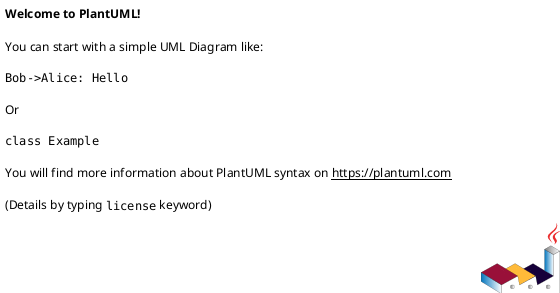
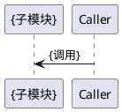
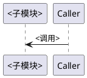
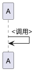
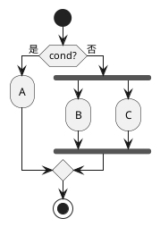
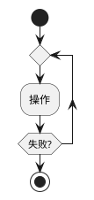
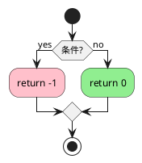

# PlantUML 编写约束

> **规则 ID**：`DOC-002`
> - `DOC-002`：编写任何 PlantUML 图表前，必须遵守本文件的渲染失败经验清单（禁止空图块、UML 块内禁止花括号占位符、必须显式闭合、条件块内禁止 fork、活动图颜色使用新语法）。

> 本文档记录实际遇到过的 PlantUML 渲染失败问题及其修复方案，防止重犯。

## 规则 1：禁止空图块

**问题：** `@startuml/@enduml` 内只有注释或完全为空时，PlantUML 报 "must contain at least one shape"，导致渲染失败。

**错误示例：**



**正确做法：** 即使是模板，也必须包含至少一个图形元素（participant、start、rectangle 等）。

---

## 规则 2：UML 块内禁止花括号占位符

**问题：** 模板占位符 `{模块名称}`、`{调用}` 或 `{{模块标题}}` 会被 PlantUML 解释为 package/object 等语法块的定界符，导致解析错误。

**错误示例：**



**正确做法：** PlantUML 代码块内的占位符统一使用尖括号 `<>`，正文 Markdown 中仍可使用 `{}` 或 `{{}}`。



> **适用范围：** 仅 `plantuml` fenced code block 内禁止 `{}` / `{{}}` 占位符；普通 Markdown 正文、表格、代码示例不受此限制。

---

## 规则 3：PlantUML 代码块必须显式闭合

**问题：** 模板或示例遗漏 `@enduml` 时，渲染器会把后续内容吞入同一图块，造成语法错误或整页渲染失败。

**错误示例：**



**正确做法：** 每个 `@startuml` 必须在同一 fenced code block 内对应一个 `@enduml`，不得跨块闭合。


---

## 规则 4：条件块内禁止 fork/fork again

**问题：** `fork/fork again` 是并行分支语法，不能嵌套在 `if/else` 条件块内部，会导致语法错误。

**错误示例：**



**正确做法：** 用 `repeat/repeat while` 表达重试循环，或用 `if/else` 表达互斥分支，不要混用 fork。



---

## 规则 5：活动图颜色必须使用新语法 `<<#color>>`

**问题：** 活动图（Activity Diagram）中对节点着色的旧语法 `#color:label;` 已被 PlantUML 标记为 deprecated，渲染时会报语法警告。

**错误示例：**



**正确做法：** 颜色移到语句末尾，使用 `<<#color>>` 附着在 `;` 之后。

```plantuml
@startuml
start
if (条件?) then (yes)
  :return -1;<<#pink>>
else (no)
  :return 0;<<#lightgreen>>
endif
stop
@enduml
```

> **适用范围：** 仅活动图（`start`/`stop` 语法）中的 `:label;` 节点。时序图、组件图、类图等其他图型不受此约束。
