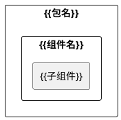
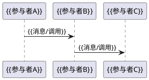
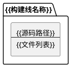
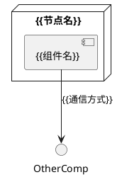
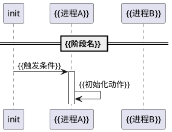

# {{模块标题}}

{{一句话概述模块的核心能力与覆盖范围。例如："基于 XX 的结构化 YY 框架，覆盖 A、B、C 全链路。"}}

## 文档索引

| 编号 | 名称 | 层级 | 说明 |
|------|------|------|------|
| {{XX.01}} | [{{子文档名称}}](./{{文件名}}.md) | {{内核态/用户态(vendor)/用户态(system)}} | {{一句话说明子模块职责}} |
| {{XX.02}} | [{{子文档名称}}](./{{文件名}}.md) | {{层级}} | {{说明}} |

> **阅读建议**：先读本 README 建立全局视角，再按层级深入子文档。每个子文档均采用 4+1 视图（用例/逻辑/过程/开发/部署）组织。

## 逻辑视图

### 组件分解

{{N 句话描述架构分层、每层职责、层间通信方式。}}

### 跨层契约

{{描述层间共享的数据格式/协议/接口，说明契约的唯一性和核心抽象。}}

> {{二进制格式/协议的完整字段说明、类型定义、源码结构体详见各子文档的"逻辑视图"章节。}}

### 设计原则

| 原则 | 说明 |
|------|------|
| {{原则名}} | {{一句话说明该原则如何解决问题或带来什么好处}} |
| {{原则名}} | {{说明}} |

## 过程视图

### 端到端数据流

### 关键指标

| 指标 | 设计值 | 保障机制 |
|------|--------|---------|
| {{指标名}} | {{设计值}} | {{如何保障该指标}} |
| {{指标名}} | {{设计值}} | {{保障机制}} |

> {{并发模型、上下文安全、重试策略等实现细节详见各子文档的"过程视图"章节。}}

## 开发视图

### 源码组织

{{描述构建线划分、共享头文件、产物类型等。}}

### 构建集成

| 构建线 | 构建系统 | 产物 |
|--------|---------|------|
| {{构建线名}} | {{构建工具/配置}} | {{产物路径或类型}} |
| {{构建线名}} | {{构建系统}} | {{产物}} |

> {{Kconfig/Makefile 详情、Android.bp 配置、device.mk `PRODUCT_PACKAGES` 清单详见各子文档的"开发视图"章节。}}

## 部署视图

### 运行时拓扑

### 安全域隔离

> 💡 如果模块不涉及 SELinux 或多进程隔离，可删除本小节。

{{N 个 SELinux 域或进程域}}，{{N-1}} 次跨域通信，权限最小化：

| 域 | 运行身份 | 核心权限 | 不需要的权限 |
|---|---|---|---|
| {{域名}} | {{用户:组}} | {{权限列表}} | {{明确排除的权限}} |
| {{域名}} | {{身份}} | {{权限}} | {{排除权限}} |

**跨域通信**：
1. **{{域A}} → {{域B}}**：{{通信方式/接口}}

> 各域的完整 `.te` 策略、`file_contexts`、`service_contexts` 规则详见各子文档的"部署视图"章节。

### 启动顺序

> 💡 如果模块不涉及多进程启动顺序依赖，可删除本小节。

{{描述各层的启动触发条件、重试机制、依赖关系。}}

## 跨层设计决策

> 💡 如果模块不涉及跨层决策（如单层模块），可删除本节。

以下决策需要{{N 层}}协同才能理解其完整含义，此处仅给出结论。实现细节在对应子文档中展开。

| 决策 | 架构动机 | 详细展开 |
|------|---------|---------|
| **{{决策名}}** | {{为什么这样设计}} | [{{XX.01}}](./{{XX.01-子文档.md}}) §关键设计 |
| **{{决策名}}** | {{架构动机}} | [{{XX.02}}](./{{XX.02-子文档.md}}) §关键设计 |

## 相关资源

- **{{资源类别}}**：`{{路径}}` — {{一句话说明}}
- **{{资源类别}}**：`{{路径}}` — {{说明}}