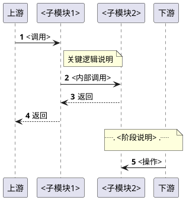
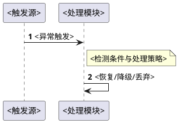
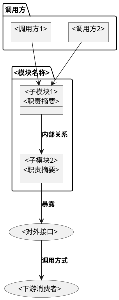
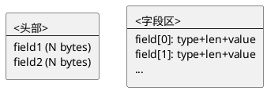
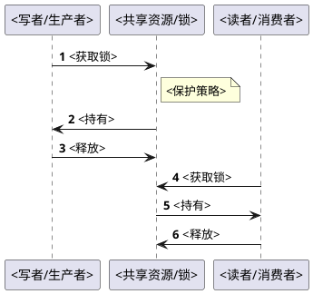
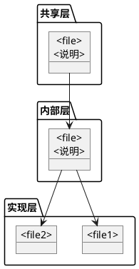
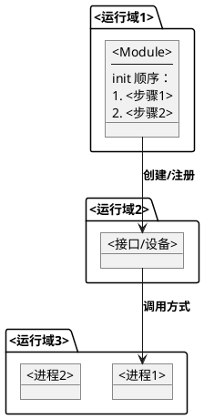
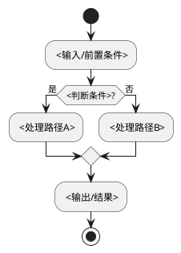

# {模块名称}

## 概述

{一句话定位}：是什么、做什么、属于哪个层（内核 / HAL / Daemon / ...）。

- **职责**：核心职责描述
- **上下游**：数据来源 / 服务对象
- **对外接口**：{字符设备 / Binder AIDL / EXPORT_SYMBOL / socket / ...}

**设计理念：** {核心设计思想，1-2 句}

**设计目标：**

1. **{目标1}** — {简述}
2. **{目标2}** — {简述}
3. ...

**源码路径：**

- 工作目录：`~/workspace/{workspace}/`
- 模块源码：`{模块相对路径}/`
- 完整源码归档：[`../../patchs/rpi5/{layer}/new/{模块相对路径}/`](./../../patchs/rpi5/{layer}/new/{模块相对路径}/)

> **关联文档：** {上下游组件} 设计见 [{关联文档}](./XX.XX-XXX.md)。系统级架构分析见 [README.md](./README.md)。

## 用例视图

### 正常路径：{核心业务场景}

{场景概述，1-2 句}



### 异常路径

#### {异常场景1}

{触发条件与处理概述}



#### {异常场景2}

（同上）

## 逻辑视图

### 模块分解



**职责矩阵：**

| 模块 | 职责 | 关键抽象 |
|------|------|---------|
| `{子模块1}` | {职责描述} | `{结构体/函数}` — [{文件}:{行号}](./../../patchs/...) |
| `{子模块2}` | {职责描述} | `{结构体/函数}` — [{文件}:{行号}](./../../patchs/...) |

### {核心数据结构 / 协议格式}

{描述本模块的核心数据结构或通信协议格式}



**{编码表 / 字段表}：**

| 字段 | 类型 | 说明 |
|------|------|------|
| `{field1}` | `{type}` | {说明} |
| `{field2}` | `{type}` | {说明} |

## 过程视图

### 并发模型

{描述并发架构：多生产者/单消费者、锁策略、线程模型等}



{关键并发机制的文字说明}

### 关键不变量

| 不变量 | 保证机制 | 代码位置 |
|--------|---------|---------|
| {不变量1} | {机制} | [`{文件}:{行号}`](./../../patchs/...) |
| {不变量2} | {机制} | [`{文件}:{行号}`](./../../patchs/...) |

## 开发视图

### 文件职责矩阵

> **约束：** 目录结构只列出源码文件，不含编译产物（`.o`、`.ko`、`.cmd`、`bazel-out` 等）。

> **{外部依赖说明}：** {如有外部共享头文件/配置不在本目录内，在此说明}

```
patchs/rpi5/{layer}/new/{模块相对路径}/
├── {file1}.{ext}          # {职责说明}
├── {file2}.{ext}          # {职责说明}
├── {file3}.{ext}          # {职责说明}
├── {build_file}           # 编译配置（Makefile / Android.bp / CMakeLists.txt / ...）
└── {config_file}          # {配置文件说明}
```

| 文件 | 职责 | 关键函数 | 行数 |
|------|------|---------|------|
| `{file1}` | {职责描述} | {关键函数} | {N} |
| `{file2}` | {职责描述} | {关键函数} | {N} |

### 模块依赖图



### {对外接口导出}

> _如有 EXPORT_SYMBOL / Binder AIDL / socket API 等对外导出的接口，在此说明；无则删除本节_

**使用示例：**

```c
// 代码示例
```

**调用方契约：**
- {契约1}
- {契约2}

### 构建集成

> _根据模块所在层选择对应的构建说明，删除不适用的部分_

#### {内核：Kconfig / Makefile}

| 配置项 | 值 | 说明 |
|--------|-----|------|
| `config {MODULE}` | `bool` / `tristate` | {说明} |
| `obj-$(CONFIG_{MODULE})` | `{module}.o` | {说明} |

```bash
cd ~/workspace/rpi5-kernel-build/common
make ARCH=arm64 CROSS_COMPILE=aarch64-linux-gnu- menuconfig
# {菜单路径} → Y
make ARCH=arm64 CROSS_COMPILE=aarch64-linux-gnu- Image
```

#### {AOSP：Android.bp / .mk}

```bp
// Android.bp 示例
```

```makefile
# product mk 中的 PRODUCT_PACKAGES 声明
PRODUCT_PACKAGES += {module_name}
```

## 部署视图

### 运行时拓扑



### 权限与安全

> _适用时保留，无 SELinux / 权限配置则删除本节_

| 配置项 | 文件 | 说明 |
|--------|------|------|
| {权限项1} | `{文件}` | {说明} |
| SELinux 域 | `{域}.te` | {allow 规则} |
| file_contexts | `file_contexts` | {标签} |

### 验证

```bash
# 验证部署/运行状态
{验证命令}

# 查看日志
{日志命令}
```

## 关键设计与实现

本章节从架构与源码两个维度，提炼 {模块名称} 中的关键设计决策及其实现细节。

### {设计决策1} — {一句话总结}

**设计思路：** {核心思想}



**源码实现：**

```c
// {文件}:{行号}
// 代码片段
```

{实现细节说明}

### {设计决策2} — {一句话总结}

（同上格式）

## 接口参考

### {对外 API}

| 函数 | 参数 | 返回值 | 说明 |
|------|------|--------|------|
| `{api1}(arg1, arg2)` | {类型} | {返回类型} | {说明} |
| `{api2}(arg1, arg2)` | {类型} | {返回类型} | {说明} |

### {ioctl / Binder 方法 / CLI 命令}

> _根据模块类型选择，删除不适用的部分_

| 命令/方法 | 方向 | 参数 | 功能 |
|------|------|------|------|
| `{CMD1}` | {方向} | {类型} | {说明} |
| `{CMD2}` | {方向} | {类型} | {说明} |

### {file_operations / IPC 接口}

> _适用字符设备 / Binder 模块，无则删除本节_

| 操作 | 行为 |
|------|------|
| `{op1}` | {行为} |
| `{op2}` | {行为} |
